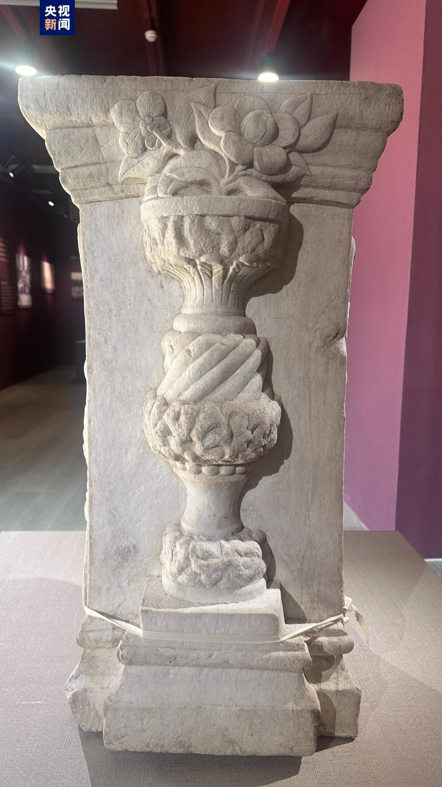
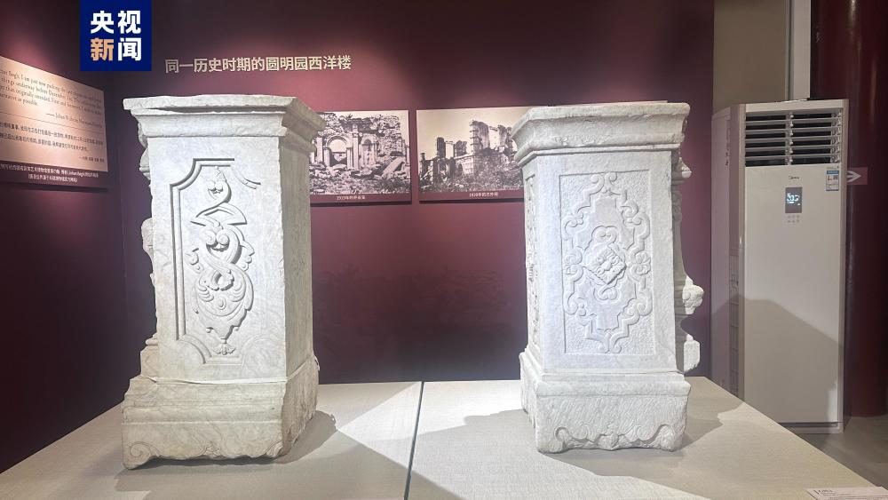

# 漂泊海外百年终回故土，圆明园7根石柱首次同公众见面

来源：央视新闻客户端

**今天上午，流失海外百年的圆明园西洋楼石柱回归故土，首次在圆明园遗址公园正觉寺的“最上楼”一层同公众见面。**
历经百年辗转，几经周折，7根石柱终于重新回到祖国的怀抱，成为继原位于西洋楼海晏堂的马首铜像后，又一批回归原属地的圆明园流失海外重要文物。

**此次回归的石柱共7件，均为汉白玉材质，通高约80~92cm，立面有雕花造型，品相较好，推测均来自西洋楼遗址区。**
这些石柱正面纹饰以西式番花、贝壳纹等西洋雕花为主，侧面花瓶内花束则以具有吉祥寓意的牡丹、玉兰、荷花、菊花等中国传统花卉为主，圭角卷云纹、开窗的海棠线雕刻方式等亦与中国古建望柱、栏板相同，体现了中西合璧的文化内涵。

圆明园西洋楼建筑以木质梁柱为基础，通过用砖砌筑内墙，外部包以汉白玉等石材的方法建造。其建筑主体仿西方巴洛克风格建造，常在建筑上设立石柱作为望柱或栏杆连接物使用，同时还具有装饰的作用。两侧没有雕花的石柱应为建筑上的联排装饰物，两侧饰有花瓶或花纹的石柱则用于楼梯或楼层平台栏杆部分，花瓶的样式则是配合栏杆形制雕刻而成。

在此次7根石柱回归过程中，社会力量慷慨奉献、主动作为，高等院校热心支援、建言献策，抓住海外收藏单位相向而行、释放善意的有利契机，国家多部门统筹引领、保驾护航，保护机构尽心履职、勇于担当。
**各方密切合作，历经10年，最终促成石柱回到原属地。**

国家文物局组织中国社会科学院、故宫博物院、北京大学、四川大学等专家开展实物鉴定。专家一致认为：“该7件文物为汉白玉质地，工艺精湛，浮雕雕刻花卉、缠枝几何纹饰，具有中西合璧的文化因素。其质地、纹饰均可与现存圆明园西洋楼遗存的文物对照。该组文物保存较完整，略有风化痕迹，据工艺、纹饰和材质情况，可定为真品。该组文物原存于KODE博物馆，该博物馆旧藏中有大批民国时期文物。原持有者于民国时期曾长期在中国工作，该组文物应为其在此时期获得并流出中国。”

（总台央视记者 田云华 闫洪）

