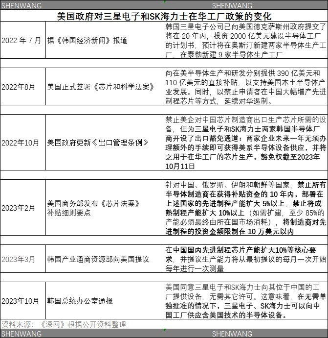

# 美国给三星“开后门”：挤压中国本土芯片企业

作者｜张睿

编辑｜康晓

出品｜小满工作室·深网

就在美国给三星电子、SK海力士的出口豁免权即将到之际，誓要遏制中国半导体发展的美国再次给二者“开了后门”。

10月9日，韩国总统办公室通报，美国同意三星电子和SK海力士向其位于中国的工厂提供设备，无需其它许可。
**这意味着，在无需单独批准的情况下，三星电子、SK海力士可以向其中国工厂供应含美国技术的半导体设备。**

三星电子和SK海力士是存储芯片巨头，提供了全球近70%的DRAM（动态半导体存储器）芯片和50%的NAND
Flash（闪存）芯片，而其在中国开设的工厂贡献了近一半的产能。

数据显示，三星在西安开设的NAND闪存制造工厂占据公司四成的产能，SK海力士在无锡开设的DRAM芯片制造厂约占公司DRAM芯片产能的一半，全球产量15%。

在存储芯片的生产制造中，技术先进的极高深宽比刻蚀设备至关重要。

由于光刻技术受波长限制，仅凭光刻机很难满足5纳米以及更先进的制程工艺，需要通过反复的刻蚀来实现更小的尺寸。而全球高端刻蚀设备则被美国的泛林、应用材料和日本的东京电子牢牢掌握。

**与三星电子、SK海力士中国工厂不再受先进半导体设备牵制形成反差的是，长江存储等中国存储厂商还在面临“新设备买不了，老设备没人修”的挑战。**

2022年底，成立仅6年的长江存储先于三星、美光、SK海力士完成了232层3D
NAND闪存的量产。当年12月，美国就将长江存储列入实体清单，禁止美国企业向其出口128层及以上NAND闪存所需的设备、材料和软件。

自此，长江存储空有232层闪存技术，却无力进一步扩产，刚刚有点起色的本土存储企业可能被拉大技术差距。

一面是给中国本土储存芯片企业禁令，遏制中国大陆芯片产业的发展；一面是给三星、SK海力士“开后门”，挤压中国存储企业的市场份额，美国的“阳谋”被一步步揭开。

**库存高企、亏损扩大，三星海力士急需“政策救场”**

韩国总统办公室通报的时间节点耐人寻味。一是近半年三星电子和SK海力士的半导体库存大幅增加；二是曾被三星和SK海力士奉为“摇钱树”的半导体业务遭遇近十多年来最大亏损。

据二者的上半年财报显示，截至6月底，三星半导体业务DS部门库存金额为33.6896万亿韩元，同比2022年底时的库存金额增长15.9%；SK海力士的半导体库存金额为16.4202万亿韩元，同比增长4.8%。

在价格方面，据TrendForce数据显示，2022年第三季度和第四季度，DRAM平均价格的跌幅分别为31.4%和34.4%。今年二季度DRAM价格跌幅收窄至10%到15%。去年下半年，NAND
Flash均价跌幅均超过20%，今年二季度均价续跌 10%～15%。

**由于存储芯片价格暴跌和库存价值大幅下降，三星芯片业务和SK海力士都遭遇了十多年以来的最大亏损。**

2023年第一季度，三星电子芯片业务营业亏损4.58万亿韩元，这也是三星半导体业务14年来的首次亏损。2023年第二季度，三星芯片业务依然亏损4.36万亿韩元。

SK海力士也于2022财年第4季度创下10年来最大亏损。该季度（截至2022年12月31日），SK海力士营业亏损为1.7012万亿韩元，净亏损为3.5235万亿韩元。2023年第二季度，SK海力士营业亏损额达
2.8821 万亿韩元，净亏损额达 2.9879 万亿韩元。

**SK海力士等韩国存储企业从去年下半年开始转盈为亏，有智能手机和个人电脑市场需求疲软的影响，更重要的是，随着长江存储等中国本土企业工艺的提升，手机及电脑头部企业在选择上游闪存供应商时有了更多的选择，这直接影响了三星和SK海力士的存储芯片订单。**

一个值得关注的细节是，2022年下半年，有消息传出，苹果有意将长江存储纳入其iPhone手机存储芯片供应商体系，长江存储自研发的128层3D
NAND芯片已经通过了苹果的测试。

站在苹果等手机厂商的立场看，三星手机本身就是全球第一大手机厂商，和自己存在竞争关系，选择长江存储的芯片不仅可以分摊过度依赖SK海力士等闪存芯片的风险，还可以有压价的便利。

但苹果的这一想法很快被美国商务部按下了。2022年12月15日，美国商务部将包括长江存储、寒武纪、上海微电子装备等在内的36家中国科技公司列入了“实体清单”。迫于压力，苹果取消了长江存储的订单。

**长江存储被制裁，导致储存芯片供给侧产能下降，三星、SK海力士等开始趁机涨价。**

据DigiTimes去年12月报道，在长江存储被制裁后，三星马上就将其3D NAND
Flash的报价提高了10%。而据《韩国经济日报》报道，日前三星已与小米、OPPO、谷歌等智能手机品牌客户签署了DRAM和NAND
Flash芯片供应协议，价格比现有的合约价高出了10%～20%。

一面是给中国本土储存芯片企业禁令，遏制中国大陆芯片产业的发展；一面给三星、SK海力士开后门，挤压中国存储企业的市场份额，美国政府的“阳谋”被一步步揭开。

**堵不如疏，本土存储企业或错失“以战养战”的窗口期**

为了打压中国大陆半导体产业的发展，美国2022年曾联合日韩、台积电，组建了“芯片四方联盟”（Chip
4），以通过控制韩国以及中国台湾地区的芯片产能和原材料供应，来削弱中国大陆半导体芯片的快速发展。

但美国的这种“围追堵截”在2023年8月29日出现了松动和裂痕。

8月29日中午，华为Mate
60系列带着5G速度回归，这意味着，简单粗暴的制裁并不能阻止中国芯片产业的发展，反而给了中国本土芯片产业链韬光养晦、以战养战的机会。

**当粗暴的制裁无法阻止中国芯片产业发展时，在中国取得进展的芯片领域局部放开，通过海外半导体巨头抢占市场份额并形成垄断，就成了另一种“曲线禁令”。美国曾靠此套路在EDA领域尝到甜头，受此影响，中国EDA软件产业曾陷入长达15年的沉寂期。**

EDA软件是芯片设计必需的软件工具，有“芯片之母”之称。目前，全球芯片设计的高端软件EDA基本被新思科技（Synopsys）、Cadence、Mentor三大公司所垄断。

事实上，中国很早就意识到EDA软件在半导体产业里的重要性，并从1986年开始加大对中国EDA事业的扶持。当年7月，电子工业部在北京、上海、无锡建立3个集成电路设计中心。

据《工业软件简史》记载，彼时，巴黎统筹委员会（简称“巴统”）正对中国实施EDA软件封锁。在无法购得先进工具的情况下，中国的IC设计很难发展。

1988年，国家计划委员会设立了“ICCAD
Ⅲ级系统开发”专项，由北京集成电路设计中心牵头攻关，这个Ⅲ级系统被命名为“熊猫系统”。10年后的1998年，熊猫2000系统在第35次设计自动化会议(DAC)上展出，走上国际展台。

虽然与国外商业EDA软件相比，当时中国EDA软件还有五年左右的差距，但熊猫系统的发布，让中国EDA事业找到了一个突破口。

如果按照既定的发展路径，随着熊猫系统在市场的普及，中国的EDA产业会在全球占有一席之地。但后期随着“巴统”解散、封锁解除，国际EDA软件巨头Cadence和Synopsys（新思）等凭借先进技术和颇占优势的价格快速抢占了中国市场。

“在当时的业界，‘造不如买，买不如租’的思维占据了上风。从1994年到2008年，中国的EDA软件产业发展陷入了长达十五年的沉寂。这十五年，国外的EDA软件厂商正在进行着‘大鱼吃小鱼’的激烈兼并，是EDA软件从自由竞争走向寡头垄断的时期，而中国EDA软件则错失了在激烈竞争中以战养战的机会。”《工业软件简史》的作者林雪萍如此评价。

历史不会简单重复，但往往压着相同韵脚。

随着荷兰9月宣布阿斯麦将继续向中国市场提供光刻机设备（断供的时间将推迟至2024年），以及三星电子、SK海力士获得无限期豁免权，国产EDA软件的发展路径会不会在国产存储芯片领域上演，本土存储企业会不会错失“以战养战”的窗口期，这都是值得思考的问题。

**曾在存储市场打败日本，三星再度祭出“反周期大刀”**

眼下看，三星电子和SK海力士是此次事件的最终受益者。作为存储器老大，三星电子的目的只有抢占中国巨大的半导体市场这么简单吗？

把时间拨回上个世纪80年代，抢占了全球大部分内存市场的公司并不来自韩国，而是日本。有数据显示，1985年，日本占领了全球内存60%以上的市场。

存储芯片产业具有周期性。生产存储芯片不仅需要数年时间建厂，还要跟随内存制程的提升不断投入资金研发和生产。

上个世纪80年代，从美光手中拿到256K内存技术授权的三星，开始在存储领域奋起直追，试图缩小与日本的技术差距。

**与日本存储企业相比，三星的优势之一是有政府资助。在政府资金的加持下，三星多次祭出“反周期大刀”，在价格下跌、生产过剩、其他企业削减投资时逆势扩张，最后通过规模效应来降低成本，逼着对手退出市场，甚至破产。**

经过存储行业周期性的洗礼，全球内存厂商从20世纪80年代的四五十家，至2008年仅剩三星、SK海力士、德国的奇梦达（Qimonda）、美国的美光（Micron
Technology）和日本的尔必达这主要的5家。

在此后的10多年中，奇梦达和尔必达也没能抗住存储芯片的周期性调整，先后破产。2009年奇梦达宣布破产；2012年，尔必达也因为产品价格下滑及公司资金周转困难申请破产。

时至今日，三星、SK海力士、美光这三家公司牢牢掌控了存储芯片市场。

现在，存储芯片产业正处于周期底部，美国又给三星和SK海力士“开后门”，三星或将再度开展反周期操作。据电子时报报道，为了巩固其在NAND闪存市场的领先地位，三星电子计划再次采用双堆叠技术来制造超过300层的3D
NAND，旨在以生产成本优势超越竞争对手。

