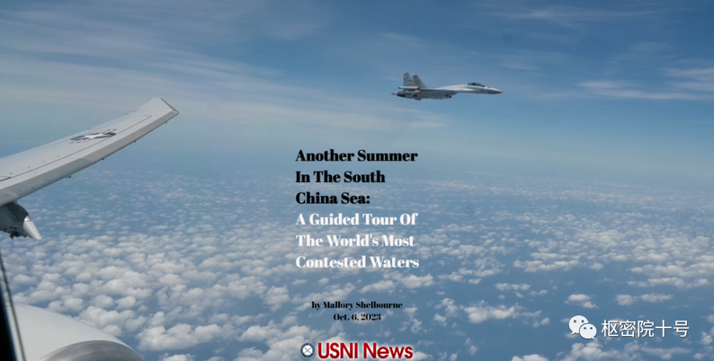
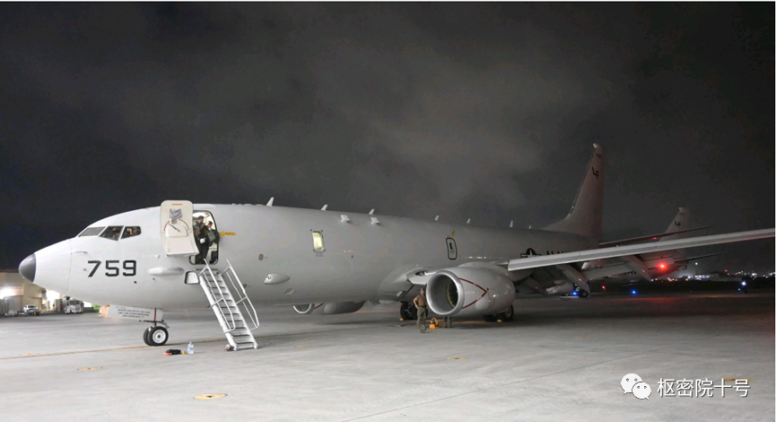
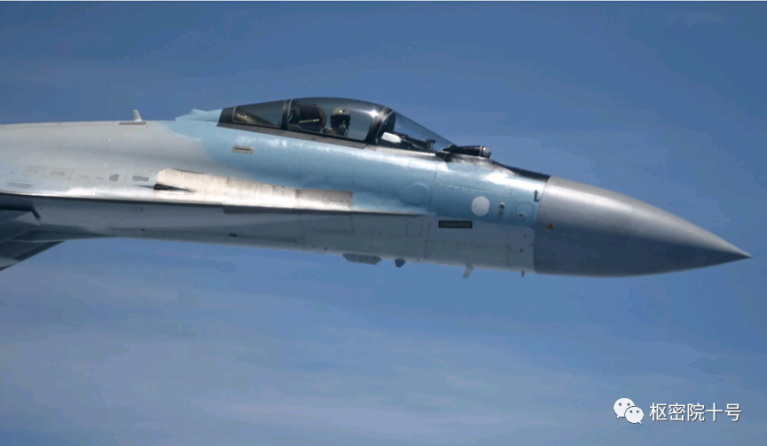
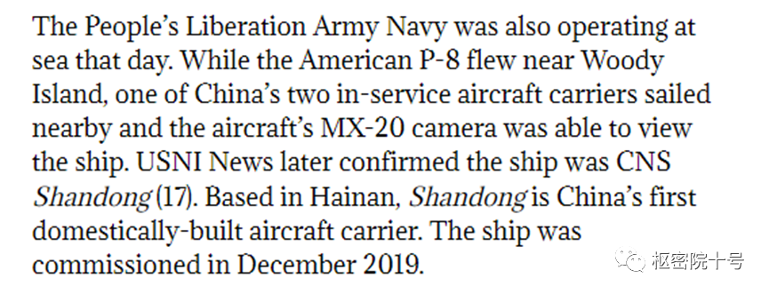

# 美媒：P-8A巡逻机在南海遭解放军拦截时，正在跟踪山东舰

美国海军学会网站几天前发布了长篇报道，讲述美国海军P-8A巡逻机在南海巡逻9个小时的遭遇，尤其是大书特书了关于中国战斗机拦截该机的经历。老司机的同事们第一时间发现，该报道竟然搞错了中国战斗机的型号——将苏-35弄成了歼-11。考虑到这篇报道还得到美国海军方面的背书，实在让人对美军的专业性大打折扣。

对，就是这篇报道

不过老司机发现，在被我们指出这个错误之后，该报道已经悄悄地把文中的歼-11全部改成了苏-35……

早先的报道提到“遭遇解放军歼-11（J-11）战斗机拦截”

在更新的页面里已将多处歼-11改成了苏-35，并承认“早先被识别为沈阳歼-11”，报道里的类似修改还有很多

不过除了将苏-35错误识别为歼-11之外，老司机注意到，美媒在这篇报道中也透露了许多信息。例如所谓P-8A遭到解放军战机拦截，到底是怎么回事？为何美军要出动P-8A巡逻机执行如此漫长的任务？从美媒报道中可以清晰地看出来，美军在印太地区的日常巡逻到底是“维护地区平衡”，还是在“故意挑起事端”。

报道提到，这架P-8A巡逻机于8月的某个周三从冲绳嘉手纳基地起飞，在KC-135R大型空中加油机的配合之下，前往南海执行远程巡逻任务。“起飞约两小时后，在靠近南海边缘的空中，P-8A接收了KC-135的加油，然后向西飞向西沙群岛。”

报道描述称，P-8A在南海的飞行路线是首先飞过西沙群岛继续西行，靠近越南海岸线后再南下，一直到南沙渚碧礁附近再调头北上，经过
仁爱礁附近那艘搁浅报废的菲律宾登陆舰上空后，返回冲绳。报道非常明确地提到，对于这样的情报收集、监视和侦察任务，机组人员在“飞越有争议的珊瑚礁、环礁和岛屿时，会从飞机的摄像头和传感器中提取尽可能多的数据”。

美军对于这种故意挑事和借机收集军事情报的做法当真是毫不掩饰。

但解放军显然不会惯着美军的毛病。报道提到，这架P-8A于下午1时30分左右在西沙群岛的永兴岛附近遭遇了解放军苏-35战斗机的拦截。

有意思的地方来了。美军机组成员承认，“我们知道在南海靠近永兴岛附近时，会遭到岛上的拦截。所以我不会说这是出乎意料的。”另一名美军机组成员表示，解放军的反应“像闹钟一样准时”。

按照该报道透露的信息，这架苏-35战斗机的拦截非常准确和及时，显然解放军对周边空域的情况有着充分了解。苏-35的飞行位置始终卡在P-8A与西沙群岛之间，以阻挡美军对西沙群岛的进一步骚扰和抵近侦察。

报道称，这架中国战斗机打开了识别应答器，所以美军机组人员知道他们即将被拦截。“当天的互动是安全和专业的，喷气式飞机没有做出威胁性的动作，但它确实离得足够近，透过窗户可以看到中国飞行员的头盔和氧气面罩。”如此近的距离显然也让解放军飞行员有机会近距离打量美军同行，报道提到，美军机组人员前往机窗边时，会撕下自己军服上的姓名牌，以避免身份泄露。

这架苏-35战斗机在P-8A旁边伴飞了约一小时，让老司机非常感兴趣的是，报道承认“尽管美国官员一再表示，中国对美国军机的不安全拦截一直在增加，但没有提供任何数据来支持这一说法。”中国国防部发言人此前已经多次表示，中国军机对外国侦察机的所谓拦截是“依法依规对其进行识别查证，有关操作是专业的、安全的”。如今，这一点也从美军方面得到了印证。

接下来，报道还披露了美军机这次远程巡逻的主要目标之一——在西沙永兴岛附近，P-8A使用机载MX-20光电侦察监视吊舱发现了正在附近航行的中国航母山东舰。考虑到山东舰在此后不久的9月上旬就前往西太平洋开始新一轮远海训练，P-8A很可能是专门提前刺探它的相关情报。值得一提的是，MX-20侦察吊舱是美军新一代远程机载侦察设备，具备大倍率的连续变焦能力，还能够提供高清白光和热成像监视画面。从美媒的报道可以看出，之所以P-8A只能使用光电吊舱从远处拍摄山东舰，很可能就是因为遭到苏-35的有效拦截。

总之，美媒的描述清晰地记录了P-8A所谓的日常巡逻背后，是毫不掩饰地刺探中国等南海周边国家的军事情报。对于如此充满恶意的行为，美国媒体和五角大楼也就不要继续“喊冤”了——遭到解放军战斗机拦截，这不是美国人自找的吗？

