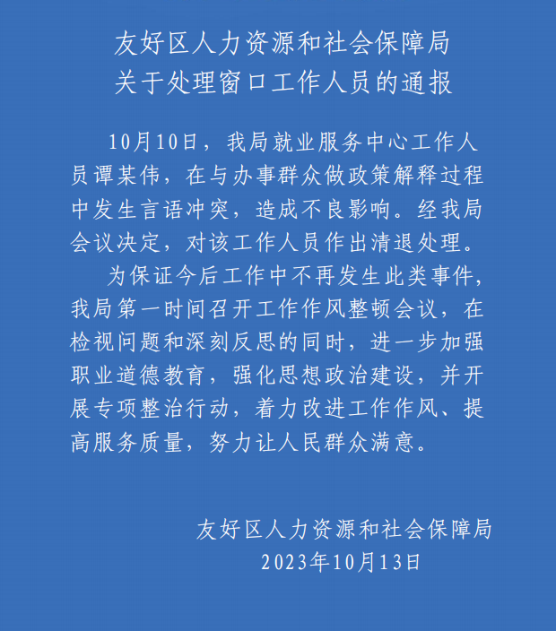

# 黑龙江一人社局工作人员拍桌怒斥办事群众，官方通报：涉事人员被清退

近日有网传视频显示，黑龙江伊春市友好区人社局一名男性工作人员嚼着口香糖拍桌子，怒斥办事群众“有事说事”，引发热议。“友好人社”微信公众号消息，10月13日，黑龙江伊春市友好区人社局通报，10月10日，该局就业服务中心工作人员谭某伟，在与办事群众做政策解释过程中发生言语冲突，造成不良影响。经会议决定，对该工作人员作出清退处理。

