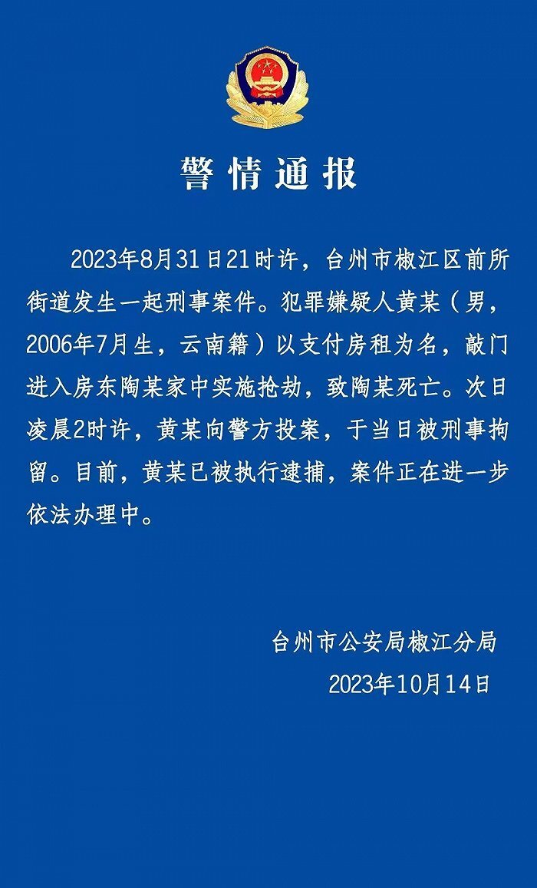

# 17岁少年以支付房租为名，抢劫杀害65岁房东，已被浙江警方逮捕

椒江公安官微10月14日通报，8月31日21时许，台州市椒江区前所街道发生一起刑事案件。犯罪嫌疑人黄某（男，2006年7月生，云南籍）以支付房租为名，敲门进入房东陶某家中实施抢劫，致陶某死亡。次日凌晨2时许，黄某向警方投案，于当日被刑事拘留。目前，黄某已被执行逮捕，案件正在进一步依法办理中。

**相关报道：**

[浙江17岁少年杀害65岁房东，被害家属：父亲可怜收留他，却被无端杀害](https://new.qq.com/rain/a/20231013A09VAS00)

