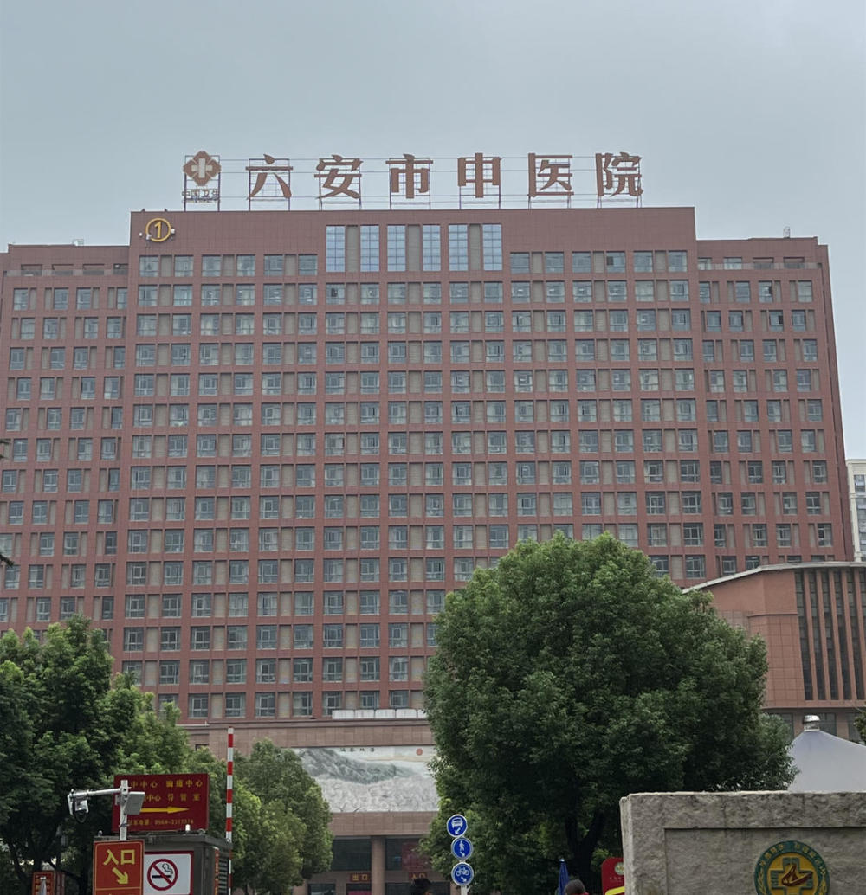
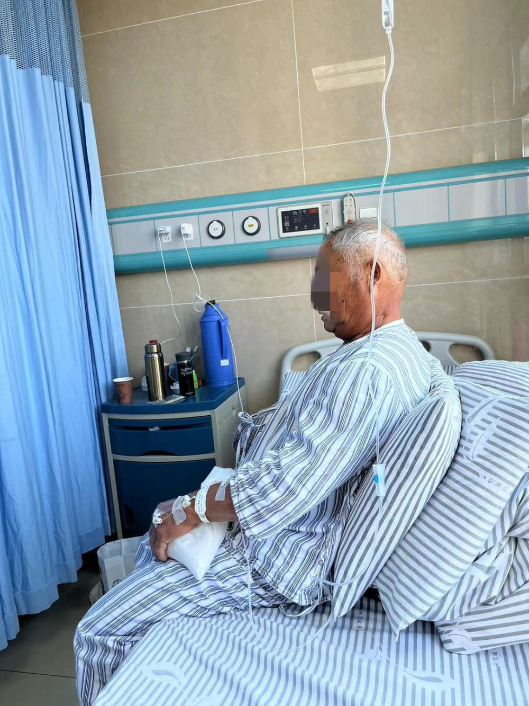

# 63岁老人免费体检后多次手术身亡 一家涉事医院不满医疗事故鉴定结果要求重新鉴定

“无论医院选择哪一种诊疗方式，我们都是配合的。我很后悔，现在就好像试卷答案已经出来了，回头看题目全是错的，那又有什么用呢？没用，父亲已经死了。”杨先生的父亲参加社区免费体检查出有肠息肉，先后在两家医院手术后，因感染性休克离世。经安徽六安市医学会鉴定，这是一起一级甲等医疗事故，医院的过失医疗行为与患者死亡后果存在因果关系。

今年10月10日，红星新闻报道此事后，六安市卫健委当晚发布情况通报称，根据初步调查结论，责令六安市中医院给予涉事医师停职处理。六安市卫健委还委托市医学会开展医疗事故鉴定并作出鉴定结论，六安市卫健委将依法依规作出相应处理，处理结果将及时公布。

红星新闻记者了解到，其中一家涉事医院已表示不服，要求重新鉴定。

**老人免费体检查出直肠息肉**

**术后出现肠梗阻被转入ICU**

杨先生的父亲杨开平今年63岁，是一位农民。2023年5月5日，杨开平进城找儿子，路过六安市城南镇天河湾社区时，了解到六安市中医院组织实施的国家免费早癌筛查项目，可以免费体检，杨开平便报了名。

5月6日，杨开平乘坐由六安市中医院安排的大巴车前往医院。医院出具的消化内镜诊疗报告单中，诊断出杨开平有“降结肠肿物”“直肠息肉”，医生建议入院手术。杨开平当时惦记家中的秧苗还没插完，就打算先回家插秧，之后再到医院手术。

_▲六安市中医院_

5月10日，杨开平因结肠肿物入住六安市中医院肿瘤放疗科，5月12日医院医生对杨开平进行了降结肠内镜黏膜下剥离术（ESD）+经内镜黏膜下切除术（EMR）。

杨先生提到，患者做这项手术后，医生会关注患者放屁的情况。杨开平术后迟迟没有放屁，5月13日上午10点杨开平腹部开始剧烈疼痛，下午3点又发烧了。当天杨开平的腹部CT提示显示“所及肝周、腹腔脂肪间隙散在积气”，医院对患者给予补液、抗感染等对症治疗。

医院的记录还显示，5月14日，杨开平的腹部DR显示：“肠梗阻、两膈下游离气体影，考虑肠道穿孔可能；请胃肠外科会诊意见：考虑消化道穿孔，查体腹膜炎体征明显，建议外科手术治疗。”

杨先生提到，术后腹痛一直折磨着杨开平，家属曾找医生询问情况，也提出过转院，但最终还是按照医生的安排办。直到5月16日23时许，医院给杨开平做“腹腔镜辅助回肠双袢造口+腹腔脓肿冲洗引流+肠粘连松解术”，手术持续到5月17日。医院术中诊断为“结肠穿孔；腹腔脓肿；弥漫性腹膜炎；感染性休克（代偿期）；术后转入ICU监护治疗”。杨开平在ICU病房住到5月26日，后转入普通病房。5月30日，造口排气排便通畅，拔除胃管后进食流食。

_▲杨开平生前住院接受治疗_

6月1日，杨开平出现肠梗阻症状，6月6日转入安徽省第二人民医院。安徽省第二人民医院在6月7日进行开腹探查术、肠粘连松解术、心肺复苏、腹腔脓肿切开引流术、其他开腹手术，术中杨开平出现心率下降，合并血压下降，转入ICU救治。6月11日上午，杨开平经医院抢救无效死亡。

杨先生提到，父亲先后在两家医院住院约1个月，原本只是做一个常规手术，没想到却因为六安市中医院的错误医疗行为，让原本身体健朗的父亲，饱受身体疼痛的折磨，经过多次手术后去世，体重也一下子减轻了20多斤。去世前父亲还做了开腹探查手术，这让家属接受不了。

杨先生表示，父亲已经离世，家属不是一味追求补偿，而是希望走法律程序，追究医院和相关负责人的医疗事故责任。

**六安市医学会鉴定为一级甲等医疗事故**

**安徽省第二人民医院不服要求重新鉴定**

2023年7月30日，安徽医之本司法鉴定所司法鉴定意见书显示，鉴定意见：被鉴定人杨开平符合ESD+EMR术后并发急性腹膜炎致感染性休克而死亡；医疗行为是否存在过错及与死亡是否存在因果关系待另行医疗损害鉴定。杨开平的家人对上述意见书存在异议。

8月25日，该鉴定所做出修正，将上述意见补证为“被鉴定人杨开平符合降结肠内镜黏膜下剥离术+经内镜黏膜下切除术后并发急性腹膜炎致感染性休克而死”。

9月27日，六安市医学会出具对杨开平死亡的医疗事故技术鉴定书。鉴定书显示，六安市中医院认为，医院是由具备资质、依法注册的医务人员，在相应的执业范围内，向就诊人员提供了符合诊疗规范和常规的诊疗，不构成医疗事故，故不应承担责任。安徽省第二人民医院认为，患者虽出现不幸离世，但医院在诊疗过程中并无延误患者治疗，患者死亡原因系前期感染毒素入血，诱发患者发生了急性冠脉综合征所致的心功能衰竭；患者死亡原因与医方的诊疗行为不存在因果关系。

六安市医学会鉴定书分析，六安市中医院医疗行为存在过失，其中包括“
ESD+EMR术后出现穿孔、腹膜炎，外科会诊后建议手术治疗未立即执行，对ESD手术并发症认识不足、重视不够、处理不到位；5月16日外科手术未发现穿孔处，清除脓肿不彻底；6月6日在静脉麻醉下经回肠双袢造口近端口探查方法不当”。安徽省第二人民医院在此事中，存在的医疗行为过失情况为，6月6日CT检查报告提示：膈下见宽大游离积气影，疑似消化道穿孔的情况下，6月7日依然给患者行X线下放置肠梗阻导管和胃镜下放置肠梗阻导管措施不当。

六安市医学会指出，医方上述过失医疗行为与患者死亡后果存在因果关系。本病例属于一级甲等医疗事故，六安市中医院承担主要责任；安徽省第二人民医院承担次要责任。

10月10日，红星新闻报道了此事，10日晚，六安市卫健委就此事发布了通报。通报中提到，2023年6月14日，市卫健委接到患者家属有关投诉后，立即组织开展调查核实，并成立了医疗责任调查处置工作专班。根据初步调查结论，责令市中医院给予涉事医师停职处理，并要求医院积极配合患者家属依法选择医疗纠纷处理途径。

通报中还提到，2023年6月16日，安徽医之本司法鉴定所依据患方家属委托进行了尸检。8月7日、25日，安徽医之本司法鉴定所先后出具了死因鉴定结论和补充结论。8月29日，应患方家属要求，市卫健委委托市医学会开展医疗事故鉴定。9月27日，市医学会组织开展医疗事故鉴定。10月7日，市医学会出具“本病例属于一级甲等医疗事故，院方负主要责任”的鉴定结论。10月7日至8日，市卫健委将医疗事故鉴定结论分别交与医患双方及公安机关。市卫健委将依据《医疗事故处理条例》等法律法规，依法依规作出相应处理，处理结果将及时公布。

10月13日，安徽省第二人民医院对接处理此事的相关负责人告诉红星新闻，医院不服鉴定结果，要求重新鉴定。

杨先生则认为，他父亲在六安市中医院的时候已肠穿孔，安徽省第二人民医院接治后仍按照肠梗阻治疗，父亲在安徽省第二人民医院经抢救无效去世，他觉得安徽省第二人民医院过错更大。

杨先生还提到，在此前报道发出后，有人评论说他是专业医闹者，为了钱拿父亲做实验，这让他觉得遭受到网络暴力，并前往派出所报案。杨先生出具的当地派出所受案回执显示，警方已对杨先生被诽谤一案进行了受理。

红星新闻记者 陈卿媛 朱必胜

编辑 彭疆 责编 邓旆光

