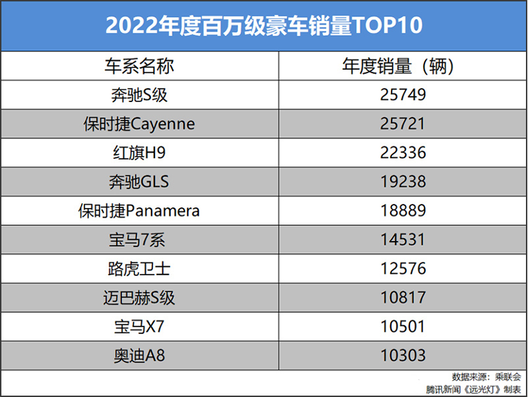

# “打破西方垄断”？中国百万豪车集中登场，硬刚奔驰路虎特斯拉

腾讯新闻《远光灯》 作者 刘坎顺

9月1日晚，在2023极氪进化日现场，国产纯电超跑极氪
001FR的登场直接引爆全场热情。它在现场不仅以四轮独立电驱和ZVC四轮独立矢量控制技术进行了原地坦克掉头，同时还展示了车载卫星通讯技术，重要的是全程都在点名售价在100万以上的特斯拉Model
SPlaid，并用真实力展现出了直接硬刚的姿态。

这或许意味着国产纯电性能车在多项指标上已经能与国际厂商“掰掰手腕”了。

官方消息称，极氪 001 FR售价在百万以上，号称打破千万级跑车性能垄断。

随后，9月20日，售109.8万元的仰望U8豪华版正式上市；

9月26日，全球首款剪刀门+软顶敞篷的纯电跑车——MGCyberster开启预订；

10月9日，百万级中国跑车——昊铂SSR的量产上市并交付；

接下来的第四季度，蔚来计划推出NT3.0平台自家“迈巴赫”轿车——蔚来ET9（命名未定）；

同样在第四季度，仰望有望推出百万元级别纯电动超跑——仰望U9。

……

这些车企的一系列大手笔似乎正在昭示，2023年就是中国品牌百万豪车启程元年。纵观目前的中国车企，无论是仰望、蔚来、极氪，还是昊铂，大家都正在用创新的技术，展示着中国品牌在新能源汽车领域的实力，并坚定的向高端市场发起冲击。

可以说，在如今的纯电动时代，中国车企的创新技术已经打破了传统豪华品牌曾经的优势，但后者在品牌影响力和文化底蕴等方面依旧强势。因此，接下来该如何讲好品牌故事，打造品牌高端形象，无疑都是中国车企急需进修的功课。

**用新技术打破百万级天花板**

在中国汽车高速发展期间，国产轿车从小到大被分为微型车、小型车、紧凑型车、中型车、中大型车这5个类别。其中，微型车的市场完全被中国品牌主宰，小型车和紧凑型车的热销车型中也不乏中国品牌（以中低端档次为主），但只要上升到中型车和中大型车这两个市场，中国品牌就有些力不从心了。

尤其是中型车一直都是中国品牌的“死穴”。无论是早期奇瑞推出的瑞麒G6，长安推出的睿骋，还是荣威950、广汽传祺GA6等，甚至当年能勉强踩到合资品牌“脚后跟”的吉利博瑞、一汽奔腾B70，这些国产重型车在日系三强（凯美瑞、雅阁、天籁），及德系的大众帕萨特/迈腾面前，依旧缺乏竞争力。当时还有媒体指出，中国品牌造不出畅销中型车，除了三大件技术的落后之外，也是企业体系竞争力的客观反应。

而这种现象也同样发生在SUV市场。在小型SUV和紧凑级SUV市场，中国品牌能造出一款月销过万的热销车型，但一旦上到中型SUV，月销过千都成了奇迹。当然，这与当时中型车主要面向公商务市场也有一定的关联，毕竟这个层级对于品牌价值的认同更高。

高端市场更是难见中国品牌身影。在2022年百万元豪车销量的排名中，前十名依然被奔驰、保时捷、宝马、路虎等车企包揽。

如今，在燃油车转向电动车时代的关键时间点，中国车企终于迎来了依靠电动化技术打造高端市场的窗口期。

2023年4月的上海车展中，比亚迪率先推出高端品牌——仰望，不仅成功吸引了欧洲车迷专程打飞的来“仰望”，就连国内车迷想近距离接触，也需要排队等待入场。首款车型仰望U8在9月20日正式上市，豪华版售价为109.8万元起，成功让中国品牌的车型迈入了百万级豪华俱乐部。

仰望U8能够摸到百万级天花板，主要还是得益于该车型先进且新颖的技术，包括易四方、云辇智能车身控制系统、自主研发碳纤维座舱等技术，均为行业领先。

选择以创新技术冲击高端市场的中国车企，在今年还特别多。例如在9月，广汽埃安也推出了全新高端品牌——Hyper昊铂。随后在10月9日，昊铂SSR正式上市，推出了3个版车型可选，售价区间为128.6-168.6万元，并实现了上市暨交付。

又诸如，蔚来在售产品最高价格已上探至60万元级别，进一步缩短与奔驰主销车型之间的差距，但未来将推出的ET9还将在这个价位上上探一大步；MG（名爵）旗下首款剪刀门+软顶敞篷的跑车Cyberster已开启预订，计划抢夺保时捷718的市场份额；极氪更是推出了极氪001FR高性能版，来对标特斯拉Model
S Plaid版车型。

不难看出，仅从技术竞争力角度而言，中国车企的进步都非常明显，尤其在电动化时代下，已经打破了传统豪车品牌曾经打造的技术壁垒。对于缺乏品牌历史、文化和底蕴的中国车企而言，硬核技术才是冲击高端市场最有竞争力的武器，同时也是更容易获得消费者认可品牌的基本前提。

从王传福公布的数据来看，比亚迪从0到第100万辆用时13年；100万到200万辆用时1年；第200万到第300万辆仅用时半年。后面的速度增长越来越快，这都缘于比亚迪在三电等核心技术层面的突破，从而让旗下的各大系列在销售中脱颖而出。

**鏖战“保时捷最大单一市场”**

中国车企此轮用技术推动的“品牌向上”，一定程度赢得了消费者的青睐和认可，这点在仰望U8的预售数据上得到了反馈。未经官方证实/否认的数据显示，在仰望U8开启预售后的48小时内，订单就已经达到了1.3万辆，开启预售后的20天内，订单就突破了3万辆。

换句话说，仰望U8在还没有正式上市交付的情况下，其积压订单的价值就已经超过了300亿元。而作为对比，同为百万级越野车的路虎卫士在2022年全年的销量仅为12576辆。

不过，也有销量分析师告诉腾讯新闻《远光灯》，车企的预定和销量是两回事，以仰望U8为例，截止到年底交付之际，这3万的订单能有10%的真实转换率就很不错了。

毕竟百万级的定价和硬派越野的定位，注定了仰望U8是一款极其小众的车型。奔驰S级、保时捷卡宴这类热销的百万级豪车，一个月销量也仅为1000多辆。

圈内人士认为，百万级豪车本身就是小众市场的车型，受限于当前人们的消费水平与购车欲望，在当前经济消费低迷以及疫情环境不确定的当下，其实大家对百万级豪车的消费欲望是有所降低的。仰望U8在未来能保持月销量5000辆就很不错了，毕竟百万级豪车的总销量也不算高。

也有消费者认为，在真正高端SUV玩家群体中，他们更看重越野性能，反而对品牌的诉求没那么高。仰望U8的技术实力已经实现了超越，因此在未来，将会抢夺大众途锐、丰田普拉多、路虎卫士等车型的市场。更值得一提的是，未来仰望U8在中东地区的影响力也很大，相信该地区的富豪们会蠢蠢欲动，毕竟从技术上来说，仰望U8更适合在沙漠、丛林等户外等场景中使用。

有国外调查数据显示，有79.5%的人表示，因豪车文化是汽车文化中极有魅力的元素而喜欢；有63.3%的人表示，因某个特定品牌或文化价值而关注；有16.5%的人表示，通过豪车话题，可以了解到富人、名人名流的生活。

尽管目前看来百万级别豪车拉动销量有限，但正因为高端豪华车的关注度高，所以也具备了持续的增长率。根据麦肯锡最新报告显示，随着超高净值人群（UHNWI）的持续增多，豪华车市场增长的潜力非常大，预计到2031年，豪华车市场将以8%-14%的复合年增长率扩张，且价位越往上增长率越高。

全球最大保时捷经销商集团之一捷成汽车的董事总经理奕波在此前接受媒体采访时曾表示，“汽车行业相关统计显示，2011-2021年的十年间，豪华车销量CAGR(复合年均增长率)为12.9%，远高于乘用车市场5.8%的增速。到2021年，中国已经连续七年成为保时捷全球最大的单一市场。”

在Hyper
SSR上市现场，广汽埃安总经理古惠南表示，中国第一超跑昊铂SSR的成功量产，标志着中国不仅打破了西方对超跑的垄断，更重要的是以超跑为载体，从研发、设计、试制验证、智造、产业链等领域全方位提升中国汽车工业能力，并推动汽车运动文化的普及。

**要真正力压奔驰、路虎并不容易**

回顾中国汽车工业进入高速发展的这些年，从第一个10年到第二个10年，可以说是从工业化到私有化的转变，汽车在国内开始普及，消费者购车注重性价比；而在第二个10年内，可以称为是典型投资逻辑的发展，凭借技术实力打造爆款才能获得超额收益；而接下来的第三个10年，国内市场将迎来独特的个性化需求时代，中国车企需要兼顾打造爆款和满足个性化的能力，才能在未来获得增量市场。

尽管以主打高端技术流的豪车在今天更容易被认可，但技术永远只是高端豪华车的基础，真正影响到上限的还是汽车文化和品牌个性。

中国流通协会新能源汽车分会秘书长章弘也表示过，目前中国品牌在电气化智能化的支持下，高端品牌正在取得过去十年乃至二十年不曾有过的成绩与市场份额。但在发展过程中，也要正视与海外品牌的竞争。

章弘强调，我国新能源汽车产业即将要面临来自外资独资车企和合资车企的竞争，比如说特斯拉、BBA、大众、丰田、日产、本田以及现代和起亚。这些外资车企，大部分都是百年老店，积累了成熟丰富的迭代研发创新和打造高端豪华车型的经验，拥有着一流的设计和制造人才、完善的销售和售后服务体系、悠久的品牌历史和影响力、数以千万计的忠实粉丝。

因此，这些外资车企一旦转型并进军新能源汽车产业，将会成为这个产业最大的变量。且不说特斯拉的成功，就smart的转型大卖，已经是最好的案例和证明了。

在奔驰与吉利合作之后，smart的全面转型电动化之路也在逐步推进中。首款车型smart精灵#1从去年9月开启交付之后，截止目前已经累计交付了近3万辆，这对于单一车型来讲，算是不错的表现了。另外，smart品牌全新推出的第二款车型——smart精灵#3的首批交付已于6月21日开启。

总的来说，中国车企的技术是到位了，也已经具备了站稳高端的技术实力，但是如何把品牌软实力与营销能力的短板补齐，这无疑会影响着中国车企未来冲高端的潜力和能力。

另外，中国车企在打造品牌，营销高端豪华车型时，不能只靠资本市场的融资。而必须是每推出一款新车型，都要有盈利的信念与计算，都要让其形成自身的现金流。唯有如此，豪华高端车型才有可能持续发展。

