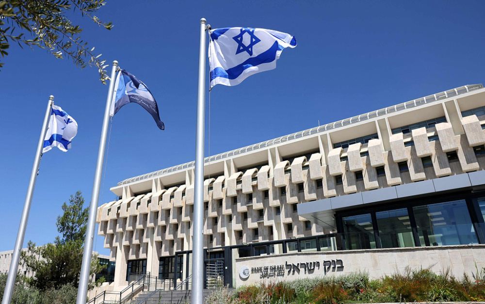

# 巴以冲突一周：战争成本将达68亿美元，全球经济面临新风险

据海外网13日报道，巴以冲突已经持续一周，由以色列工人银行进行估算，此次战争的成本将至少达68亿美元。此前新华社也表示，这场冲突给本就因乌克兰危机升级受到冲击的全球稳定带来新的不确定性，打击市场信心，且妨碍全球范围遏制通货膨胀的努力。

 _当地时间2023年10月12日，巴以冲突持续，以色列士兵和坦克在以色列-加沙地带边境集结。_

**战争成本**

自冲突爆发以来，以色列国防军征召了超过30万名预备役军人执行任务，这一数字是前所未有的。这些预备役军人来自各行各业，有教师、科技工作者、创业者、农民、律师、医生、旅游业从业者和工人等。他们脱离日常经济生产活动，投入战斗。以色列经济损失的大小将取决于这些预备役人员离开工作岗位的时间，时间越久对该国经济的打击也就越大。受战争的影响，以色列旅游业会立即衰退。

_当地时间2023年10月11日，以色列，以色列国防军士兵集结去边境。_

_当地时间2023年10月9日，巴以冲突持续，耶路撒冷空旷的街道。_

_当地时间2023年10月9日，巴以冲突持续，耶路撒冷空荡荡的咖啡馆。_

_当地时间2023年10月11日，耶路撒冷老城街巷空荡，店铺关闭。_

_当地时间2023年10月12日，巴以冲突持续，以色列特拉维夫机场人满为患 ，大量航班被取消。_

 _当地时间2023年10月12日，巴勒斯坦加沙地带，巴以冲突持续，一名工人在田地里劳动。_

工人银行预计，以色列和哈马斯之间的战争成本至少为68亿美元。该银行首席策略师莫迪·沙弗里尔日前分析称，目前可以粗略估计，战争的成本将至少达到以色列GDP的1.5%，这意味着未来预算赤字也将增加1.5%。

工人银行的预测部分基于以色列此前战争的成本。根据以色列国家安全研究所（INSS）的数据，2006年持续34天的“第二次黎巴嫩战争”的损失约为94亿新谢克尔（约合23.68亿美元），占GDP的1.3%。2008年12月至2009年1月的“铸铅”行动损失约为33亿新谢克尔。尽管“第二次黎巴嫩战争”持续时间不长，但火箭弹袭击导致该国经济瘫痪。

_当地时间2023年10月12日，以色列亚实基伦遭到巴勒斯坦哈马斯袭击，街道被炸毁。_

_当地时间2023年10月12日，加沙城，巴以冲突持续，当地遭以军空袭，建筑严重受损。_

正如以色列总理内塔尼亚胡警告的那样，在以色列政府的目标实现之前，将会有一场漫长而艰难的战争。以色列的经济虽仍强劲，但有下行趋势。现在，军事行动将需要更多的政府支出，这意味着必须在高利率的环境下借入更多资金，同时可能提高税收，这些都可能给经济带来压力。国际评级机构穆迪11日警告称，如果以色列与哈马斯的冲突持续下去，影响以色列的经济活动和政策制定，这将对该国主权信用状况的韧性构成考验。

世界银行数据显示，2022年以色列的国内生产总值（GDP）约为5200亿美元。战争爆发前，以色列央行预计该国经济在2023年和2024年均将增长3%。高科技产业和工业制造是以色列的经济支柱产业。

_当地时间2022年8月23日，耶路撒冷，以色列央行总部外景。_

另外，战火很可能对以色列的钻石产业造成冲击。钻石是以色列出口最多的商品之一，该国钻石业主要聚焦于切割与抛光而非挖矿。受战争影响，以色列钻石分级公司在新加坡的股价一度重挫。化工产品是另一个以色列的主要出口产品。华尔街对以色列钾肥供应的前景非常担忧。

_当地时间2020年11月23日，以色列钻石工厂，工人正在加工钻石产品。_

不过，以色列经济学家对他们的战后经济恢复持积极态度。温特认为，尽管目前形势黯淡，但以色列的经济将会有所改善。据他观察，在前几次战争后，以色列一些领域的经济活动有所增加。以科技产业为例，许多士兵回来后，把他们在战场上学到的经验转化为安保业务，战争对投资和需求的打击都是暂时的。

**冲击全球经济**

据新华社报道，巴以冲突给本就因乌克兰危机升级受到冲击的全球稳定带来新的不确定性，打击市场信心，且妨碍全球范围遏制通货膨胀的努力。任何经济不确定性都会妨碍政策制定，增加风险溢价，“尤其考虑到”发生冲突的地点位于全球主要产油区。市场走向将遵从具体的经济情景，此轮冲突是否会打破过往长期的平衡状态仍有待观察。

_当地时间2023年10月12日，科威特证券交易所的内部景观。巴以冲突导致中东和世界股票市场波动。_

此外，石油和股票市场可能因新一轮巴以冲突立即受到冲击。目前国际市场原油价格已经受到影响。中东是全球主要产油区，而且是苏伊士运河、霍尔木兹海峡等主要国际航道所在地，外界将密切关注主要石油交易国以及像伊朗、沙特阿拉伯这样的产油大国所作反应，以判断原油价格是否会继续攀升。未来，债券和股票市场交易行情也会显示出市场对巴以冲突产生影响的预判。

_当地时间2023年10月10日，以色列对加沙城港口发动空袭后，浓烟滚滚。_

 _当地时间2021年2月9日，以色列埃拉特，以色列Eilat-Ashkelon能源公司的油港。_

除影响原油价格，新一轮巴以冲突还对全球经济信心构成冲击。定于本月在摩洛哥举行的国际货币基金组织和世界银行年会将着重评估处于波动中的全球经济的走势。同时，各国中央银行不仅要应对可能发生的新一轮通货膨胀，同时还要缓解经济信心遭受的冲击。美国联邦储备委员会的货币政策同样可能受影响。冲突可能导致油价攀升，给“通胀和经济增长前景”两方面都带来挑战，美联储需要确定物价上涨和经济增长放缓哪个才是更令人担忧的问题。

_当地时间2023年10月8日，国际货币基金组织和世界银行年会在摩洛哥举行。_

新一轮巴以冲突的影响将随着时间流逝变得更加清晰，冲突持续时间、激烈程度以及是否会外溢到其他地区等将成为关键因素。

**图文来源：新华社、海外网、视觉中国**

