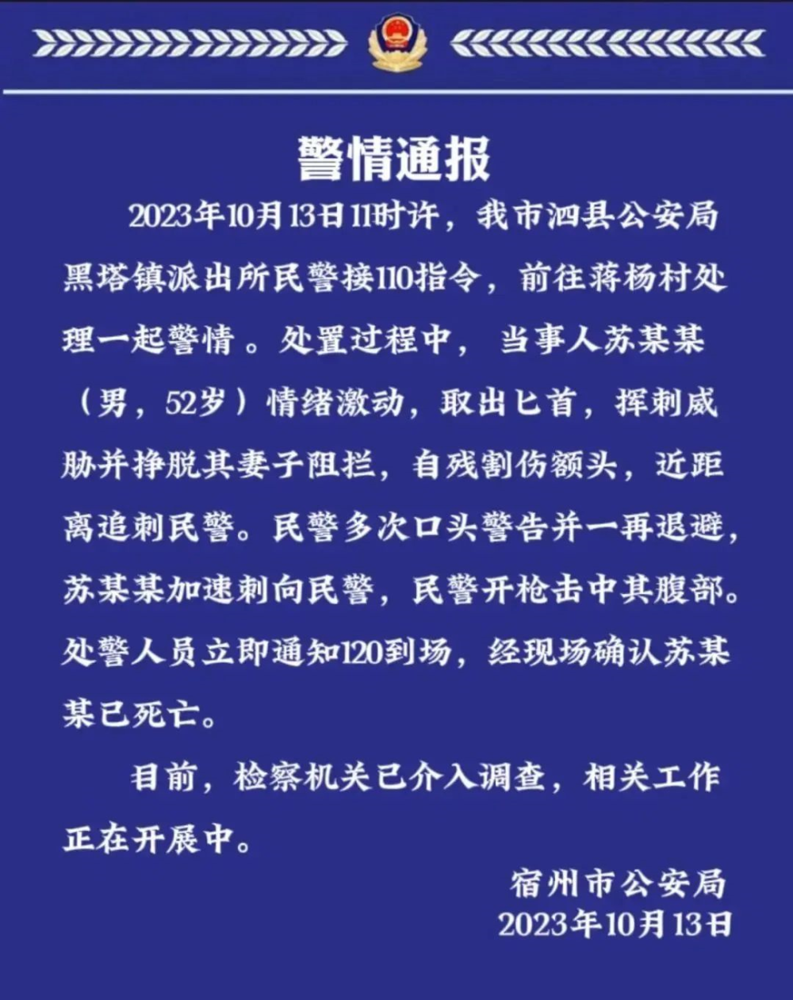
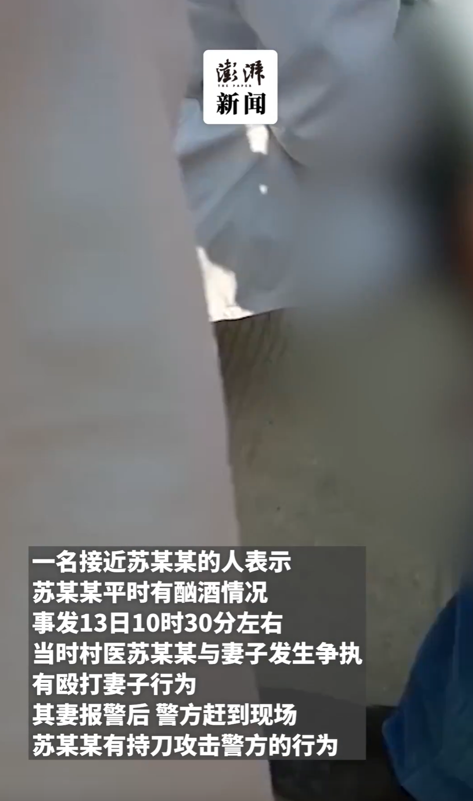

# 男子持匕首追刺民警被击毙，知情人：他是村医，当天与妻子发生了争执

10月13日晚，安徽省宿州市公安局发布警情通报称，2023年10月13日11时许，我市泗县公安局黑塔镇派出所民警接110指令，前往蒋杨村处理一起警情。处置过程中，当事人苏某某（男，52岁）情绪激动，取出匕首，挥刺威胁并挣脱其妻子阻拦，自残割伤额头，近距离追刺民警。民警多次口头警告并一再退避，苏某某加速刺向民警，民警开枪击中其腹部。出警人员立即通知120到场，经现场确认苏某某已死亡。

目前，检察机关已介入调查，相关工作正在开展中。

另据澎湃新闻报道，知情人介绍，村医苏某某当天与其妻子发生了争执，袭警后被民警击中。

**【来源：九派新闻综合平安宿州、澎湃新闻】**

