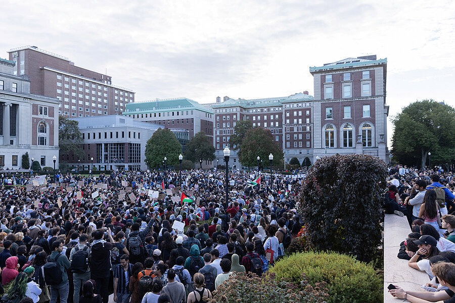
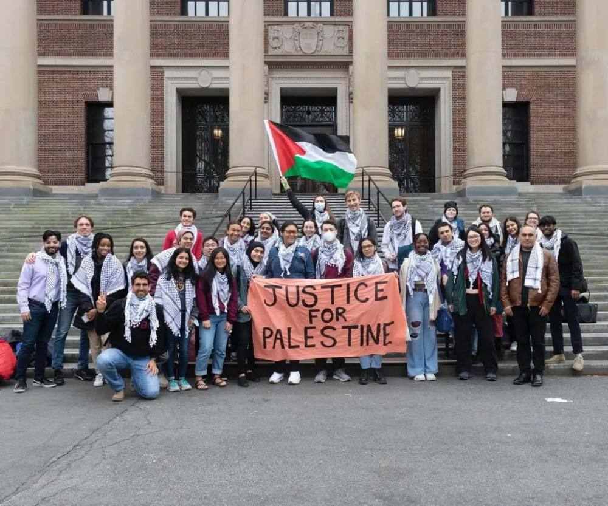
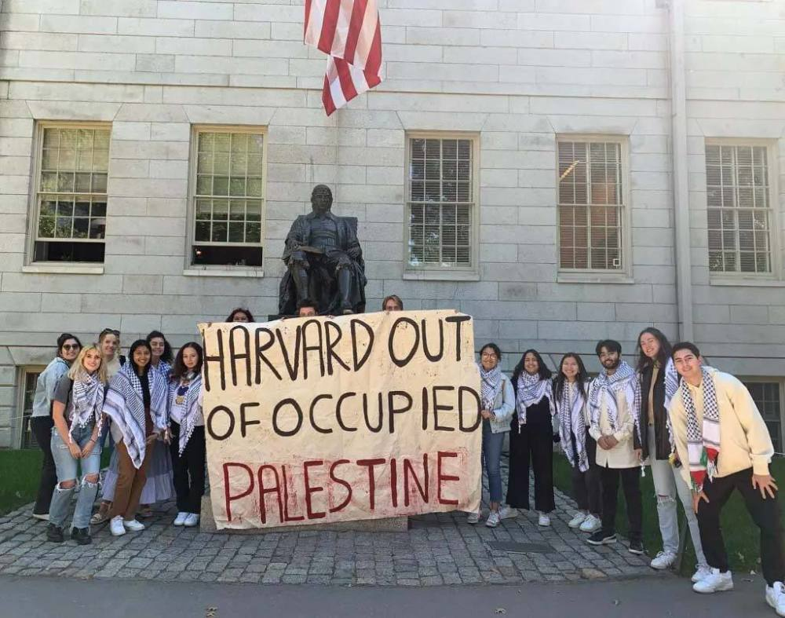
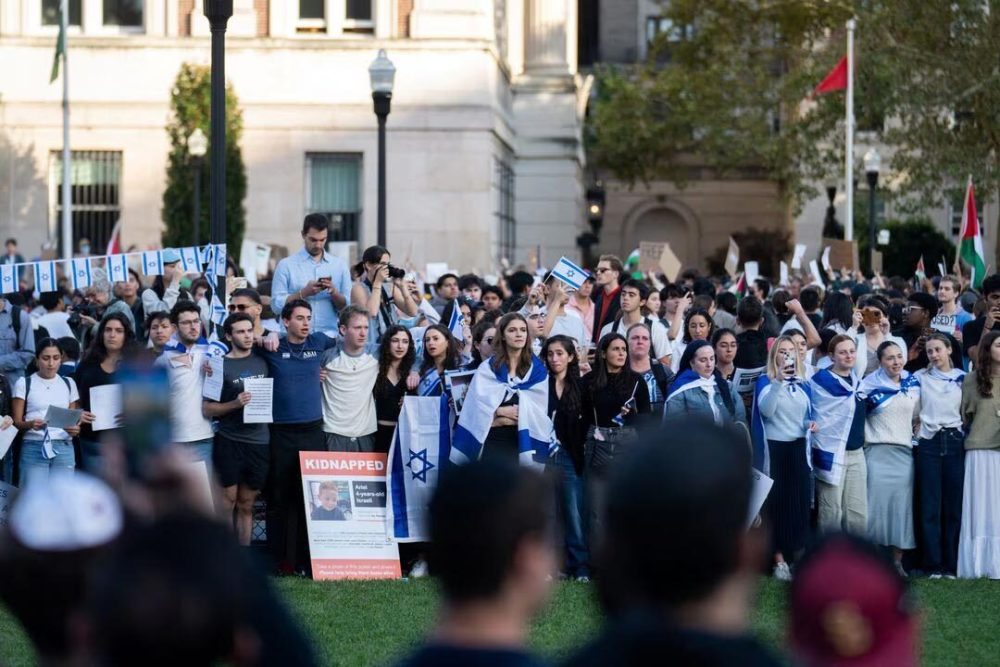
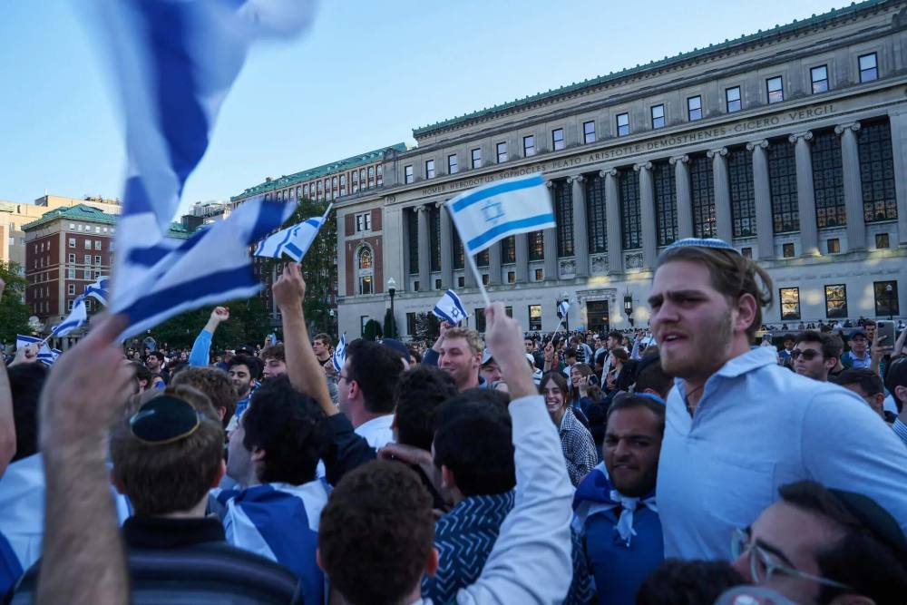
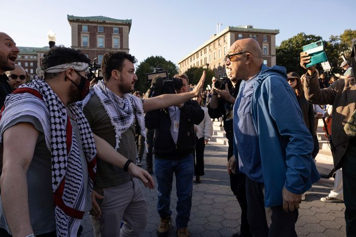

# 美国大学校园，成了巴以冲突“第二战场”

【文/观察者网
熊超然】过去一周以来，巴以冲突的局势加剧，不仅让加沙地带的数百万平民处于水深火热之中，放眼全世界的许多角落，人们也正因这场激烈冲突而变得分裂。

“在冲突愈演愈烈之际，持异见学生间的紧张关系已在美国部分大学校园里爆发。”当地时间10月14日，路透社报道指出，许多美国大学已成为巴以双方抗议活动的爆发点，包括哈佛大学、哥伦比亚大学、耶鲁大学、斯坦福大学和宾夕法尼亚大学等精英高校都卷入这场“争议旋涡”，学生之间的对立关系达到白热化。

在这些大学里，各自支持巴以双方的学生群体大量紧张对峙，甚至爆发暴力冲突，哥伦比亚大学一度封锁校园。更严重的是，这种分歧已经蔓延到美国的各个校园，似乎没有停止的迹象。

美国《基督教科学箴言报》（The Christian Science
Monitor）指出，美国大学校园里围绕巴以冲突的两极分化已经存在许久，过去一周的所发生的一切更是加深了这种两极分化。许多学生针对巴以历史问题的冲突和究责发表了严厉的批判言论，或谴责哈马斯，或谴责以色列，或谴责所有暴力行径……也有许多匿名接受采访的学生坦言，巴以冲突有着复杂的历史经纬，并承认自己确实对这一段历史不熟悉。

同时，这场冲突也重新点燃了关于所谓“取消文化”（cancel culture）、“后果文化”（consequence
culture）以及大学校园言论自由的讨论。路透社报道称，未来几天，美国大学校园气氛可能会变得更加紧张。

_当地时间10月12日，美国哥伦比亚大学内的亲巴勒斯坦学生群体举行抗议示威活动。图自路透社_

哈佛学生团体谴责以色列，遭大批校友施压

“和往常一样，哈佛占据了舞台中心位置。”

作为全球最知名的高等学府之一，《商业内幕》如此形容此轮巴以冲突爆发后，这所大学内所发生的一切。

当地时间10月9日，哈佛大学一个由30多名学生组成的“哈佛巴勒斯坦团结组织”发表了一份声明，称以色列政府“对所有当前正在发生的暴力事件负有全部责任”。声明还称，加沙地带的数百万巴勒斯坦人“被迫生活在露天监狱中”，并呼吁哈佛大学“采取行动，制止正进行的对巴勒斯坦人的屠杀”。

这一声明，随即引发哈佛大批著名校友的抨击，包括诸多校内人士和校外政商界人士，比如知名对冲基金经理、潘兴广场资本管理公司创始人比尔·阿克曼（Bill
Ackman），他呼吁校方公布这些社团中的学生姓名，“以免他们被华尔街聘用后才被发现”。

_哈佛学生团体在校内声援巴勒斯坦 图自《纽约邮报》_

此后，哈佛校领导层发布了声明，但批评人士仍认为该声明“过于软弱”，哈佛大学校长克劳丁·盖伊（Claudine
Gay）随后又是致信，又是发布视频，谴责“恐怖主义暴行”，并表示与这些学生团体保持距离，称这些团体不代表校方立场。

据《哈佛深红报》（Harvard
Crimson）报道，当地时间10月10日，涉嫌卷入此事的学生姓名和个人信息被公布在了网上，11日，一辆公开展示着这些信息的广告宣传卡车甚至在校园内行驶。该报称，截至10日晚间，最初的34个签名者中，至少有5人已经撤回了其支持声明的表态。

值得一提的是，美国前财政部长拉里·萨默斯（Larry
Summers）也曾担任过哈佛大学校长，他也批评哈佛大学对这些学生团体的声明保持了“沉默”。不过，萨默斯似乎不太认同阿克曼的想法，认为其“有点忘乎所以”，并通过彭博社发表看法称，阿克曼要求校方提供学生名单的做法，是一种“麦卡锡主义的把戏”。

美国多所大学对立严重，甚至爆发冲突

在巴以冲突出现近年来罕见的重大升级之后，哈佛大学并不是唯一一所卷入相关“争议旋涡”的美国大学，许多知名高校也碰到了和哈佛大学一样的情况。

当地时间10月12日，哥伦比亚大学有数百名学生组织了“两组人马”，一方支持以色列，一方支持巴勒斯坦，并在校内的示威活动中紧张对峙。为保证安全，学校官员封锁了公众进入校园的通道。

在当天现场，巴勒斯坦支持者在图书馆附近的草地上举着标语牌，上面写着“解放巴勒斯坦”和“生存就是抵抗”等字样，其中许多人戴着口罩来隐藏自己的身份。而就在大约30米开外，支持以色列的学生也默默地举着海报，上面涉及巴勒斯坦伊斯兰抵抗运动（哈马斯）劫持人质的有关内容。

_当地时间10月12日，美国哥伦比亚大学内的亲巴勒斯坦学生群体（上图）和亲以色列学生群体（下图）各自举行抗议示威活动。图自路透社_

然而，并不是所有活动的参与者都如此“安静平和”，路透社报道称，同样是在哥伦比亚大学，当一些人为巴勒斯坦受害者默哀时，有反对抗议的人士愤怒地向亲巴勒斯坦组织高喊，“你们应该纪念被哈马斯杀害的儿童”。

此外，哥伦比亚大学内还有一名以色列学生被人棍打，他自称当时遇到了一名正撕毁印有哈马斯绑架以方人员信息和照片宣传单的女子。纽约警察局发言人证实了这一消息，并称警方已逮捕并指控一名嫌疑人犯有一项袭击罪。

英国《卫报》采访到的一名自称约尼（Yoni）的哥伦比亚大学学生认为，亲巴勒斯坦的集会是在“庆祝死亡”：“他们想杀了我们所有人，你在这里看到的死者照片只是一个开始，他们不相信我们有生存的权利，否则为什么不来和我们一起哀悼我们的死者呢？”

_当地时间10月12日，美国哥伦比亚大学内的亲以色列学生群体举行抗议示威活动。图自路透社_

而另一边，亲巴勒斯坦阵营的一名学生阿维拉·谢瓦利埃（Darializa Avila
Chevalier）则说，亲以色列阵营的集会才是关于“杀戮”。她称自己之所以参加集会，是担心以色列正对加沙地带的巴勒斯坦平民发动可怕的报复行动，那里有大量平民，其中许多是儿童，都在以色列的空袭被炸死。

“这事关与加沙人民站在一起，提醒全世界，这些人应该有尊严地生活，应该摆脱占领，摆脱殖民暴行，摆脱以色列不断向他们施加的暴力。”谢瓦利埃说：“没有人想要暴力，不是吗？参与这些抗议活动的人试图传达的是，这种暴力不是五天前开始的，这种暴力始于以色列对巴勒斯坦的占领。”

双方团体组织各执一词，分歧蔓延全美高校

英国《卫报》指出，“这种分歧已经蔓延到美国的各个校园”；《商业内幕》网站也表示，“其他学校也被卷入了争论中，且没有停止的迹象”。

作为宾夕法尼亚大学的主要捐助者，阿波罗全球管理公司首席执行官马克·罗文（Marc
Rowan）号召他的宾大校友“合上支票本”，直到学校校长和董事会主席下台，他还谴责上个月在学校内举办和参与巴勒斯坦写作文学节活动的校友。

在耶鲁大学，出现了一份呼吁罢免一位大学教授的在线请愿书，并已获得四万多个支持签名，据称该教授疑似在社交媒体上“庆祝哈马斯发动袭击”。斯坦福大学暂停了一名讲师的职务，该讲师被指控在课堂上专门针对犹太学生。而据印第安纳大学校方报纸报道，该校举行的抗议活动，以紧张的冲突而告终。

据报道，当地时间10月12日，“巴勒斯坦学生正义组织”（SJP）宣布发起一个“抵抗日”（day of
resistance）活动，该组织在北美各大学的200个分会举行了示威活动，这导致校园里的紧张局势再次加剧，这其中也包括亚利桑那大学图森分校、加州大学洛杉矶分校和乔治城大学等高校。

“巴勒斯坦学生正义组织”称，哈马斯此前发动的袭击是“巴勒斯坦抵抗运动的历史性胜利”，而与反犹太主义作斗争的非营利组织“反诽谤联盟”（ADL）则给众多大学校长致信，警告“巴勒斯坦学生正义组织”的行动，“是将哈马斯的恐怖主义重新包装为正当的‘抵抗行为’，是在宽恕哈马斯的恐怖主义”。

_当地时间10月12日，美国哥伦比亚大学内的亲以色列学生群体举行抗议示威活动。图自路透社_

难解的巴以问题令美国高校陷入困境

“（美国）大学管理人员正努力解决如何保持校园安全，一方面谴责中东的暴力事件，另一方面又不太深入地卷入一场影响犹太学生和巴勒斯坦学生个体的激烈政治和历史争端。”路透社认为，许多美国大学的管理者已经陷入到了这样的困境之中。

当地时间10月13日，美国《基督教科学箴言报》也刊发一篇长文，解析了美国高校在巴以冲突升级后所遇到的复杂景象。

文章指出，随着巴以冲突的升级，以及许多暴行被曝光，许多学生对巴以历史问题的冲突和究责发表了严厉的批评，在引发一场风暴的同时，也引发了人们对于大学在解决分歧问题和培养学生批判性思维方面起到作用的质疑。“这也发生在反犹太主义抬头的时刻。”该报援引“反诽谤联盟”的数据称，2022年，美国校园里的反犹太事件增加了42%，这比美国全社会36%的增幅还要高。

文章称，围绕巴以冲突的深刻两极分化，已在美国大学校园里存在了一段时间，而过去一周发生的事件，更是让这种两极分化加深。

《基督教科学箴言报》采访到的一名学生认为，媒体的报道已经“扭曲”了公众对于哈佛学生群体的看法，尤其是在校园态度远非是“非黑即白”的情况下。“媒体的报道好像绝大多数学生都支持哈马斯或支持暴力，但我认为这里没有一个学生支持暴力行为。”

采访中，许多学生都承认，巴以冲突有着更为广泛的历史背景，而这一段历史是自己所不熟悉的。而得克萨斯大学的研究生索斯（Saws，化名），则是来自中东地区的穆斯林，她觉得自己有责任让同龄人了解这场冲突。

“没有人想要战争，但这不是从五天前开始的——是从75年前开始的。”索斯告诉她的朋友，加沙地带数十年以来一直遭受攻击，“我不支持滥杀无辜，但如果你看看这些数字……已经有数百名巴勒斯坦人在报复中被杀害。”

在波士顿，东北大学的四年级心理学专业学生科比·克雷格（Kobe
Cragg）和母亲打了很长一通打电话，试图弄明白巴以冲突的一切，并问候了他的巴勒斯坦及以色列朋友，了解他们过得怎么样。他称，在以色列和加沙地带发生的暴力是“绝对的悲剧”。

 _当地时间10月12日，美国哥伦比亚大学内的亲巴勒斯坦群体和亲以色列群体对峙。图自美联社_

克雷格认为，“共情”是可以实现的，尽管对于与冲突有密切关系的人来说，“共情”可能会更加困难。“我相信任何人都有同理心是可能的。”他说，“考虑到目前发生的事情，我理解对彼此的立场产生‘共情’是一种挑战。”

而与这位学生所想的不同，媒体对此并不乐观。《商业内幕》网站评论道，只要战争在以色列和加沙地带肆虐，美国大学校园里的冲突也会持续下去。

该网站还指出，这场冲突还重新引发人们关于欧美所谓“取消文化”、“后果文化”以及大学校园言论自由的讨论。“取消文化”，即旨在要求对那些所谓“发表明显不当言论或者做出出格行为”（不限时间）的人或团体进行全方位抵制和封杀，从而使之受到惩罚。如今，哈佛学生团体撤回声明以及多名学生撤回支持表态，都是一种担心受“取消文化”影响的表现。

路透社认为，未来几天，美国的校园气氛可能会变得更加紧张。当前，以色列誓言要消灭哈马斯，以报复巴勒斯坦激进分子发动的针对以色列的史上最致命袭击。

截至10月13日，本轮巴以冲突已致双方超过3200人死亡。巴勒斯坦卫生部门13日晚间宣布，本轮冲突已致巴勒斯坦方面1949人死亡，受伤人数超过8600人。其中加沙地带死亡人数为1900人，受伤人数为7696人。约旦河西岸死亡人数为49人，受伤人数超过950人。以色列卫生部更新数据显示，自本轮巴以冲突以来，以方死亡人数超过1300人，受伤人数至少达到3484人。

与此同时，加沙当地人道主义危机在日益加剧。据联合国网站消息，联合国近东巴勒斯坦难民救济和工程处主任专员拉扎里尼警告说，整个加沙地区已经有超过42.3万居民流离失所，其中27万多人在近东救济工程处的庇护所避难。

**本文系观察者网独家稿件，未经授权，不得转载。**

