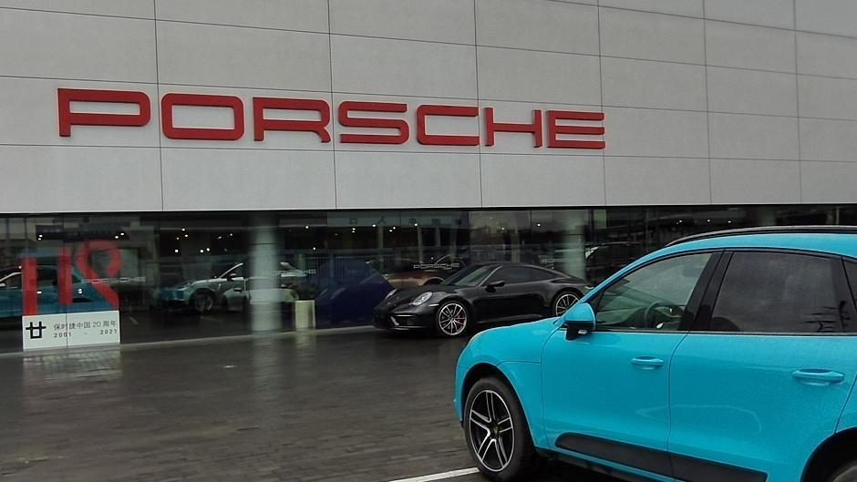
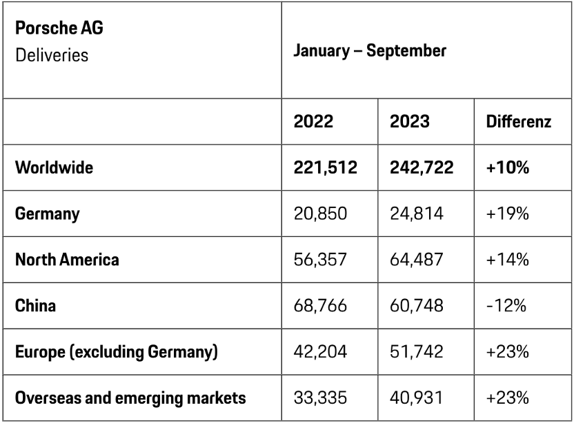

# 豪车不香了？保时捷今年前三季在华交付逾6万辆，下滑12%

保时捷今年前三季度在中国市场的交付量逆势下滑。

10月13日，德国大众旗下豪华品牌保时捷官网显示，2023年前三季度保时捷在全球实现24.27万辆交付量，同比增长10%。

其中，中国市场贡献6.07万辆交付量，同比下滑12%。今年上半年，保时捷在中国市场的交付量为4.38万辆，同比增长8%。也就是说，第三季度保时捷在华交付量仅有1.69万辆。

欧洲市场凸显出了强劲需求。今年前9个月，保时捷共在欧洲市场（除德国外）交付5.17万辆，同比增长23%；德国市场交付量为2.48万辆，同比增长19%。

北美市场交付量为6.45万辆，同比增长14%；海外及新兴市场贡献了4.09万辆的交付量，同比增长同样达到了23%。

自2015年到2022年，中国一直都是保时捷最大的单一市场。今年前三季度北美市场的交付量已经超越中国，若第四季度不能翻盘，2023年保时捷的最大单一市场或将易主。

_保时捷全球销量分布，来自官网_

分车型来看，经典跑车911在前三季度交付了3.88万辆，同比增幅高达27%；Macan车型交付量为6.84万辆，同比增长15%；Panamera交付量为2.68万辆，同比增长5%；718车型交付量为1.65万辆，同比增长18%。

Cayenne车型交付量罕见出现下滑，为6.45万辆，同比下滑3%。保时捷方面解释说，新款Cayenne于今年4月上市，不同地区的新款车型上市时间不同，从全球角度来看，这暂时导致了上市较晚的市场中产品供应量下降。

值得注意的是，保时捷旗下电动车型交付量也获得了显著增长。今年1-9月，Taycan车型交付为2.79万辆，同比增长11%。

自2019年上市以来，Taycan车型正逐渐为保时捷打开高端纯电市场，得以和特斯拉Model
X/S同台竞技。保时捷方面表示，虽然面临着供应链挑战以及全球参差不齐的电动汽车市场，仍预计今年Taycan车型销量将获得大幅增长。

放眼中国车市，乘联会数据显示，今年以来，全国累计零售销量为1523.3万辆，同比增长2.4%。保时捷在华销量增速不及大盘。

不过再看其他豪车品牌，保时捷似乎也并不“孤单”。今年第三季度，宝马在中国的销量增速也没有跑赢全球。

据官网，宝马集团今年前三季度在全球交付了183.66万辆汽车，同比增长5.1%。其中在中国市场交付60.28万辆BMW和MINI品牌汽车，同比增幅仅为1.7%。

梅赛德斯-奔驰在中国则获得了略好的表现。今年1-9月，梅赛德斯-
奔驰全球的乘用车累计销量达到152.98万辆，同比增长2%。在中国市场累计交付57.87万辆新车，同比增长3%。

