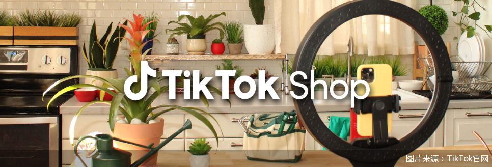

# TikTok东南亚历劫：“一件衣服2.3元”与被动的商业化

对于TikTok，接二连三的坏消息从东南亚传来。

10月4日，TikTok印尼电商业务关停。UTen合伙人黄森解散了当地的服饰自播团队，同时准备把服饰类库存转移到马来西亚，那里有他们的合资公司。

更坏的消息还在后面。10月11日，又有媒体报道，马来西亚政府正在审议一项与印尼类似的政策，考虑禁止TikTok上的电商业务。与此同时，越南也传来消息，在完成对TikTok近5个月的调查后，认定后者违反了电子商务、信息安全和儿童保护方面的法律。

在这之前，黄森已经在印尼市场经历了一轮过山车：TikTok
CEO周受资亲自前往印尼斡旋的消息，曾让他抱有过一丝幻想。但很快，当地对于TikTok商家的动作让他瞬间认清了现实：海关开始查灰清、税务局查税、移民局查签证、劳工局查本地雇佣……七天之内，情况急转直下。

TikTok仿佛在印证一个“历史规律”，越是风光无限，越是险象环生。印尼总统佐科对“一件衣服只卖2.3元”的不满，将TikTok电商业务与当地复杂的产业发展、吸纳就业问题纠缠在了一起。接下来的问题就是，这场始于印尼的关停风波是否会蔓延至整个东南亚？而被周受资寄予厚望的东南亚市场，又能否扛住这一波“伤害”？

01 “2.3元”风暴眼

“一件服装竟然只卖5000印尼盾，这里面肯定有掠夺性定价。”

5000印尼盾换算成人民币大约只有2.3元。在广为流传的这段演讲视频中，印尼总统佐科毫不掩饰自己对TikTok电商平台的担忧，他还点出了一个关键问题，这里“90%都是进口产品”。

9月27日，印尼贸易部宣布，包括TikTok在内的社交平台不得从事电商服务，且仅给出一周时间作出调整。虽然TikTok多次重申对印尼市场的重视、对本地商家的尊重，但仍无法阻止禁令。

10月4日，TikTok关停在该国市场的电商业务，成为一个不再拥有“电商功能”的短视频内容平台。

事发突然，背后原因复杂。在传出的内部沟通中，TikTok电商负责人康泽宇如此形容TikTok在印尼的遭遇。

一段时间以来，外界关于原因的猜测众说纷纭。印尼官方说法是新规主要为了保护印尼中小微企业，此前，佐科曾在内阁会议上提到，TikTok
Shop日益增长的影响力，不利于微型、小型和中型企业。社交媒体上的企业以异常低的价格销售进口产品，这些价格低于本地商品的生产成本，影响了本土企业。

数据显示，印尼中小微企业超过6400万家，占印尼企业总数的99.9%，对该国GDP的贡献率达到60.3%，并吸纳了97%的劳动力，占就业总人口的99%。

佐科的这段演讲，恰恰成为破解TikTok印尼电商关停疑云的关键所在。接受北京商报记者采访时，跨境指南创始人、东南亚电商资深卖家林超指出，在印尼TikTok上销售最好的产品主要集中在服饰和美妆，而在服饰方面，印尼当地已经有本土化的供应链，因此对电商平台做服装品类生意或者说是其他地区的服装进入印尼市场非常敏感。

林超补充称，中国跨境电商SHEIN也是因为服装为主的原因，导致无法进入印尼市场。

2018年中国贸促会纺织分会的投资调研总结提到，印尼作为东盟人口最大的国家，纺织服装行业是国家支柱型产业，为全球品牌提供巨大的服装产业链，全国从业人口273万，2017年纺织服装出口额124亿美元，其中服装出口约75亿美元。

位于雅加达的丹拿望（Tanah
Abang）市场，被称作印尼纺织业的中心，也是东南亚最大纺织品和服装批发市场。黄森去过那里很多次，在他的印象里，电商兴起之前，不同地方的印尼商家都会聚集到这里进货，再拿回到当地倒卖。

但电商兴起后，他们只需要在网上下个单就能够完成之前的操作，很少还会再去丹拿望，“而且TikTok出来后，价格卷到比批发市场里还便宜”。

此前有消息称，丹拿望的商贩们在摊位前张贴海报，抗议销售额下降，敦促政府关闭TikTok Shop。因为TikTok压低了价格，不少店铺被迫关门，员工下岗。

与此相对应的是，黄森提到，在TikTok上大卖的商家中，有中国背景的人占据多数。印尼风波一出，直播电商同行中当地团队基本该解散的解散，该裁员的裁员，当地的中国团队部分回国，部分选择留在当地处理积压的货物，但是品牌化和本地化做得好的团队动作小一些。

8年跨境资深卖家“麦老板跨境圈”也提到，他接触到的东南亚电商卖家中，中国企业占据九成以上。“印尼当地人没有货，没有资金，也没有整合资源的能力，更多是中国商家雇佣当地达人做短视频直播，由中国商家搭建完整的变现体系。”

但对“一件衣服只卖2块3”的问题，黄森却斩钉截铁地表示，绝对不是中国卖家做出来的事。他给北京商报记者算了一笔账：即便是灰清的价格，一个立方服装的关税也要达到3200-3500元左右，一立方大约是1000条牛仔裤，折算下来单条成本都已经接近3.5元，再加上生产、仓库、员工运营以及签证、租房等成本，根本不可能做到2.3元的价格。

黄森认为，在印尼市场，很多价格非常低且货不对板的服装产品，其实来源于印尼本地人。在寻找印尼本土供应链的时候，黄森曾拜访过很多服装工厂，既有大型的如Levi's和Nike的代工厂，也有一些“小作坊”。

这些小作坊可能只是一间民房，十几个工人的规模，但他们大多都在Shopee、Lazada以及TikTok上有自己的店铺。

通常而言，这些“小作坊”在TikTok上的体量会比Shopee和Lazada体量更大一些，因为借助于社交内容的传播很容易出现爆款。比如牛仔裤成为爆款，当地商家就会用一种不是牛仔但仿牛仔颜色的布料进行制作，最终的销售价格甚至不到20元人民币。

这也反映出了一个关键问题：印尼纺织业的“外强中干”。黄森提到，印尼虽然具有成熟的纺织业供应链，但从经济角度考虑，其上游面料、纱线的价格都要比从中国市场进口更贵，工厂的运转效率以及工人的劳动贡献率也很低，从整个市场的角度看，其生产、运转、组织的效率要远不如从中国进口。

这种情况甚至不局限在服装行业。黄森举例称，很多其他进口自中国的商品，比如冰激凌乳制品等，价格也要比同规格的本地产品便宜大概1/3。

“如果不贸易保护的话，纯粹从成本和效率上对比，印尼这种高度吸纳就业的产业是完全抵不过中国的。”黄森总结说。

02 印尼“江浙沪”

黄森算得上是TikTok出海印尼的见证者。按照黄森的说法，不同于很多深耕东南亚市场的商家，他纯粹是因为TikTok才出海印尼的。

最早的时候，受TikTok邀请，黄森主做第三方的数据和SAAS工具。但一段时间尝试下来，黄森发现印尼当地对于数据分析的需求量太少，因此团队很快从最初的技术产品运营转向发力本地团队，成为MCN机构，又进一步转型成为卖家以及品牌卖家。

目前其运营的MCN机构已经达到了印尼服饰类排名首位，作为卖家的销售体量一个月也有大概100万美元左右。

黄森将印尼的首都地区形容为中国的江浙沪，比重甚至可能更大。他提到，虽说印尼是万岛之国，但50%的人口都集中在首都所在的爪哇岛上，绝大部分电商订单也都聚集在那附近，对电商业务来说，人口又多又集中的区域，非常适合做电商的高效分发。

而这或许也正是TikTok选择印尼的关键所在。据了解，印尼和英国是试水TikTok电商的两大阵地，2021年2月，印尼TikTok
Shop领先英国市场两个月，率先上线成为TikTok出海直播带货的第一站。

此后，TikTok Shop又进一步延展至东南亚的泰国、越南、菲律宾、马来西亚和新加坡，以及美国等更多国际市场。

印尼是东南亚地区人口最多的国家，几乎占据整个东南亚人口的一半。有媒体报道称，TikTok在印尼拥有1.25亿月活跃用户，仅次于美国。此外，2022年TikTok
Shop东南亚GMV为44亿美元，其中印尼站GMV为25亿美元，占比近60%。

“人口红利就是最大的红利”，“麦老板跨境圈”称，有了人口才有消费，天花板才够高，TikTok东南亚会先选印尼，也是因为当地人口多，消费能力强，发展猛。

黄森把当下印尼的大环境比作是20年前的中国，消费者的接受水平也很像中国的下沉市场，这时候当直播带货这样一种充斥着大量促销内容的信息冲击过来，而且价格确实要比身边线下产品更低时，当地消费者是完全没有抵抗力的，而这种快速增长的模式也是传统电商无法企及的。

过猛的发展势头也让TikTok经历了类似于“枪打出头鸟”的结果。林超提到，与在东南亚其他国家的业务相比，TikTok在印尼的体量会更大一些，而且增速更快。此外，TikTok电商在印尼上线的时间并不久，在当地本土化的资源和人脉可能不像其他平台那么广泛深入，作为一个势头很猛的新平台，可能也容易成为“首先被开刀的对象”。

科技网站“Tech in
Asia”报道，印尼市场排名前三的电商平台是Shopee、Tokopedia和Lazada，去年它们在印尼的市场份额分别为36%、35%、10%，三者都是纯电商平台。

Shopee是东南亚最大的跨境电商平台，总部位于新加坡，Tokopedia是印尼本土电商公司，Lazada属于阿里系平台，覆盖马来西亚、菲律宾、印尼、新加坡、泰国和越南六个市场。这些平台均以印尼本土卖家为主，受新规影响较小，例如Shopee上，跨境交易量不到百分之一。

传统的货架电商正在经历“显眼包”一样的兴趣电商的挑战。新加坡咨询公司Momentum
Works的数据显示，去年印尼电商交易额约为520亿美元，其中约25亿美元来自TikTok，其在印尼电商平台的激烈竞争中啃下了5%的市场份额。

一位名叫Dennies的印尼商户在接受《纽约时报》采访时表示，政府关停TikTok Shop印尼业务，想要保护的根本不是本地中小商家，而是其他电商平台。

Dennies此前通过TikTok Shop售卖皮包和手提箱等商品，营业额是其他电商平台的3倍。印尼新规出台后，Dennies随即失去了这部分收入。

03 明年4月是关键

印尼的风波尚未平息，马来西亚又传来了新消息。近日，当地媒体报道称，马来西亚政府正在审议一项与印尼类似的政策，考虑禁止社交媒体平台TikTok上的电子商务交易。

报道援引马来西亚通讯和数字部长Fahmi
Fadzil采访称，多家大型商店对TikTok平台上提供的产品价格提出投诉，主要零售商也对通过该平台销售的产品的定价竞争表示担忧。Fahmi还强调，TikTok应该就个人数据保护提供解释，这是用户在平台购物时关心的问题。

此外，越南公布的一项针对TikTok的调查也显示，指责其违反了越南内容分发网络储存信息的条例，此外，TikTok越南的电商业务也没有遵守当地公布申请人的资料、在登记时储存卖方的全部资料等规定。

北京市京师律师事务所合伙人律师卢鼎亮对北京商报记者分析称，目前马来西亚政府也就上述问题要求TikTok作出相应解释，用以回应用户在平台购物所关心的商品定价竞争问题和隐私数据担忧问题。不排除今后东南亚的其他国家或地区会对类似问题提出关注和质疑，也不排除相关部门今后会要求社交平台与电商业务进行剥离的要求。

不过在黄森看来，马来西亚和越南的情况要相对可控得多，因为“马来西亚产业结构与印尼有一定区别，服装产业并不是其核心产业，而且马来西亚的人均收入也相对较高”。

越南可能更不会出现类似的风波。按照中国出海商家的描述，在货架电商和社交电商方面，与其他东南亚国家从业者相比，越南人是“玩得最明白的”。

黄森提到，越南的电商大部分是越南人自己做的，他们通常会选择从中国的广东或者广西进货，然后再贴牌卖出去，而且越南商家在社交内容的打造上也很强，“越南市场更多是线上商家和线下实体经营者之间的矛盾，与印尼完全不一样”。

因此，这场始于印尼的风波可能并不会如外界担心的那样蔓延至整个东南亚。调皮电商创始人冯华魁对北京商报记者分析道，从电商角度看，让一家企业只做社交不做电商是一种无法推广的行为。

在他看来，TikTok
Shop在当地真正落地时间并不长，所谓的对当地实体造成重要影响的说法有些牵强。如果真要保护国内实体，比起限制电商，对进入印尼的商品统一加征关税的方式才更符合逻辑。

林超也提到，虽然TikTok
Shop在印尼的增速很快，但整体占比并不大，关停影响有限。“如果关停的是Shopee，可能就会影响到印尼的整个经济，因为Shopee已经是印尼第一大电商平台，而TikTok
Shop与Shopee可能还有5-10倍的差距。”

至于印尼市场，目前对于TikTok电商业务的回归预测很多，林超认为，其中比较靠谱的是在明年1月或4月之后。

明年4月是一个关键的时间节点，届时印尼2024年大选结果尘埃落定。林超认为，TikTok可以与新一任领导班子进行沟通，有望重新恢复业务。而1月的原因在于TikTok可能更迫切地想要尽早恢复，过两个月整体反对的声音较小一些，再按官方要求申请电商资质，应该不难恢复。

与大选之间千丝万缕的联系，也是TikTok印尼历险原因中广为流传的一个，“麦老板跨境圈”将其概括为“拉选票的手段”。

“麦老板跨境圈”称，在东南亚国家，一些政策从提出到落实，通常需要一两年的时间。而这次新政从起草到实施不过两周时间，是十分异常的。按照佐科的说法，中国卖家的策略是先战略性亏损，后期再把价格提升，影响到印尼本土企业，在大选前出台这一政策可以展示自己的成绩，为本地人民做贡献，有效地利用舆论。

有媒体报道称，印尼三位主要总统候选人之一的Anies Baswedan，曾在9月30日批评了政府关闭TikTok
Shop的政策，他认为，“根本问题不是来自TikTok Shop功能，而是来自社交媒体上销售的进口产品”。

对于印尼的情况，康泽宇在内部沟通中表示，“仍在与有关当局积极讨论，以找到持续为印尼企业和用户提供良好服务的最佳方式”。对于印尼业务的恢复进展情况、对其他东南亚地区是否有准备预案以及东南亚市场策略是否有调整等问题，北京商报记者联系了TikTok，但截至发稿未收到回复。

对于印尼业务的恢复进展情况、对其他东南亚地区是否有准备预案以及东南亚市场策略是否有调整等问题，北京商报记者联系了TikTok，但截至发稿未收到回复。

不过抖音集团方面发给了北京商报记者一份外媒编译稿件，内容为马来西亚电商委员会主席表示，封禁TikTok电商将严重损害中小商家利益，并提到后续有相关内容会及时同步。

04 TikTok风云难测

如果不是印尼市场横生枝节，TikTok这会儿或许已经在东南亚市场与“Shopee们”展开了激烈的正面交锋。

今年6月，周受资曾透露，TikTok将在未来三年内在东南亚市场投资超过1200万美元，以支持超过12万当地商户和企业。据他透露，TikTok在东南亚拥有大约8000名员工，而六年前刚进入该市场时只有100人左右。

“东南亚地区成为TikTok的重点投资区域，是基于该地区互联网普及程度较高，市场潜力巨大。”中国信息协会常务理事、国研新经济研究院创始院长朱克力对北京商报记者说道。

贝恩咨询预测，2025年东南亚地区电商市场规模将达到2340亿美元，已成为国内各大互联网巨头出海必争之地。

电商领域格外地“卷”。Shopee的母公司背后有腾讯的影子，Lazada的背后是阿里，除了暂时受阻的TikTok外，今年8月，拼多多跨境电商平台Temu正式上线智利、菲律宾站点，其中菲律宾正是其东南亚地区首站。

经历了飞速发展的时代，国内电商格局基本稳定，市场也已经接近天花板。此时拥有大约6亿人口的东南亚市场，成为企业掘金的重要目的地。

朱克力分析称，东南亚地区经济增长迅速，消费者购买力提升，为互联网企业提供了巨大的市场机遇。此外，东南亚国家的互联网基础设施和支付体系也不断完善，为互联网公司拓展市场提供了良好的环境。

一些东南亚国家还采取了相关鼓励政策，吸引外资进入，为其提供一定程度的竞争优势。“这些因素综合起来，使得东南亚成为互联网巨头们扩张海外市场的热门选择和重要区域。”朱克力称。

“中国企业出海倾向东南亚的趋势已经延续很久了”，冯华魁提到，国内企业出海时并没有预设的目的地，一定是在跑马圈地时期普遍试了一圈，哪个市场容易进再在哪个市场深耕，现实的情况决定了企业出海东南亚的优势。

在他看来，东南亚人口众多，对于消费品的品质要求没有那么高，东南亚市场作为中国一般制造业转移对象较为合适。而且东南亚国家也相对认可并倾向于仿照中国的发展模式，比如参考中国巨头做电商、游戏等方向。

电商其实是中国数字化商业的一部分，一定程度上说可以称之为中国数字化的前奏或者序曲，推动了传统商业的数字化营销、管理等转型。冯华魁认为，从这个角度看，印尼未来的大方向也一定如此，只有一波又一波的电商企业进入东南亚，东南亚电商企业数字化才会越来越高，从而进一步推动当地数字经济的发展。

而从长远发展的角度，林超也仍看好东南亚市场。他总结出了三个方面的原因，中国与东南亚国家在政府层面的合作较多前景稳定，物理距离近，以及东南亚国家的商业大多由华人或华裔主导，东南亚财团与中国大型企业或者政府的合作历来较多。

“这决定了东南亚国家不会在贸易上与中国企业产生较多的摩擦，因为本身都是利益共同体。”林超称。

但这些也不意味着TikTok出海东南亚的一帆风顺。卢鼎亮分析称，由于东南亚的电商市场具有一定的特殊性，不同地区的营商环境、消费者成熟度、用户习惯、物流支持程度均有较大不同，面对习俗做差异化和地理碎片化的东南亚市场，各个电商公司都存在一定挑战。

“而且东南亚当地监管部门对电商业务中涉及到的价格竞争、隐私保护等问题的关注将会成为TikTok电商业务后续发展过程中必须面临的监管成本”，卢鼎亮称。

北京商报记者 杨月涵

