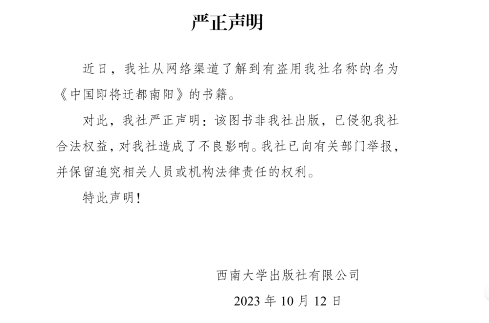
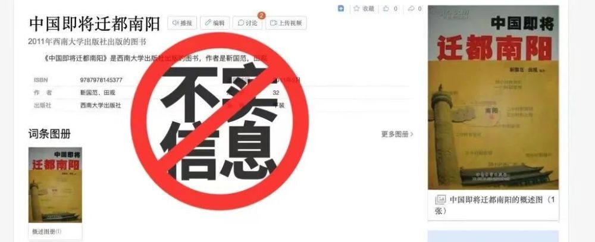

# 《中国即将迁都南阳》由西南大学出版社出版？官方：系伪书，将追责

近日，西南大学出版社发布声明，名为《中国即将迁都南阳》的书籍系盗用西南大学出版社名称，非西南大学出版社出版物，已向有关部门举报，并保留追究责任。

_西南大学出版社发布严正声明。官方截图_

据了解，网络上《中国即将迁都南阳》一书系2011年，由靳国范、田观编著，定价32元，出版方赫然写着：西南大学出版社。

西南大学出版社总编室主任郑持军回应称《中国即将迁都南阳》一书并非盗版书，而是伪书。

“盗用了西南大学出版社这个名字，书号、包括出版社社标全部都是他们自己捏造的，并非是西南大学出版社出版物。”郑持军表示，目前出版社已启动法律程序，将维护合法权益。

来源：华龙网

