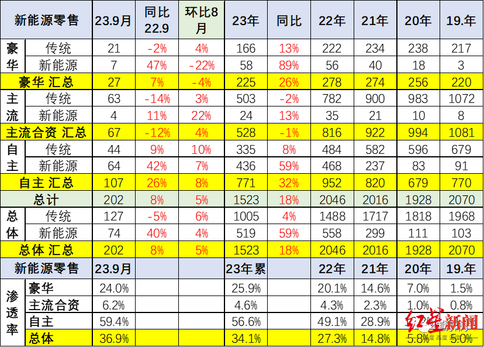

# 下滑12%，中国成保时捷唯一下滑市场，保时捷在中国为什么不香了

红星资本局10月15日消息，保时捷官网披露的交付数据显示，2023年前三季度保时捷在全球交付了24.27万辆，同比增长10%，其中中国市场6.07万辆，同比下滑12%，是唯一下滑的单一市场。

今年1-9月，经典跑车911交付了3.88万辆，同比增长27%；Macan车型交付6.84万辆，同比增长15%；Panamera交付2.68万辆，同比增长5%；718车型交付1.65万辆，同比增长18%；Cayenne车型交付6.45万辆，同比下滑3%。保时捷旗下电动车型Taycan交付2.79万辆，同比增长11%。

今年上半年，保时捷在中国市场的交付量为4.38万辆，同比增长8%。也就是说，第三季度保时捷在华交付量仅有1.69万辆。

自2015年到今年上半年，中国一直是保时捷最大的单一市场。但今年前三季度，北美市场以6.45万辆的交付量超越中国成为保时捷最大的单一市场。

保时捷在中国为什么不香了？

乘联会数据显示，1-9月乘用车累计零售1523.3万辆，同比增长2.4%；豪华车累计销量225万辆，同比增长26%。

其中新能源豪华车1-9月零售销量58万辆，同比增长89%，已超过2022年全年的56万辆。传统豪华车1-9月累计零售销量166万辆，同比增长13%，2022年全年为222万辆。9月，豪华车中的新能源车零售渗透率为24%。

_豪华车销量（据乘联会）_

也就是说，豪华车的市场增量主要来自新能源车，新能源车的销量增速远高于传统车，而保时捷是以传统燃油车为主。

业内人士指出，保时捷在中国卖不动，主要是因为中国的豪华车市场竞争激烈，特别是新能源豪车抢走了很大一部分客户。

车评人吴佩表示：“电车市场四五十万能买的车子太多了，别看他们品牌新，但和高端品牌的客户确实是同一波，买蔚来、理想的很多人，都考虑过Macan。”

汽车独立分析师刘昊向红星资本局表示：“中国车市已经是存量市场，豪华车的消费者数量增长也不大，销量增长很多来自换购、增购。现在换购大多会将智能汽车纳入考虑，能买保时捷的消费者买得起几乎所有的自主品牌新能源汽车，而且还是顶配。相比保时捷，自主品牌的智能体验更好，性价比更高。而增购更多是为了代步或者家庭需要，一般不会选择保时捷。”

有保时捷车主告诉红星资本局，她增购了一辆蔚来ES6，选择这款车的原因是“换电的体验非常好，而且还不到40万元。”另一位保时捷车主增购了一辆特斯拉Model
3，“代步需求，Macan太耗油了。我的预算有限，买Model 3才花了23万。”

公开信息显示，保时捷售价较低的718和Macan车型也要56万元起，Cayenne车型93万元起，Taycan车型89万元起，Panamera车型99万元起。顶配保时捷一般在110万至200万元。

而自主品牌豪华新能源汽车（轿车、SUV）的主流价格区间在40-80万元。蔚来汽车最高售价65万元，小鹏汽车最高42万元，理想汽车最高46万元，极氪最高40万元，智己最高57万元，高合汽车最高80万元。

今年以来，自主品牌豪华新能源汽车的价格上探至100万元。比亚迪仰望首款车型U8售价109.8万元，刚刚上市的纯电超跑昊铂SSR售价128.6-168.6万元，是目前最贵的自主品牌量产车。

保时捷在中国市场的竞争对手，还有全球的豪车品牌。中国是宝马、奔驰、奥迪的全球最大单一市场，也是劳斯莱斯、宾利、兰博基尼等品牌全球排名前三的重要市场。特斯拉Model
S&X的价格区间与保时捷相交，路特斯的两款车ELETRE和EMIRA更是与保时捷的主销车型重合。

红星新闻记者 吴丹若

编辑 杨程

