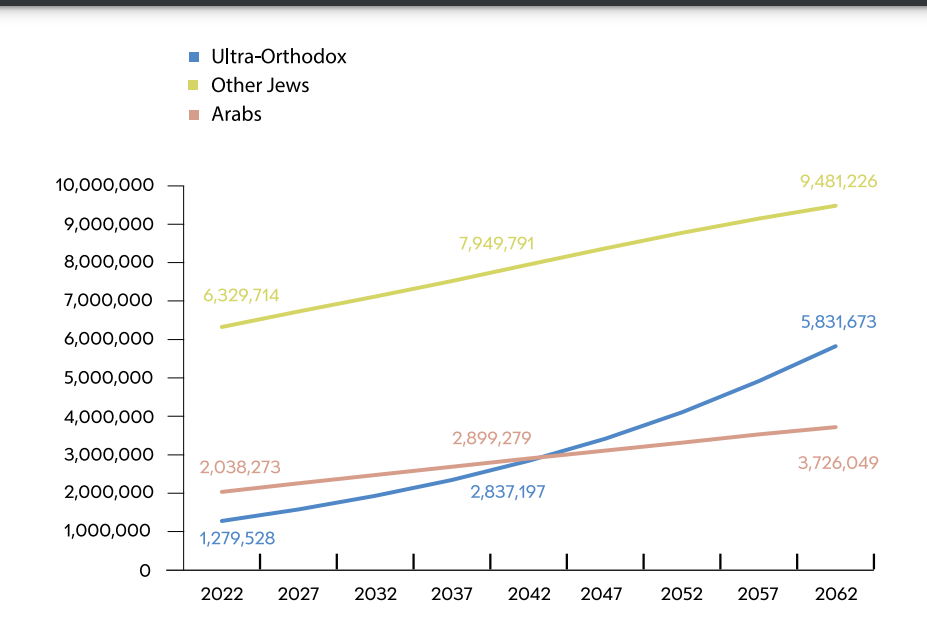

# 以色列总理送儿子上前线？媒体：照片实为2014年送其服兵役

**速览**

网传图片与近期哈马斯突袭以色列引发的冲突事件并无关系，实际是2014年以色列总理内塔尼亚胡送小儿子阿夫纳（Avner）服兵役时拍摄的照片。2017年12月1日，阿夫纳（Avner）已经结束服役。

根据以色列1949年制定的《兵役法》，所有符合资格的年满18岁的以色列人都必须服兵役。不过，以色列的极端正统派可以在26岁之后获得永久豁免权，以色列各派别目前仍在就该项豁免权的适用年龄进行磋商。

**事件背景**

近日，中外社交平台均流传一张图片，据称是近期在哈马斯突袭以色列之后，以色列总理送儿子上前线的照片。

_网传说法相关截图_

**明查**

在谷歌对网传图片进行反搜，早在2014年，该图已经出现在以色列媒体的报道中。《耶路撒冷邮报》12月30日的报道封面图就使用了这张图片，标题为“以色列总理内塔尼亚胡的儿子阿夫纳（Avner）在以色列国防军基础训练事故中受轻伤”，文内称，“阿夫纳（Avner）于本月早些时候入伍，在接受基本训练后，预计将在一个战斗情报部门服役。”

_《耶路撒冷邮报》报道截图_

进一步检索，《以色列时报》12月1日的报道就使用了这张图片，图说为：“2014 年 12 月 1
日，总理本杰明·内塔尼亚胡和他的妻子萨拉与儿子阿夫纳一起出现在耶路撒冷的弹药山（Ammunition
Hill）。”文章称，“以色列总理内塔尼亚胡最小的儿子阿夫纳（Avner）从2014年12月1日开始在以色列国防军服兵役，他的父母——以色列总理本杰明·内塔尼亚胡和母亲萨拉陪同他登上巴士为他送行。”

_《以色列时报》2014年12月1日报道截图_

_2014年12月1日，以色列总理夫妇与他们的儿子亚伊尔（Yair）和阿夫纳（Avner）的合照。_

根据报道，阿夫纳（Avner）的哥哥亚伊尔（Yair）当时已经服完兵役。

2017年12月1日，在阿夫纳（Avner）服役结束之后，以色列总理的脸书账号也发布了这张图片并表示，“三年前，我们迎接了你的入伍，今天，我们为你翻开人生的新篇章而激动不已。”

而上述几个出处均标明了该图来自以色列总理办公室（GPO）的摄影师Kobi Gideon。

_以色列总理内塔尼亚胡2017年于脸书发布的图文截图。_

根据1949年制定的以色列《兵役法》，所有符合资格的年满18岁的以色列人都必须服兵役，男性为3年，女性为2年，不过，公民可以因宗教、身体或心理原因豁免服兵役。2015年起，男性服义务兵役的时长缩短至32个月。

_以色列国防军士兵招募首页显示以色列有哪些公民符合义务服兵役的条件。_

值得一提的是，以色列的极端正统派可以在18岁之后以参加宗教研究为由延期服兵役，至26岁后可以获得永久豁免权。而这部分人口的生育率很高，截至2022年，其人数在以色列全部人口中占比为13%，且预计会在2062年达到31%左右，对以色列的征兵规划有较大影响。

 _2022年度以色列极端正统派的社会统计报告对未来人数趋势的预估_

在义务兵役管理上，以色列政府与国防军（IDF）始终存在分歧，前者一直有意让以色列的极端正统派早日免服兵役，而以色列国防军认为这实质上将全面禁止正统派服兵役，并表示从社会各阶层征召以色列人至关重要。根据以色列总理办公室报告，2021年，内阁曾批准将极端正统派年轻男子免除以色列国防军服役的年龄降低至
21 岁计划，但该计划未能生效。

 _以色列政府2021年发布的公告，有意向将永久豁免年龄降低至21岁。_

今年8月，根据以色列政府的声明，正统派党派、政府和国防军对新的《征兵法》进行了一次讨论，新法律旨在将永久豁免年龄从26岁降低至22岁，促进全民服役和正统派的就业，并将增加应征入伍或在预备役服役人员的福利。不过，各方最终仍未能达成统一意见。

目前，以色列仍然维持现有的极端正统派的服役豁免权规定至2024年3月31日，以色列政府承诺在此之前确定一项新法案。

 _《耶路撒冷邮报》对政府会议内容报道截图_

综上所述，网传图片与近期哈马斯突袭以色列引发的冲突事件并无关系，实际是2014年以色列总理内塔尼亚胡送小儿子阿夫纳（Avner）服兵役时拍摄的照片。2017年12月1日，阿夫纳（Avner）已经结束服役。根据1949年制定的以色列《兵役法》，所有符合资格的年满18岁的以色列人都必须服兵役。不过，以色列的极端正统派可以在26岁之后获得永久豁免权，以色列各派别目前仍在就该项豁免权的适用年龄进行磋商。

