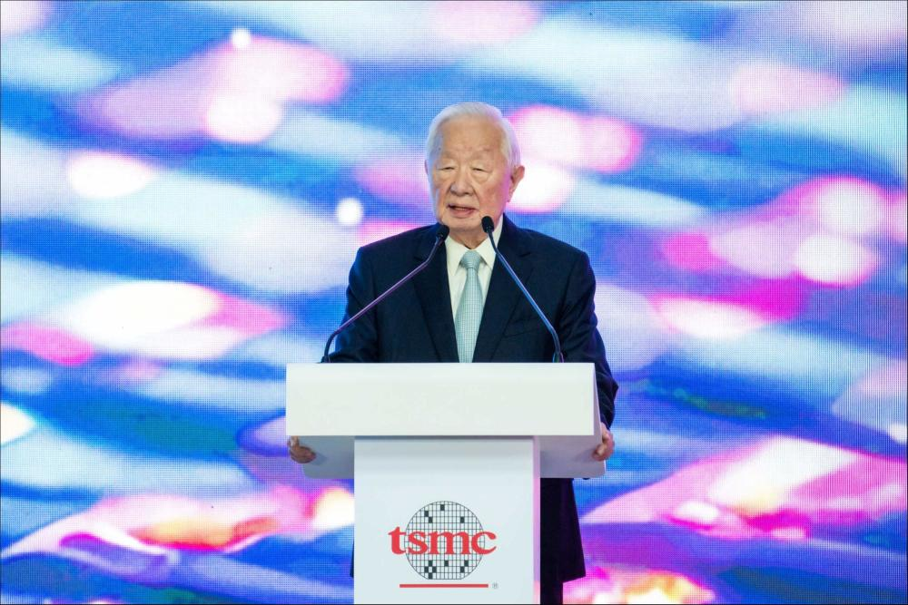
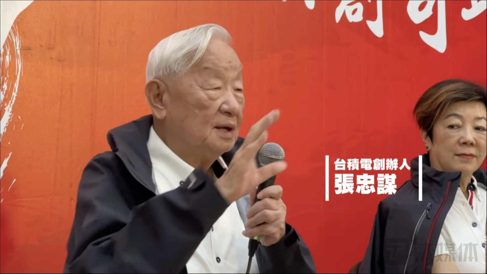

# 张忠谋：20年后台湾芯片产业恐失去优势，台积电未来挑战将更加严峻

随着全球芯片竞争严峻，供应链脱钩断链愈演愈烈，晶圆代工龙头台积电“教父”开始对半导体行业进行预警。

会后罕见的近一个小时的群访中，张忠谋强调，在世界各国纷纷建立芯片供应链下，日本是较理想的地方。他直言，未来20、30年后，中国台湾半导体制造环境可能不会像现在这么有优势，这和地区经济发展情势演变有关。放眼未来，哪个国家半导体制造环境相对有利？也许是印度、越南、印尼，可是谁知道呢。

**当被问及中芯国际最新技术是否会威胁台积电领先地位时，张忠谋摇头说不会。他还认为，巴以冲突对芯片供应链影响很小，并透露下周可能在美国纽约与英伟达创始人黄仁勋见面，但目前还不确定。**

公开资料显示，今年92岁的张忠谋，出生于浙江宁波鄞县，1932年迁居南京，1937年迁居广州，曾就读美国哈佛大学、斯坦福大学，以及麻省理工学院的机械工程学位、博士学位。在德州仪器（TI）工作20多年后，回台创立了台积电——全球最大的半导体制造商之一，被誉为“半导体教父”，曾任台积电董事长，于2018年从董事长职位上退休。台积电的客户包括苹果、英伟达和高通。

据福布斯2023年4月公布的中国台湾50大富豪排行榜，张忠谋净资产达23亿美元，排名第24位，在全球富豪榜排名第1312位。

台积电员工运动大会至今已举办26届，是台积电为增加员工健康和福利待遇所举行的活动。今年运动会是疫情以来暌违三年再度举办，台积幼儿园及JASM也首次组团参加，并与上海、南京分公司团队同步连线直播。

**92岁高龄的张忠谋看起来状态不错，偕同夫人张淑芬二人入场后则绕场一圈，并发表了10分钟左右的致辞演讲。**

张忠谋表示，每年的运动会都是他当年最愉快的一天，这是退休后第二次参与运动会。他直言，50岁后他忽然警觉年纪越大就越不健康，之后保持每周至少三天运动时间，这对于他健康有很大帮助。张忠谋强调，员工运动会重要的是体现台积电的团队精神价值。

张忠谋指出，当前外部地缘政治和“逆半导体”环境下，台积电在未来几年面临的挑战会比过去更为严峻。在半导体方面，全球化和自由贸易都没有了，目前最重要的还是地区安全，且别的公司可能会利用地缘政治的趋势，来打败台积电。

**会后群访中，尽管张忠谋表示因下周举行财报会，而拒绝回答台积电业务相关事项，但他对行业、世界半导体局势等话题均进行了比较重要的观点预测。**

随着芯片对于世界越来越重要，目前全球主要国家和地区都在积极的建立本土化的芯片供应链，对此台积电也不得不顺应趋势来做全球化的布局，比如在美国、日本、德国建厂。

张忠谋表示，“相信20-30年后，中国台湾半导体制造环境不会像现在这么有优势。”这也正是台积电近几年积极进行海外布局的一大关键因素。

张忠谋比较看好未来日本半导体产业。他直言，50年前曾为了德州仪器到过日本九州，依过去经验来看，其实日本、新加坡都是较理想的地方，只是新加坡资源相对少，日本九州的土地及水电等资源都充裕，且日本是工作文化很好的地方。

张忠谋还指出，1955年至1972年，他觉得美国的半导体制造环境，跟中国台湾今天一样好，至少几乎一样，但随国家经济发展等情势演变，1972年之后美国已升级到获利高、轻资本的芯片设计领域，半导体制造环境就不利了。如今，尽管台积电当前拥有很大的技术优势，
**但他相信20年到30年后，随经济发展情势演变，中国台湾地区也会像美国一样，半导体制造环境不会如现在有利。**

那么，放眼未来，哪个国家半导体制造环境相对有利？张忠谋表示，也许是印度、越南、印尼，可是谁知道呢？都有可能是接棒之地。

张忠谋还指出，在美国建厂一直是他的梦想，1996年时成立WaferTech投资建厂，虽然短短2、3年便“美梦变恶梦”，但现在的台积电已与当时完全不同，无论人才、资金、技术强很多，且拥有丰富的经验曲线，有着更好的储备，做越多越能降成本，认为他当时的梦想也许可以在现在实现。但他也强调，要会利用这个机会才行，所以台积电积极大幅增加研发，是公司能成功的秘密。

**谈及与英特尔（Intel）、三星半导体的追赶竞争时，**
张忠谋表示，目前在研发投入上，两家公司还无法超越台积电的领先地位，他举例称，三星每年花50亿美金投入半导体制造，这规模已经很大了，但相比300多亿的台积电来说还比较少，“你怎么会打得过我们”。而英特尔IDM（集成设计制造）模式则不仅要做设计芯片，而且要制造、供应销售芯片，过于复杂。

据悉，台积电南京厂自2015年开始规划建设，总投资超过58亿美元，分为两期建设。南京二厂于今年9月投入运营，两期厂区共生产12nm、16nm、28nm技术节点的芯片，每月总产能为6.5万片晶圆。

**国际半导体产业协会（SEMI）最新报告预计，半导体制造产业将在2024年第一季度触底，库存正常化推迟到2023年底。**

**扩产进展方面，**
目前台积电美国亚利桑那州的3nm晶圆厂进展缓慢，量产进度延后一年至2025年才能量产；而台积电日本熊本12nm、28nm晶圆厂进展顺利，预计将在2024年底投产，项目投资的规模约为1.2万亿日元，日本政府会给予近一半资金补贴。

有消息指，台积电还计划在日本熊本建第二座6nm晶圆厂，预计投资规模将达到2万亿日元，日本经济产业省正在考虑提供接近9000亿日元的补贴。建设工作预计将从明年夏天开始，并在2027年实现量产。

**（本文首发钛媒体App，作者｜林志佳）**

