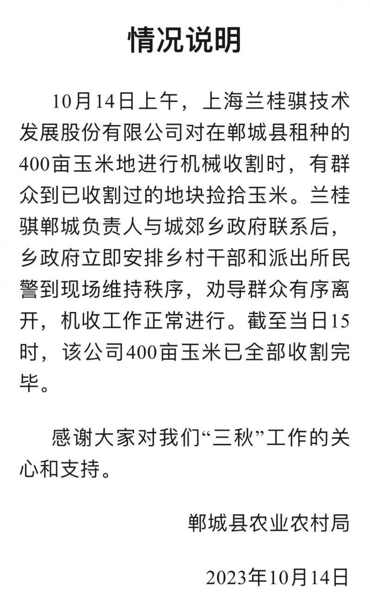

# 河南郸城一玉米地疑遭五百余人哄抢，特警出动维持秩序，当地回应

10月14日，一段河南周口郸城县某玉米地疑似遭周边村民哄抢的视频在网上引发关注。10月15日，郸城县农业农村局通报称，10月14日上午，上海兰桂骐技术发展股份有限公司对在郸城县租种的400亩玉米地进行机械收割时，有群众到已收割过的地块捡拾玉米。兰桂骐郸城负责人与城郊乡政府联系后，乡政府立即安排乡村干部和派出所民警到现场维持秩序，劝导群众有序离开，机收工作正常进行。截至当日15时，该公司400亩玉米已全部收割完毕。

文/北京青年报记者 戴幼卿

**相关报道：**

[河南玉米地被村民哄抢，特警出动维持秩序，为什么这些村民不觉得是偷](https://new.qq.com/rain/a/20231010A05SME00)

