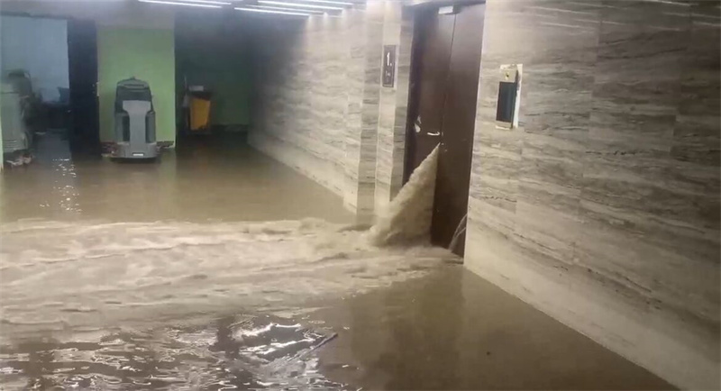
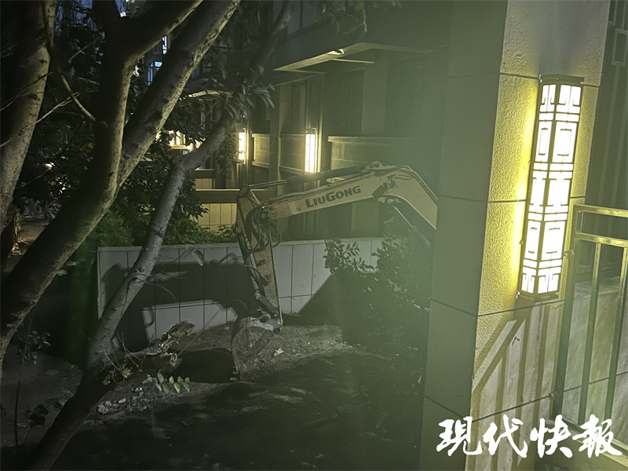
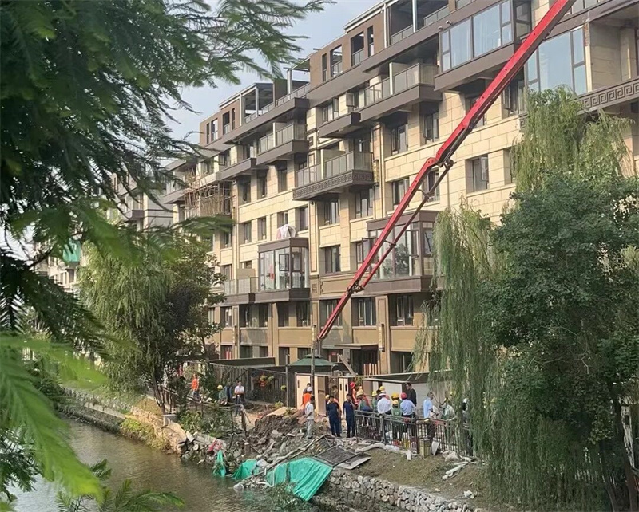

# 疑因滥挖地下室致河水倒灌！南京一小区车库被淹，最深的地方没过膝盖

现代快报讯（记者 刘赟
文/摄）10月14日，一则网友拍摄的视频引发关注。视频显示，南京江心洲升龙桃花园著·尚院小区南侧河堤塌陷，河水倒灌至地下车库，整个车库变成一片汪洋。当天晚上，现代快报记者来到事发小区，看到坍塌的河堤缺口已被堵住，现场积水也基本被清理干净。物业工作人员透露，事故中没有人员受伤，相关情况正在调查中。

_△ 大量河水倒灌进地下车库_

从网友发布的视频中可以看到，河堤坍塌后，大量河水从坍塌处涌入小区的地下车库，泥浆甚至蔓延到了小区内部的路面上。

根据网友视频的定位，当晚，现代快报记者来到事发小区所在的亚鹏路上，看到路边还停着几辆工程车，路面也还有一些未干的积水。

_△ 停在附近的工程车_

记者看到，事发小区南边紧挨着一条小河，据了解这条小河是江心洲上的排洪河道，而河堤塌陷处就位于小区最南边楼栋一楼的一户人家窗前。虽然已经过紧急处置，但仍可以看到大量泥土裸露在外，泥土上方铺了几块防雨布做了简单的遮挡。

_△ 坍塌的河堤已被堵住_

住在附近的一名居民告诉现代快报记者，事情发生于14日早上五六点左右，疑似因一楼住户装修导致。“一楼靠河边的这家装修挖了地下室，大概是没有及时回填才让河堤坍塌的。当时地下车库里全是水，最深的地方差不多没过膝盖了。”

 _△ 河堤坍塌后，相关部门第一时间赶往现场处置_

小区物业工作人员向现代快报记者透露，当时该小区车库内停放的车辆并不多。据了解，事故发生后，小区物业第一时间发现了问题，公安、消防及社区工作人员赶往现场组织抢险。物业工作人员表示，险情已在早些时候处置完毕，没有人员受伤，具体情况相关部门正在调查中。

（本文部分图片来源网络）

（校对 许元华）

