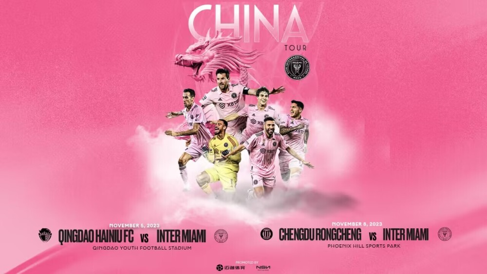
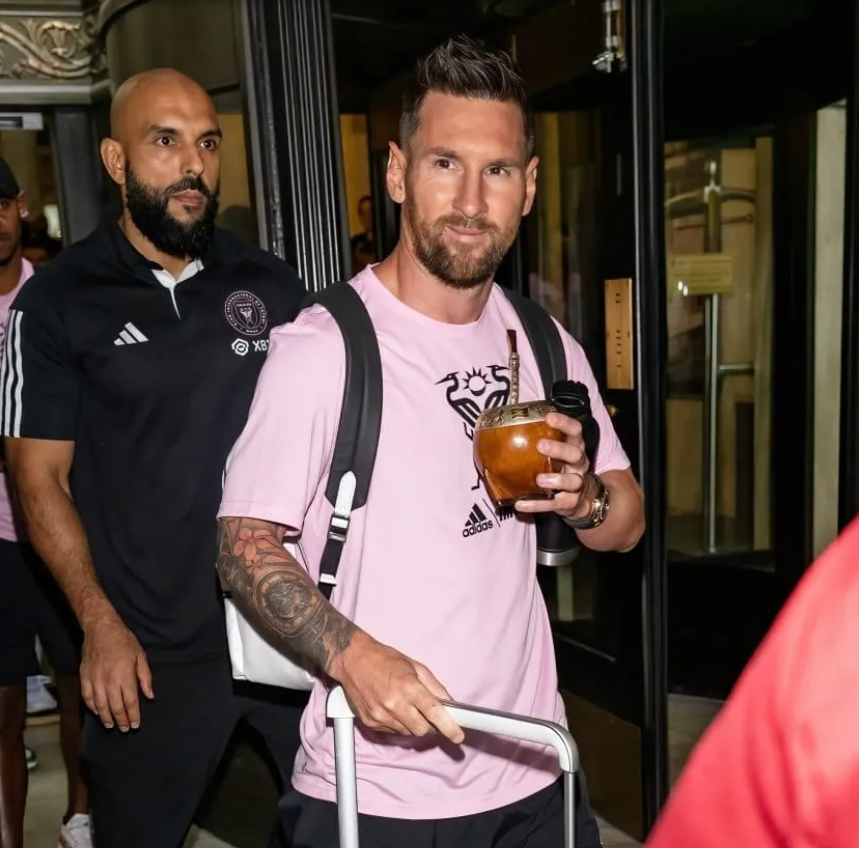
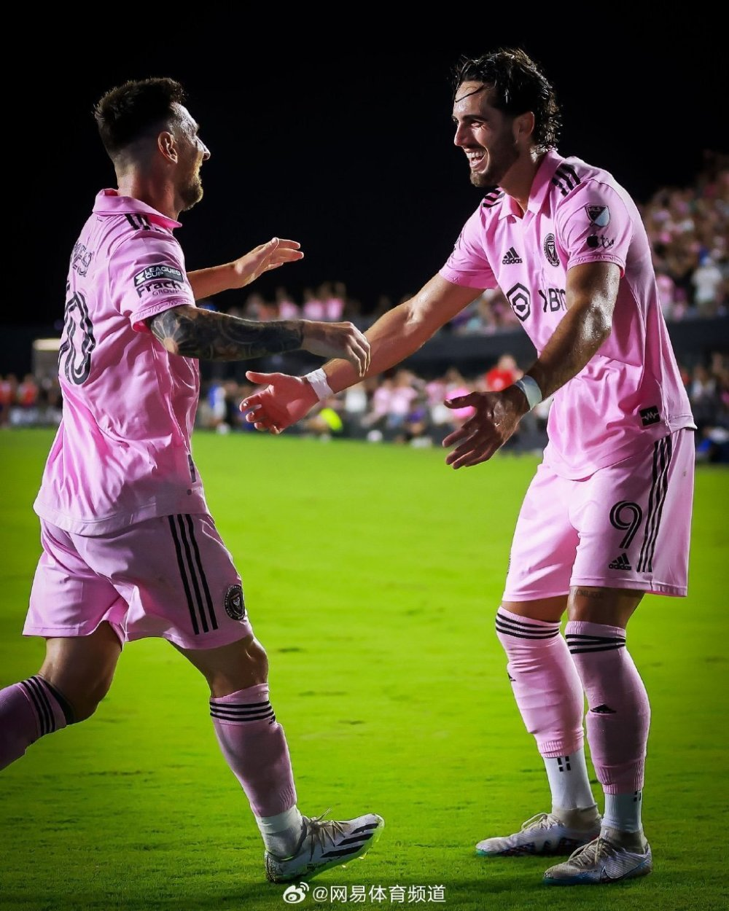
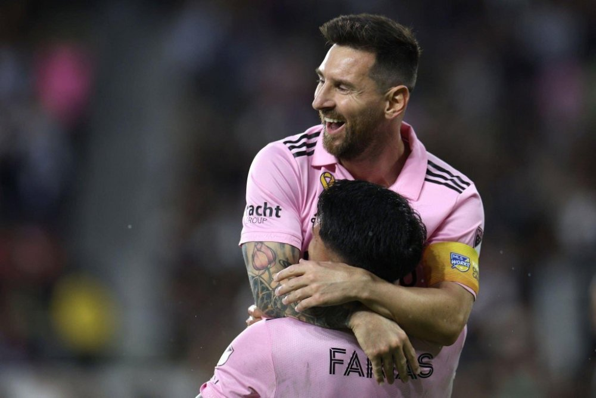

# 迈阿密国际官宣！首次国际之旅，梅西再度访华，连战海牛蓉城

周日，迈阿密国际通过俱乐部官方网站宣布将在11月访华，这将是迈阿密国际的首次国际之旅，也意味着梅西将在一年之内第二次访华。

由于未能晋级季后赛，迈阿密国际10月21日将结束所有的比赛。在确认无法晋级季后赛之后，媒体就透露迈阿密国际将在11月9日在成都对阵成都蓉城，著名记者滨岩之后也确认了这一消息。

在俱乐部官网发表的公告中，迈阿密国际表示，“俱乐部宣布将在11月开始中国之行，这是俱乐部的首次国际之旅，目标是扩大俱乐部的影响，并且为2024年做准备。迈阿密国际将在友谊赛里对阵两支中超球队，首先在11月5日对阵青岛海牛，11月8日将在成都对阵成都蓉城。”

迈阿密国际首席商务官阿森西表示，“我们非常兴奋地继续扩大我们的全球业务，让我们的球队在全世界不可思议的球迷面前踢球。这是一个特殊的机会，我们可以分享我们的热情，因为我们会接触到全新的观众，在新的地方展示自己。”

迈阿密国际体育总监亨德森则表示，“这是一次很好的机会，我们可以继续推进我们在2023年取得的成绩，我们赢得了第一座奖杯。我们将抓住这次机会，开始为2024年做准备，我们期待着在上赛季的基础上再接再厉，取得更大的成功。”

