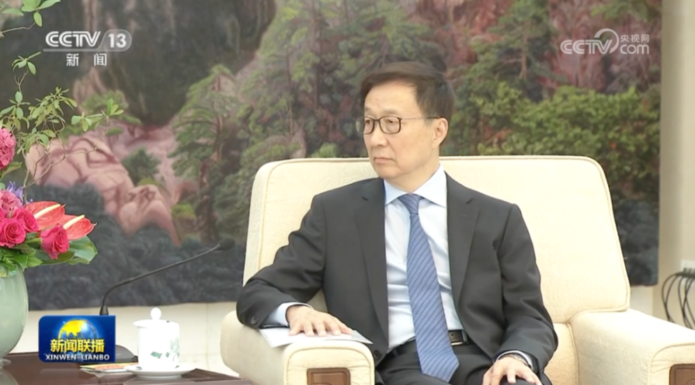
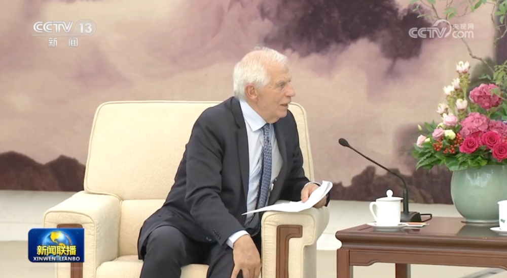
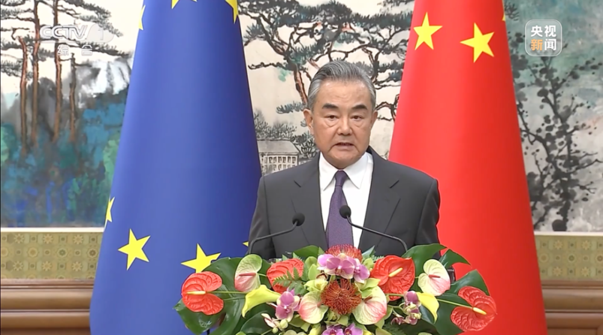

# 韩正、王毅先后与他见面，三个细节值得关注

**撰文 | 余晖**

10月14日晚《新闻联播》报道，10月13日，国家副主席韩正在北京会见欧盟外交与安全政策高级代表博雷利。

当天下午，中共中央政治局委员、中央外办主任王毅也会见了博雷利。

此番博雷利访华，是应王毅邀请的。

他访华的时间是10月12日至14日，这是他担任欧盟外交与安全政策高级代表以来首次访问中国。

沟通

中欧关系，今年以来备受外界关注。

今年4月6日下午，国家主席习近平在人民大会堂会见欧盟委员会主席冯德莱恩。

习近平强调， **中欧双方要加强沟通** ，建立正确的相互认知，避免误解误判。

“中欧要聚焦合作，互利共赢，支持经济全球化、贸易自由化，就经贸合作中的问题深入 **对话沟通** ，通过协商达成双方均可接受的安排”。

冯德莱恩表示，欧方完全不赞同搞“脱钩断链”，希望同中方加强交往对话， **尽早重启三个对话机制** ，开展更多互利合作。

据外交部网站介绍，中国同欧盟迄已建立60余个磋商和对话机制。其中，战略、经贸、人文交流是重点——

**中欧高级别战略对话、中欧经贸高层对话和中欧高级别人文交流对话机制是三大支柱。**

九月以来，中欧高层之间互动频繁。中欧在经贸、数字、环境领域的面对面交流再度重启。

9月25日，中共中央政治局委员、国务院副总理何立峰与欧盟委员会执行副主席东布罗夫斯基斯在北京共同主持 **第十次中欧经贸高层对话**
。何立峰也是“中欧经贸高层对话中方牵头人”。

这几天，中欧高级别战略对话也已经举行——2023年10月13日，王毅同博雷利举行了 **第十二轮中欧高级别战略对话** 。

首次中欧高级别战略对话是在2010年9月举行的。

第二轮至第十一轮战略对话举行的时间分别在2011年5月、2012年7月、 2014年1月、
2015年5月、2016年6月、2017年4月、2018年6月、2019年3月、2020年6月和2021年9月。

博雷利访华

博雷利，1947年4月出生，今年76岁，他对中国并不陌生，此前曾有三次访华经历。此次访华是 **他担任欧盟外交与安全政策高级代表以来首次访问中国。**

博雷利此访已两次推迟。今年4月是因为新冠检测阳性，7月初又在最后一刻取消行程。另外，这次启程前，巴以又爆发武装冲突，他召集欧盟国家外长开会讨论应对之策。

《环球时报》在社评中指出，这个一波三折的过程，有点像中欧关系近一两年来的起伏经历。博雷利最终成行，对正处于相对低迷的中欧关系来说，无疑是一次坦诚沟通、增进了解、化解分歧以及加强合作的重要契机，需要双方抓住并最大程度地利用好。

据《环球人物》介绍，此次博雷利访华，首先到了上海，到访上海国际问题研究院；之后，到访北京大学并发表演讲，称希望自己访华有助于为欧盟和中国领导人会晤奠定良好基础。

在北京期间，韩正、王毅先后和他见面。

今年是中国和欧盟建立全面战略伙伴关系20周年。从博雷利访华的大背景看，欧洲高层同中国对话的意愿很强。

另外，有专家对媒体分析说，“在当前形势下，欧方尽管坚持对华‘三重定位’，但在面对自身经济衰退、俄乌冲突、全球治理等问题上显然离不开中国，因此仍然希望与中方进行沟通。中欧目前并未演变为全面战略对抗，应在对话中明确双方关系的边界。”

细节

此次博雷利访华，也是中欧高层在多领域一系列互动的延续。

还有几个细节值得一提。

第一，在会见中，韩正、王毅重申了“沟通”“合作”的重要性。

韩正提到，中欧之间没有根本利害冲突，没有地缘政治矛盾，双方 **共识远大于分歧，合作远大于竞争。**

他说， **中方愿与欧方加强高层对话和各级别交往** ，对共同关心的问题真诚、深入地开展沟通，进一步增进双方理解和互信，推动中欧关系持续健康稳定发展。

王毅提到，中欧之间没有地缘政治矛盾， **没有重大利害冲突** ，有的是广泛共同利益和巨大合作需求。

他说，双方应把工作重心和注意力 **放在合作上** ，放在巩固伙伴关系上。

“政府应为企业创造公平的环境，提供正面的预期，经济问题不应政治化，双方应共同捍卫自由贸易，维护公平竞争原则。”

第二，当前对于中欧双方来说，最为重要的议程便是预计于今年年内举行的“中欧峰会”。

此次和博雷利见面期间，王毅提到， **要为年底前的领导人会晤作好充分准备** ，要推进对话合作，坚持相互开放，扩大贸易投资，反对“脱钩断链”，活跃人文交流。

当日，韩正会见博雷利时，博雷利也提到，“愿通过此访进一步加强欧中关系， **确保年底欧中领导人会晤圆满成功** ”。

此次访华期间，博雷利还表示，欧盟不会对中国关闭大门，不会打贸易战，无意限制中国发展，乐见中国繁荣稳定。

“欧方期待同中方加强应对气候变化等领域的合作，寻求建立更加平衡对等的经贸关系，为欧中领导人会晤积累实实在在的成果，为企业提供更加公平公正的营商环境。”

回应巴以冲突

还有一个细节值得关注。

新一轮巴以冲突近期备受关注。10月11日，有专家对环球网分析称，“ **在巴以问题上，欧洲和美国的立场相差很大**
，欧洲此前一直采取相对平衡的立场，其目的在于避免中东发生长时间的混乱，否则会为欧洲带来难民、恐袭等诸多问题。”

此次王毅与博雷利见面时，双方就乌克兰危机、巴以冲突交换了意见。

10月13日，王毅同博雷利在举行中欧高级别战略对话后共同会见记者。

针对巴以局势问题，王毅表示，当前巴勒斯坦形势危急。此轮冲突已导致大量平民伤亡，人道形势急剧恶化。中方谴责一切伤害平民的行为，反对任何违反国际法的作法。

他指出，巴勒斯坦问题始终是中东问题的核心，是当今世界不断被撕开的伤口。这一问题的根源在于巴勒斯坦独立建国的夙愿迟迟未能实现，在于巴勒斯坦人民遭受的历史不公一直未能得到纠正。

“
**以色列有建国的权利，巴勒斯坦同样有建国的权利。以色列人已得到生存保障，巴勒斯坦人的生存谁来关心？犹太民族已不在世界上颠沛流离，巴勒斯坦民族何时才能重返家园？**
”

他提到，解决问题的方案就是“两国方案”，就是建立独立的巴勒斯坦国，这样才能实现巴勒斯坦和以色列的和平共存，实现阿拉伯和犹太两大民族的和谐相处。

10月14日，博雷利在北京举行新闻发布会。

据环球网报道，在当日的发布会上，博雷利表示，以军要求上百万加沙居民24小时内南撤是“不可能的事情”。

“你无法在短时间内转移如此多的人，尤其是没有庇护所和交通工具的情况下。”他说，以色列的行动不应在加沙地区制造人道主义危机。

“ **我们维护以色列在经历了此前遭遇后自卫的权利，但（自卫）是有限度的。这个限度就是国际法** 。”

**资料 ｜ 新华社 人民网 央视 环球网等**

**【版权声明】本文著作权归政知新媒体独家所有，未经授权，不得转载。**

