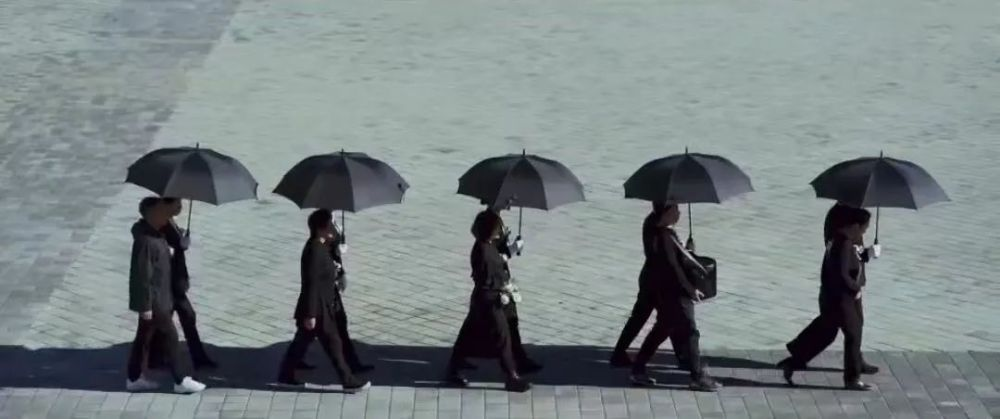
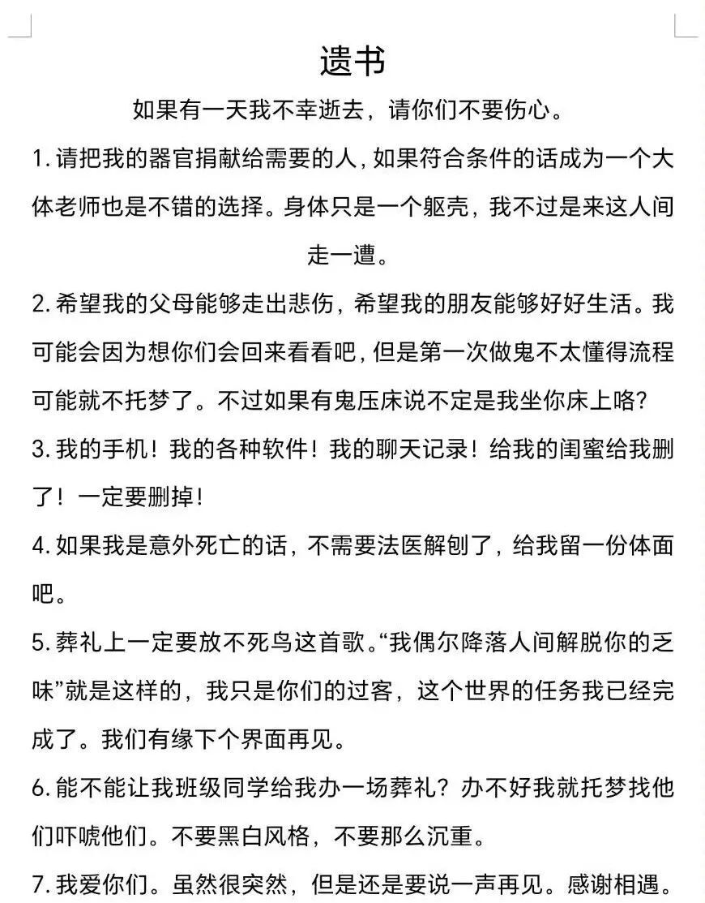
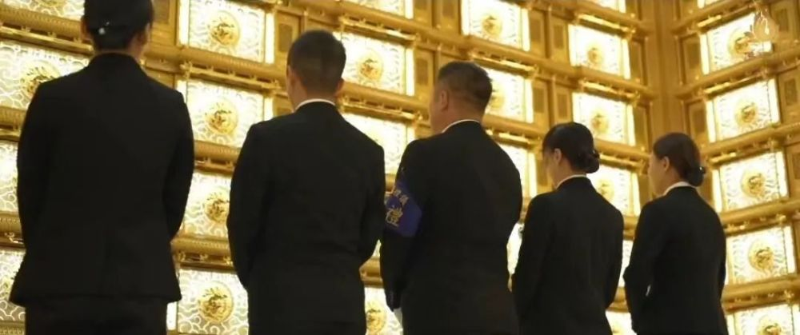
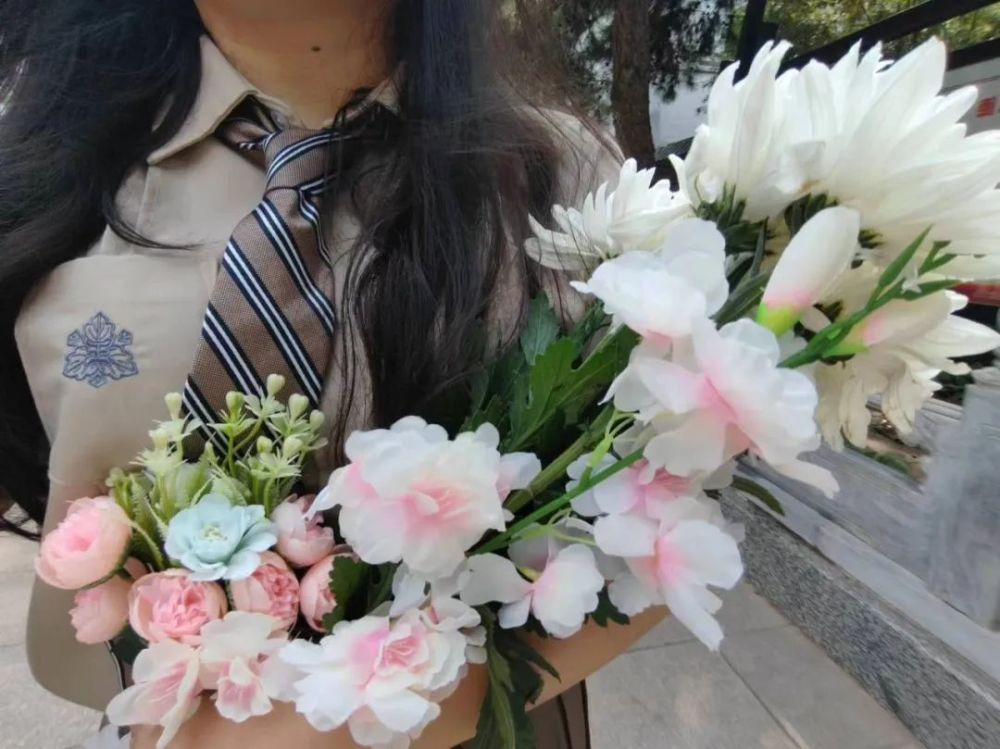

# 人才缺口大、仅10所学校开设，殡葬专业就业率真的是100%吗

**葬礼并非一定要是铺张的、大开大合的，“如果你能用逝者热爱的东西跟他做最后一次告别，大概不会留遗憾”。这是茶泉灵觉得工作有价值感的时刻。**

**文 |** 陈奕宁

**编辑 |** 金匝

**运营 |** 圈圈儿

**行业火热**

哪怕已经入行6年，茶泉灵依然记得那场特殊的葬礼。

那时她刚考入长沙民政职业技术学院（以下简称长沙民政）的殡葬专业，得知了一场学长、学姐们策划的告别仪式。

逝者是一位19岁的男孩，热爱踢球，在球场上意外离世。茶泉灵的学长、学姐们，将男孩的灵堂布置成一个微缩的足球场，墙上挂着他的球衣、球鞋，骨灰被安放在球网下。每位来宾都会在足球上签名，他们胸前戴着男孩生前最喜欢的花，一支洁白的马蹄莲。父亲捧着男孩的骨灰入场，推开门的瞬间，场上响起了球赛开局的哨声。一起参与的茶泉灵很想落泪，“会觉得这是比赛的开始，也是生命的结束”。

这个策划跨越近半年，最初是由同样热爱足球的男孩父亲提出的，但母亲排斥与足球有关的一切。男孩的骨灰已经存放了两年，迟迟没有下葬，每隔一段时间，茶泉灵的学长、学姐就会上门给这位母亲做心理调节。慢慢地，母亲开始谈起男孩的过去，展示男孩在足球场上奔跑的照片：小小的身体穿着条纹衫，看起来很开心。

最终，男孩母亲接受了这个策划方案。

从那天起，“殡葬专业”四个字，在茶泉灵心中有了不一样的内涵，她终于理解了课堂上老师强调的“让逝者安息，让生者满意”，以及《殡葬服务学》这本书里，中国现代殡葬职业教育开创者王夫子写的一段话：“由于殡葬服务归根结底是满足生者的心理需求，因而殡葬服务的更重要的对象仍然是生者。”

作为一门“特殊的服务行业”，殡葬此前算冷门专业。2017年，茶泉灵是整个大理市专科提前批里，唯一选择殡葬专业的。但她感觉到，从前两年开始，殡葬专业“慢慢变得有热度了”。

比如，殡葬题材的影视剧多了。电影《人生大事》和《保你平安》里，两个主人公都在殡葬行业里打滚，莫三妹被称为“种星星的人”，魏平安借由墓地推销员的角色完成自我救赎。网剧《三悦有了新工作》，也涉及到殡仪馆的工作日常，在豆瓣获得8.4的高分。

_▲ 图 / 《人生大事》_

殡葬专业的火热，反馈到尹彦锋身上。他是今年殡葬专业的大一新生，在小红书上晒出录取通知书后，他收获了2万次点赞，近1万条评论。向他咨询专业报考的人多起来，高薪、高就业率、适合社恐，几乎是最常看到的三个形容词。

到了今年6月25日，赶上毕业季，重庆城市管理职业学院教师赵宇在采访中表示：“殡葬专业的就业率基本能达到100%。”“100%就业率”的微博热搜出现了。

其实，报考时的茶泉灵也碰到过类似描述，“网上会提到毕业后有很多单位选择”。她向一位学姐求证，得到了肯定的答复。因此，她放弃了家乡的“烟草栽培与加工技术专业”，选择来到1500公里外的长沙就读。

2012年-2018年，可以称作殡葬专业的“黄金年代”，卢军过去曾任长沙民政殡仪学院院长，那时他几乎不用为就业数据操心，优秀学生在毕业前能收获十几个单位的邀请，去往殡仪馆、公墓和殡葬服务公司等。

康文斌踩在了“黄金年代”的尾巴上。2018年，他从殡葬专业毕业，曾见证过2015届毕业生招聘会时的盛况。学校设置了单独的场馆，专门供殡葬行业的企业进行招聘，数量超过200家，同年，学校这一专业的毕业生仅有300余人。

专业人员的缺口，从2000年开始就已存在。最初，殡葬被认为是纯粹的“体力活”，从业者地位低，没什么学历，由师傅带徒弟的方式传承。最初几届毕业生找工作时，有些殡仪馆馆长会直接说：“我们就是个烧死人的，还要雇大学生干什么？”谈论殡仪文化和服务标准几乎成为一件可笑的事，他们只会跟毕业生们交流“晚饭去哪儿吃”，或是“这瓶酒该怎么喝”。但殡葬专业被行业接纳，并未耗费很长时间。馆长们很快注意到，这些学生和社会上招来的人完全不同，他们掌握更现代的技术，真的把这件事当“服务”来做，逝者家属们也更满意。

卢军觉得：“这个行业，一直缺专业人才。”相关的职业教育从1995年才起步，从业人员可能有几十万，新增需求达上万人。目前，中国有8所高职和中职院校开设了殡葬专业（2023年又新增两所），每年毕业的学生也才接近1000人。

从他们就读于这个专业的第一天起，有关殡葬的一切学习，已经开始。

**两个课堂**

“我爱你们。虽然很突然，但还是要说一声再见。”

葛尹佳鑫写完了人生的第一封“遗书”。2021年，她考入长沙民政的现代殡葬技术与管理专业，这是《死亡文化学》课上，老师布置的第一次作业。

“请把我的器官捐献给需要的人。”“可能因为想你们会回来看看吧。”“能不能让我班级同学给我办一场葬礼？”她也看到同学们在“遗书”中谈论朋友、家庭，和遗体处置方式。

_▲ 葛尹佳鑫在课堂上写的遗书。图 / 受访者提供_

在这门课上，葛尹佳鑫第一次讲述了自己曾经面对的“死亡”。初中时，她的发小因突发脑溢血去世。在葬礼上，她第一次意识到，不久前见过面的闺蜜，昨晚还在为彼此点赞的朋友，随时可能会离去。这件事自此埋在她心里，也是她后来进入殡葬专业的深层原因。

卢军曾连续几年做过殡葬专业学生学习动机的研究。2010年前，有60%的学生因为“好就业”选择这个专业，但2012年之后，就读动机发生显著转变，80%以上的学生填写的理由是：“家人/亲友从事”或“感兴趣”。

葛尹佳鑫就是在父亲的建议下报考了殡葬专业。她的父亲在东北一家殡仪馆工作了近20年。在父亲刚成为司仪那几年，她会听着他练习讲稿直到背熟。对她而言，进入这个专业，似乎是一件顺理成章的事。

而一旦真正进入这个专业，除了直面死亡，也要学习如何妥帖地处理死亡，大到操作火化机，小到完成炉前的告别仪式。他们会在硅胶的手臂上模拟缝合皮肤，将陶泥覆上头骨模型，捏出轮廓，在彼此的脸上练习化妆。葛尹佳鑫有时候觉得，自己学习的，是美术生、医学生的技能。

_▲ 课堂上的案例分析。图 / 受访者提供_

除此之外，《现代殡葬礼仪》是她最喜欢的课程之一。在这门课上，她能策划模拟告别仪式。茶泉灵的课程也是如此，每一年的校内职业技能大赛上，老师都会给出一些参考人物，由学生们策划仪式。茶泉灵为凉山大火中牺牲的消防员们策划了一场追思会，其中有个环节是“母亲朗读写给儿子的一封信”，她在信中写道：“孩子，大火烧在身上的时候，疼吗？妈妈猜想，开始肯定很疼，然后会麻木。”

也有课程难度很高，《民政智能化技术》的笔记上，葛尹佳鑫反复涂抹着“字节”“字符”“程序”，一旁画着满脸问号的小人——这门课的老师以前参与过直升机制造。

卢军在2000年进入殡葬专业，成为设备班的第一批老师，当时距离长沙民政在全国首开殡葬专业仅过去5年。防腐整容的老师来自临床医学，殡仪服务的老师多来自社会学、历史学和民族学，而卢军本科学的是机械制造，研究生读的是软件工程。

卢军将当时的设备班教学称作“三无”：无老师，整个殡葬专业的老师加起来不足十人；无教材，只有操作性的讲义；无设备，学生们实操需要去附近的殡仪馆。卢军到学院的第一项工作，就是编写《火化机原理与操作》。他到全国各地的殡仪馆、火葬场了解操作流程，去火化机生产企业学习设备构造，再将资料一张张编辑起来寄给一线的师傅们看，前后跨越了两年多时间。

殡葬专业的每一门课，几乎都经历了这样的探索过程。2011年以前，殡仪学院一直是独立的二级学院，仅有“现代殡葬技术与管理”一个专业。2018年，长沙民政进入双高校建设计划，将殡葬专业归入民政与社会工作学院下，逐渐发展出“殡葬设备与维护”“陵园服务与管理”“遗体防腐与整容”等专业或方向。

学习之外，还有长达7个月的时间需要学生进入殡葬行业实习。他们会经历在内勤、服务和业务等环节轮岗，接触到公墓管理、火化、遗体接运、殡仪服务、防腐整容等各个工种。

这和课堂上普适性的操作规范很不同：比如，真正留给仪式策划的时间经常不到一天，而不是课堂里的一周；给逝者化妆时，化妆品不是固定的，上海习惯用油彩，而浙江更考究，会直接使用普通的化妆品。给年幼的逝者穿过几次衣服，茶泉灵就发现，为了方便为逝者沐浴和穿脱，师傅往往会建议家属买比平时大一号的尺码。缝合硅胶模具和缝合遗体皮肤也完全不同，前者是厚厚一层，很容易下针，而后者则非常轻薄，皮下还有脂肪，下针力度要轻。

很多学生也是第一次与逝者接触，茶泉灵将其称为“内心的突破”。19岁的冬天，她来到梧州市殡仪馆实习，在医院漆黑的地下车库，接运一具在冰库里放了一个多星期的遗体。推出来的瞬间，遗体表面结了一层霜，她戴的硅胶手套黏在上面，遗体连带手套往下滑了十几公分。她内心咯噔了一下，师傅在一旁却很淡定，他告诉茶泉灵“换副手套就好了”。20分钟后，她接到另一具刚离世的遗体，寒风吹过的手接触到遗体腋下的余温，产生了一种被火灼烧的错觉。当天晚上，她本以为自己会做梦，梦到白天工作的场景，但洗漱后很快就睡着了，“根本没时间害怕，忙碌的工作会让你很快适应环境”。

实习中，社会对于殡葬的误解，几乎是学生们无法回避的。早些年，卢军经历过一个画面：殡仪馆的门口，一位火化工去小卖铺买烟，老板娘让他把钱丢在柜台上，然后从柜子里拿出一根小棍子，把硬币赶到了抽屉里。浙江的一家殡仪服务公司，康文斌和同事们会很默契地只把家属送到小区门口，不会陪同他们进入家门，告别时也不会说“再见”。葛尹佳鑫遇到过司机只愿意送她到距离殡仪馆500米的地方，送到门口也不是不行，“但需要发个红包，讨个彩头”。

**最后的体面**

毕业后，殡葬专业大部分学生的去处，是殡仪馆、殡葬服务公司和墓园。但因为供需关系的变化，100%就业率，并不是全部的真实。

20年来，近两万名毕业生流入市场，他们替换了殡葬行业的老一辈，拥有更长的工作寿命。殡葬专业的变化，已经率先被毕业生们感知。2019届的詹竹月在实习时就发现，空缺的岗位并不多，很多带编制的岗位不再放出，她毕业当年的招聘会只来了100多家殡葬企业，而一年后葛尹佳鑫参加招聘会，企业数量下降至70家。

詹竹月形容自己是被热搜“骗”进殡葬专业的人。每到志愿填报季，她总能发现“殡葬”与“高薪”挂钩的言论。读到“90后女生殡仪馆上班1600元一天”的新闻时，詹竹月有些愤怒，“这完全就是骗人”。她所接触的招聘信息里，工资基本是“底薪+提成”的形式，底薪在2500元至4000元左右，很多岗位要求从业者具备司仪、插花、防腐、整容等多项技能，也对工作时间做出严格要求，比如“节假日需要值班”“连续32个小时在岗”。

哪怕是在一线担任入殓师的茶泉灵，她的薪资已经属于中上水平，也没有网上流传的那么高。在给网友的回复中，她坦言：“我上2休2，没有法定节假日，有五险，没有一金，包吃包住，月薪在6000-8000元。”遇到紧急情况，她还得回殡仪馆加班。

康文斌也曾连轴转40个小时，由于无法承受长期熬夜，他已经退到二线成为一名后勤。“一线的工资会比我们高2000到3000元，最多的时候，他们加上提成能到一万左右。”但他也补上一句：“但我不羡慕他们，做一线实在是太累了，大概有30%的人最终会选择转行。”

_▲ 茶泉灵的工作日常。图 / 受访者供图_

现实的工作也会让他们更深刻地理解，在死亡这扇门的两端，人性复杂——很多人要为人生这最后一件事，花上最多的一笔钱，博一下最后的体面。

茶泉灵接送过一位患癌去世的女士遗体，才28岁，瘦到只剩骨架，手腕细细小小。她丈夫的第一句话是询问送往殡仪馆的费用，红着眼睛说：“我医治她已经花了好多钱，我怕身上的现金不够。”

这是一种很复杂的情绪，茶泉灵安慰他：“不会花很多钱，骨灰盒也好，衣服也好，都是可以选择的。”在她工作的殡仪馆，会给遗体提供洗澡、穿衣、化妆的服务，包括给男性刮胡子，给女性修眉毛，甚至剪指甲，一整套流程是870元。便宜的骨灰盒是有瑕疵的产品，售价是50元，寿衣也分很多种，也有200多元的。第二天，茶泉灵在午饭时听同事聊起，这位丈夫最后花了8000块。

康文斌也遇到过一位老太太，她的老伴去世了。虽然家里经济状况非常差，女儿患有精神疾病，老太太依然想花光家里所有的积蓄，为老伴办一场风光的葬礼。“我们知道这已经超出她的承受范围，稍微有点良知的人，都会选择劝阻她。”他和同事一遍遍对她说：“这个钱没必要花，可以留给自己和女儿。”但老太太的态度很坚决，康文斌最终也没能拦住。

每个月，他也会碰上一两个难以沟通的家属，有些子女平时工作忙，陪老人的时间少，在老人突发疾病去世后就会报复性消费，进门直接对他说：“按你们最好的来。”劝说遇到阻力，内向的康文斌都会有一丝后悔：“曾经我以为不需要和太多人打交道，如果再让我选一遍，我可能都不会选这个专业。”面对失控的家属，他需要更多的耐心去沟通，接受他们的痛哭或是歇斯底里的愤怒。

“大操大办还算是轻的”，更难的是和习俗“抗争”。康文斌遇到过家属要求在出殡路上放鞭炮，被拒绝后，差点和他动手打起来。在一家殡仪馆实习时，他参与了八人抬棺。接运车已经开到门口，家属说：“这个方向不对，应该八个人抬着棺，绕村子走完一整圈。”这是一口实木棺材，将近600斤，重重压在他和同事们肩上，时间一长，他们几乎难以喘息。

“这些是不是逝者想要的？”茶泉灵经常会思考这个问题。在课堂上，老师曾告诉他们，葬礼并不只是黑白的，也可以是粉色的。如果一个人喜欢大海，也能布置成蓝色，然后用白色去点缀，撒上一些沙子和贝壳。

2021年，茶泉灵在湖北一家殡仪馆做入殓师，第一次给意外离世的13岁女孩化妆，
“寿衣的款式都很老气”，茶泉灵建议女孩父亲买一件女儿喜欢的衣服。下午一点，父亲离开殡仪馆，直到晚上五点，终于找到了合适的。

这是一条白色的连衣裙，袜口上带着花边，配了一双黑色的小皮鞋。女孩的嘴唇已经发白，茶泉灵给她涂了偏橘色的口红，在眼部画上亮晶晶的闪片，把头发盘起来，扎了一根粉色的头绳。这位父亲跪在女儿身边，对茶泉灵说了见面后最长的一句话：“我的女儿从来没有化过妆，这是第一次，也是最好看的一次。”

还有一次，是为一位清瘦的老人举办葬礼。她的短发打理得很整齐，梳子放在头边，断了几个齿，身下是洗得有些褪色的床单，很朴素、常见的花色。她的儿子说，这是母亲生前最喜欢的梳子和床单。葬礼并非一定要是铺张的、大开大合的，“如果你能用逝者热爱的东西跟他做最后一次告别，大概不会留遗憾。”这是茶泉灵觉得工作有价值感的时刻。

越来越多的逝者家属，也开始接受不同的告别。从音乐教育专业毕业后，孙千越进入吉林市一家新型墓园工作。与她想象中阴森恐怖的氛围不同，整个地下墓园显得宽敞明亮，两侧分别有四间单独的墓室，放置骨灰坛的小格子上雕刻着祥云、龙凤和莲花。最便宜的墓位是2万，位置较好的8万，能放下四代人的家族墓位是60万。

 _▲ 孙千越所在的新型墓园。图 / 受访者提供_

在那些小小的格子里，有医生、运动员，也有八九岁的小孩，“好像每个人，不管什么年龄，什么职业，都会走到这一步”。孙千越记得，一位家属在墓位里放了一个火影忍者的手办，家属也常给逝去的老人使用年轻时的照片，穿着笔挺的军装，或是梳着麻花辫。

康文斌碰到过一位特殊的客户，女性，三十多岁，打扮精致，问起给谁咨询，她总是支支吾吾的，一会儿说是给家人，一会儿又说是给朋友。来来回回了一两个月，康文斌的许多同事都认识了她。一年后，康文斌接到去接遗体的电话，才发现就是那位女性。这是他从业5年来，第一次遇到为自己咨询后事的年轻人。

**爱、死亡与教育**

进入殡葬行业后，茶泉灵发觉，自己与父母的关系好像缓和一些了。她从小学三年级开始住寄宿学校，与父母称不上有多亲近，最初报考殡葬专业也有一丝“赌气”的成分，想离家远一点。

但刚去殡仪馆实习的第一个月，她目睹了许多年轻人因意外去世，回家路上，主动拨通了父亲的电话。父亲没有像往常那样，问有没有吃饭或是钱够不够花，而是说：“你才刚去，要是在单位过得不习惯，就先回家过年吧。”她那时猛然发觉，自己是幸运的，父母和自己都还健康平安地活着。

频繁聊起工作后，她感到家人对这份工作的态度发生了转变。曾经避讳死亡的奶奶慢慢开始问起她：“那你有没有帮他把衣服穿好呀？”“你有没有给她化妆？”

今年过年回家的时候，茶泉灵和奶奶睡在同一个房间，奶奶说：“我为什么今天要和你说说话，因为你一年也就回来一两次。奶奶不会一辈子陪着你，不知道还能陪你走多长的路。”黑暗中，茶泉灵没有看清奶奶的脸，背过身哭了。死亡上面只盖着一层薄薄的纱，但奶奶就这样平静地把它揭开了。

对于殡葬专业学生来说，死亡教育几乎贯穿于他们的每一堂课。除了《现代殡葬心理学概论》《临终关怀与悲伤辅导》《生命文化学》等与“死亡”“生命”直接关联的课程，这种理念也逐渐引申到机械工程类的课程中。火化机技术课上，卢军会告诉同学们为何要推行火葬，火化前如何通过告别仪式，给逝者家属做一些心理安抚。

死亡教育不应停留在殡葬专业，“正确认识死亡”，是教育最基本的层次，首先就需要开设相关的课程。据教育部2020年底公布的数据，国内已建设《死亡文化与生死教育》《生死学》《死亡的社会学思考》等50余门视频公开课与共享课，北京大学、山东大学、广州大学等多所中国高校都已开设死亡教育课，除了理论知识，也会涉及到写遗书、立遗嘱等课外实践形式。

北京大学《死亡的社会学思考》的授课教师陆杰华甚至觉得：“从大学才开始死亡教育应该是相对有些晚的。”在国外，有些孩子在三四岁时就会阅读有关死亡的读本，了解生物的延续与更替，明白死亡是一件必须要面对的事。

路桂军是清华长庚医院疼痛科的主任医师，他曾策划过一场生前葬礼，来宾们身着深色服装，他则躺在棺材中静静听着每个人的发言。在采访中，路桂军说：“我们要全心全意地接受自己完整的人生，而完整的人生就包括死亡。”
这也是卢军所提倡的“体验式教育”：“逐步了解死亡后，才会知道生命的意义，然后去珍惜生命，把它当作一种责任。”

 _▲ 葛尹佳鑫去公墓祭拜。图 / 受访者供图_

成年人还有一项课程，是学会如何处理死亡以及死亡带来的情绪。“有的中年人四五十岁，他可能对其他事情已经知道很多，但对死亡几乎一无所知。”康文斌经常遇到不会开死亡证明的家属，他们不了解去殡仪馆办理火化的具体流程，很容易被民间收费高昂的丧葬一条龙坑骗。

茶泉灵在网上分享了她从事殡葬业的日志，那里就像一个小小的树洞，经常会有网友分享自己亲人离世的故事。她能感受到，很多人久久无法从悲伤的情绪中走出，“我希望有一天能开一家为家属提供心理疏导的咨询室”。而类似的心灵抚慰室已经在北京、重庆等城市出现。“里面布置得很温馨，会有秋千椅、大的毛绒玩具，也会有钢琴、吉他之类的乐器。”葛尹佳鑫说。

同样等待变革的还有殡葬专业教育。2023年，殡仪学院被长沙民政重新列为单独学院后，卢军期待学生们获得更充分的成长。“3年的时间对我们来说太短了，除去半年的顶岗实习和各种通识课，留给职业教育的时间只有一年半左右。”而如果专科升到四年制的本科，一年多的时间内“可以再多开十几门课。”

这样的期许也许不会落空。2022年11月，教育部发布了《关于做好2023年职业教育拟招生专业设置管理工作的通知》，“现代殡葬管理”专业，被列入2022年职业教育本科专业目录的增补清单，隶属公共管理与服务大类、高职本科专业层次，学生毕业后，将获得管理学学士学位。

“可能在未来，殡葬专业能发展出一门独立的学科。”卢军说。那时候，它将无需依赖考古学、历史学、社会学等其他学科，就能对自身展开探索。

（应受访者要求，康文斌、詹竹月为化名）

**文章为每日人物原创，侵权必究**

