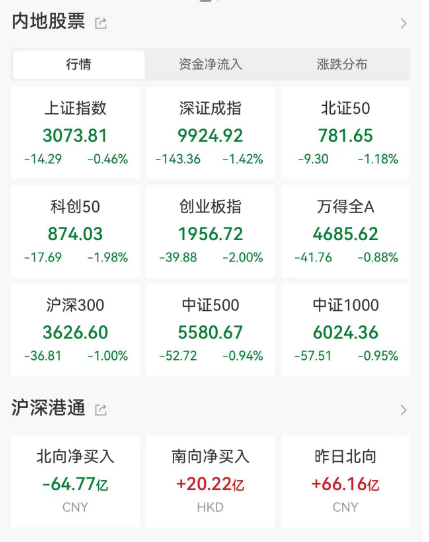

# 发生了什么？A股全线下挫，创业板跌2%再创年内新低，“酱油茅”闪崩

中国基金报 泰勒

兄弟姐妹们啊，今天的市场，又跌了。

而历史上的今天：2007年10月16日，沪指创下6124.04点的历史高点。

一起分析一下今天大跌的原因。

三大指数今日集体调整，截止收盘沪指跌0.46%，深成指跌1.42%，创业板指跌2%，创年内新低。

共1523只个股上涨，3566只个股下跌。

北向资金净卖出近65亿元。

宁德时代跌超3%，股价再创2年半以来新低。

酱油茅——海天味业闪崩。

半导体产业链集体大跌！

油气股逆势大涨！

今天下跌的原因主要有几个。

第一、海外风险在提升，市场避险情绪升温。巴以冲突持续升级，地缘政治风险愈演愈烈。

分析称，随着冲突持续，市场正意识到全球经济不确定性正在增加，中东冲突升级已经成为一朵无法忽视的新乌云。冲突持续会造成怎样的影响？从短期来看：冲突的持续或将导致市场对于石油供应中断的担忧，推升国际原油价格大幅攀升。同时投资者对于黄金、美元等避险资产的需要也明显增加，助推其价格上涨。如果局势进一步恶化，可能导致全球能源价格短期易涨难跌，避险情绪上升，也给A股带来一定的不确定性。

第二、外资一直在卖，北上资金持续卖出，而北上持有较多核心资产，导致最近不少白马股大跌。

第三、国内经济总体支撑下，仍有待政策的释放以及经济的有效复苏。

