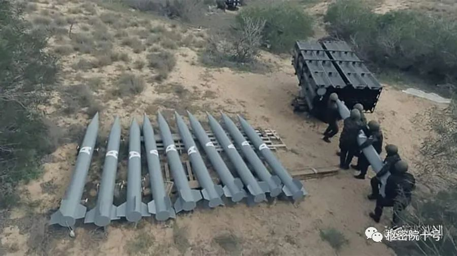

# 哈马斯抵御以军进攻有哪些武器？火箭弹威胁巨大，还拥有“先进装备”

目前以色列已经在加沙附近集结数十万大军。以色列国防军14日发表声明宣称，以军正在进行“重大地面行动”的准备工作，将对加沙地带实施“广泛的地面进攻计划”来扩大攻势，包括实施“空中、海上和陆地联合协调攻击”。

面对气势汹汹的以军，无论在兵力、装备还是训练方面都处于明显下风的哈马斯还有什么招数？

可能很多人首先想到的，是在俄乌冲突中大显身手的无人机。尤其是哈马斯汲取俄乌冲突经验，利用民用无人机从空中释放炸弹，摧毁多辆以军坦克和无人值守武器站后，关于哈马斯如何在加沙巷战中利用无人机偷袭以军的猜测就更多了。

但值得注意的是，加沙的特殊战场环境，与俄乌冲突并不一样。相比辽阔的乌克兰平原和延绵上千公里的战线，加沙地区范围很小，长约40公里、宽10公里，以军有机会利用电子战手段干扰和压制整个加沙地区的民用无线电频段。考虑到哈马斯使用的无人机基本都是民用型号或是用民用电子元件组装的，它们很难在复杂电磁环境下保持作战能力。

而以色列装备的军用制式无人机基本不受影响，而且以军有着丰富的无人机使用经验，已经装备了多型巡飞弹。但有个问题是，俄乌冲突证明，微型无人机的战时消耗很大。以色列主要为特种部队研制和装备的这些无人机究竟能不能支撑长时间作战，还是未知数。

相比无人机，倒是哈马斯的火箭弹依然威胁巨大。尽管以色列军方表示，自7日开始以来，哈马斯已经向该国发射了5000多枚火箭弹，但根据以色列情报部门2021年的评估报告，在加沙活动的反以武装手里拥有多达3万枚火箭弹，显然它们还远没有到“用尽”的阶段。在2008年以军进攻加沙的“铸铅”行动中，虽然以军在加沙发动地面进攻，但哈马斯仍能抽空，不时向以色列境内发射火箭弹。

此外，但俄罗斯《消息报》15日称，哈马斯的火箭弹性能明显提升，从现场视频来看，哈马斯已经投入了“阿亚什-250”远程火箭弹，它的最大射程超过200公里。因此未来这一幕很可能重演——在以色列对加沙发动地面攻势时，哈马斯火箭弹可能突然大规模飞向以色列。，以军“铁穹”系统能不能应对这些升级版火箭弹，以及有没有足够的弹药应对持续的消耗战，谁也不知道——美国宣布向以色列提供的首批军援物资中，就包括了“铁穹”系统的拦截弹，似乎很能说明问题。

此外，相比早先只有步枪和RPG火箭筒的状况，新加坡《联合早报》提到，如今哈马斯已经拥有大批炸弹、迫击炮、火箭、反坦克导弹和防空导弹等。尽管这些“先进装备”数量不多，但它们如果利用得当，仍足以对低空飞行的直升机和充当先头部队的主战坦克等构成威胁。特别是“梅卡瓦4”主战坦克在设计之初主要针对RPG等非传统威胁，它在新一代反坦克导弹面前表现如何？

事实上，从之前几次巴以冲突的经过看，外界普遍认为，以色列想要通过武力彻底消灭哈马斯“几乎不可能”。美国有线电视新闻网也表示，以色列领导人可能急于对哈马斯造成致命打击，但这将付出高昂的代价——付出代价的不仅包括巴勒斯坦民众，也包括以色列民众。

