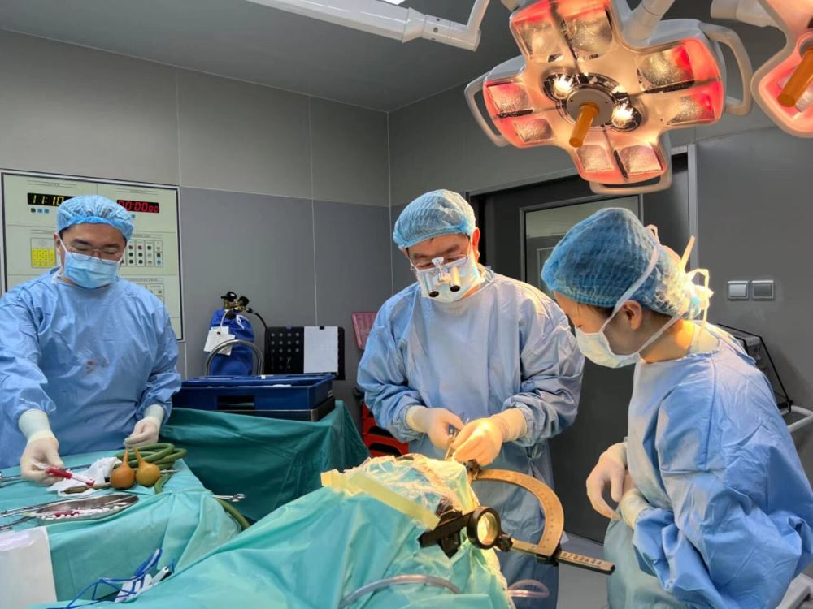
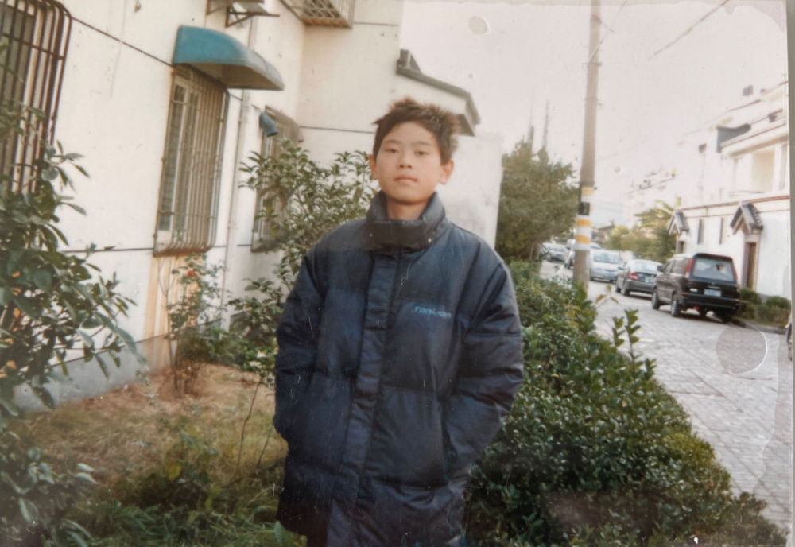
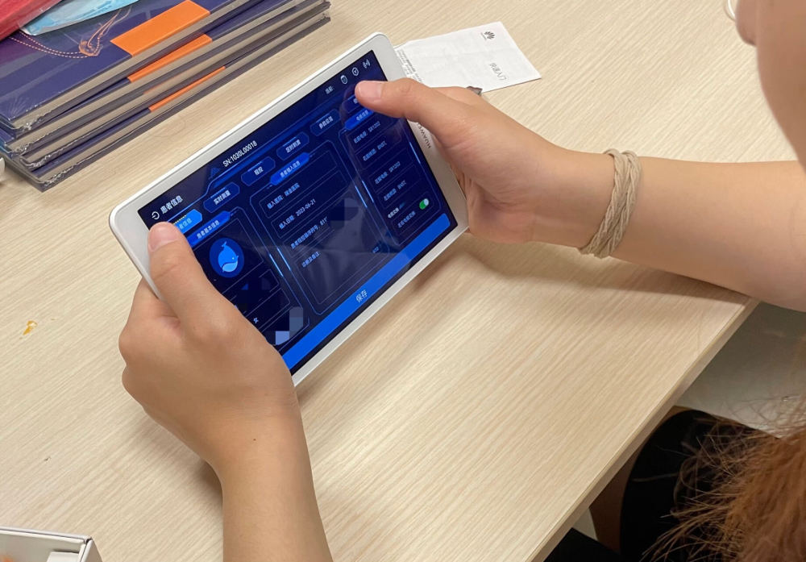
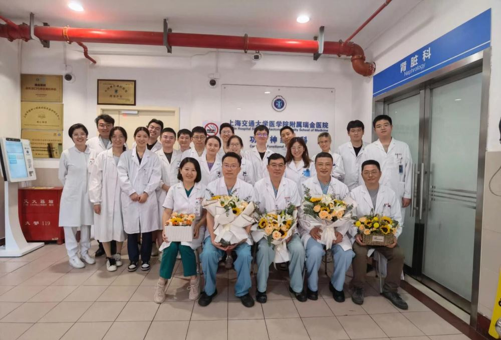
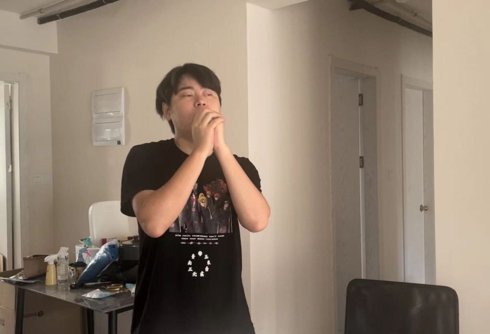

# 患抑郁16年后，他往大脑里植入两根电极，用自己手机就能切换情绪

吴晓天的手机里有一个患者端的程控软件。早上八九点，他开启工作模式，维持白天工作、社交，晚上十一二点，他切换到休息模式，能平稳入睡。如果有临时安排，比如朋友家人聚会，灵活延迟几小时再切换，也没关系。

手术

要将两支直径1.25毫米的电极放入一名抑郁症患者的大脑深部，需要一位经验丰富的神经外科医生。

2022年1月18日，上午9时，上海交通大学附属瑞金医院功能神经外科主任孙伯民站在了手术台前，他用手术刀切开头皮，露出白色的头骨，再用颅钻在头骨上钻开两个硬币大小的孔洞。切开厚而坚韧的脑膜后，可以看见因血管覆盖而呈现出粉白色的大脑，以及那些错综复杂、为了增加表面积而在进化中凹陷、曲折的密集沟回。过去200万年内，人类大脑的表面积增加了两到三倍，我们变得更聪明了，我们也有了更多烦恼。

_孙伯民在为患者植入脑起搏器设备的手术中_

每根末端有8个金属触点，两两间隔0.5毫米的电极，孙伯民要将它们放入吴晓天的大脑。他相信，通过施加轻微电压——仅仅约为家用电压220伏的百分之几——能够治疗纠缠了这个32岁抑郁症患者16年的病症。

从一些细节可见为手术安全所做的考量：深入组织的电极末端被特意设计成钝形，穿过如豆腐般柔软的脑组织时不会造成大的破坏。电极导线进入脑部预期位置后，安装在头骨孔洞上的圆盘形锁扣紧紧咬合住尾部，以防止位置发生偏移。

当然，总有小血管无可避免地被刺破。但孙伯民说，大脑的凝血功能可以很容易地自行止住这些微小的损伤。“医生技术比较高一点的，（出血量）不到10毫升。”与其它需要侵入颅内的手术相比，这算是“微创”。

这种方法叫作脑深部电刺激（Deep Brain
Stimulation，DBS）。外科医生们将其持续提供电脉冲的运作机制与心脏起搏器类比，称之为“脑起搏器”。

过去二十年，孙伯民的手术台上躺着的大多是患有运动障碍的病人，如帕金森症。“脑起搏器”用以恢复大脑对肢体的掌控，比如让手指不再无意识颤动，能握紧一个杯子。随着脑科学的进步，科学家也逐渐证实，大脑的千沟百回不仅控制着身体的一举一动，还控制着那些我们过去归于人类心灵的情绪：伤心、痛苦、喜悦和满足。

一个简单的推论是，如果我们能从物理层面影响大脑，那么是不是就可以将变幻莫测的“心灵”也置于医学的触角之下？

电极瞄准的靶位，是吴晓天脑内一个名为终纹床核的神经核团。如果说大脑是一座工厂，神经元细胞就是员工，同样工种的员工聚集在同一个部门工作，这个部门就是神经核团。人类大脑拥有约860亿个神经元，它们到底组成了多少个功能各异的神经核团，目前为止，科学家也无法确定。

选择的依据来自神经科学的进步。当人们面临威胁时，科学家们观察到脑部影像上终纹床核的位置亮起，显示出生物代谢活动加强的信号。于是他们推测，这部分脑区与威胁唤起的负面情绪相关。

在过去，孙伯民和他的同行们曾用毁损术治疗精神疾病，如物质成瘾、强迫症等。这是一种利用激光或放射线等方式损毁核团的手术，是“一锤子买卖”，杀死的神经元不可恢复。随着医生们的武器越来越精密，掌控越来越细致。像孙伯民这样的医生希望，用电的方式介入大脑，找到那些灰暗情绪的源头，打击的方式不再是一次破坏式的损伤，而是持续的、可逆的，有试错机会的调控。

为什么是电？神经元信号在大脑中以生物电的方式传递。而大概百余年前，电也成为一种临床工具：医生发现同时患有癫痫和精神疾病的病人在癫痫发作后精神症状好转，于是用电流在大脑中引发癫痫以治疗精神病患，这被称为电休克疗法。

手术本身并不算困难，无论是颅骨上钻出孔洞，还是将被绝缘线包裹的电极置入大脑，对于孙伯民都是驾轻就熟。但这依然是一次指向未知的冒险。没人能断言冲入大脑的电流到底如何治疗抑郁症，仅仅能提出猜想：电流刺激的部位可能激活了大脑中的奖赏通路，这一通路与人类情感紧密相关，从而改善抑郁、焦虑症状。

这是一场确定与不确定交织的手术。关于大脑、关于精神疾病，仍有太多未知，无法像对骨折或是皮肤炎症，敲定生理层面环环相扣的因果证据。而精神疾病的哪些部分应当归因于生理，何种程度上又属于社会因素，更是一个会撕裂社会讨论的议题。

但这都不重要，多年来，吴晓天尝试各种方法逃离阴影，吃药、心理治疗，甚至练过气功。电休克的效果也只能在吴晓天身上维持几天时间。病情严重的时候，他对所有事都失去兴趣，只能躺在床上度日，也曾试图烧炭、割腕自杀，都被救下来。对像吴晓天一样的患者，两根小小的电极几乎是最后的希望。

_中学时代的吴晓天，那时的他已经开始受到抑郁症的影响_

一旦锁扣固定好电极，再盖上硅胶制成的圆形颅孔盖，这场脑内的部署就进入尾声了。

镊子捏住露出锁扣的电极导线，小心翼翼地塞入皮下，绕至吴晓天的耳后和颈部，一路延伸至右胸，与被埋入锁骨附近皮下的刺激器相连。火柴盒般的刺激器将在开机后持续发出电脉冲，从而实现对患者神经中枢的刺激。

孙伯民团队已经做了26台这样的手术。他们启动了一项脑起搏器治疗难治性抑郁症临床研究，招募患病多年、药物治疗无效的患者。在全球约3.5亿抑郁症患者中，难治性抑郁患者占30%左右，也就是超过1亿人。作为研究的主导者，孙伯民有勃勃雄心。“难治性就是想尽办法都山穷水尽，但你总要给他们一个出路。”

手术进行到下午3时。孙伯民笃信，吴晓天再醒来时，会拥有一种逃离阴影的可能性。

磨合

给大脑短暂喘息的时间，脑起搏器便能正式开机。医生平板电脑上的触点图标按顺序成对亮起，从2伏起，按0.5伏为阶梯向上调整，一次刺激持续约30秒。这是为了找到大脑能承受的天花板。不同的振幅，代表不同的刺激范围。可选择的还有脉宽，脉宽不同，则强度不等。电极有16个触点，两两相对，你可以选择通电这一对，也可以选择另一对。大脑是真正的黑箱，每一次控制都要小心翼翼。

如果用手触摸，这种强度的电最多只会让人感觉麻酥酥的。而在大脑中，电流向外刺激，就会形成影响脑组织的电场。

一个形象的比喻是，就像开机之前，脑袋里一片黑暗，然后光来了。

手术后一星期，吴晓天迎来了第一次开机。他无法察觉电流的触及，但却感到各类情感涌向他。“有各种各样的感觉。有寒窗苦读10年终于中举的感觉，有被人背叛从背后捅了一刀的感觉，有回到母亲温暖怀抱的感动。”他甚至哭了。一个有趣的事实是，这些曾经被被认为需要无数前提、背景，仰赖与他人互动才能产生的情感，凭空出现了。而反过来，当形容那些冲击性的情绪时，吴晓天再次如同讲故事般，赋予了它们的社会性的基础。

负责调节电流，专业术语叫“程控”的，是孙伯民的学生胡晓静医生。这位26岁的女医生刚刚毕业，度过了8年的医学生生活。她不喜欢在实验室里养细胞，那些实验进展缓慢，总是悬而未决。但做医生不同，她靠近患者，靠近大脑。如果患者好转，某种程度上便是事件的终了。胡晓静原本学习的是运动障碍疾病的程控，效果“立竿见影”，找准触点，患者的手立马就不抖了。

 _胡晓静医生在平板上为患者调整脑起搏器参数_

她曾对脑起搏器治疗抑郁症有过疑虑。这听上去实在太不可思议，两支电极就可以调控人的情绪吗？

但被说服的过程就是简单粗暴，一名抑郁症患者经过她的程控，真的“放两根电极就好了。”

当然，具体过程不会真的那么简单。“程控”不会瞬间完成，而是需要几个月到半年的时间，由医生和患者共同寻找适合的触点和参数。

直白的说，到底什么振幅、脉宽、频率的电流，到底哪些触点会起作用，每个人都不一样，医生也不会事先知道。调控的原则是根据触点位置和核团的距离远近来选择，但更详细的操作就像开盲盒，只能一点点试，所谓大胆假设小心求证，完全依赖患者的主观感受：两次程控间隔至少一周，给情绪神经通路反应的空隙，这个时候，
患者要填写自评问卷，和医生视频会面：回答诸如“有没有做噩梦？”“会感到紧张吗？”等等问题。电流强度不够，抑郁状态不会改善，电流过高，又容易让人处于躁狂状态。这就涉及平衡。

胡晓静医生的微信列表里，26位患者有专门的分组。她遇见过因为工作困难，或者和父母起了冲突，陷入新的抑郁而希望重新调控的，也遇见过三十多岁的男患者多次宣称自己情绪差，无力做事。她帮他把参数调高，却有一周没有收到任何反馈，直到患者家人说，他去赌博了。

前一种情况，她会谨慎对待，因为“正常人是需要心情不好的时候的”。后一种情况，她决定以后多听听他家人的意见。

反反复复的调节会带来挫败感，但更多的时候，如胡晓静一般的医生相信，坚持和耐心是成功的关键。“读书的时候只要把书上的内容读会就可以了，但当你真的开始做研究、在临床上，路可以无限走下去。”年轻的医生用手指滑出一张A4纸的边界，“不像课本，到这里就结束了。你一直往外延伸，很有趣。”

新路

要找到一段完整的时间和孙伯民交谈是困难的。作为瑞金医院功能神经外科的领头人，他的行程被排满了：大多数日子，他八点前就到医院，看诊、做手术、参加会议；出差也不少，要飞到国外参加学术会议和报告。在脑起搏器治疗难治性抑郁症的研究被报道后，找到他的记者络绎不绝，采访又填满了行程间的时间空隙。

一个周三，我在上海瑞金见到孙伯民。他今年60岁，戴着眼镜，仍是一头黑发。孙伯民是世界有名的功能神经外科医生，但上世纪80年代，他起步于精神科。那时，他在安徽的医院里参与到用毁损术治疗精神类疾病的工作中。他惊讶于外科手术的效果，“强迫症一做（毁损术），第二天他就好了。这些东西是很神奇。”

过去五六十年间，药物一直是治疗精神类疾病的主流。以抑郁症为例，20世纪50年代，医生们偶然发现，肺结核病患者使用的一种名为异丙烟肼成分使人产生了“欣快感”。人们猜测，其机制可能是大脑中神经递质改变起到作用。随后数十年间，更多的抗抑郁药被制造出来，比如世界闻名的百忧解。而药物加心理治疗，却几乎是长久以来抑郁症常见治疗方案的全部。

孙伯民逐渐认为，精神科没有更多医生发挥的空间，医生只负责开药，但直到今天，由于并不清楚抑郁症的生理原因，你也无法得知药物清晰的作用机制，它们基于五羟色胺、多巴胺等各类递质假说，难以被证明。

孙伯民更认可外科的哲学，一种更直接的物理层面的哲学。这种认同推动他前往美国洛杉矶加州大学医学中心功能神经外科中心进修，正式转向功能神经外科领域。也是在那里，他首次接触到脑起搏器的治疗和研究。

你首先能在孙伯民身上感受到一种大胆。他在世纪之交回国，在瑞金医院从零起步，把功能神经外科从一个只有三张床位的小组发展为如今完全独立的科室。最初，他用脑起搏器治疗帕金森症患者，遭到质疑，大多数医生认为服药是低风险的有效方法。但这么多年过去，用脑起搏器治疗帕金森被越来越多人接受，已经成为一种常规的治疗手段。

_上海瑞金医院功能神经外科孙伯民团队_

现在，他最大的梦想就是在外科手术的方向上走出一条治疗精神疾病的新路。

过去，对于抑郁症患者的研究几乎没有办法深入颅内记录脑内活动的情况。研究者们主要记录的是头皮上的电信号，但电信号由内而外散发，经过脑组织、颅骨、头皮，谁也不知道信号已经发生了什么样的变化。而植入的电极可以做到无线传输数据，是孙伯民团队向医疗器械公司提出的优化建议。新疗法的出现也为认知疾病带来可能。

他给我描绘了一个比仅仅“治愈”更具野心的蓝图。“机器能自动识别患者的情绪状态，自动切换模式，实现闭环刺激。例如，感知到病人有所好转了，就自动切换到柔和一点的刺激参数。”

“让我们第一次有机会能够真正进入到抑郁症的脑子里面去。”孙伯民说。

我们聊到近百年前一位备受争议的医生莫尼斯。葡萄牙神经医生安东尼奥·莫尼斯是唯一获得诺贝尔奖的外科医生。20世纪30年代，他指导助手医生，将他称之为“前额叶白质切除术”的手术应用于20个精神病患身上，于几周后便向公众宣称有效。那之后，外科手术治疗精神类疾病在美国、英国、巴西等地短暂流行。

但人们逐渐发现，接受莫尼斯手术后的患者虽然不再有暴力行为，却神态木然，表情呆滞，有的则出现记忆缺失。莫尼斯的诺贝尔奖被视为“耻辱”。著名的批评之一来自英国神经病学专家奥利弗·萨克斯：“这种手术并没有‘治愈’病人，只是造成一种温顺与被动的状态，比原来活跃的症状更要远离‘健康’，而且根本不可能逆转......有些人在精神上已死亡，活生生被这种‘痊愈’谋杀了。”

孙伯民不同意对莫尼斯的全盘摒弃。他笃信，关于脑的临床研究和治疗，始终是“否定之否定”，不能以当代标准评判历史上的尝试。“在历史的情况下，他的理念、对精神病的治疗，对后面的影响都非常大。你不能拿现在的安全性、有效性去要求他。”

最近，他刷到网上对脑起搏器治疗的评论，有人质疑研究中的伦理问题，会侵害患者权益或隐私，也有人把这台机器等同于“电子毒品”。不过，他似乎没有被这些争议影响太多，仍然按进度推进着自己的研究。

“网友想的是拿机器控制人，但我们不是。我们首先是病人要治病。”他说。

一位精神科医生的选择

在知名的宛平南路600号，上海精神卫生中心，我见到副院长王振。他从医近20年，是诊疗强迫症、抑郁症方面的专家。

精神科和功能神经外科是思路泾渭分明的两个学科，但又有相当一部分重合的临床领域。我有些好奇当脑起搏器引起了如此大的反响，精神科医生会怎样评价。

_王振在工作中_

“有精神科和心理科的同行非常反对，觉得你用一台机器、一个设备来改变一个人的脑子，改变七情六欲，会受到很大的伦理挑战。”

但王振是中国年轻一代的精神科医生，不排斥新技术。他说，技术没有对错，关键是去把控使用的方法。

2009年，美国食品药品监督管理局，在脑起搏器用于难治性强迫性障碍的治疗上批准了人道主义设备豁免。这是世界范围内一次记录在案的正式承认，意味着在医疗实践中，脑起搏器可以成为一种“无路可走”后的尝试。

2015年，王振参与编写《中国强迫症防治指南》（下称：《指南》）。当中国精神病学界的权威们讨论到是否将外科手术治疗写入《指南》时，大多数专家都持怀疑和反对态度。

这源于上世纪末在国内一度开展的毁损术，术后很多病人社会功能严重受损，甚至改变了人格。也因此，即便此后毁损术依然小规模存在，但在许多精神科医生看来，这种不可逆的、具有破坏性的脑部手术仍是不可接受的。

而王振觉得，脑起搏器的优势在于可逆、微创，值得一个被验证的机会。他据理力争，在书面文件上为脑起搏器留下一个窗口。最终，这份2016年出版的《指南》写道，“多项研究证实脑起搏器对难治性强迫症存在确切疗效。但该治疗为侵入性，需通过外科经颅手术才能实现，且长期疗效存在争议。”

这是脑起搏器第一次在国内精神疾病相关的正式医疗文件上留下痕迹。

在这之前，在国内，也有医院做了零星的尝试。第四军医大学唐都医院发表于2013年的一篇论文记录了早期的临床摸索：两例植入了脑起搏器的抑郁症患者都在开机后出现改善，“患者⾃诉‘情绪突然变好，周围环境⼀下⼦明亮’。”但其中一名患者后续出现失眠、抑郁症状加重，以拔出电极告终。

与切除术或毁损术相比，今天可以接受脑起搏器的原因和其安全之处在于——如果没有效果或患者出现副作用，直接拿掉机器就好。简言之，有“后悔药”可吃。

王振告诉我，目前，上海精卫中心正牵头开展一项脑起搏器治疗难治性强迫症的临床研究。共入组了60例难治性强迫症患者。

在他的手机中，存有一位安装了脑起搏器的难治性强迫症患者复诊的视频。这位患者的强迫体现在不能坐下，除了自己准备的一张小凳子。视频里，他面对着诊室里的椅子，犹豫着，有些焦虑地挪动着左右脚。在医生调节参数后，他慢慢、小心翼翼地挪动，坐在座位的三分之一处。医生问他，“容易一些了？”患者点点头。

“技术的滥用，这是我最担心的。未来要建立起使用这一技术的规范化流程，包括从精神科评估、外科手术、到术后精神科随访的全过程严格管理。”王振保持谨慎的态度。他们的临床研究采用了国际上最严格的难治性强迫症评估标准，接受手术的患者，必须被证明药物治疗和心理治疗都不起作用。

明年2月，这项关于难治性强迫症研究中的60名患者将进入术后随访，计划持续十年。“我们的评估有两方面，一是疗效能不能够长期维持。如果做了一个手术，只维持一两年效果就不行了，是不是要衡量这个代价？另一个是想评估，短期来看，对患者的不良影响是有限的，但长期呢？”

运气和希望

2021年，有论文总结，脑起搏器治疗难治性抑郁症仍处于第三期临床试验阶段，机制尚不明确，风险及并发症相关统计数据不足，最佳作用靶点仍缺乏共识，尚未得到更大的多中心双盲试验证据支持。换言之，还未取得循证医学的有力证据。

对于患者个人而言，它到底会带来些什么？我试图找到更多接受过脑起搏器治疗的精神疾病患者和操作过这一手术的医生，了解他们的经历与看法。

我在一个问答平台找到了唐歌。2017年，他32岁，在华西医院安装了脑起搏器。那时他已患强迫症近20年，出现抑郁症状一年多。状态最糟的时候，他有几个月没和自己3岁多的儿子说一句话。

唐歌描述人生得以改变的时刻：“（术前）我连续几个月瘫在床上。抑郁状态是玩不了手机的。开机后当天晚上，在宾馆里面，我玩了几个小时手机。非常神奇的变化。”过去十多年，他从不参加外出聚餐，因为他的强迫症状是一种极致的洁癖，但在术后，他不再错过每一次聚餐了。

2017年手术时，唐歌安装的刺激器还只能用电池供电。6年里，他手术更换过了2次电池，最后一次换成了可充电的，这下也许能持续使用十几年。唐歌觉得，这些术后的麻烦不值一提，在患病的20年中，他有80%的精力耗费在忍受痛苦上。在高校工作十多年，他连讲师的职称都未评上。今年他38岁，正在试图从头辨识职场交往的规则，想学习人情通达。放在从前，这是他从未想过，也无暇顾及的事情。

然而，25岁的吴启瑞不如唐歌那样幸运。吴启瑞患上双相情感障碍四年多，在90%的时间里，他处于情绪触底的抑郁状态。看书时，他感觉大脑胀痛，身体则疲惫乏力、肌肉疼痛。有时连续十多天，他甚至没有起床刷牙的动力，而那些关于死亡的念头总是找上他。

2021年12月，他做了脑起搏器手术。刚开始生活恢复了正常，他失去许久的意志力也回来了，还思维敏捷，口齿伶俐。

但约一个月后，他“复发”了。当时他正和表弟表妹吃火锅，原本有说有笑，突然间情绪掉落在地，“（抑郁）发作了。”他询问医生，医生说是他的大脑靶点产生了耐受性。

他更换了刺激靶点。但仅二十多天后，抑郁再次追上了他。

“就好像打怪兽一样。你一直攻击一个靶点，靶点有抵抗力了，你要换靶点
，进行重新的调控。重新调控一下子会好起来。但是过一段时间大脑又耐受了，（抑郁）又会卷土重来。”他说。

重复四五次后，吴启瑞再难以忍受这种反复。每一次“复发”都不好受，他掉入情绪的深潭，一次次溺水。他曾在一所985大学学习法律专业，在临近毕业时因病休学。那以后，他一直期待重回校园。去年，他选择再次手术，进行毁损术治疗。毁损术改善了他一部分躯体症状，不再有肌肉酸痛，但在认知层面的治疗仍然有限，他依然无法集中注意力，缺乏看书学习的动力。难以解释的是，他也无法脱离脑起搏器。他曾尝试过睡觉时关机，断电后却感觉头脑木然，产生濒死感，只能又打开。

_©视觉中国_

一位患者推荐我和湖南省脑科医院功能神经外科副主任医师陈小峰聊聊，评价他是说实话的医生，也很愿意和病人交流。

在电话那头，这位42岁，从医18年的医生告诉我，“我们可能还在一个很初级的阶段探索。（脑起搏器有效）有可能就是误打误撞。”近十年来，他曾为多名精神类疾病患者做过脑起搏器手术，包括神经性厌食症患者、抑郁症患者等。所谓程控，没有固定的模式，就是反复去找，慢慢调。对部分患者来说，脑起搏器有改善的效果，但其有效性很难预测。

但他也看到，技术带来了珍贵的希望。陈小峰曾接诊过一位患神经性厌食症的女孩。2013年女孩刚来就诊时，一米六七的个头，体重只有二十多公斤。父母带她跑遍了各大医院，也试过药物、心理治疗等方法，最后找到陈小峰做了脑起搏器治疗。在经过三个月调控后，女孩病情真的慢慢好转，愿意吃饭，脸颊变得丰盈。

三年后，女孩又找到陈小峰。这一次她要求取出脑起搏器。她要结婚了，不想再戴着机器生活。这不是没有可能，几位医生都告诉我，脑起搏器很可能涉及神经环路的重塑，大脑的功能在调控中修复，那么在关机后，也许患者仍能保持正常生活。

陈小峰先让女孩尝试关机了七八个月，确认没有问题，再将她胸口的刺激器取了出来。导线和电极仍然留在体内，如果未来有需要，可以很快恢复使用。

女孩邀请陈小峰参加了她的婚礼。婚宴上，她已经恢复成健康人的体型，穿着婚纱，有些微胖。“有的时候患者能走出来，（机器）就是在最难的时候帮助一下。”陈小峰感慨。

与机器共生

8月，我在苏州见到了前文的吴晓天。术后约三个月，吴晓天和医生摸索出了两个模式，工作模式电流高，刺激强，令他感到舒适，充满能量；休息模式刺激则相对弱。“但有一种力量支撑着、保护着。”后来在他的争取下，孙伯民同意他自己掌握模式切换的权限，他觉得，吴晓天能清晰地描述自己的感受，也有良好的自控力。

吴晓天觉得自己完全恢复了，平日里，他在苏州经营民宿，时常要解决客人琐碎的问题，水电、地址、开门密码，如今他有十分的热情和耐心回答客人们。他变得开心、热爱社交、喜欢唱歌。最近，他正式离开父母的家独居。卧室里，他布置了投影仪、电脑、脑起搏器的充电器，还储存着泡面、午餐肉，一切他所需且乐意纳入自己世界的物件。

在采访中、网络上，吴晓天总是被问到相似的问题：你是真的快乐吗？

_现在的吴晓天感到快乐，常常在聊天中途唱起歌_

换句话说，人们或许想知道，通过机器得到的情绪，到底是不是真实的？

这就是公众最想了解的。但无论肯定或否定的回答都让人生畏。如果不是，人们失去对情绪的掌控，让虚假的感受填满大脑。如果是，那我们和笼中按压操纵杆获得快感的白鼠有何区别？

更根源的问题或许是，人在何种程度上能够接受机器的存在？一位心理从业者告诉我，人们似乎不想承认，自己要臣服于生物本能，要承认人的自主性比生物调控更次级。“我当然也能参加心理治疗，通过个人成长慢慢获得快乐。但也能单纯靠生物环路自上而下激发快乐。”

“很真实的情绪。不是吃药那种麻木的感觉。现在是发自内心的开心，悲伤也是发自内心的悲伤。”吴晓天直截了当地给出答案。

胡晓静上一次见到吴晓天是在8月底，她感觉吴晓天有点“太高兴了”，说话滔滔不绝，很兴奋。她和孙伯民都同意，吴晓天的状态有些轻躁狂。医生们解释，这种状态下，人会感觉很舒服，精力旺盛，思维活跃，但只要可控，也没有大问题。

她说，机器提供的是一个机会。
“机器是辅助，真正还是靠他自己和这个机器磨合，去适应新的生活。很多患者会把生活的重心放在机器上，依赖机器，装了机器我就一定得好。其实不是的，你不可能说我什么都不做就立刻好了。你要自己慢慢去适应，调整心态，机器只是让你更容易达到这样一个状态。”

吴晓天满意自己的状态，机器帮助他重新掌控了自己，不再是等待救援的病人。

“机器人”的标签也没有给他带来困扰。他给我看胸口暗红色的疤痕，皮肤下有一块硬硬的凸起，那是刺激器。他觉得自己更像偶像钢铁侠了，胸口有源源不断的“能量”。

他的手机里有一个患者端的程控软件。早上八九点，他开启工作模式，维持白天工作、社交，晚上十一二点，他切换到休息模式，能平稳入睡。如果有临时安排，比如朋友家人聚会，灵活延迟几小时再切换，也没关系。

他做好了余生与机器共处的准备。父母让他在直播时强调单身的属性，想让他认识异性，结成家庭。吴晓天不愿意。

十多年来，他习惯了孤独，机器没能改变的，也是孤独，“那又怎么样呢？”

◦ 为保护受访者隐私，胡晓静，吴晓天、唐歌、吴启瑞为化名；感谢段维、阮瀚阳对本文的帮助。

作者 | 迟拉佻 编辑 | 张瑞 出品 | 腾讯新闻 谷雨工作室

版权声明：腾讯新闻出品内容，未经授权，不得复制和转载，否则将追究法律责任。

