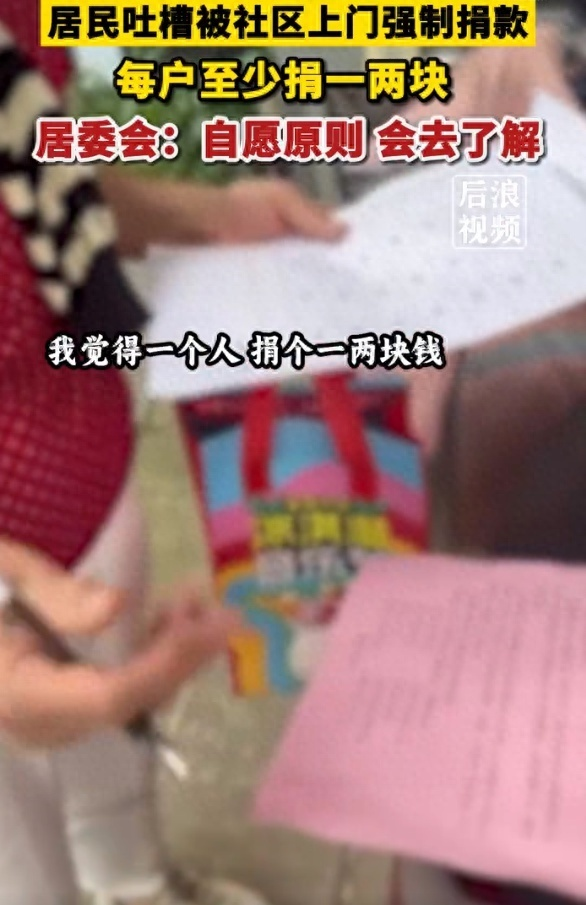
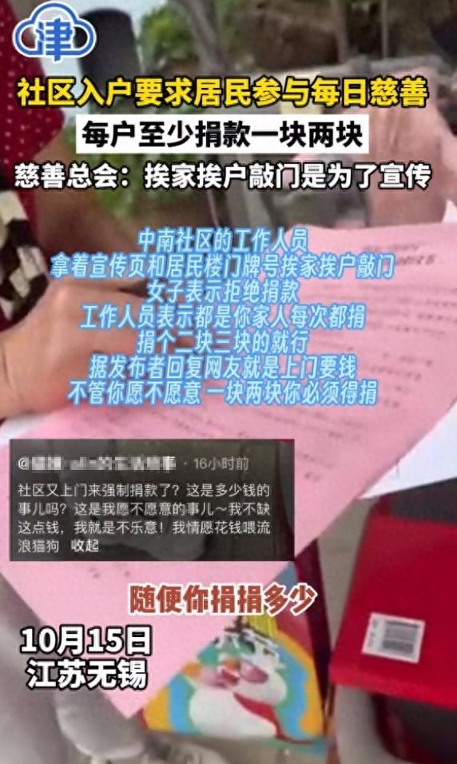

# 江苏无锡一居民吐槽被社区上门强制慈善捐款，居委会和慈善总会回应

据后浪视频报道，10月15日，江苏无锡一居民吐槽社区上门强制住户参与“慈善一日捐”活动，每户至少捐一两块。

视频中，居民称不想捐，社区人员表示你家人都捐了，捐一两块就行。

16日社区居委会工作人员表示，这个慈善捐款都是自愿原则，不会强制让大家捐款，对于这个情况他们会去了解。梁溪区慈善总会工作人员也表示，挨户敲门是为宣传慈善一日捐活动，捐款是自愿的。

另据津云报道，视频发布者称社区就是上门要钱，不管愿不愿意，一块两块必须得捐。

**【来源：后浪视频、津云】**

