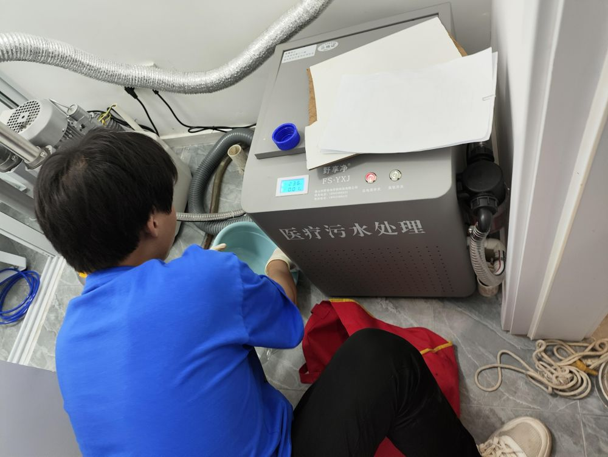
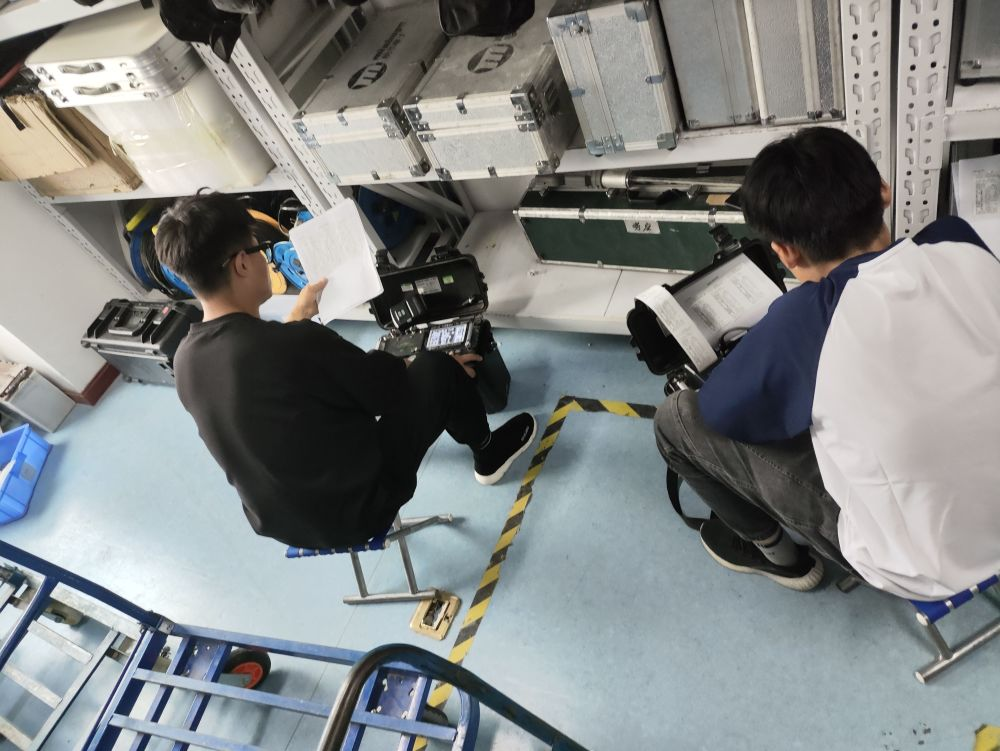
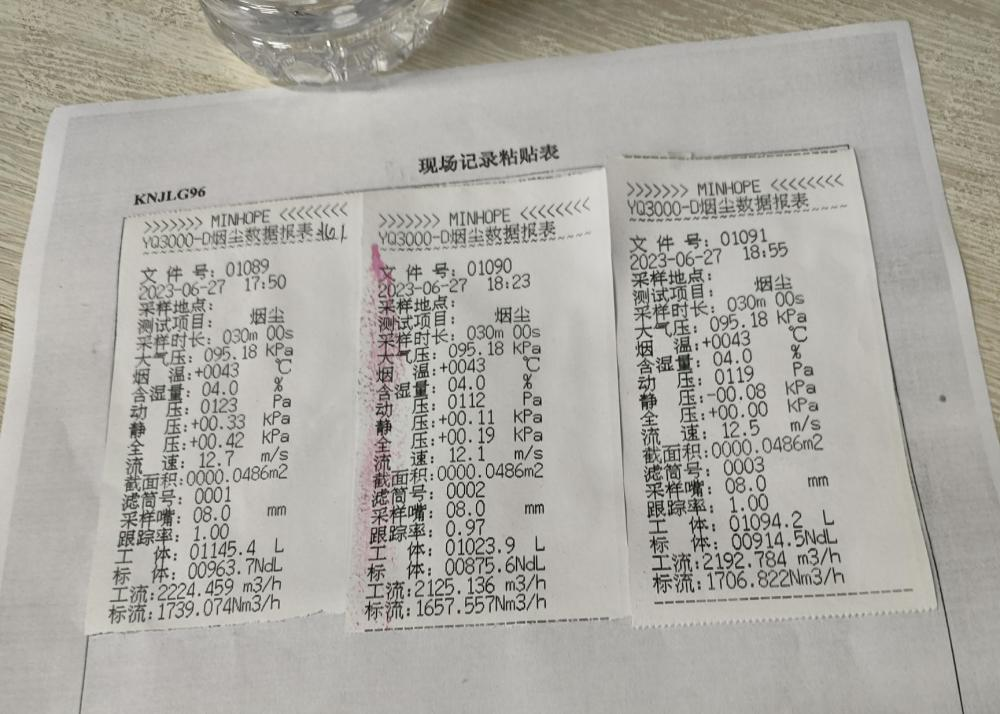
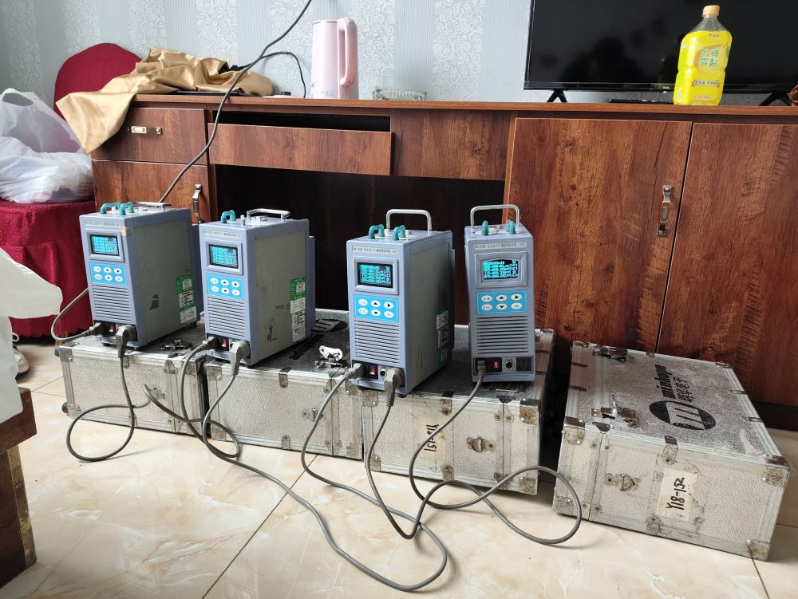
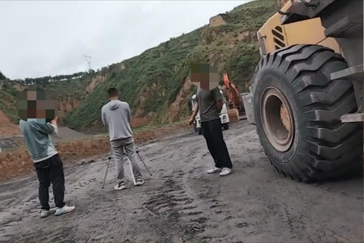

# 记者卧底调查环境监测机构造假：二氧化硫超标40多倍仍然能“合格”

“之前我测的一家砖厂，本来测的数值超得不行，倒了一吨还是两吨片碱，立竿见影，二氧化硫含量就成个位数了。”一位采样主管透露说，这种严重超标的排污企业即便被环保部门查处，第三方监测公司也能摆脱责任，“哪怕它被查到，就说最近没买下（脱硫脱硝材料），也算是个理由，没买下，它就没法加，它如果说我就从来不用，那就死得比咱还惨。”

“只测两个排气口，剩下的全部造假。”尽管良心不安，采样员张林最终还是按照领导的吩咐，编造了排污企业“不超标”的监测数据。

作为西安一家第三方环境监测机构的采样员，前往排污企业采集废气和废水等样品是他的日常工作，但类似的监测造假，也成了他和同事们的家常便饭：即使认真采样，拿回去给实验室，分析出的结果超标的话，他们还是会按照被监测企业的要求，把数据改成合格。

“第三方环境监测十多年前就有，随着环保意识的加强，越来越多的地方需要第三方环境监测。”河北环境工程学院教授、武汉大学环境法研究所研究员曹晓凡说，如今从建设项目开工前的环境影响评价，到项目建设竣工的自主验收，以及排污单位申请排污许可证，甚至基层县区环保部门执法检查，都需要聘请第三方环境监测机构，对水、土壤和大气等进行监测。

聘请第三方环境监测机构，主要是保证监测的公正和真实性，但新京报记者相继卧底西安、太原两家第三方环境监测机构，发现他们经常弄虚作假，通过伪造、篡改监测数据，出具虚假监测报告等方式，帮助排污企业“蒙混过关”。

针对环境监测机构弄虚作假多发的情况，在今年2月初召开的全国生态环境保护工作会议上，全面整治第三方环保服务机构弄虚作假问题，已被列入生态环境部2023年重点工作任务之一。

**拿自来水替代医疗污水水样**

张林就职的公司名叫西安科纳检测校准有限公司，它成立于2018年，公开信息显示，它是经陕西省质监局资质认定的从事第三方环境监（检）测的专业机构，业务范围包括水质监测、空气监测和固废监测、噪声监测等。

该公司规模不大，只有二三十人，按要求配备了各种实验室，占据了所在办公楼的一整层。今年6月下旬，新京报记者通过网络应聘进入该公司，成为一名环境采样员。

按照该公司的业务流程，接到任务后，公司一般会派出采样员前往排污企业采样，采样员带回样品后交由实验室分析化验，最后根据化验结果出具监测报告。

新京报记者注意到，遇到有些废气监测任务，采样员需要使用便携式分析仪器，在现场测出一部分污染物数据，水质监测，则需采集污水样品带回实验室化验分析。

在业内人士看来，采样工作是整个环境监测的基础，一旦采样出了问题，最后报告的可信度就会大大降低。然而，新京报记者在科纳检测工作一段时间后发现，尽管这家公司标榜自己行为公正，服务规范，但在实际采样中却经常弄虚作假。

7月1日，科纳检测的一名采样人员和卧底记者一起前往咸阳市维乐口腔诊所采集医疗污水水样。正常情况下，采集污水样品，一般要在污水处理设备的排水口取样，然而这家诊所用来处理医疗污水的环保设备只是摆设，医疗污水未经过处理就直接排了出去。

“一直没用，电源都没打开过。”该诊所的一名工作人员对此毫不掩饰。

由于污水处理设备一直并未启用，其排水口基本没有水排出。于是，采样员想了个办法，直接端来一盆自来水灌进医疗污水处理设备，然后从其排水口取了“污水样本”。

_7月1日，西安科纳检测校准有限公司的采样员在水质监测的采样过程中，用自来水代替医疗污水水样。新京报调查组 摄_

“用自来水代替医疗污水，会不会影响监测结果？”对于记者的疑问，这名采样员称不必太认真：不管采什么样的水，最后得出的结论都会是“合格”，因为即便水样不合格，后面数值还是会改到合格。

而在6月29日的一次采样中，与新京报记者一同在一家纸箱厂采样的采样员，在接到同事电话后，现场多采了两个气袋的空气样品，作为另一家被监测单位的样品送回检测分析。

**监测仪器留造假“后门”篡改数据**

除了采样造假，该公司现场监测数据，也能被篡改。

6月26日，卧底记者与一名采样员前往西安永成混凝土搅拌工程有限公司进行废气监测。这家混凝土搅拌公司在生产过程中会产生大量粉尘，该公司按照环保要求安装了除尘器，此次任务即是对处理后的废气进行监测，确定其是否符合排放标准。

上午11点多，记者和科纳检测公司的一名采样人员一起来到这家公司，搅拌厂的一名工作人员表示，此时除尘器并未启动，“往里打灰（添加砂石、水泥等原材料）的时候才开，一般情况下不开”。尽管搅拌厂没有正常生产，与记者同行的采样人员表示不重要，告诉厂方只打开除尘器就行，于是，废气监测便在搅拌厂没有正常生产的情况下开始了。

与采集废水不同，废气监测时，一部分数据在现场监测时会直接在仪器上生成。为了保证数据真实准确，这些仪器的原始数据后期需要打印出来留档。

这家搅拌厂共设有八个除尘器排气筒，按照采样任务要求，一个排气筒需要一天监测3次，每次连续监测半小时，形成3组监测数据，也就是说8个排气筒一共需要24组数据，然而，采样员只实际监测2组数据，编造了余下的22组数据。

“领导让我编的，他让每个排气筒测一组数据，剩下的数据回去编，我在此基础上又多编了几组。”他说。

_7月1日，在西安科纳检测校准有限公司的办公室内，两名采样员正利用废气监测仪器凭空编造监测数据。新京报调查组 摄_

需要存档的实时监测数据，是如何编纂出来的呢？

在熟悉该公司工作情况后，新京报记者发现，采样人员之所以可以随意编造数据，在于其使用的废气监测仪器留有“后门”：只要输入密码，就能更改其中任意监测数值。比如采样时长原本只有1秒，可以改成30分钟，其他包括烟温、湿度、大气压、工况体积和标况体积等在内的数据均可以随意更改。

生态环境部制定的《环境监测数据弄虚作假行为判定及处理办法》第十三条中明确规定，监测仪器设备应当具备防止修改、伪造监测数据的功能。

很明显，此设备违反了上述规定。

记者注意到，这家公司采样人员使用的废气监测仪器，是由青岛明华电子仪器有限公司生产的YQ3000-D型大流量烟尘（气）测试仪，科纳检测公司共有三台这一型号的仪器，机身张贴的合格证显示，这三台仪器都在一年之内经过专业机构的检验校准。另外合格证上也标注了三台仪器的出厂编号，分别为“5548190909”“5549190909”“5555210611”，编号都是十位数，前两位均为“55”，其中后六位代表出厂日期，“190909”即2019年9月9日，出厂编号的第三位和第四位数看似并不代表什么，但这三台机器的秘密，就分别藏在“48”“49”和“55”这几组数字中间。

在科纳检测工作一周之后，其中一名采样员才向记者透露了更改原始数据的密码。“比如这台仪器的编号是5548190909，第三位和第四位是‘48’，仪器里显示今天是1号，日期就是‘01’，那这台仪器的密码就是‘0148’，密码每天都不一样，明天是2号，密码就是‘0248’”。

按照这名采样员所说，新京报记者在仪器上输入密码后，所查询的数据便进入可更改的状态，各项数值均可改动并保存。而另两台机器，也可按照相同规律操作。

记者在卧底期间发现，科纳检测公司的办公室里，几乎每天都有人使用那三台烟气测试仪篡改、编造数据，同事和领导对此都习以为常。

_从废气监测仪器上打印出来的现场监测记录单据，其多项数值均经过篡改。新京报调查组 摄_

**污染物超标数十倍仍可合格**

使用留有“后门”的监测仪器，并非只有西安的这家公司。在山西太原，同样有环境监测机构使用这一型号的仪器造假。

7月初，新京报记者应聘进入山西方创环境检测有限公司，这家位于太原的公司成立于2015年，有二十多名员工，据公司采样员介绍，他们公司每年能出具上千份环境监测报告。

该公司外出采样时使用的也是由青岛明华电子仪器有限公司生产的大流量烟尘（气）测试仪。多名采样人员向记者证实，在查询界面输入密码后，同样可以随意更改系统内的原始数据。

记者尝试发现，输入密码后包括采样时长、含湿量和工况体积在内的原始数值均可以被修改。

山西方创环境检测公司的造假手段同样不只是伪造监测数据，他们还会在采样过程中与被监测的企业串通，通过临时添加药剂的方式，确保监测时相关指标“暂时合格”。

7月11日，该公司多名采样人员前往山西新鸿顺能源有限公司进行废气监测，开始正式监测之前，采样人员首先使用一台便携式红外线烟气分析仪对两个排气筒进行监测，此时仪器上给出的数据显示，废气二氧化硫含量最高时达到1600mg/m³，“二氧化硫含量太高，闻都能闻到。”

_7月11日，在山西新鸿顺能源有限公司，现场监测仪器显示，其中一个管道排放的废气中二氧化硫含量达到1600mg/m³，超标四十多倍。新京报调查组 摄_

《山西省锅炉大气污染物排放标准》中规定，二氧化硫含量不能超过35 mg/m³，这意味着这家企业排放的废气中二氧化硫含量超标了四十多倍。

“二氧化硫含量高得不行，让他们加药。”一名采样员吩咐。

当厂里的工作人员反馈已经加完药，现场仪器测出的二氧化硫含量便迅速降低，“跟她说加药可以，数值降下来了。”

二氧化硫含量降低之后，采样人员才开始正式监测。不出所料，现场测出的各项指标均是合格。采样结束之后，一名采样人员不忘叮嘱厂里工作人员，以后遇到检查要及时加药，“别人查的时候不合格就麻烦了。”

方创检测的采样主管告诉新京报记者，厂里添加的药剂其实是脱硝液和片碱之类的物质，它们被加进去后很快会引发化学反应，达到脱硫脱硝的目的。

“之前我测的一家砖厂，本来测的数值超得不行，倒了一吨还是两吨片碱，立竿见影，二氧化硫含量就成个位数了。”这位采样主管透露说，这种严重超标的排污企业即便被环保部门查处，第三方监测公司也能摆脱责任，“哪怕它被查到，就说最近没买下（脱硫脱硝材料），也算是个理由，没买下，它就没法加，它如果说我就从来不用，那就死得比咱还惨。”

既然通过添加药剂的方式能有效降低二氧化硫含量，企业为何平时不用？一名采样人员解释说，排污企业主要为了节约成本，“加的这个药贵，企业不舍得一直加。”

而在对山西京能吕临发电有限公司的灰场进行废气监测时，几名采样员压根儿没有为采样器接通电源，摆拍几张照片后就离开，对该厂的噪声监测也是摆拍完就走。

随后，他们将采样器带回宾馆，直接在宾馆房间内进行了气体监测，“不在这儿测，也得在其他地方测，得有数据。”

 _7月13日，山西方创环境检测有限公司的采样员采样时，直接将采样器摆放在宾馆房间内采集废气样本。新京报调查组
摄_

**“包合格”成监测行业潜规则**

“咱们这监测风气不好，你给我做监测就必须得给我过，过不了我就找另一家。”张林认为，西安当地环境监测行业已形成了这样的潜规则。

入行多年的贺强对此深有同感，“现在谈个业务，付款都是先付百分之十，给钱我派人过去给你测，测完了出报告，人家看到合格了，才给你结尾款。”贺强告诉新京报记者，在这样的背景下，遇到监测结果不合格企业，对方也会很强势：“修改报告，或者再给我复测，直到合格为止。”

“数据超了就实验室想办法改，实验室就先问你采样的时候有没有搞，就算你搞了也不能说你采假数据了，你绝对要说我是实测的数据，然后皮球踢到实验室，他们想办法把这个数据改到不要超。”张林告诉记者，他所在的监测公司几乎出的都是合格的报告，很少会出不合格的报告，“除非是上头环保局（生态环境局）知道你这个数据本来就超标了，你再给出了不超标的，那不是往枪口上撞吗？”

_7月13日，山西方创环境检测有限公司的采样员前往一处灰场采样时，压根没有为采样器接通电源，只摆拍了假装在采样的照片就迅速离开。新京报调查组 摄_

贺强介绍说，几年前他刚入行时，情况并非如此，“那时候采样人员地位比较高，以前人家还给塞红包，现在给你打个招呼就不错了”。张强认为，之所以出现这样的变化，是因为第三方环境监测企业越来越多，彼此竞争加剧，“光我们这附近，差不多有十家，小的监测公司倒闭了一批又冒出来一批。”

太原的情况也比较相似，方创检测的采样主管向记者透露说，一些规模小的公司为了争抢监测业务，恶性竞争，“现在拉业务全看价格了，一个项目像我们公司可能五万块钱能接，那种大公司最起码十万才能接，比我们更狠的公司，一万块钱也敢接，测也不测，一万块钱，就敢给你编个报告出来。”

“之前北京一家知名环境监测机构在太原开设了分公司，干了没几年就关门了，最后那段时间一个单子都接不到。”这名采样主管介绍，从上门采样，到实验室分析化验，第三方环境监测机构都需要付出一定成本，如果给出的报价太低，监测公司肯定会弄虚作假，“之前查出阳泉的一家环境监测机构造假，人家企业连排气筒都没有，它在报告里给人列出排气筒的高度，出的数值，人家啥也没有，他不知道咋出的，这就是我说的一万块钱都敢接的那种公司。”

一名山西本地环境监测业内人士告诉记者，当地一些比较大的公司，往往不敢弄虚作假，他们按照环境监测规范操作，报价自然比较高，然而业务经常却被其他小公司抢走，“没办法，排污企业都会选择报价低的，而且找这样的公司测，人家包合格，我们怎么去竞争？”

**“监测造假根源在于排污企业”**

河北环境工程学院教授、武汉大学环境法研究所研究员曹晓凡认为，在价格方面开展恶性竞争，确实是环境监测机构弄虚作假的一个重要因素。

中国人民大学环境学院教授宋国君介绍说，目前第三方环境监测机构弄虚作假之所以比较常见，与近几年我国大力推行的排污许可证制度有一定关系，“现在有了排污许可证，有了连续监测数据，实际上是排放管理要求变严了，环保部门和排污企业都有压力，管理变严，又不想努力，就只有数据造假”。他认为造假乱象的根源还是在排污企业，“理论上环境监测机构是排污企业雇的，企业拿钱，那就是和企业一伙的，甚至说你不给我达标，我就找别人，他们被逼得不行，就铤而走险造假。”

宋国君介绍说要解决第三方环境监测造假的问题，首先还是要针对排污企业，“查出来就罚你排污企业，让他造假也是自己负责，罚就是罚持有排污许可证的企业，这是你的责任。”

同时曹晓凡建议，环保部门要加大对环境监测领域的执法监管力度，“违法必究，这个市场才能规范发展，另外就是典型案例曝光，对其他企业有很大的警示教育意义。”

2023年2月27日，生态环境部公布3起第三方环保服务机构弄虚作假典型案例：广东国环检测技术股份有限公司环境监测弄虚作假案、格林斯凯（上海）环保科技发展有限公司故意更换监测样品案、江苏南京联顺机动车检测服务有限公司出具虚假检测报告案。

其中广东国环检测技术股份有限公司出具的80份监测报告存在未开展采样分析直接出具监测数据、故意不真实记录或者选择性记录原始数据、纸质原始记录与电子存储记录不一致、用替代样品进行分析等多种伪造或篡改监测数据的情形，造假报告涉及45家排污单位，涉案金额达66.49万元。

2022年6月，中山市第一人民法院作出判决，该公司犯提供虚假证明文件罪，判处罚金20万元；总经理罗某慧等5名人员分别被判处有期徒刑1年9个月至1年2个月不等，并处罚金。

（文中张林、贺强均为化名）

新京报调查组

编辑 甘浩

校对 赵琳

