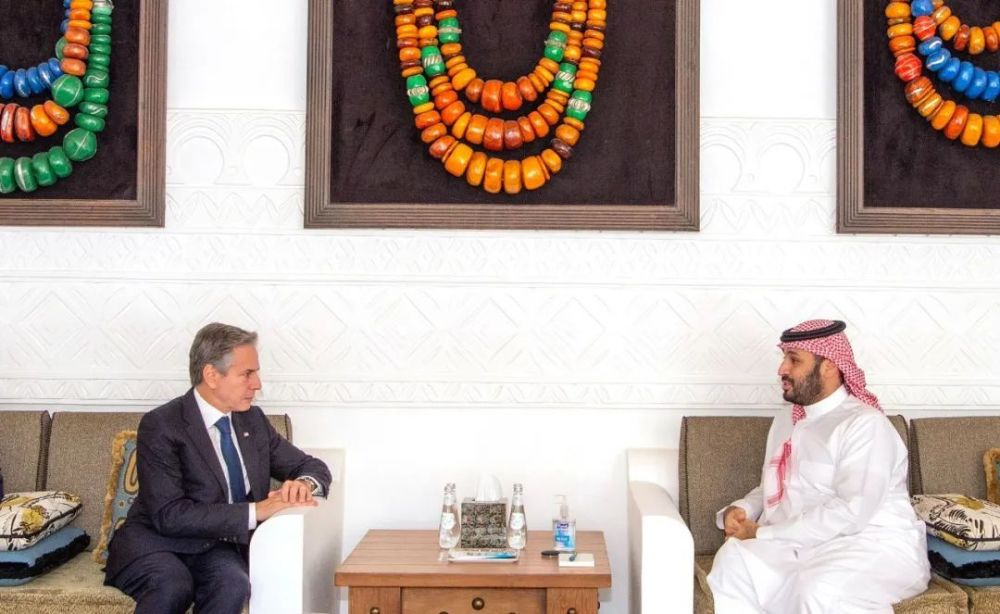

# 访问中东连连碰壁，布林肯也没想到

当地时间10月15日，沙特王储兼首相穆罕默德在利雅得会见美国国务卿布林肯，双方讨论了当前加沙地带军事冲突升级问题。

会后，布林肯对记者称会晤“非常富有成效”，但一名美国官员透露，此次会晤持续时间仅不到一个小时。此前，沙特方面还回绝了美国要求其谴责哈马斯。

布林肯此行碰壁不断。巴以新一轮冲突爆发前，沙特与以色列正在美国主导下推进两国关系正常化谈判。但就在布林肯访问沙特第一天，沙特宣布暂停与以色列的关系正常化谈判，给了美国当头一棒。

_当地时间10月15日，沙特王储兼首相穆罕默德（右）会见美国国务卿布林肯。图源：视觉中国_

**拒绝谴责**

自12日起，美国国务卿布林肯开始了其中东之行，访问了以色列、约旦、卡塔尔、巴林、沙特阿拉伯、阿联酋等国。有报道称，其目的是“与阿拉伯盟友合作，防止战争升级为更广泛的冲突，并帮助释放被哈马斯武装分子绑架的人质”。

有消息人士称，美方敦促沙特谴责哈马斯的袭击，但被沙特外交大臣拒绝。熟悉此事的美国消息人士证实了这一点。

布林肯此前与沙特外交大臣费萨尔就哈马斯发动袭击通了电话，通话结束后，费萨尔在一份声明中说沙特不接受以平民为目标的行动，但没有谴责哈马斯发动的袭击。

沙特外交部14日表示，坚决反对强制加沙地带居民迁移，谴责继续把手无寸铁的平民作为打击目标。同时，沙特外交部呼吁解除对加沙地带的围困。

布林肯14日对阿联酋进行了短暂访问后，当天晚些时候返回利雅得与沙特王储兼首相会面，不过直到15日上午会面才成行。这也是他三天内再度访问该国。

尽管布林肯对外强调当天的会晤“富有成效”，但现实却是，会谈连一个小时都不到就草草收场，并且是在王储私人农场住所进行的。

美国国务院发言人马修·米勒称，布林肯在会晤中强调“美国坚定不移地致力于制止哈马斯的‘恐怖袭击’，确保所有人质获释，防止冲突蔓延”、“双方重申了保护平民和促进中东及以外地区稳定的共同承诺”。

据央视新闻报道，穆罕默德在会晤中重申，需要找到方法来制止夺走无辜平民生命的军事行动。他强调，沙特正努力加强沟通，平息局势，制止当前冲突升级，并要求尊重国际人道主义法。

穆罕默德说，沙特呼吁解除对加沙的围困，以带来正义、稳定与和平，并确保巴勒斯坦人民获得合法权利。沙特反对以平民为目标破坏影响日常生活所需的基础设施和重要服务。

联合国近东巴勒斯坦难民救济和工程处14日表示，新一轮冲突以来，目前加沙地带已有接近100万巴勒斯坦人流离失所。由于加沙北部的巴勒斯坦人向南部撤离，流离失所问题将更加严重。

当地时间15日，埃及总统塞西对来访的布林肯直言，以色列针对加沙地带的轰炸是“过度的”。塞西表示，以色列在加沙的行动，已经超出了“自卫权”，变成了对加沙地带230万人的“集体惩罚”。这被认为是巴以本轮冲突以来，埃及发表的最严厉批评。

美国一方面寻求沙特等阿拉伯国家谴责哈马斯，自身却对加沙地带正在发生的人道主义危机视而不见，与此同时还在不断加强对以色列的武器支援拱火浇油。

外界看来，美国这番操作下来，恐难在稳定局势中起到建设性作用。而布林肯的密集访问在政治上赚足了眼球、刷足了存在感，但要起到明显的调停作用，恐怕难度很大。

_当地时间10月13日，巴勒斯坦加沙地带拉法省，在以色列轰炸拉法难民营后，巴勒斯坦人在寻找幸存者。图源：视觉中国_

**暂停谈判**

长安街知事（微信ID：Capitalnews）注意到，布林肯刚到沙特的第一天，即当地时间14日，沙特就宣布，鉴于目前的巴以局势，暂停由美国推动的沙特以色列关系正常化谈判。

“沙特已经决定暂停讨论（沙以之间）可能实现的关系正常化，并且已经通知美方官员。”一名熟悉谈判进程的消息人士表示。

推动沙特和以色列关系正常化，是美国政府长时间以来追求的政治成果，尤其今年初沙特和伊朗在北京历史性握手言和后，美国更“着急”了。如今巴以冲突下，沙特突然“不谈了”，这让美国很被动。

为何沙特这么重要？自2020年9月以来，在美国政府推动下，以色列同阿拉伯联合酋长国、巴林、苏丹、摩洛哥等阿拉伯国家相继签署《亚伯拉罕协议》，快速推进同这些国家的关系正常化。

此前，埃及和约旦是仅有的两个与以色列实现关系正常化的阿拉伯国家。由于巴勒斯坦问题、阿以冲突，包括沙特在内的大多数阿拉伯国家没有同以色列实现关系正常化，彼此对立甚至敌视。

尽管以沙没有实现关系正常化，但近年来两国关系有走暖趋势。就在9月26日、10月2日，以色列旅游部长海姆·卡茨、通讯部长什洛莫·卡希先后率团访问沙特，被外界视为两国关系正常化进程中的突破性事件。

以色列总理内塔尼亚胡今年6月曾表示，如果以色列与沙特阿拉伯能够达成关系正常化协议，这将是“改变历史”的重大举措，也将是他近期主要政策目标。

他称沙特为“最有影响力的阿拉伯国家”，认为以沙关系正常化将有助于结束以色列与阿拉伯国家的对峙，也有利于化解以色列与巴勒斯坦人的冲突。

不过，沙特方面长期以来公开表示，在巴以问题通过“两国方案”得到解决之前，不会与以色列实现关系正常化。

沙特外交大臣费萨尔6月曾表示，如果不为巴勒斯坦人找到通往和平的途径，沙特与以色列实现关系正常化带来的好处“有限”。他呼吁，应继续致力于推动落实“两国方案”，给予巴勒斯坦人获得尊严和公平正义的途径。

可以说，沙以两国关系的“死结”仍是巴以问题。而对于阿拉伯国家与以色列关系正常化，巴勒斯坦持强烈反对态度，认为相关国家背叛了巴勒斯坦人民反抗以色列占领、建立独立国家的正义事业。

据报道，布林肯此前曾表示，破坏沙特与以色列关系正常化的努力，可能是哈马斯对以色列发起袭击的部分原因。

外界认为，如果布林肯的这一猜测属实，那么哈马斯的部分政治目标在某种程度上或许已经达成。有分析认为，“哈马斯袭击是对拜登政府推动沙特与以色列关系正常化的重大打击”。

截至目前，巴以新一轮冲突已致双方超4100人死亡。当地时间15日晚，以色列军方表示，目前加沙地带已有超过60万人向该地区南部撤离，撤离工作仍在继续进行，接下来在加沙地带将确定更多攻击目标，会对加沙展开多轮袭击。

最新消息称，布林肯将在当地时间周一重返以色列，将其中东行延长一天。有报道称，以色列即将对加沙地带发动地面攻击，而美国“致力于阻止冲突蔓延”。布林肯此行能否奏效，仍有待观察。

