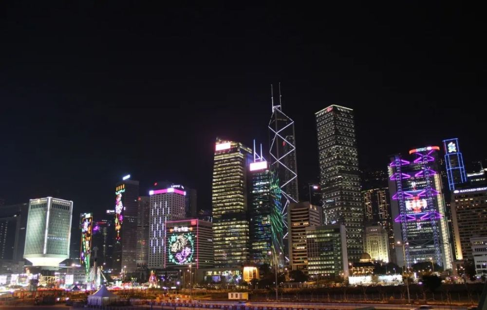

# 踩雷恒大等地产债，海通国际要退市，中环精英们的寒冬来了

_图源：视觉中国_

作者 | 肖望

编辑 | 陈弗也

出品 | 棱镜·腾讯小满工作室

在香港上市14年后，海通国际（0665.HK）将最终黯然退市。

10月9日，海通证券公告，同意公司境外全资子公司海通国际控股有限公司（下称“海通控股”）以协议安排方式对海通国际进行私有化。

14年前，海通控股耗资18亿港元拿下周大福旗下大福证券控股权，进而将其更名为海通国际，成为海通证券国际化布局的重要板块，也由此揭开了中资在港券商一段波澜壮阔的发展大幕。

经过多年发展，在此次私有化退市之前，海通国际已稳居中资在港券商TOP3的地位。

“海通国际这个上市主体已经失去了融资的意义，而且维持上市资格的成本很高，也没什么成交量。”一位资深香港资本市场观察人士对作者表示，“退市后，很多信息就免除了披露义务，尤其它之前踩了很多雷。”

从收购本土券商、赶上香港资本市场大潮站稳脚跟，再到激进重仓地产美元债导致巨额亏损，乃至流动性枯竭，海通国际的境遇可以看做中资券商在香港发展20年大潮中的一个缩影。

**守住上市资格已毫无意义**

10月9日，海通国际复盘暴涨97.18%，并带港股中资券商集体收涨。

暴涨缘由，即是海通控股拟以每股1.52港元的价格,回购注销其他股东持有的海通国际股份。这一价格，较海通国际停牌前0.71港元/股的价格溢价114%。海通控股为此要付出的代价为34.70亿港元，完成私有化后，海通国际将从港交所退市。

有个别中小股东表示不满，因为私有化价格相较于6月末每股2.69港元的净资产折价56%。

对此，海通国际也解释了私有化的考量。

海通国际指出，过去一年，公司股票一直按6月末净资产折让62.48%-77.49%的比例买卖，而私有化为股东们提供了一个高于当前市场价格的溢价出售机会。此外，公司港股过去一年间每天的交易量都极低，一旦股东们大量出售股票，对股价就会产生重大负面影响，私有化为其他股东提供了投资变现的机会。

在此次私有化之前，海通控股持有海通国际的股份比例已达73.6%。相较去年末，海通控股持股比例增加了5.48%。

这并非海通控股本意。在去年巨亏65.4亿港元后，今年上半年海通国际拟通过增发股票募资，以增强公司的资本基础，但除了控股股东海通控股额外申购外，公司其他股东都相对冷淡，由此导致海通控股及公司董事持股总比例增至73.6%。距离港交所要求的最低公众持股量下限仅有1.40%的空间。

海通国际表示，预期未来还需要通过股权融资以增强资本实力，但鉴于最低公众持股量的限制，公司进一步大规模向海通控股配售已不大可能。换言之，公司作为上市公司从股本市场筹集资金的能力受限。

因此，付出监管合规、信息披露等成本来维持公司的上市地位已不合理。受美联储持续加息以及集团大额亏损的影响，公司依托自身信用评级的融资成本可能不断上升。而完成私有化后，由于母公司海通证券也是上市公司，预计海通国际能够受益于控股股东的稳健财务表现和信誉，有助于降低融资成本。

财报显示，海通国际近两年的融资成本在飙升。2022年，公司财务成本为13.49亿港元，同比增加22%。而今年上半年，公司财务成本为11.58亿港元，同比增加146%。

尤其是上半年来自银行贷款的财务成本达8.14亿港元，较去年同期的2.12亿港元大增3.84倍。主要原因是市场利率自去年第四季度急促上升。

**踩雷恒大等地产债，五年利润一朝亏光**

“有好几位在海通国际的朋友都在抓紧离职。”今年3月末，有接近海通的资本市场人士向作者透露，海通国际业务踩雷，从业者担心影响职业声誉，选择在爆雷前另谋高就。

彼时，外资投行巨头瑞信正陷入流动性和信任危机，随后被瑞银收购。上述人士直言，“海通国际就像下一个瑞信，瑞信曾踩雷瑞幸保荐导致声誉和客户大量流失，而海通国际踩雷也暴露出其风控问题。”

随后，海通国际披露的业绩公告显示，公司巨亏65.4亿港元，差不多将此前年景好时海通国际5年多的利润都亏光，亏损幅度震惊市场。

海通国际指出，重大亏损主要因为三方面：一是投资亏损，包括在二级市场交易的股票和债券投资损失约34.43亿港元，集团一直在压降其相关投资规模，还有与私募债权和股权投资、另类投资相关的公允价值损失16.54亿港元；二是减值15.88亿港元，因为抵押品市场价格或估值下调；此外便是佣金费用收入下降53%至15.43亿港元，因为香港市场IPO募资金额和市场日均成交量下降。

2023年上半年，海通国际亏损7.81亿港元，亏损同比收窄54%。亏损收窄的主要原因，则是公司从去年起就开始减少股权投资和债权投资规模。

5月份，市场上有消息称某中资非“中字头”券商开启大规模裁员，涉及业务线包括但不限于投行、资管及固收等部门。该券商被指是海通国际，作者也从业内确认，海通国际首席经济学家孙明春及研究部多人在今年5月后离职。

财报显示，在业绩较好的2020年，海通国际员工达到1355名，员工成本为15.65亿港元。但从2022年及今年上半年出现员工大幅减少的情况，2022年末及2023年6月末员工数分别为996名和880名，员工成本下降至11.56亿港元及4亿港元。员工人均年薪下降显著，从2020年的人均115万港元降至当前的91万港元。

中泰国际分析师赵红梅在研报中指出，中资在港券商亏损频发，除外部环境恶劣之外，没有执行严格风控、行业配置过于集中等问题值得反思。

以海通国际管理的海通亚洲高收益债券基金为例，其房地产持仓曾高达 81.55%，直到 2021 年 12
月才大幅调仓，但房地产依旧是该基金的最大行业配置。基金持仓中，包括中国恒大、华夏幸福、花样年、禹洲集团、正荣地产、佳兆业集团等的地产股均在2021年-2022年出现违约及展期。重资本高杠杆模式在周期中充分暴露出脆弱性，集中持仓的大量地产美元债因违约展期缺乏流动性，给券商的流动性管理带来极大挑战。

投资地产美元债有多惨？有投资者向作者哭诉，曾经20万美元一手的地产美元债，如今价值仅剩4000多美元，亏掉近98%。WInd数据也显示，海通亚洲高收益债券基金近三年亏幅达54.03%。

**中资券商在香港的好日子远去**

踩雷地产美元债导致亏损的中资券商远不止海通国际，包括交银国际、申万宏源香港、兴证国际、西证国际等也均录得亏损，2022年度分别亏29.84亿港元、8.8亿港元、2.97亿港元、2.41亿港元。

不过，也有中信国际、华泰国际、中金香港等表现逆势亮眼，2022年分别实现9.8亿港元、22亿港元和31亿港元的盈利成绩。

“海通国际在IPO和并购业务其实做的挺好，但自营业务太激进，把重点房企的地产美元债基本踩了个遍。”上述观察人士惋惜道，近几年，中资券商在香港等国际资本市场的话语权提升不少，但当前发展也面临挑战。

中资券商自2008年金融危机后出海加速，海通国际即是其中的典型代表，并在此后香港资本市场的蓬勃发展中尝到红利。

但中泰国际证券指出，中资券商在过去十年发展的两个主要红利均已消失，一是海外资金利率低的融资优势，随着美联储快速加息，过去10余年全球低成本资金的时代已经消失。二是跨境证券账户监管趋严，内地客户资源优势不再。

10月13日，据《证券时报》等报道，监管部门发布通知，国内券商及海外子公司被禁止接受新的内地客户进行离岸交易。尽管这只是监管部门再次明确前期的一些整改要求，但也表明中资券商在香港的零售经纪业务面临挑战。

中泰国际证券指出，中资券商在香港的主要收入来源是信用业务、经纪业务，其次是自营及投资业务。在本轮加息周期及市场震荡下，在重资本业务上过分依赖保证金融资、房地产公私募债券等高收益业务的券商产生巨额亏损。

巨丰投资首席投资顾问张翠霞评价称，中资券商的资产配置不理性，存在比较明显的“赌”巨额资金的行为。十年来，中资地产企业保持了较长时间的高速增长，但也导致投资人忽略了发展周期和经济周期。

彭博指出，海通证券派驻内地高管宋世浩出任海通国际联席CEO，与海通国际行政总裁林涌分担职责以管控经营风险。私有化海通国际获得其完全控制权，以扭转亏损业务。

在上述观察人士看来，远离公众视线是海通国际刮骨疗毒的较好选择。而当前港股市场交易低迷和融资额下降，投行聚集的香港中环寒冬还将持续时日。

