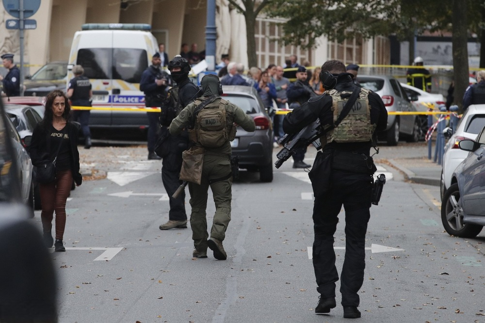

# 遭“恐袭预告”，法国缘何被恐怖组织盯上？

_当地时间2023年10月13日，法国阿拉斯，一名持刀男子在一所高中杀害了一名教师，并打伤了另外两人。反恐官员表示，他们正在牵头调查这起持刀袭击事件。（视觉中国/图）_

在国际局势极为紧张之际，恐怖主义再次袭击法国。

当地时间2023年10月13日，在北部城市阿拉斯发生持刀袭击事件后，法国称处于恐袭警戒状态，将威胁等级调至最高。这次袭击事件导致一名教师死亡，三人重伤。

仅仅一天后，法国卢浮宫博物馆、凡尔赛宫、里昂火车站等多处地标建筑因安全威胁而发布“紧急疏散令”。一些卢浮宫博物馆的参观者在社交媒体上发布消息称，在疏散过程中，现场有巨大的警报声。

就在上个月，阿拉伯半岛基地组织通过内部刊物向法国、瑞典发出了“恐袭预告”。法国内政部长热拉尔-达尔马宁（Gérald
Darmanin）接受《法兰西西部报》（L’Ouest-France）专访时称，当局将一如既往认真应对，因为“恐怖主义的风险仍然很高”。

多年前“11·13巴黎恐袭案”的恐惧浮上心头。为什么法国总是被恐怖分子盯上？

恐袭风险死灰复燃

八年前，“11·13巴黎恐袭案”发生后，人们走上街头，在遇袭地点摆上哀悼的蜡烛和鲜花。

2015年11月17日晚上，在靠近巴黎国王喷泉街的悼念地点，摄影师本杰明·费拉尔斯基在哀悼人群中发现了一名悲伤的警察正伏在同事肩膀上哭泣。

本杰明抓住时机、摁下快门，定格了让人心碎的一幕。他在社交媒体上发布了照片，命名为《哭泣的警察》。

八年后，这一代表了法国伤痛记忆的警察哭泣场景，却在新一轮的“恐袭预告”中出现。

据法国商业调频电视台（BFMTV）9月14日报道，阿拉伯半岛基地组织（AQAP）最新一期出版物《战斗之声》中，向法国、瑞典发出“恐袭威胁”。

在阿拉伯半岛基地组织（AQAP）刊发的一张宣传画中，蒙面人手持长枪，居高临下。冷酷的目光下，两名法国警察相拥哭泣。

据了解，该宣传物的文章通过多种互联网平台传播。刊文还提出，瑞典在发生一系列烧经事件后，“带领欧盟国家打击伊斯兰教、穆斯林国家”。

阿拉伯半岛基地组织是一个激进的伊斯兰主义组织，主要活跃在也门和沙特。2015年1月巴黎《查理周刊》恐怖袭击发生后，该组织“宣称负责”。

“犯罪前科”与赤裸裸的挑衅，引发了法国当局的担忧。

“很长一段时间里，我们以为这种情况不会再次发生。然而阿富汗、黎凡特和非洲等正在为其提供资金，这意味着威胁可能发生。”2023年9月20日，法国内政部长达尔马宁在受访时警告，该国的恐袭风险可能死灰复燃。

达尔马宁指出，目前主要的危险仍然来自法国本土的激进分子。这些人通常是在互联网上逐步激进化，他们极度孤立，乐于接受圣战宣传，响应仇恨号召。由于宗教激进化、模仿或精神脆弱等原因，他们使用非常有限的手段实施行动。

同时，基地组织和“伊斯兰国”分支在一些地区重建。在萨赫勒地区，尤其是在黎凡特和阿富汗，毒品网络正在重建，并有可能为恐怖主义提供资金。

“有了钱，这些组织就可以通过渗透移民潮等方式，就地培训圣战分子。就像 2015 年 11 月 13
日袭击事件中的一些行凶者一样。他们还可以远程培训其他人。”达尔马宁说。

罩袍禁令拉锯战

据法国BFMTV
9月15日报道，该恐怖组织呼吁“让穆斯林儿童独处”“在父母的保护下成长”。这段文字，加上针对“巴黎某个部级政府部门”的威胁，暗示基地组织指的是与最近法国国内的“Abaya禁令”相关。

“很难不把它与最近法国学校禁止穿Abaya联系起来，尽管根本没有提到这一点。”报道称。

阿巴雅（Abaya）是一种宽松的长袍，可以遮罩女性身体曲线。在法国学校中，常常可以看到女性穆斯林学生穿着阿巴雅上学。

2023年8月末，法国政府以政教分离原则为由，禁止学生穿这种有着明显宗教标志的服装。据教育部门指令，9月开学时，穿阿巴雅到校的学生禁止进入课室，之后由校方向她们“解释禁令的意义所在”。

法国总统马克龙在此项问题上强调，政府在这个关系世俗主义原则的问题上“绝不让步”。他表示，“我们知道会有违规的情况出现……有些或许只出于一时疏忽，但相当一部分是想要挑战共和价值。我们决不能妥协。”

尽管法国政府就禁令表现出了强硬姿态，但依然有穆斯林学生身穿罩袍到校。

据法国教育部统计，9月4日开学时，全国有298名学生穿着罩袍上学，其中只有67名学生坚持不愿脱掉罩袍。

当地时间9月7日，法国克莱蒙费朗高中一名女孩因坚持穿着罩袍上学而被禁止入校。随后，女孩父亲向校长发出了“割喉”死亡威胁。校长报警后，该名家长当晚被警方扣留。

除了学生群体外，也有很多穆斯林支持者以多种方式反对“罩袍禁令”。

法国政府颁布禁令后，包括巴黎南方教育协会在内的三家机构提出上诉，他们要求中止禁令，称禁令违反了“基本自由”。

2023年9月19日，十多名穆斯林女性聚集在法国驻奥地利大使馆门外，就阿巴雅禁令对法国穆斯林妇女表示声援。在线传播的抗议视频中可以看到，一位身穿橘色长袍、头戴头巾的女性高举抗议标牌，上面写着“Abaya，我们的身份，我们的权利”。

“法国的穆斯林政策，其实是其针对所有族群公民基本要求的组成部分。”上海外国语大学中东研究所研究员钮松告诉南方周末记者，就宗教服饰而言，其所涉及的也不只是头巾问题，其他宗教包括基督教的相关服饰或标志也在限制之列。

“换言之，法国在公共领域对于宗教服饰、标志的限制，并不是针对特定的宗教，但宗教信仰者的抗争也一直伴随着政策推行的过程。即便是法国社会内部，也存在着对共和同化与政教分离原则的理解和执行方法上的不同看法。总之，围绕头巾、abaya服装的激烈对抗不仅撕裂了法国社会，而且也必然激怒保守的穆斯林群体。”钮松说。

争论持续多日后，法国最高法院9月25日作出裁定，政府对穆斯林服饰长袍的禁令是“合乎法律”的。

为什么总是法国？

2015-2016年，法国巴塔克兰音乐厅枪击案、《查理周刊》袭击案等接连发生，暴力恐怖袭击愈演愈烈。

2016年7月14日，造成至少84人死亡的“尼斯海岸恐袭案”发生后，英国安全智库“现实主义研究地缘政治与安全中心（CGSRS）”刊发名为《为什么总是法国》的报告，试图分析法国境内恐袭高发的内在逻辑。

报告称，虽然其他欧洲国家也经历过恐怖主义，但是“法国正在呈现出一种明显的模式”“受到的影响尤为严重”。同时，虽然袭击者宣称“效忠极端组织”，但大多数人都是年轻的法国公民，且呈现小团体式活动。

为什么法国成为本土伊斯兰恐怖主义如此突出的目标？报告对此作出了多个解释。

首先是外交政策。报告称，法国长期以来一直干预穆斯林世界，特别是中东和北非（MENA）地区。因而伊斯兰主义者经常把法国视为“合法目标”。

其次，法国人口构成增加了伊斯兰恐怖袭击的可能性，比如7%-9%的人口是穆斯林，远高于德国或英国等其他欧洲大国。

此外，来自中东和北非地区的移民缺少流动机会，长期生活在贫困之中，由此带来对法国本土人民和机构的“不信任和仇恨”。最后，法国有着悠久的世俗主义传统，许多公民对任何形式的宗教都持非常消极的看法。这让一些穆斯林群体感到宗教自由受到了攻击。

对于法国缘何被极端组织“盯上”，多名中国国际关系学者也向南方周末记者作出解释。

钮松认为，在西方阵营内部，法国针对多元族群和信仰群体的态度较为“严苛”，强调族群平等并捍卫世俗化原则，不允许宗教元素在公共领域过分展示。因此，围绕头巾问题、abaya服饰问题等所产生的矛盾与冲突便会周期性呈现。

此外，外来移民、难民与欧洲社会存在着结构性矛盾，这既包括经济实力上的显著差距，更包括文明背景上的迥异。德国与意大利等国对穆斯林移民的态度与政策相对温和，而法国因其严格的世俗化政策而更容易在宗教服饰等问题上激化早已累积的矛盾，并因问题的涉教性而难有回旋余地。法国自然成为恐怖组织在欧洲展开袭击的“优先”选项。

中国人民大学国际事务研究所所长王义桅告诉南方周末记者，法国是近代欧洲文明的发源地。法国大革命的自由、平等、博爱理念影响了整个欧洲。但是，自由的泛滥也带来了对其他文明的冒犯，这会引起保守主义者的不满。同时，法国穆斯林人口众多，针对外部穆斯林世界的行为也会引起内部的反弹。

正如《为什么总是法国》报告中预测，“由于问题的复杂性和深度，法国未来可能面临更多恐怖袭击”。

“这不是新鲜事”

除了法国外，瑞典也是这场“恐袭预告”中的袭击对象。这与瑞典国内数月来激进主义者焚烧经书风波有关。

自2023年6月起，瑞典多地发生焚烧、亵渎伊斯兰宗教典籍事件，主要参与者为伊拉克难民萨尔万·莫米卡（Salwan
Momika）和萨尔万·纳吉姆（Salwan Najem）。

二人多次公开反对伊斯兰宗教典籍《古兰经》，并举行示威活动。

其实，在这次“恐袭预告”之前，瑞典就因“烧经”事件被其他极端组织“点名”恐吓。

2023年8月，基地组织媒体平台“As-Sahab 媒体基金会”（The As-Sahab Media
Foundation）在一份题为“攻击侵略民族的义务”的公告中呼吁，对丹麦和瑞典在过去几个月中发生的焚烧经书行为展开“报复”。

8月13日，英国外交部发布出行警告，称瑞典很有可能发生袭击事件，其安全当局已挫败了多起袭击企图。中国驻瑞典使馆也提醒，中国公民应关注瑞典当前安全形势变化，提高安全意识，保持高度警惕，加强安全防范。

8月17日，瑞典将该国恐怖主义威胁等级从3级提升至4级“高威胁状态”，这是2016年以来的首次。

瑞典当局称，这一决定是基于瑞典安全形势不断恶化而作出的“综合性、长期性和战略性判断”。此后，瑞典多个部门在边境、机场、公共交通等多领域加强安全措施。

对于瑞典遇到的“恐袭威胁”，英国国王学院瑞典恐怖主义研究员汉斯·布鲁恩（Hans Brun）认为，这些威胁“并不是新鲜事”，没那么重要。

他告诉瑞典TT新闻社，“你可以把它看作是对个人行动的号召。如果这是他们自己组织的，他们就不会这样提前宣布。你还应该记住，基地组织如今已被大大削弱。”

布鲁恩表示，基地组织的声明不会影响整体安全局势，最大的影响可能是在中东工作的丹麦和瑞典外交官，他们可能需要采取额外的预防措施。

布鲁恩的“预言”并非空穴来风。

2023年7月，激进分子在瑞典首都斯德哥尔摩一座清真寺外焚烧经书后，伊拉克抗议者冲进瑞典驻伊大使馆，驱逐了大使并烧毁了使馆。伊拉克总理苏达尼甚至因此驱逐了瑞典大使，并暂停了瑞典电信公司爱立信的工作许可。

截至目前，瑞典政府正在寻求法律手段限制近日来愈演愈烈的经书焚烧事件，以缓和与伊斯兰国家的紧张关系。然而，支持者们则提出，这可能违反该国宪法。

“他们会采取行动吗？”

自2023年9月8日橄榄球世界杯开幕以来，法国一直在举办大型活动，包括查尔斯三世国王来访、教皇来访等，而这些活动将一直持续到2024年巴黎奥运会。正如法国内政部长达尔马宁在受访时感慨，“恐怖主义风险很高，重大事件接踵而至”。

达尔马宁表示，为了做好奥运会安保，法国已经增加了14000名警察和宪兵，并与多个部门合作，以应对不同的风险。“我们已经为此努力了两年。”达尔马宁说。

伴随着恐袭预告的发出，不少民众担心极端组织是否会付诸行动。

法国情报研究中心副主任阿兰-
罗迪埃在接受BFMTV采访时称，阿拉伯半岛基地组织威胁《查理周刊》两年后才采取行动，“这表明基地组织有能力等待”“当他们发出威胁时，随后往往会采取行动”。

9月28日，南方周末记者通过邮件联系到阿兰-罗迪埃，他透露了该组织的诸多细节。

阿兰-罗迪埃表示，2013年，阿拉伯半岛基地组织通过线上出版物《Inspire》公布了11名“通缉人物”，其中包括《查理周刊》漫画家斯特凡·沙邦尼尔
(Stéphan·Charbonnier）。

两年后，两名自称来自基地组织的恐怖分子谢里夫·库阿奇 (Cherif Kouachi) 和赛义德·库阿奇 (Saïd Kouachi)
兄弟袭击了《查理周刊》，导致包括周刊主编在内的至少12人死亡，多人受伤。而肇事者之一赛义德曾于2011年在也门接受了军事式训练。

阿兰-罗迪埃认为，自2015年袭击事件以来，极端组织发起的圣战运动似乎不再把西方国家作为直接目标，而是“通过广告招募”。

“这些组织似乎没有足够的手段派遣活动分子到欧洲实施恐怖行动。我们必须确保他们的演讲不会被内生的恐怖分子所利用。”阿兰-罗迪埃说。

上海外国语大学中东研究所钮松认为，在全球协同反恐的攻势之下，基地组织的影响力大不如以前，但其仍具有实施暴力恐怖主义袭击的动机与能力。因此，此次基地组织威胁对法国与瑞典展开袭击仍不可掉以轻心。

钮松表示，事实上，包括法瑞在内的国际社会一直对基地组织的当前动向和活动能力保持高度关注和应有的警惕，不会对其口头威胁无动于衷。

也有人对这场恐袭预告持怀疑态度。

法国苏凡中心(Soufan Center)资深研究员瓦西姆·纳斯尔在接受法国《观点》杂志（Le
Point）采访时呼吁，民众应该保持理性，“恐慌的时刻还没有到来”。

他认为，该杂志内容共17页，重点关注也门，对瑞典和法国的威胁只出现在第14页。“威胁当然存在，我们必须认真对待它，但目前没有理由更加恐慌。”纳斯尔说。

（南方周末实习生李金澳对本文亦有贡献）

南方周末记者 毛淑杰

责编 姚忆江

