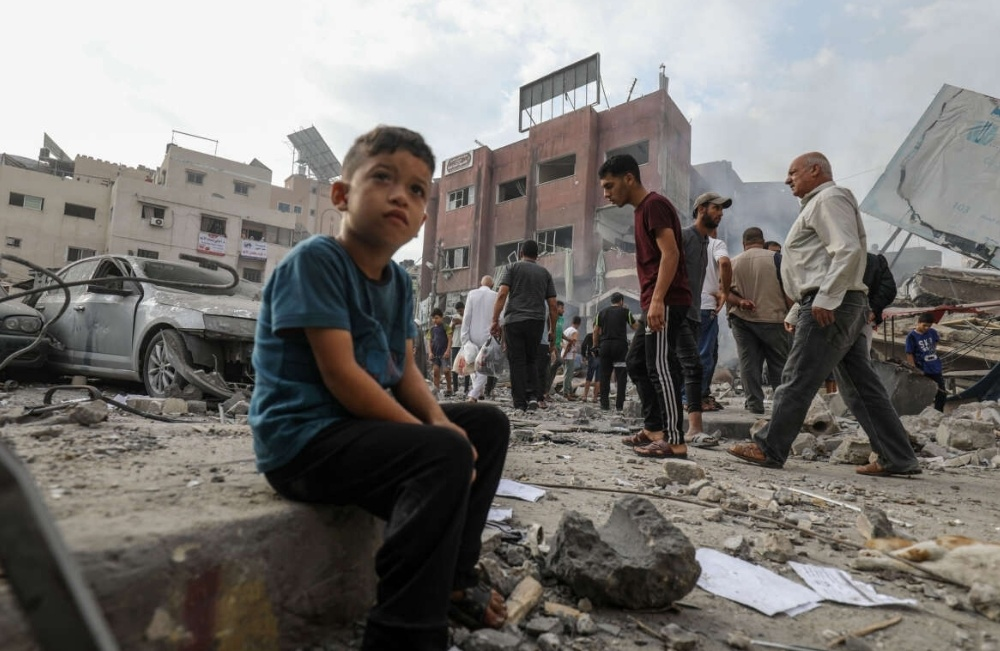

# “他们遵守了以色列撤离令，结果第二天就被以军炸死...”

【文/观察者网 刘程辉】

“他们以为自己正逃往安全地带，结果第二天就被以色列的空袭炸死。”

美国有线电视新闻网（CNN）10月17日发文披露，当以色列军方要求加沙地带北部居民向南撤离后，一些听从了警告并撤离家园的巴勒斯坦民众依然遭遇了悲惨的命运：他们在撤离区之外死于以军空袭。

美联社（AP）同日援引巴勒斯坦民众的话称，以色列要求当地民众前往加沙南部寻求庇护，然而以军却对那里发动了猛烈空袭。报道称，仅17日这天加沙南部就有数十人在以军空袭中死亡。

以色列国防军13日发表声明，要求加沙北部的所有平民撤离到加沙瓦迪（当地地名，位于加沙中部）以南地区。以军宣称这是为了避免在加沙城展开大规模军事行动时伤害平民。

CNN报道称，当加沙北部的巴勒斯坦人注意到以色列军方通过电话、短信和传单要求他们向南撤离的警告时，他们以为自己前往的是潜在的安全地带。然而，一些听从警告逃到撤离区外寻求安全的巴勒斯坦人却在以色列的空袭中丧生。

“这些杀戮凸显了这样一个现实：撤离区和以色列军方的警告无法保证人口稠密的加沙地带平民的安全，那里的巴勒斯坦人没有安全的地方来躲避以色列的炸弹。”CNN写到。

_阿伊德及其家人在以军空袭中遇难/CNN_

报道提到了一位名叫阿伊德·阿吉拉米（Aaed Al-Ajrami）的巴勒斯坦人的遭遇。

阿伊德和他的侄子拉吉接到了一名以色列军官的电话，警告他们立即召集所有认识的人撤离到南方。尽管他们听从了命令并成功逃离了撤离区以南，但阿伊德及其一些家人还是在第二天被以色列的空袭炸死。

根据一段电话录音，以色列军官告诉他们：“你们都去南方吧。你们和你们所有的家人。收拾好所有的东西，然后前往那里。”

但当阿伊德想知道撤离路线和出发时间时，以色列军官语焉不详。

“走哪条路并不重要，”军官回答说，“越快越好，已经没有时间了。”

阿伊德听从了警告。

在13日一早，他与家人和亲戚一起向南前往代尔巴拉赫的朋友那里，这个地方位于撤离区之外。

然而第二天，以色列就对阿伊德所在区域发动了空袭，导致阿伊德和其他12名家人死亡，其中包括7名儿童。

“这些人都以为自己终于安全了，在那个地方不会发生任何事情，”拉吉说，“你可以遵守命令，这样你就不会面临危险，但其实无论你在哪里，危险仍然会降临到你身上。”

“我感到不公平，这些都是无辜的人，他们做了什么？”他说。

CNN报道指出，自13日以色列发布撤离令以来，约有50万巴勒斯坦人从加沙北部逃往南部，但还有许多人无法前往撤离区以南，被困在加沙北部。

_建筑废墟中的加沙居民/美国非盈利性新闻网站Truthout_

22 岁的亚拉·阿尔哈耶克（Yara
Alhayek）说，她住在北方的家人如果前往南方，就无处可避难。“我们无法离开，因为没有安全的地方可以去……我们离开家真的很危险，但如果我们留在家里也真的很危险，所以我们不知道该怎么办了。”

据联合国网站12日消息，一些联合国独立专家当天明确谴责以色列“不分青红皂白地袭击巴勒斯坦平民”。独立的国际医疗人道救援组织“无国界医生”15日晚发表声明，指责以色列袭击了医院和救护车，“狂轰乱炸造成的大多数伤亡都是平民”。

联合国人道主义事务协调办公室（OCHA）17日发表声明称，在加沙遇难的人道主义工作人员已增至31人。

OCHA发表的声明称，16日以色列空袭造成7名民防人员死亡后，在加沙的人道主义工作人员遇难人数已上升至31人。声明表示，加沙已经连续第六天“全面停电”，这将对加沙地带的医疗系统造成影响；加沙医院正处于崩溃的边缘，用于运行备用发电机的燃料储备几乎完全耗尽，这将危及数千名患者的生命。

**本文系观察者网独家稿件，未经授权，不得转载。**

