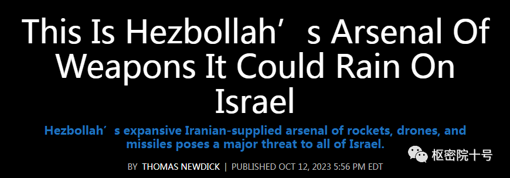
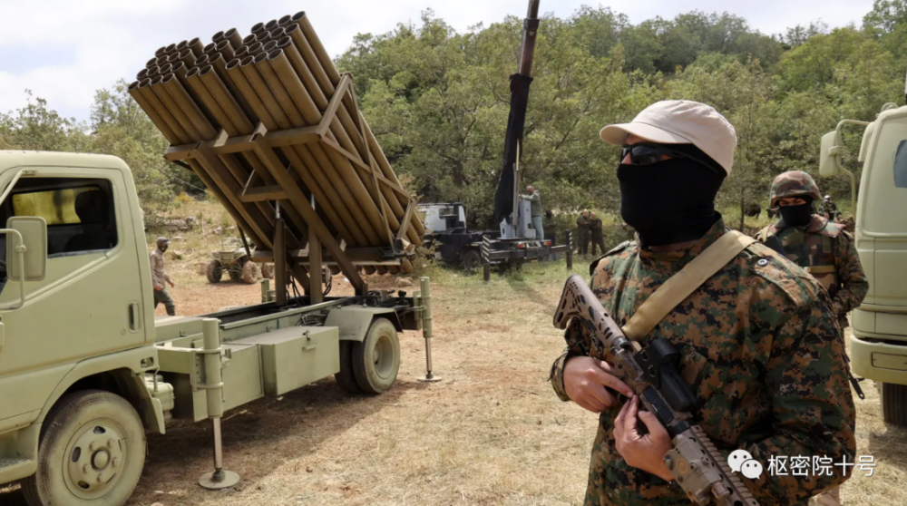
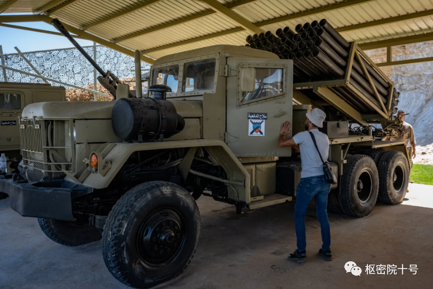
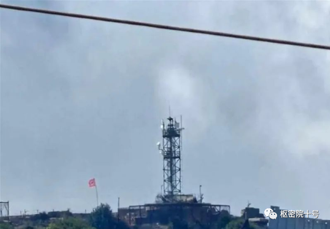

# “这是真主党可能向以色列倾泻的武器库”，以方头疼的真主党会参战吗

随着以色列加速准备对加沙的地面战，连日来在以色列北部边境与黎巴嫩真主党发生的致命性冲突，引发外界对于“战争蔓延到另一条战线”的担忧。黎巴嫩真主党的军事实力到底有多强？为何它的参与让外界这么担心？

想要了解黎巴嫩真主党与以色列之间的恩恩怨怨，先要从以色列国土的地理位置来看看，与以色列陆地接壤的周边国家中，约旦和埃及局势平静，与国土形状狭长的以色列的顶部接壤的黎巴嫩和叙利亚安全形势则很糟糕，而活跃在黎巴嫩和叙利亚的真主党武装就成为以色列的眼中钉。而且这个眼中钉的实力相当不俗，不仅背后有地区军事强国提供军事援助，而且真主党的武装人员训练有素、作战经验丰富。

美国“动力”网站“战区”栏目近日以“这是真主党可能向以色列倾泻的武器库”为题介绍了真主党的家底。

首先让以色列发憷的就是各种火箭弹。

另外，真主党今年5月在一次军演中展示了多管火箭炮。

美国智库战略与国际问题研究中心2021年发布的导弹威胁项目报告显示，真主党拥有规模惊人的武器库，“主要由各种地对地火箭弹和导弹组成”。分析人士表示，难以确定真主党如今确切有多少枚火箭弹，但数量可能高达13万枚甚至更多。不同于哈马斯手工打造的“卡桑”系列简易火箭弹，黎巴嫩真主党的这些火箭弹基本都是军用制式型号，无论是射程还是命中精度都要高得多。

报道称，真主党数量最多的火箭弹包括仿制的中国63式107毫米火箭弹、俄制122毫米“喀秋莎”和“冰雹”火箭弹。这些火箭弹的发射非常简便，可以利用三脚架发射或安装在卡车和皮卡车后部，战时可以快速撤退，使它们难以遭到报复性攻击。尽管存在射程有限、精度不足等缺点，但同时也具备飞行时间短、弹道低的优势，传统方式很难拦截。以色列“铁穹”防空系统号称能够有效拦截这类火箭弹，但正如哈马斯在7日的突袭中所展示的那样，大规模发射火箭弹足以压倒“铁穹”系统。

真主党还拥有口径更大的多种火箭弹，包括240毫米的Fajr-3火箭弹（射程为27英里）和302毫米的Khaibar-1火箭弹（射程62
英里），它们是真主党火箭武器库中威胁最大的型号之一，不但射程远、精度高，而且可以携带更大的弹头，爆炸威力更惊人。

此外，真主党还有仿制苏联“蛙-7”近程战术火箭的Zelzal系列火箭弹，它们依靠自旋稳定，具有更大的射程和更重的有效载荷，可以击中以色列南部更深处的目标。

“动力”网站称，更让以色列担忧的是，伊朗在研制射程1000公里内的近程弹道导弹领域取得重大突破并提供了多个型号给真主党，使后者的远程打击能力得到显著提升。例如伊朗的Fateh-110公路机动近程弹道导弹能携带重约1000磅的高爆弹头，并获得GPS辅助制导，可以精确打击155-186
英里范围内的目标。2022年3月，伊朗使用该系列导弹精确打击驻伊拉克美军基地，证明了它们的精确打击能力。此外，“动力”网站还提到，真主党可能从叙利亚获得苏制“飞毛腿”导弹，它的射程可达342
英里，弹头重达2172磅，“从真主党控制的地区发射时能击中以色列深处的目标”。

除了对地打击的陆战武器，多家外电报道认为，真主党已经拥有了多种可以高速飞行、精准打击的反舰导弹。美媒担心，真主党拥有的这些反舰导弹将使东地中海的海上行动严重复杂化，它们不仅对以色列海军的行动构成威胁，就连靠近黎巴嫩的美国海军也必须谨慎行事。

“动力”网站称，2006年，真主党在黎巴嫩海岸利用伊朗制造的“努尔”反舰导弹成功命中一艘以色列海军护卫舰，首次展示了真主党的海上封锁能力。以色列报告显示，真主党此后还通过叙利亚获得了至少12枚俄制P-800“红宝石”导弹，这种先进反舰导弹的最大飞行速度超过2.5马赫，能命中300公里外的目标。报道称，真主党也可能使用该导弹打击以色列的陆上目标，“凭借极高的速度和隐形外形，它将成为难以拦截的目标”。

此外，真主党依靠伊朗提供的大量无人机，取得了丰富的实战经验。早在2004年，真主党就利用一架伊朗制造的无人机短暂进入以色列领空进行侦察。2006年黎以冲突期间，真主党向以色列领空发射了大批无人机，尽管以军全力拦截，但其中一些装满炸药的无人机仍成功击中以色列北部的目标。2012年以色列空军的F-16战斗机还在高度敏感的以色列迪莫纳核设施附近击落了一架由真主党控制、伊朗制造的无人侦察机。去年，以色列又在东地中海击落真主党派往卡里什海上油气平台的三架无人机。“这些案例充分证明真主党无人机对以色列目标的渗透能力”。此外，真主党的无人机还在叙利亚广泛参战并获得宝贵经验。

“动力”网站称，伊朗在开发和部署各种类型的无人机方面取得重大进展，包括根据早先俘获的美制RQ-170侦察无人机而设计的隐形无人机，以及各种自杀式无人机。这类无人机很难被发现和击落，并且能发起高度精确的攻击。它们的飞行距离也比火箭炮更远，甚至超过了近程弹道导弹。它们还能沿着迂回的路线飞行并从不可预测的方向进行攻击，这使得对手更难以防御它们。特别是伊朗研制的自杀式无人机在俄乌冲突中大显身手，真主党可以控制这些无人机对以色列的防空能力构成严重威胁。

不仅装备优良，真主党还拥有一支训练有素、规模庞大的部队。

“德国之声”网站14日称，美国智库威尔逊中心2022年将真主党武装描述为“中东——可以说是世界上——最强大的非国家军事体”。该组织领导人哈桑·纳斯鲁拉曾夸口说，真主党拥有多达10万名战士，西方情报机构认为，这一数字可能有所夸大，但远远超过约1万-2万人的哈马斯。

美国政府的最新报告称，伊朗是黎巴嫩真主党的主要支持者，每年提供约7亿美元的资金援助，同时还输出大量先进武器和相关培训。不同于半民兵化的哈马斯，黎巴嫩真主党武装人员经过严格培训，而且很多人都有着丰富的战场经验，先后在叙利亚、伊拉克与极端组织“伊斯兰国”进行长期作战，也曾帮助也门胡塞武装对抗沙特。

在这样的军事实力之下，也难怪真主党近日连续释放强硬信号：不仅对以方目标进行打击，而且在边境亮出代表“复仇”渴望的红色旗帜。

综合伊朗塔斯尼姆通讯社、黎巴嫩“灯塔电视台”15日消息，黎巴嫩真主党在其边境亮红色旗帜，以回应以色列日前在加沙地带的袭击。

黎巴嫩真主党内部人士透露，与该组织更为人熟知的黄色旗帜不同，红色旗帜象征着对“复仇”的渴望。针对这一事态发展，以色列军方宣布，隔离距黎巴嫩北部边境长达4公里的区域，并严禁人员进入。

据卡塔尔半岛电视台网站15日报道，伊朗外交部长阿卜杜拉希扬15日对半岛电视台说：“如果旨在立即阻止以方袭击行动——这些袭击正在杀死加沙地带的儿童——的措施最终陷入僵局，很可能会促使有关方面开辟许多其他战线。不排除这种局面，而且这种局面的可能性越来越大。”

