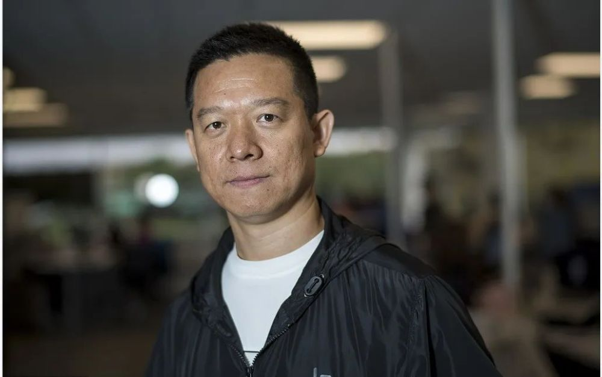

# 乐视的“贴牌”生意经：向工厂授权商标，养活400名员工

_图源：视觉中国_

特约作者 | 一元

编辑 | 陈弗也

出品 | 棱镜·腾讯小满工作室

退市三年后，乐视系依旧深陷在债务危机里。

2023年9月底，北京金融法院判决，要求乐视网（400084.OC）向原告投资者支付投资差额损失、佣金、印花税等赔偿款共计近20.40亿元。此外，贾跃亭就原告投资者的损失与被告乐视网承担连带赔偿责任。

不过，乐视并未彻底消失。去年7月，他们曾因400多名员工没有内卷和996而冲上热搜。鲜为人知的是，乐视还依靠“商标授权”，获益颇丰。

公开资料显示，目前乐视品牌主要有两个经营主体，乐视网以及乐融致新电子科技有限公司（下称“乐融致新”）。

乐视网的核心业务是乐视视频，拥有多个影视剧的版权，其中最为人熟知的是《甄嬛传》。2020年7月，乐视网因连续多年亏损而退市。此前，承载乐视超级电视等业务的乐融致新，部分股权遭司法拍卖，公司从乐视网逐步剥离出来。

“乐视网仍然持有乐融致新股份，是乐融致新的股东，二者是关联方，也会有正常结算。”2023年9月，乐视智能生态总裁李晓伟在接受媒体采访时解释，乐融致新的收入来源主要是大小屏内容的运营，以及乐视智能生态硬件。

今年9月底，乐融致新发布了多款投影仪产品。此前，他们还发布过平板等产品。

依靠商标授权获益的，正是乐融致新背后的大股东，其掌握着乐视旗下的上千个商标。

**1354项商标，以960倍的价格被拍**

2020年6月，乐视网进入退市整理期后，乐视网的1354项商标（其中五项已注销）以13.6万元的价格公开拍卖，评估价为19.4881万元。

拍卖网站显示，已对外授权的商标
“LETV”、“乐视”、“乐视TV”、“乐视TV超级电视”等在拍卖范围内。整个竞拍过程有上千次报价，106人报名参与竞拍，超十万人在线围观了这场拍卖。

没有人想到，经过一天公开拍卖，乐视网上述商标专用权竟然以1.3亿元的价格成交，达到了起拍价的960倍。

此次拍卖由北京市第三中级人民法院发起，执行申请人是天津嘉睿汇鑫企业管理有限公司（下称“天津嘉睿”）。2017年4月，融创中国携150亿资金入股乐融致新、乐视影业等公司，用于投资的主体公司便是天津嘉睿。

拿下商标的公司正是天津嘉睿，当时许多人误以为是融创拿下了乐视的商标，实际上，拍卖前一个月，天津嘉睿已脱离了融创系。

公开资料显示，2020年5月，代表融创方的天津盈瑞汇鑫企业管理有限公司，以0元的价格，将天津嘉睿100%的股权转让给了致新云网企业管理（天津）有限公司，后者的法人代表便是乐视智能生态总裁李晓伟。

乐视网曾发布公告表示，致新云网与融创集团、天津盈瑞汇鑫企业管理有限公司不存在关联关系，不存在其他隐性关系，不存在股权代持情形。

值得注意的是，天津嘉睿是乐融致新的控股股东，持有75%的股份。李晓伟在接受采访时表示，乐融致新的大股东是员工持股平台，实行管理者集体决策。

换言之，是乐视自己人买下了乐视网旗下的商标。

商标出售后，乐融致新方面曾向媒体透露，天津嘉睿是乐视网的债权人之一，对乐视网的借款超过12亿元。

实际上，天津嘉睿买下上述千余个商标，无需投入真金白银。根据现行法律规定，作为债权人，天津嘉睿可以出价购买商标，通过“以物抵债”的形式，获得商标的所有权，无需支付现金。

2021年4月，天津嘉睿再度以1600万元的价格，拍下乐视网旗下580个商标，包括“乐迷会”、“乐迷生活”、“乐生活”等等。拍卖网站显示，此次商标的评估价为2000万元，起拍价为1400万元。

同样，作为债权人的天津嘉睿亦无需支付现金。

相较之下，乐视网的股权当时处于无人问津的状态。1354项商标拍卖前的半个月，乐视创始人贾跃亭持有的乐视网2201万股无限售流通股票亦进行了拍卖，拍卖价为5547.1万元，然而出价次数为0，最后流拍。

**客户主要来自中小城市**

拿下商标后，天津嘉睿选择将部分商标授权给第三方使用，赚品牌费。

2021年左右，张新通过朋友介绍，从天津嘉睿手中拿到了一个乐视商标的授权，用于开发某类电器产品，按授权年限进行签约。授权结束后，如果满足条件，可以优先续约。

张新向作者介绍，授权大多会有个保底费用，比如销售额不能低于多少万元，然后根据每个产品生产价的1%-3%抽取管理费。通常来说，年前会付预付一部分费用，年底再结清。此外，产品的资料、大样等，都要给天津嘉睿做个备案。

“‘Letv’等乐视经典商标，授权价格高一些。”张新进一步解释，乐视品牌里的商标授权价格不尽相同，此外授权生产不同类型的产品，品牌费计算的方式也不同，电视、手机等数码类产品会更好卖一些，授权价格也更高，但几类产品都是乐视自己在做。

拿下商标后，张新委托代工厂进行生产，然后在电商平台售卖，并向线下门店进行推广，售价比起同类的大品牌要低一些，主打性价比。

“像小品牌的话，它就是以电商为主。因为线下渠道不好进去，都被大品牌占满了，竞争太大，渠道门店也不一定会进货，电商门槛就没这么高。”张新介绍。

谈及为何会买下乐视的商标，张新解释称，产品贴上乐视的LOGO，比白牌商品的知名度要高，更容易做推广，“买我们商品的客户，大多来自中小城市，或是追求性价比的人群。”

作者在各大电商平台搜索后发现，市面上有大量带有“Letv”商标的电子及家电商品出售。其中包括充电宝、耳机、热水器、投影仪、扫地机器人、电饭煲、风扇等。

白伟是广州一家知识产权公司的总经理，他告诉作者，只要是知名度高的企业，哪怕其发展受挫，或是出现破产等情况，其商标都有一定价值。其他公司低价拿下这类商标，去做贴牌产品，知名度就会比新品牌要高，能省去一些市场推广费用。

然而，并不是得到商标授权就一劳永逸。据张新介绍，如果做得不好，或是没有达到销售额，天津嘉睿可能就会把授权收回来，合同里也会写明类似条款。目前，张新贴牌的乐视产品，也还在盈亏线上徘徊。

白伟则进一步解释称，拿下什么商标看重的是公司的判断力，拿到商标之后，就十分依赖企业的经营能力。

**几无成本的生意**

实际上，商标授权或转让，并不是新鲜事。

2021年3月，皇家飞利浦公司发布公告称，高瓴资本将以37亿欧元（约合人民币285亿元）收购飞利浦家电业务。

此外，双方还达成品牌授权协议，出售后的家电业务可以继续使用飞利浦品牌，授权期15年，费用约为7亿欧元（约合人民币54亿元），这使得此次的交易额达到44亿欧元（约合人民币339亿元）。

另一个例子是快播，2020年4月，深圳快播公司的200多项商标拍到了950万元的高价，但其评估价仅为4.5万元。

商标为何如此重要？可口可乐的前董事长罗伯特·伍德鲁夫曾说道，即使可口可乐全球的工厂一夜之间被烧毁，公司仅凭“可口可乐”这个商标，就可以在短短几个月内重新建厂投资，获得新的发展。

不过，并非所有的乐视商标都值钱。

2022年，乐视的一场商标拍卖风波，将公司推上风口浪尖。当年9月，乐视控股（北京）有限公司（下称“乐视控股”）名下908件商标被拍卖。

有消息称，拍卖商标包括乐视旗下经典商标“LE”。对此，乐视视频不得不公开回应，称该消息是误读，拍卖的是乐视控股旗下“LE”商标，而非乐视网的“Le”商标。乐视视频、乐视超级电视及智能生态产品所用的商标为“Le”“Letv”以及中文商标“乐视”，以上三个商标的使用并不受本次拍卖影响。

2019年时，乐视已停止使用了LE的商标，更新为“Le”以及“Letv”

拍卖网站显示，908件商标的评估价为83.8万元，起拍价为83.8万元，但最终无人出价。一周后，又进行了一轮拍卖，同样流拍。

“商标授权或转让，在化妆品和饮料领域比较常见。”据白伟透露，一般知名品牌都会选择授权的形式，轻易不会一次性转让，除非要破产倒闭了，实在没办法。

秦林曾长期从事家用电器的贴牌工作，他向作者介绍称，商标授权主要有三种方式：一类是签一个授权年限，然后谈每个产品的费用；第二种是算件数，比如一共授权50万台，一共多少钱；还有一种，品牌方会在收取品牌费的基础上，指定某些零部件的采购渠道。

对于乐融致新来说，商标授权几乎是没有成本的生意。今年9月，李晓伟曾表示，“乐融致新已经实现正向现金流”。

乐融致新旗下的产品中，最重要的是电视和手机，但如今销量已无处查询。

（应受访者要求，白伟、张新、秦林为化名。）

