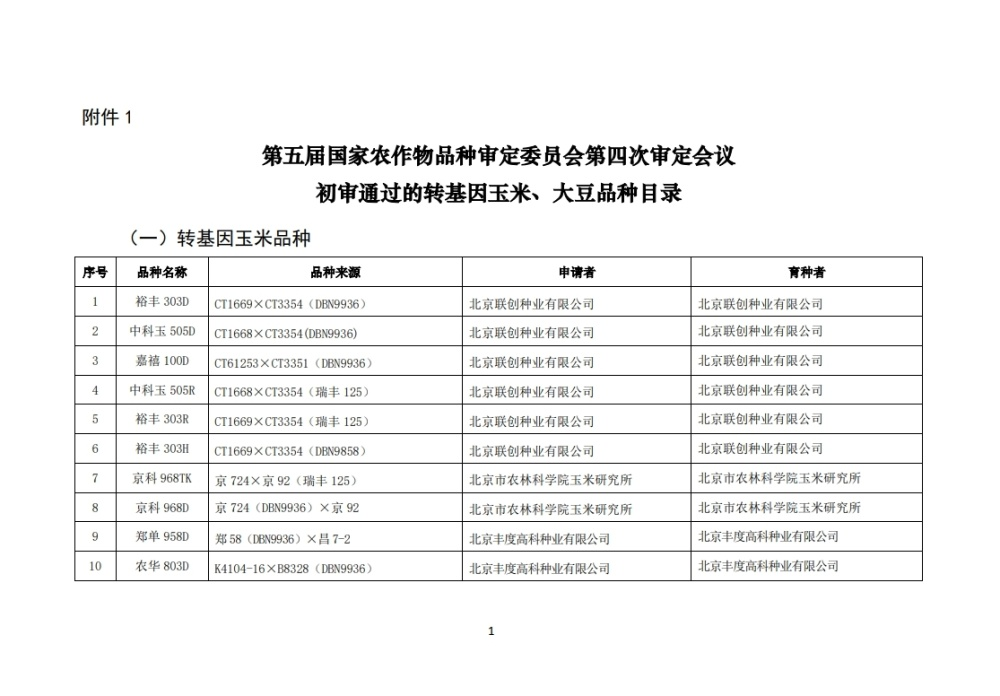
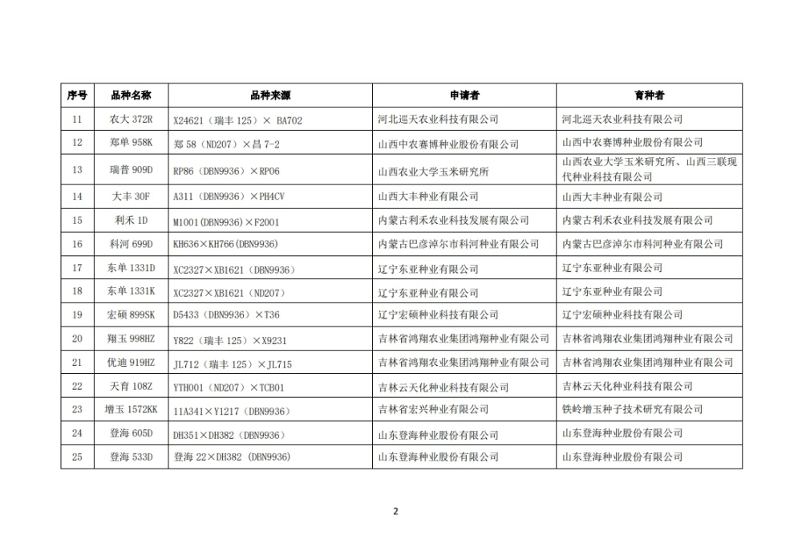
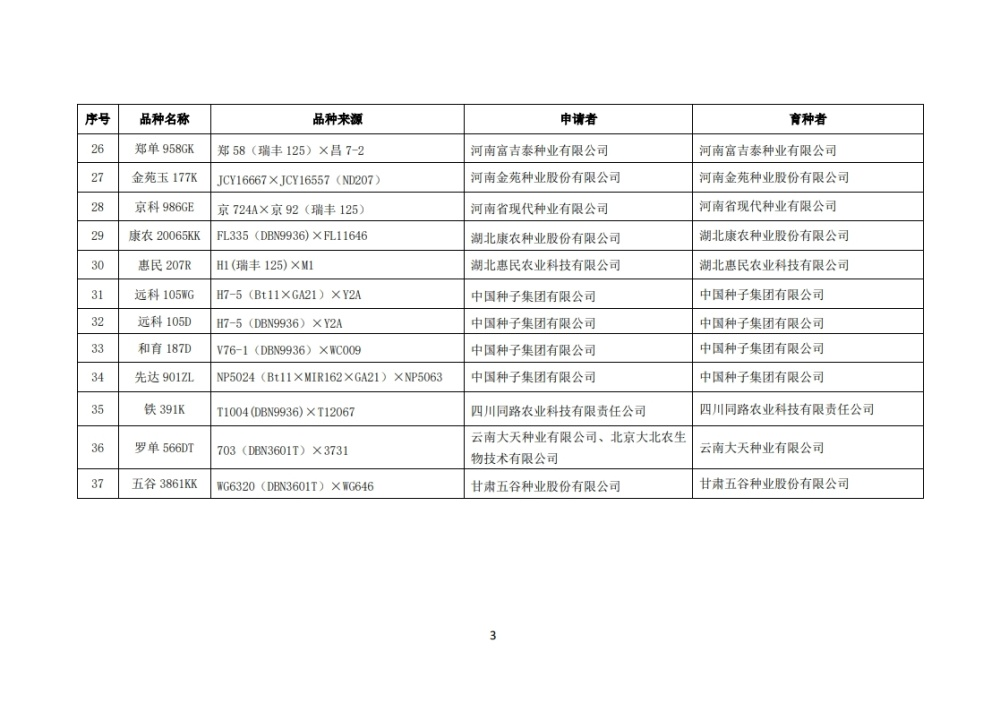
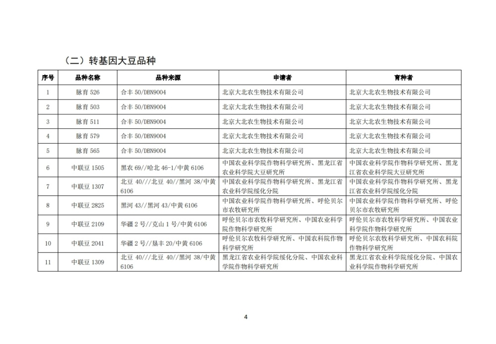
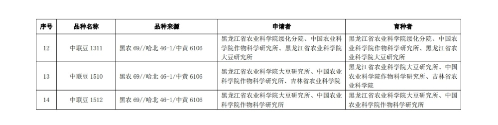

# 农业农村部公示：37个转基因玉米品种、14个转基因大豆品种通过初审

10月17日，农业农村部公示第五届国家农作物品种审定委员会第四次品种审定会议初审通过的转基因玉米、大豆品种及相关信息，公示期为30日（自2023年10月17日至2023年11月15日）。包括37个转基因玉米品种、14个转基因大豆品种通过初审，申请公司包括大北农、登海种业等。上述品种按程序通过审定后，实际种植区域还应符合国家生物育种产业化有关安排。

