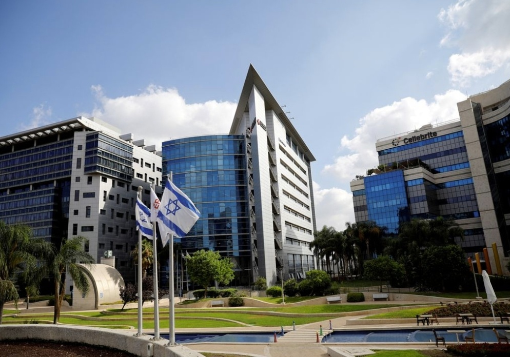

# 冲突下的以色列：科技公司员工走上战场，有公司3成员工入伍

**划重点**

  * _1_ 巴以冲突已经对以色列科技行业造成巨大影响，导致许多初创企业运营中断、项目搁置或无法继续筹资。
  * _2_ 以色列已经征召了36万预备役人员参战，约有10%的科技公司员工被征召入伍，部分公司的征召比例甚至高达30%。
  * _3_ 投资者和分析师表示，巴以冲突可能破坏以色列科技行业的复苏，初创企业融资金额大幅减少。
  * _4_ 分析师预计，以色列的科技行业会像过去与巴勒斯坦发生冲突后那样出现反弹，甚至借助这场冲突更加壮大。

随着巴以冲突规模不断扩大，战争的影响也开始延伸到各行各业，其中被视为以色列经济支柱的科技行业更是受到巨大影响。这场冲突导致许多科技创企员工被征召入伍参战，企业运营中断、项目搁置或无法继续筹资。然而，这种危急时刻也突显出以色列科技行业的韧性。巴以冲突此前是常态，许多投资者坚信以色列科技产业不会因此衰落，而是会持续蓬勃发展。

**01 1/10科技公司员工被征召入伍参战**

以色列庞大的科技行业经历了多次危机，从金融衰退、新冠肺炎疫情到巴以冲突的周期性爆发等。每一次，这个行业都成功实现了反弹，并证明为何这个只有900万人口的国家能被称为“创业之国”。

但由哈马斯上周末发动的袭击引发的最新冲突，在某种程度上颠覆了以色列人的日常生活，给该国最重要的产业带来了巨大挑战。

学校被勒令停课，商业中心特拉维夫曾经熙熙攘攘的街道几乎空无一人，许多企业仍然关闭。有些公司出于安全原因关门，但更多公司是因为根本无法照常运营，因为他们的员工被征召去服兵役。

以色列创投数据中心Startup Nation Central（简称SNC）首席执行官、前风险投资家阿维·哈森(Avi
Hasson)表示：“这与我们以前遇到的任何情况都不同，所有以色列人都受到当前战事的影响。目前，事态发展的不确定性非常高。”

这场战争对科技公司最直接的影响来自于人力方面。以色列已经征召了36万预备役军人参战，其中大多数人在以色列工作和学习，也有些人是从国外回来的。SNC估计，以色列约有10%的科技公司员工被征召入伍，在部分公司，这一比例甚至高达30%。

对于网络安全公司Pentera的首席执行官阿米泰·拉松（Amitai
Ratzon）来说，周六一觉醒来就充满了“不确定性和各种混乱”，但当他的公司周一召开全体会议时，有350名与会者参加。他回忆说，有些以色列员工认为，工作是一种分散注意力的绝好方式。而对于无心工作的人，公司允许他们休假。

Pentera在20个国家开展业务，其中以色列的员工人数最多，该公司专门为法国巴黎银行、香奈儿和丝芙兰等客户模拟网络攻击，以识别系统弱点。拉松说，在冲突期间，他不得不调整业务，取消了部分员工飞往以色列接受培训的课程，找人代替他在摩纳哥发表主题演讲，并让德国和英国的团队成员代替以色列员工飞往迪拜参加会议。拉松称，Pentera目前有20多名最优秀的员工在服役，“其中有些人已经上了前线”。

位于特拉维夫的会计自动化初创公司Trullion的首席执行官艾萨克·海勒（Isaac
Heller）证实，该公司的财务主管刚刚完成了2024年的财务预测，然后在筹集了5万多美元的资金后，立即为他的以色列国防军部队提供了新的防弹背心。

数字银行One Zero的首席执行官盖尔·巴尔·迪亚（Gal Bar
Dea）在接受采访时表示，该银行近450名员工都在以色列工作，其中约10%被征调为预备役。他惊讶地发现，在一个员工WhatsApp群里，人们不断主动为彼此代班。

迪亚举例称：“有个家伙说他被征召入伍了，突然就有三个人出来愿意顶替他顶班。有一种一切如常的感觉，一切都在向前发展。我们今天就即将推出的新产品召开了会议，每个人都在继续努力工作。”

迪亚还说，One
Zero正在开发一款类似ChatGPT的聊天机器人，用于客户服务。本周员工选择参加可选的计划会议，并决定不改变截止日期。迪亚称，负责这项工作的人是一名已被征召入伍的空军飞行员，他选择在工作间隙穿着军装参加电话会议。

专注于健康技术和生命科学的风险投资公司aMoon的投资助理亚尼夫·萨德卡(Yaniv
Sadka)说：“科技行业有很多人都被征召入伍，有的进入以色列的情报部门服役，甚至成为他们的后备军。到今晚为止，我已经参加了两场军人葬礼。”

**02 战争威胁以色列科技创企融资 投资者尚未失去信心**

投资者和分析师表示，以色列与巴勒斯坦的冲突愈演愈烈，这恐将破坏以色列至关重要的科技行业的脆弱复苏。此前，全球经济放缓和政府司法改革引发的分歧导致以色列今年可用的资金大幅减少。

科技是以色列经济中最大的单一部门。在战争爆发之前，人们的情绪已经受到了冲击。有些科技公司高管表示，政府削弱司法机构的计划吓坏了投资者，加剧了全球初创企业融资放缓的局面。

以色列最大的风险投资公司OurCrowd的首席执行官乔恩·梅德韦德(Jon
Medved)说：“未来几周和几个月，海外投资将会放缓，尤其是在冲突仍在继续的情况下。这不是一个特别容易获得投资的时期。”

在冲突爆发之前，随着全球经济增长放缓，对以色列高科技初创企业的投资已经有所下降。硅谷银行(SVB)的倒闭使其失去了一个重要的资金来源，拟议中的司法改革也威胁到了公司法和知识产权的基石。

专门追踪以色列高科技产业发展趋势的数据公司IVC研究中心和专为科技公司提供银行服务的LeumiTech整理数据发现，以色列高科技公司今年上半年的融资下降了70%，但与第二季度相比，第三季度的下降率稳定在14%。

LeumiTech首席执行官玛雅·艾森·扎弗尔(Maya Eisen
Zafrir)表示，这些数据是“融资金额和范围企稳的第一个迹象，这些数据使我们回到了2018-2019年的水平。”

2023年到目前为止，初创企业总共筹集了约50亿美元资金，而去年为160亿美元，2021年达到创纪录的260亿美元。2019年为104亿美元。这些投资的广泛很广，但主要聚焦于网络安全和人工智能(AI)公司。

以色列创投数据中心Startup Nation Central首席执行官、前风险投资家阿维·哈森(Avi
Hasson)表示：“当然，当我们处于战争之中时，很难想象这时候会有重大交易达成。”

然而，为科技公司创始人服务的网络公司TechAviv管理合伙人亚伦·萨米德(Yaron
Samid)表示，习惯了武装冲突的以色列科技公司已经制定好了“剧本”，以确保它们即使在战争期间也能继续运营。他补充说：“疫情还使我们的公司及其员工具备了在家办公的能力。”

但某些对科技生态系统至关重要的活动无法远程完成。原定于本月举行的至少三场备受瞩目的科技会议被取消，其中包括芯片制造商英伟达主办的人工智能峰会，该公司首席执行官黄仁勋原计划在峰会上亲自发表演讲。

接受采访的以色列科技公司高管表示，融资和交易也可能受到打击，因为对该国的访问突然停止，投资者正在观望局势如何发展。

以色列主要全球风险投资平台OurCrowd的首席执行官乔恩·梅德韦德（Jon
Medved）担忧地说：“接下来的几周将会非常艰难，尤其是对像我们这样正在融资的公司来说。创业经济面临的最大挑战是确保资金持续流动，因为绝大多数创业公司都还未实现盈利，他们需要持续的投资。”

尽管如此，哈森和其他人预计，以色列的科技行业会像过去与巴勒斯坦发生冲突后那样出现反弹。哈森说：“以色列科技公司能够在冲突期间发挥作用，并从冲突中恢复过来，这赢得了投资者的信心。所以，我认为投资者不会这么快就对以色列失去信心。”

以色列风险投资公司OurCrowd首席执行官乔恩·梅德韦德（Jon
Medved）表示，他相信以色列将成为科技投资的热门目的地。他说：“从历史上看，每次以色列开战，长期趋势都是买盘。”

**03 战争未能阻止以色列科技行业前行步伐**

对于以色列科技行业的许多人来说，这种危急时刻只会突显出该行业的韧性。哈森指出：“以色列的科技行业并没有停止进步。客户正在得到服务，代码正在被编写，新的想法正在形成。发动机运转正常。以色列非常、非常强大。”

总部位于特拉维夫的项目管理软件开发公司Monday.com在纳斯达克上市，该公司表示，其全球约6%的员工已被征召。但其沟通主管利亚·沃尔特斯（Leah
Walters）称：“作为一个全球团队，我们真的能够相互支持，不会对业务造成任何干扰。”

云安全初创公司Gem Security刚刚从美国投资者那里获得了2300万美元的A轮融资，该公司有30名员工分布在以色列和纽约。当巴以冲突爆发时，Gem
Security正在扩大队伍，以色列的部分员工不得不到预备役报道。

Gem Security联合创始人兼首席执行官阿里·齐伯斯坦(Arie
Zilberstein)说：“在我看来，以色列发生的事情不会改变任何事情，我们将继续坚持留在以色列的计划。”

初创公司MDI Health负责增长的副总裁阿里尔·埃弗根(Ariel
Efergan)估计，该公司在特拉维夫的40名员工中，约有五分之一被调为预备役。其余的人现在都在远程工作。

初创企业营销顾问希勒尔·富尔德（Hillel
Fuld）最终对科技行业的未来持乐观态度。他指出，全球风险投资界掀起了一波支持浪潮，世界舆论也开始向有利于以色列的方向转变。

他说：“这种转变甚至可能有助于推动那些可能不愿在以色列投资的投资者，我不认为这种情况会对以色列产生负面影响。”

与此同时，以色列科技行业的许多从业者正在加班加点地开发针对这场冲突的技术工具，比如一个面向失踪人员的布告栏式网站、网络攻击防御工具、类似公众集资平台GoFundMe的工具，甚至还有一个寻找在线心理学家的项目。

数字银行One Zero的首席执行官盖尔·巴尔·迪亚（Gal Bar
Dea）说：“这太神奇了！两天之内，人们就在筹集资金、做志愿者、收养孩子、建造新房子、遛被遗弃的狗。所有的高科技公司都参与进来，帮助建立网络、通信以及帮助平民的东西，还有帮助寻找人质的网站。”

风险投资公司aMoon的投资助理亚尼夫·萨德卡说，他“从未见过”像现在这样大规模的捐赠和大规模的志愿者活动，“这是成千上万的人互相照顾。从青少年到老年人，每个人都在帮忙”。

在接受采访的五分钟前，萨德卡听到办公室里的警笛声大作，他的妻子把孩子们带回家里避难。他说：“努力成为一家银行或高科技公司的首席执行官很有趣，与此同时，我是两个孩子的父亲。这非常艰难。这是我们以前从未经历过的。每个人都试图从商业角度和个人角度着手解决这个问题。”

周六，当德维尔·本-阿罗亚（Dvir Ben-
Aroya）醒来后，准备像往常那样去晨跑。然而，他面对的却是特拉维夫上空呼啸而过的导弹和刺耳的警报声。本-阿罗亚是以色列工作场所协作平台Spike的联合创始人，该平台的客户包括Fiverr、Snowflake、Spotify以及Wix等。

本-阿罗亚对此感到困惑不已，他回忆道：“没有人真正知道发生了什么。”但随着时间的推移，社交媒体和朋友们的短信开始让他明白过来。

当地时间周六下午3点，本-阿罗亚召开了全体会议，他在以色列的35名全职员工都参加了会议。人们分享了各自的经历，本-阿罗亚决定，在可预见的未来，每个人都应该在家工作。他还补充说，如果有人想和家人一起离开以色列，公司会支持他们。当时，至少有10%的人决定接受他的提议，他认为未来几周会有更多的人这样做。

以色列创新局的数据显示，以色列科技界占该国年度国内生产总值(GDP)的近五分之一，是该国经济产出最高的行业。科技行业也占总劳动力的10%左右。据本-
阿罗亚和其他几位接受采访的科技界人士称，即使在战争期间，以色列科技界的大部分人仍在寻找前进之路。

本-阿罗亚原本计划在上周一推出Spike的集成人工智能工具，但他几乎立即决定将该项目搁置，尽管只有一周的时间。

**04 以色列科技行业能在战火中浴火重生？**

科技行业占以色列国内生产总值的18%，约占该国出口的一半，占税收的30%，因此其繁荣对以色列经济至关重要。有些业内人士认为，这场战争最终将让以色列的科技行业更加强大，因为它可能会得到热衷于帮助国家重建的投资者的支持。

为科技公司创始人服务的网络公司TechAviv管理合伙人亚伦·萨米德表示：“有支持以色列初创企业经验的投资者不会因为战争而放弃。相反，他们在这个时候表现出积极支持的态度，就像过去一样。”

截至上周五，一份支持以色列初创企业、创业者和投资者的声明吸引了来自世界各地500多家风险投资基金的签名。声明中称：“以色列一直是全球创新生态系统的持久合作伙伴，促进了突破性的技术进步和创业创新，现在是我们站出来支持以色列的时候了。”

美国风险投资基金Insight
Partners也表示，将向以色列一份预先批准的慈善组织名单提供至多100万美元的捐款，并称这是“与以色列朋友和合作伙伴站在一起的关键机会”。

科技公司本身也加入了这场战争的努力，搁置了它们对计划中的司法改革的不满，这些改革旨在为士兵采购关键装备，找到失踪人员，并提供人工智能和网络安全等领域的专业知识。

专栏作家、初创企业顾问希勒尔·富尔德（Hillel
Fuld）表示：“我们正在团结起来，这一事实对科技生态系统具有极其重要的意义。这个国家比过去更加团结。”SNC的哈森补充说，所有人都在“齐心协力”。

世界上许多最大的科技公司，如微软和Alphabet旗下谷歌也在提供帮助，比如为急救人员提供数字服务。（文/金鹿）

