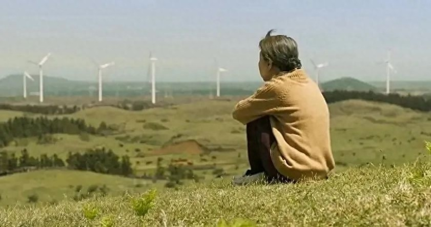
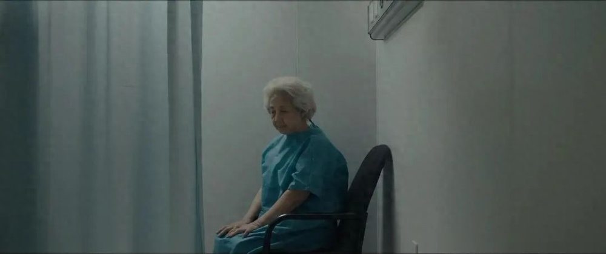
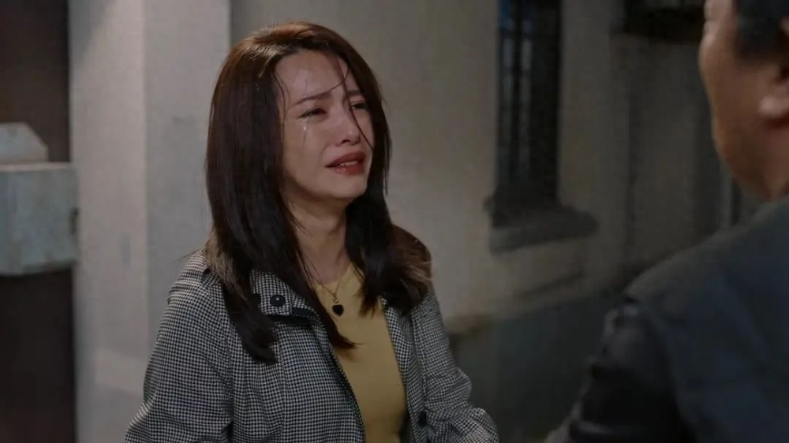
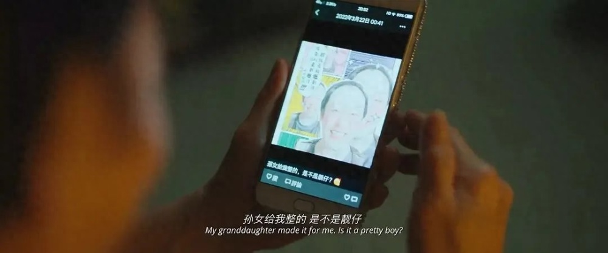
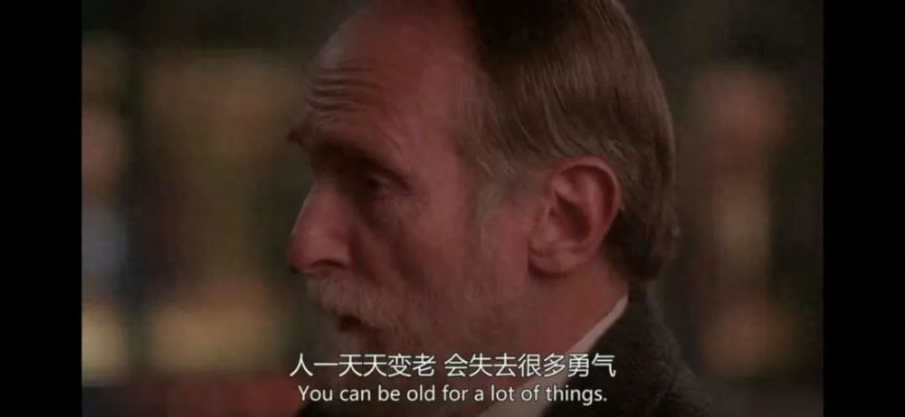

# 卫生院成了人生最后一站，专家：老人被漠视、羞辱、弃养在农村不罕见

家庭常被视为「温馨的港湾」，而学者邹翔指出，「是家庭就有冲突，家庭实际上是一个协作与竞争、温暖与黑暗共存的矛盾体。就像家庭可以供给照料、抚慰苦难，有时候，你会发现家庭同样可能成为滋生痛苦的温床。」

这是她多年观察和调研养老尤其是农村养老得到的感受。邹翔是东南大学人文学院医学人文学系副教授。2017年，在开展农村老年人家庭照料的研究中，她在广东粤西地区的秦村卫生院进行了半年田野调查，在这里，她先后接触了30位当地老人及其家庭。她发现，农村老人们在养老生活中并非安享晚年，往往他们仍然要在花甲之年继续劳作在乡间。与城市里积极寻求医疗服务、维系健康的老年人不同，许多受疾病困扰的农村老年人会主动降低自己的医疗需求，能忍则忍，能扛则扛。即便他们去了医院，往往也只是为了推迟治疗、缓解病情，降低子女和家庭的经济负担。

她还发现，漠视、羞辱与弃养在农村并不罕见，特别是当老年人失去自理能力、需要经常看病以及家庭成员的持续照护时。随着老人们年岁渐长，传统父权制家庭结构所赋予他们的话语权日渐消失。很多老人被家人漠视，而乡间卫生院成了他们人生的最后一站。

根据2018年国家卫健委数据，我国人均健康预期寿命为68.7岁，而人均预期寿命为77.0岁。这意味着有平均超过8年的时间，一个人需要被照护。根据第七次人口普查数据显示，截至2020年，我国农村老年人数量已达到1.21亿人。这样一个庞大群体所要面临的养老问题，需要解决。

最近，我们联系到了邹翔，和她聊了聊她在调研农村养老时的所见所闻，也聊了聊老年人在被照料以及自我照料中会遇到的实际问题。伴随着衰老，老年人在家庭和社会中的权力和地位也变得岌岌可危。访谈中，邹翔多次提到了老年人的社会价值。她说，改善老年人的养老环境，除了社会政策的扶持和帮助，最根本的，是引导「社会怎么去扭转对于衰老、脆弱还有人的依赖性的认知，让老人们能够真正得到伦理上、价值上的尊重」。

以下，是邹翔的讲述。

**文｜** 令颐

**编辑｜** 槐杨

**1**

2017年，我在粤西进行田野调查，接触了大概30位老人和他们的家庭。我发现，是家庭就有冲突，家庭实际上是一个协作与竞争、温暖与黑暗共存的矛盾体。就像家庭可以供给照料、抚慰苦难，有时候，你会发现家庭同样可能成为滋生痛苦的温床。

对老人的照料其实是一个很困难、很复杂的问题，不同的健康水平、经济状况和家庭关系，使得老年人生活的具体情境存在很大差异。粤西地区经济不那么发达，青壮年人口外流严重，因此当地留守老人比较多。大部分的农村老年人只要自己还能劳作，哪怕他已经佝偻了、腿脚不利索了，依旧会很努力地劳作，自我照料。

在当地，尽可能保持独立、不给子女添麻烦便是一个老人晚年最大的体面，年老体衰不意味着可以倚老卖老。被照顾的权利需要老人自己去争取，需要贡献自己的光和热，譬如帮助子女带孙，或者能够赚取点收入、不给子女添麻烦，才能够赢得家庭和当地社会的尊重。

可能一位老人已经 80
岁了，身体状况很不好了，然而面对子女外出务工，只能选择自我照料，或者需要外出做工去换取一些收入。粤西当地有很多生蚝厂，一些老人在旺季去开生蚝，做一天零工可能赚个二三十块钱。毕竟不同于青壮年，老年人往往会赚得少一些，但他们中很多人会觉得很知足，因为他们也在像年轻人一样试图在经济上自给自足。

当老人身体健康、生活能够自理时，依靠自己或者子女的经济支持还勉强能够安置晚年生活。而当老年人生病、无法独立安排生活起居时，他往往会牵涉整个家族，需要所有人齐心协力去应对生病住院的照料需求。比如老人住院，家人除了提供经济支持、带老人看病，最起码要过来给老人送饭，帮老人洗漱和换衣服。老人挂水的时候想上厕所，那肯定需要有个人去扶一把。但对于老年人来讲，一个人拖累一个家庭，会造成很大的道德负担。

在来到秦村前，我曾在广州进行过有关医患关系的调研。大城市的患者往往更重视自己的健康，他们有很强的寻求资源能力，较好的经济支付能力，和掌握信息的能力，并在寻求健康的过程中表现出强大的能动性和意愿。

所以当时我就想，是不是所有的患者遇到健康问题都会竭尽全力。然而在进驻卫生院、向卫生院医生询问病人看病的基本情况时，医生却说，「你来错地方了，我们这里没有病人。要不就是治不好、来这里等死的，要不就是家里没人看管、被扔在这里让我们养老的。你要是想调查患者怎么看病，你要去上边的大医院。」

秦村卫生院距广州 250多公里，在我调研时当地还没有通高铁，去广州要坐将近 4 个小时大巴，对村里老人来说，如果去广州看病，还没买到一颗药，就已经花了
200
多块钱的路费了，如果大医院的医生说这个病治不好或者要花很多钱，对许多农村老人而言，是更大的负担，不如索性就不去看。很多时候，秦村卫生院便成为了当地老人看病的唯一选择。如果被诊断出癌症，很多老人选择不治了，直接回家。如果是慢性疾病，他们也会寻求基层卫生院的医疗服务，来延缓病症，希望给家里省钱。大部分时候，乡镇卫生院也成为他们解决健康需求的唯一选择，这也是许多老人人生的最终一站。

在卫生院，经常能看到老人在儿女陪同前来看病的同时，也要受到子女的指责。有一位老人给我留下了很深刻的印象。在过去七八年的时间里，她时不时会往卫生院跑。问老人的家人她为什么经常来医院，家人说，经常来卫生院就是因为她怕死、「想不开」。甚至与这位老人同病房的患者也会指责她，「你都已经快
80
岁了，你天天来看病干嘛呀？你还要拖累你的子女，你有什么想不开的？」很多子女因为自己家的长辈经常来卫生院看病，对他们有很大埋怨。「都是老年人了，要看什么病，有口吃的就已经不错了！」

刚才我们也说到，老年人的照料不仅需要日常的物质照料，更包含情感慰藉和精神支持。照料始于我们对于被照料对象的情感关注与怜悯，并因为这些情感，激发具体的行为。但是，至少在我的田野中，大部分家庭的照料并非始于对作为病人的父母的怜悯、共情和关切，而更多是无奈与不情愿。「没办法，你是我父母，我有责任，我要去照顾。」甚至很多案例中的照料充满痛恨、厌恶与胁迫。

我所看到的家庭照护更多是停留在物质层面，甚至很多人连物质层面照料需求也满足不了，很难与子女的孝悌之心联系起来。

在田野调查的时候，我遇到了一个老人，他有很多慢性病，除了高血压、冠心病这些基础疾病，还做过胆结石手术，脑梗，胃出血还有胃溃疡，因此每隔一段时间就会来卫生院输液。因为新农合的普及，农村老人在卫生院这个层级看病并住院时，可以报销九成以上，有些家庭因此会将有照料需求的老人送到卫生院住院，让医护人员帮忙看护。某种程度上，这也使得当地卫生院职能从传统意义上的医疗机构转变成为养老、康复和慢病管理机构，甚至某些家庭会将有重度护理需求、瘫痪在床的老人直接遗弃在卫生院。

田野中，我曾遇到过一位脑梗后没有得到及时康复干预、瘫痪后长期占用卫生院床位的老人。他50多岁时，花了5000块钱买下一位有智力障碍的越南新娘，但是妻子在婚后生下一个女儿没多久，就跑回了越南老家，他和女儿相依为命，在镇子上靠打零工和收废品维生。

到了将近 60
岁，他突发脑梗，他的大哥把他送到卫生院。因为大哥大嫂白天需要做工，没有时间和精力照顾他，就把他留在卫生院，每天大嫂过来送饭。老人躺在床上没有任何后续治疗，两年之后就彻底瘫痪了。大哥大嫂害怕沉重的照料负担，拒绝将老人带回自己家，他们觉得卫生院是个公立医院，有责任照看他。

当时卫生院的院长也说，老人的大哥大嫂不讲理，「但是我们不可能把他直接扔到院外边」。两方就僵持住了。大嫂每天打完工后，会趁着医生下班的时候从卫生院住院部后门溜进来，给老人送一顿饭。然而家人的照料也仅限于此。医护人员说，在过去瘫痪的两年中，老人基本没有换过衣服，南方的天气很热，「所以我们整个病房基本都废掉了，因为太臭了」。

因为瘫痪、护理需求变高而直接被家人扔在卫生院门口的事在秦村上演了多次，你会看到当地人对于照顾责任主体认知的改变。很多农村家庭会开始觉得，卫生院是公立机构，有提供社会福利的职能。他们对于社会性照顾有着很强的期待。

许多旁观者可能会站在道德制高点，面对农村照料困境，指责子女不孝、道德沦丧。但如果设想我们处在农村的现实处境中，我不认为自己会做得比秦村中受访的家庭更好。与此同时，尽管面对很多困难，我所访问的家庭依旧是很大程度上去照料老人。尽管很多时候，我们看到的照料充满家庭成员之间相互的谩骂和鄙夷，但是这改变不了他们在努力延续照料的事实，只是他们的照料并不像我们理想中的那么充满爱意，温情脉脉。

_图源电影《别告诉她》_

**2**

在家庭中，给予照料可以让一个病人的复苏和康复成为可能，但同时，照料过程也会使得另一个人陷入痛苦的深渊。

这里边，最不容忽视的就是家庭中女性面对照料责任时的隐忍和付出。许多农村传统家庭中往往是父母跟着儿子进行养老，但事实上，真正代替儿子尽孝的是儿媳妇和女儿。

我曾经和一位来自中原农村地区的朋友交流，他说，老家当地特别喜欢儿女双全。我当时认为，可能当地人认为女儿和儿子都很好。朋友说，不是的，村里人依旧重男轻女，会将大部分的财产和积蓄留给儿子。「但是他们同样依靠女儿，主要因为女儿会把老人照顾得更好，儿子继承钱财，但是仍有可能对老人置之不理。」

在许多儿女双全的农村家庭中，为儿子结婚花钱买房是天经地义，但对女儿的经济支持和付出则少了很多。女儿虽然也会觉得不公平，但会更在意父母对自己的照料期待。

在广东一些地区，养儿防老观念根深蒂固。甚至很多老年人会觉得，被女儿照顾简直是家门不幸，有时候，即便是女儿在照顾老人，但老人也不会对女儿有感激之情，他们更期待由儿子来照顾。

我调研的时候，遇到了一位照顾住院生病双亲的李阿姨。她87岁的父亲被诊断出患有晚期胃癌，住院治疗。父亲回村后不久，84岁的母亲因为严重的冠心病问题也住进了医院。李阿姨是家里的长姐，有三个弟弟，都在广州经商，平常都比较忙，留在村里照顾父母意味着要牺牲他们的事业和家庭生活。于是，三个弟弟就雇佣这个姐姐来照料父母，每个月凑6000块钱给姐姐。

李阿姨纠结了很久才答应了回村里照顾父母。每天早上8点，李阿姨要骑15分钟三轮车送父母去医院进行三个小时输液。随后，载着父母回家吃午饭。但是这一家人的午餐是分开吃的：李阿姨大多独自在家吃清淡的蔬菜，而父母在外面的餐厅吃他们最喜欢的烧鹅。午饭后，李阿姨小憩一下，就开始忙家务，为父母和自己准备晚餐。而父母会整个下午和邻居一起打麻将。

对李阿姨来说，她要面对的难题是，如何在照顾父母的同时，照顾自己的情感创伤——李阿姨回忆说，尽管自己从小到大为这个家庭付出很多，却从未受到父母和兄弟的待见。当她还是个小女孩的时候，父母拒绝了她上小学的要求，安排她留在家里帮忙做家务，这样可以为弟弟们节省学费。她成家后生活困难，向弟弟们寻求帮助，却总是被拒绝。

当照料关系建立在过往的家庭矛盾中时，对于李阿姨来说，如何调和自己压抑的委屈和矛盾的情感，比照料父母难得多。

大多数情况下，李阿姨尽力把父母照顾得很好，也获得了其他家庭成员的认可，但难免也会受指责。比如，有一次，李阿姨因为感冒发烧一直咳嗽，难以陪父母去医院，问父母是否可以推迟几天治疗，毕竟根据父母的情况，推迟几天也不会影响他们的康复。母亲却拒绝了，坚持要继续去卫生院输液，还说，「我的儿子们付钱让你带我去医院！」

母亲的态度以及对她病情的不重视，让李阿姨非常失望。她跟我说，「我也是她的女儿。她（母亲）从未对我表现出任何感激之情，认为我只不过是一个雇来的保姆。」

这中间存在着对家庭照料和女性照料角色的价值贬低问题。通常，女性付出的照料，并不被认可。李阿姨虽然有一定经济回报，但很多时候，女性的照料是无偿的，是没有办法得到经济支付的。一直以来，留在家庭中的女性不能够像男性一样平等地去参与市场经济、去赚钱，从事社会生产、社会劳动，而照料因为不参与市场交换，价值被忽略，这导致在家庭里，女性的角色往往都是隐形的。

这种现象的背后，折射出来的还是社会对照护工作的价值漠视。照料从来没有被认为是一种「正当」的工作，它甚至成为了「耻辱」的根源。

很多时候，人们认为，照料是肮脏的，特别是照料老年人，给老年人换纸尿裤或者洗澡等等，会觉得这些劳作非常不堪。更多时候，这些工作会被大众理所当然地认为应该由没有接受太多教育、社会地位卑微的农村女性来承担。

我采访过四位当地护工，伴随这份工作所产生的羞耻感和自尊心受损的感觉尤其明显。她们都是老年妇女，丧偶且是文盲。其中一位王阿姨，对自己从事护理工作谋生表示羞愧：「你指望我做什么？我没钱，也没有上过学，如果我有其他选择，我不会选择在这里待着给其他人服务。」

 _图源剧集《都挺好》_

**3**

现在农村家庭压力很大，不管被照料者与照料者都面对着压力，发展社会照料也是必然趋势，但是很多农村社区在推广社会照料服务时面对很大的阻力。

在南京，许多农村社区也建立日间照料服务中心，为老人提供娱乐场所、组织保健活动。我曾经采访一位负责人，她说，农村老年人根本不配合，有时候你请一些中医、专家过来做养生讲座，他们根本就不听，他们没有能力老老实实坐上一个小时。开书画班也不现实，许多老人都不识字，很多适老服务和设备完全闲置，大部分老人可能更喜欢麻将桌。还有很多地方建了自助餐食堂，还有补贴，一顿饭三菜、一汤、一份主食，算下来一餐只要8
块钱。可很多当地老人依旧不愿意去，觉得8
块钱差不多够一天的伙食费了。很多时候我们也在大力推进农村照料服务体系，但是农村老年人对于社会照料的接受意愿是个很大问题。

即使在城市，社会照料服务供给和老人自身接受意愿之间依旧存在一个很难跨越的鸿沟。

我之前在南京调研过一个社区养老服务中心，这个社区主打适老化改造，推广了很多智慧养老的产品。一些设计师提倡给老年人使用烟雾报警器，为什么呢？有的老年人得了阿尔兹海默症，譬如炉子上还煮着东西，他可能忘记了就离开了，引发火灾就很危险。有了烟雾报警器，如果老人忘记导致饭被烧糊了，报警器识别烟雾后就会自动喷水。

其实这只是设计师们简单的设想。你会发现这个设计本质上还是觉得老年人的存在是一个问题，是一个隐患，是需要技术手段进行干预的目标。事实上，很多的适老设计并没有方便老年人生活，只是方便了子女去监督老人。

刚才提到的那个社区里，一位老人在家很无聊，他不知道安装烟雾报警器到底意味着什么，他只会觉得这个东西会喷水，很有意思。于是他就故意坐在烟雾报警器下抽烟。报警器响了、开始喷水，紧急呼叫启动了。呼叫中心后台工作人员赶来了，之后就责怪他，「你为什么抽烟？」他说，「噢，我觉得挺好玩的，就想看看它会不会喷水」。

有很多这种适老产品，购买者都是子女，而使用者是老人，老人不会主动给自己买这些高科技产品的。还有一些专门给健忘老年人设计的手环，设计师的想法是万一老人走丢了，可以通过手环上的呼叫按钮联系家人，但很多阿尔兹海默症患者走丢时他自己是犯迷糊的，这种时候他怎么还会记得去按这个手环进行呼叫呢？

在我看来，老人除了需要这种物理照料和经济支持，更需要的是情感上的慰藉。其实老人特别想要真实的交互性体验，比如子女给自己打电话，或者和其他人有一些直接联系，这种交互性不是技术产品或者科技可以取代的。

还有一个案例是紧急呼叫的产品，呼叫按钮装在家里比较显眼的位置，如果说老人遇到什么紧急情况，只要按这个按钮，呼叫中心平台会把老人的呼叫转接到子女手机上，如果子女并没有及时响应，社区呼叫中心的工作人员就会上门查看老人的情况。

社区中心工作人员跟我讲述这样一个案例，一对老夫妇晚上按下了紧急呼叫，但子女没有及时响应，后台服务人员问他们有什么紧急情况，老两口解释：因为他们吵架了，想找一个人评评理。后来，老两口还跟工作人员解释说：每次按了这个按钮，我女儿就会给我打电话。可以看出他们对于这个紧急呼叫按钮的理解：它是用来和别人沟通的。这和设计者所设想的用于应对紧急情况有很大区别。

可以看出科技产品的设计者、购买者以及真正的使用者，三者对适老产品的认知存在很大的差异。目前适老化改造中的科技产品的设计，是一个自上而下的过程，其实并没有真正融入老年人的视角，这些产品到底多大程度上能够满足老年人的照料需求，特别是老人的情感需求，也是存在疑问的。

在适老化的过程中，特别是在这些适老产品、项目市场化后，都会有相应的推广、销售的指标和任务。与其说这种产品它主打的是方便子女更好地照顾老人，更应该说是监督老人，怕老人出事。这种照顾方式更多是一种「管」，而很多中国人恰恰就会觉得，「管」也算是一种照顾。

 _图源电影《我爱你！》_

**4**

从家庭对老年人照料的漠视，到对家庭照料和女性照料劳动的贬低，再到前面说的适老产品更好实现对老人监管，这些问题根本反映出的是我们对「老」的抗拒和价值贬低。虽然人人都会老，但是随着老年的到来，我们对生命价值的判断也相应发生改变。

传统社会里，老人被认为是智慧的象征。什么时候耕种，浇水、施肥、收割，这一整套农耕智慧、知识都是掌握在老人手里的。年轻人要从老人这里吸取农耕知识和技能，对老人很尊敬。现在，老人作为信息和知识掌握者的角色完全变了。举个例子，我们现在毕业了，想找工作，想出国，了解信息的途径可能是上网查询，而不可能是去问爷爷奶奶。他们已经失去了所谓的信息权威。加上现在我们不再像以往那样依赖土地作为生产资料，年轻人外出升学就业，老人丧失了话语权。

社会对老年人的价值评价体系也发生了很大的转变。在现代社会，在讲求市场参与，讲求效率跟竞争，讲求学历和知识的背景下，老人身上的传统优势已经无法体现了。随之而来是我们对衰老的价值贬低，觉得老年人没有经济价值，只能依赖家庭，只能依赖社保体系和医疗体系。

尤其在农村。在调研时，我接触到的老人大多数都不识字，很多时候，他们连自己的名字都不识。我印象很清楚，一位老人在输液，她盯着输液瓶上的一串字，但是她只认识一个「白」字，就拉着我问，这个是不是「白」？我说是的，但是其他字她都不认识。

这种情况下，你要这些农村老人怎么去参与市场？他们很难在大城市打工、落脚，可能只能在城市中从事保洁、保安等一些服务行业，甚至一些服务行业也对学历和年纪有限制，他们无法正常地参与城市市场的劳动，只能滞留在家乡中。就像我所遇到的护工，她们的劳动价值很难真正获得来自社会层面的认可。

此外，调研的过程中，不仅是当地家庭，甚至连卫生院的医生也对老年人的健康表现得轻描淡写。我遇到过一位老人在县医院做开腹手术不成功，转到卫生院休养的。老人在手术之后，创口一直长不上，引发了腹膜炎，生命也岌岌可危。因为腹腔化脓，产生大量的积液，管床医生每天都要负责给他清理伤口。每次的换药看起来更像是活体解剖，我和医生感慨这位老年人真可怜，医生却反问：「这有什么好可怜的？」

我当时觉得震惊，又反问管床医生为什么不觉得这位老人可怜？他是这样回答的：「到这把年纪了，他们身边其他的老人一个个都化成灰了，他们也没有什么想不开的。很多时候，农村人一无所有，只有一把锄头，两间瓦房。但正因为他们一无所有，所以也没什么好惧怕、好失去的。不像你们城里人，因为拥有的东西太多，所以你们好怕死。」

在农村，老年人自杀问题很严重。很多老人会在和家人产生激烈矛盾后自杀，在家里上吊，喝药，或者去投河。我接触过一个案例，这个老人是硬生生让自己在洗衣机里溺亡的，他跟家里人因为一点琐事吵架之后，钻牛角尖，就把洗衣机装满水，自己一头扎了进去。

有些子女疏于看护，不管父母，或者几个子女之间相互推诿，埋怨父母偏心、不公平。有的家庭中，大儿子说「我不想养你，因为你没有帮我带孙子，你帮小儿子带了，你去找小儿子」。但是小儿子就会说，「为什么来找我？应该跟大儿子平分责任」，到最后两个人都不照料老人。很多时候，农村家庭中子女越多，老人却越有可能无法得到照料。

家庭就是这样，成员之间也充满权力斗争。这种时候，老人就被逼到了死角上，处于权力弱势地位，他们也不知道怎么办，不知道该怎样为自己抗争。老年人对自身的价值、对生活意义的理解都建立在与家人之间的伦理关系基础上。当老人发现自己赖以生存的价值体系已经崩塌时，生活也就随之无望了。有很多老人就说，行，那我就自杀，之后让子女良心不安，受谴责吧！

其实养老带来了一系列现实的问题，不管是物质和经济压力，还是情感上的复杂与矛盾，根本反映了我们对养老的价值有待重新认识，对于衰老和脆弱性的尊重，这关乎对我们作为一个人内在价值的肯定。

我们每个人都有脆弱性。肉身是很脆弱的，当你度过无所畏惧的壮年，你也在慢慢走向老年，有需要被照顾的时刻。在伦理价值上，我们要看到任何人都有老去的这一天，每个人必须去面对，不能去躲避，也不能去把它当成一个负担。「老」只是人类社会发展一个正常的阶段，一个老了的人可能会更加深邃，更加沉稳而富有智慧。我希望每一个老人活在比较体面的世界里，他们的感受，他们的认知，他们的需求和创造的价值都能够得到尊重和认可，就像他们在壮年的时候一样。

或许，最根本的改变并不只是提高养老待遇，完善社会体系，从根本上说，是从社会层面去扭转对于衰老、对于脆弱和对于人的依赖性的偏见，让老人能够真正得到伦理上、价值上的尊重。这本质上与其说是出于对老人的尊重，不如说是出于对人的尊重。因为作为具有平等地位和人格的个体们，老年人与我们社会其他年龄群体本无太多差异，只是在人生的旅途中，他们正好行进到了衰老的那个阶段而已。

_图源电影《小鬼当家》_

