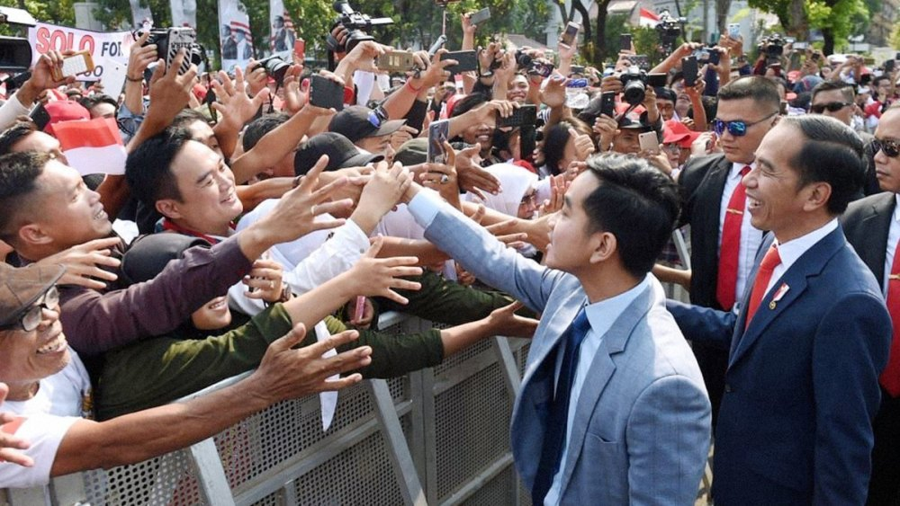

# 印尼放宽正副总统候选人年龄限制，或为现任总统佐科36岁长子铺路

【文/观察者网
熊超然】据《雅加达邮报》、英国《卫报》当地时间10月17日报道，印度尼西亚宪法法院近日所作一项决定引发争议，该决定放宽了正副总统候选人的年龄限制，只要曾担任过民选公职官员，40岁以下也可能成为正副总统候选人。

然而，这一决定引发了印尼现任总统佐科的批评者的不满，并加剧了外界的猜测，即已执政近10年的佐科支持现任现任国防部长普拉博沃∙苏比安托（Prabowo
Subianto）成为其继任者，而让自己的长子、36岁的现任梭罗市市长吉布兰（Gibran Rakabuming
Raka）作为普拉博沃的竞选搭档，以此来保持自己的影响力。

《雅加达邮报》指出，虽然吉布兰尚未宣布对参与竞选表示感兴趣，但普拉博沃的支持者一直呼吁他选择吉布兰担任竞选副手，这一年龄限制的更改为吉布兰在2024年大选中竞选副总统扫清了障碍，并铺平了道路。

_资料图：印尼总统佐科和其长子吉布兰同公众握手 图自印尼媒体_

据报道，按照印尼此前法律规定，被提名的总统或副总统候选人须满40周岁。据悉，年龄限制是印尼“2017年第7号法律”的一部分，该法律规范了选举制度。

法官哈姆扎（M Guntur
Hamzah）在裁决一份质疑该决定的请愿书时表示，原来的年龄限制对于具有政府公职经验的印尼年轻人来说是“不公平的”。“40岁的最低年龄（限制）不仅是阻碍，而且阻碍了年轻一代的发展。”该法官还表示，法国和新西兰的领导人都是在30多岁就获得最高职位（总统或总理）的。

《卫报》指出，这项裁决可能会加深人们对于佐科对“印尼民主机构”施加影响力的担忧，佐科的妹夫安瓦尔·乌斯曼（Anwar
Usman）目前就是印尼宪法法院院长，有说法称，他未来还可能担任印尼最高法院首席大法官。

《雅加达邮报》指出，佐科的批评者们认为，乌斯曼应该回避对此案的裁决，以避免任何潜在的利益冲突发生。而对于乌斯曼是否参与了这项裁决，或其本人有何看法，印尼宪法法院发言人并未立即回应记者的置评请求。同时，佐科的长子吉布兰目前尚未公开宣布有意竞选副总统，也没有立即就该法院裁决回应置评请求。

有一些分析人士担心，所谓“任人唯亲”和“王朝政治”在印尼根深蒂固，这与该国自25年前结束了苏哈托统治而取得的“民主改革”相冲突。报道称，通过一系列经济改革和大力推进招商引资之后，现任总统佐科渴望保留自己的政治遗产，但他无法寻求竞选连任第三个总统任期，因为印尼总统只能连选连任一次。

佐科在其办公室的YouTube频道上发布了一段视频中，他表示不会对宪法法院的裁决发表评论，以免被误解为“司法干预”。当被问及自己的儿子是否会竞选副总统时，佐科说：“我想强调，我不会介入总统或副总统候选人的事务。”

《卫报》称，目前佐科还未正式宣布支持普拉博沃，印尼现任防长普拉博沃，也是佐科在2014年和2019年总统大选中的竞争对手。在当前民调中，他的支持率与中爪哇省省长中爪哇省省长甘查尔·普拉诺沃（Ganjar
Pranowo）不相上下，而前雅加达省长阿尼斯·巴斯威丹（Anies Baswedan）则远远落后。

根据规定，印尼每五年举行一次大选，选举总统和副总统、国会两院议员等。此前，印尼总统佐科称，印尼2024年大选将如期举行。

**本文系观察者网独家稿件，未经授权，不得转载。**

