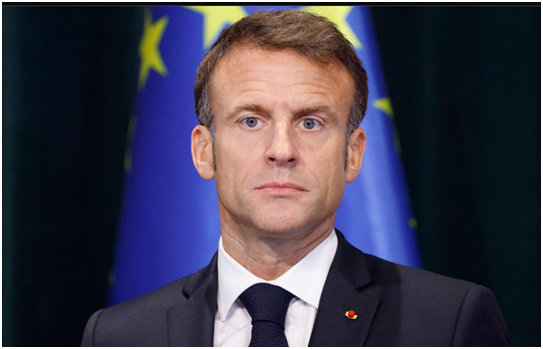
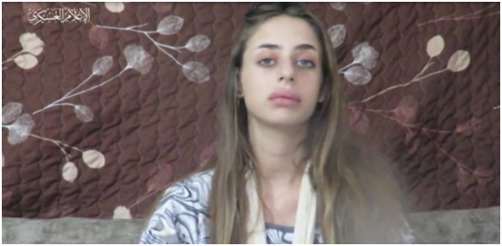

# 哈马斯首次公布影像的人质是法以双重国籍女孩，马克龙发声

【环球网报道】美国有线电视新闻网（CNN）报道称，法国总统马克龙17日呼吁“立即无条件释放”被扣押的21岁法以双重国籍人质玛雅·沙姆。

_10月17日，法国总统马克龙在阿尔巴尼亚首都地拉那参加会议。图自CNN报道配图_

CNN称，根据法国总统府说法，法兰西共和国总统注意到巴勒斯坦伊斯兰抵抗运动（哈马斯）发布的法以双重国籍女孩玛雅·沙姆的视频，马克龙“谴责”扣押无辜人质以及“制作（视频）的卑劣方式”。法国总统府称，“法国已经全面动员起来，正在与合作伙伴一起解救被哈马斯扣押的法国人质。”

_哈马斯首次公布被扣人质玛雅•沙姆的视频截图 图自外媒_

巴以新一轮大规模冲突持续不断，已造成双方逾4200人死亡，2万多人受伤。综合以色列《国土报》、美国有线电视新闻网（CNN）16日报道，哈马斯首次公布被扣押人质视频，视频中的人质名为玛雅·沙姆（Maya
Sham），21岁，拥有法国和以色列双重国籍，在哈马斯袭击加沙边界附近的以色列社区时被俘获，她的家人几天前才发现她被劫持为人质。哈马斯军事部门发言人阿布·奥贝达发表声明说，该组织扣押了大约200名以色列俘虏，其中几十人被不同派别扣押。奥贝达称，俘虏受到有尊严且尊重的对待，并补充说，有22名俘虏在以色列空军对加沙地带的空袭中丧生。

当地时间15日，联合国秘书长古特雷斯发表声明，呼吁巴以各方稳定人道主义局势。古特雷斯表示，在这个戏剧性的时刻，我们正处于中东深渊的边缘，作为联合国秘书长，有责任发出两项人道主义呼吁，即呼吁哈马斯武装立即无条件释放人质；呼吁以色列为了加沙的平民，允许人道主义物资和人员快速、不受阻碍地进入加沙。

