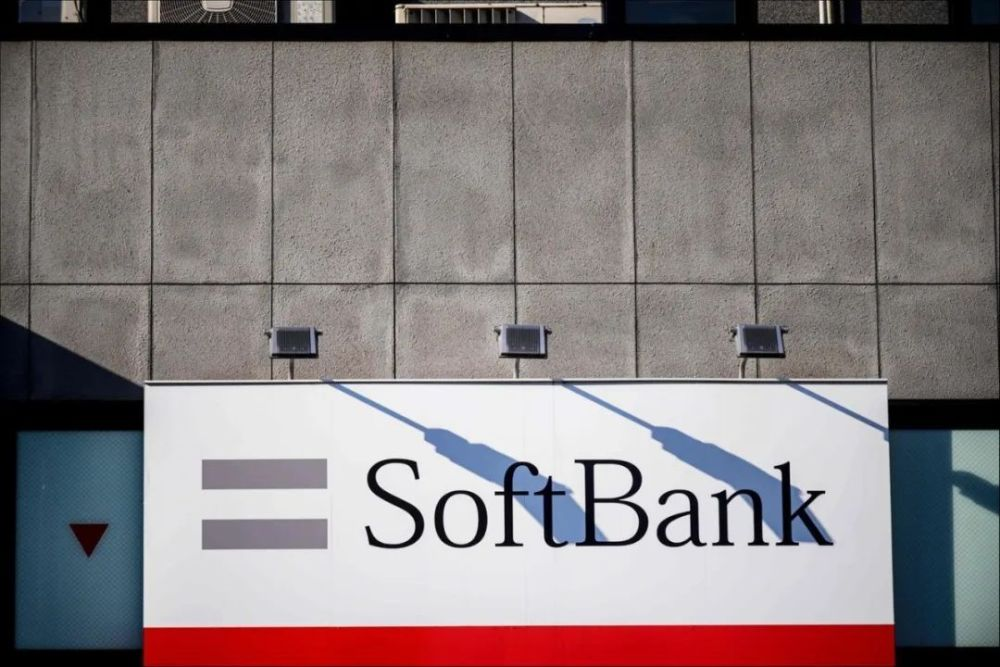
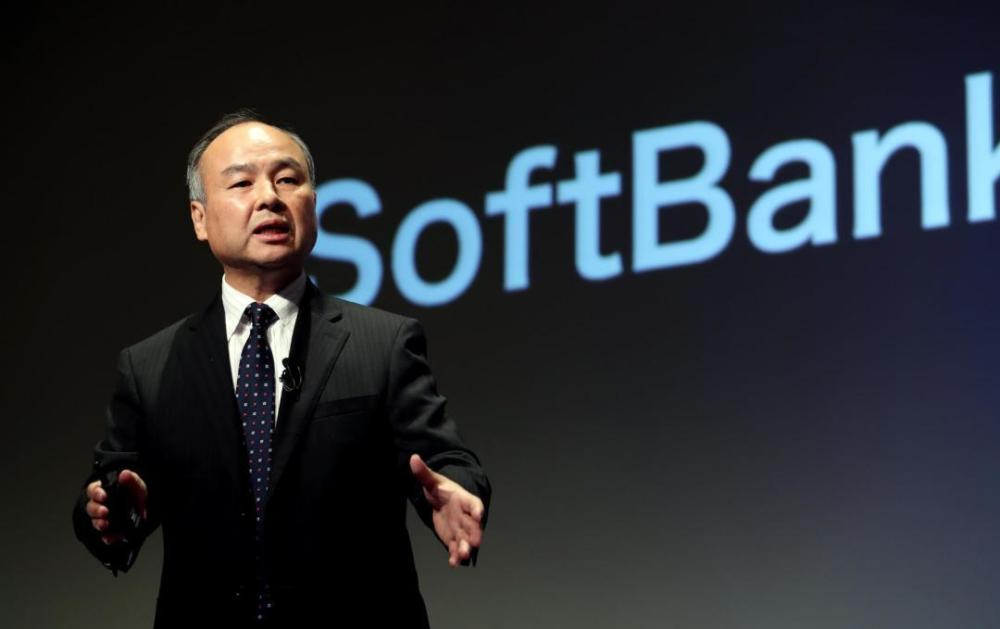
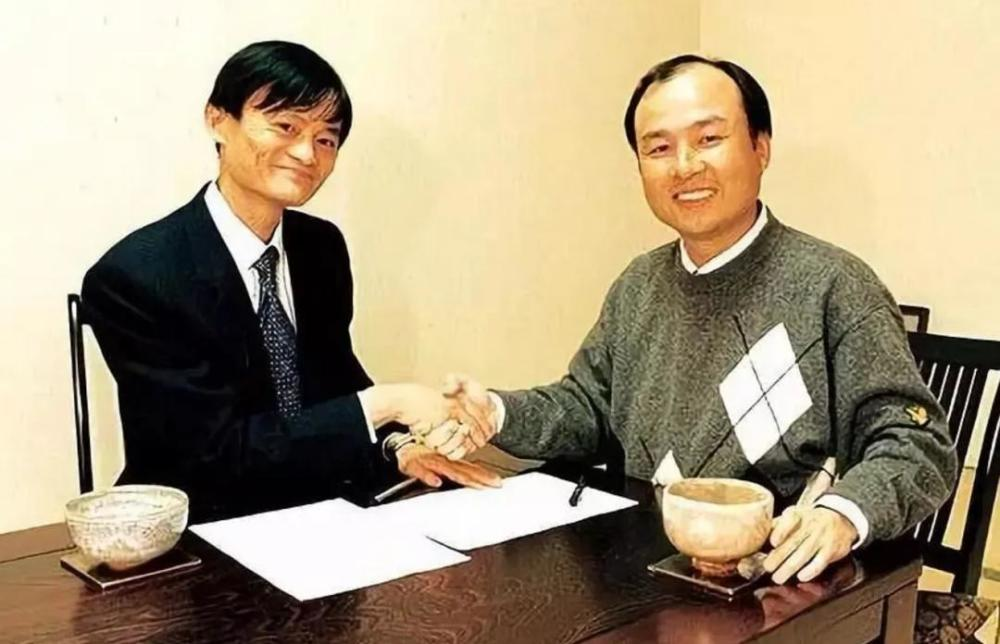
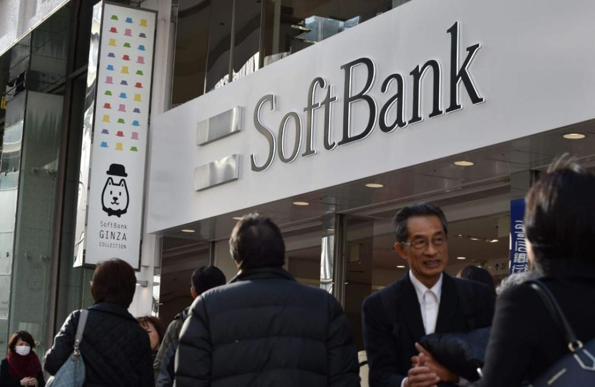

# 孙正义的AI野心，回不去的“软银时代”

文 | 山核桃

在风投行业的历史上，如果提起「软银创始人孙正义」（Masayoshi Son）的名字，一定会出现两种声音。

**一种声音是，他是改变传统风投模式的「Game changer」**
，这种以巨额、全球视野的成长型投资模式被无数玩家所效仿，这种攻城略地的姿态帮助孙正义创造许多的「本垒打」——无论是曾经的雅虎、阿里巴巴，还是如今上市的Arm，都是孙正义模式的成功案例。

**但另一种声音是，比起曾经的杀伐决断，孙正义正面临着迷茫与忧郁。**
失败的独角兽投资案例，错失对Anthropic和Cohere等人工智能初创公司的投资，旗下愿景基金的投资回报并不乐观。在软银今年6月的股东大会上，66岁孙正义表现了自己的「悲伤」，他说自己一直在思考“作为一名商人的剩余时间”，“为自己犯了很多错误和糟糕的投资感到羞愧”。

“我还有多少年了？我还有多少年？我做了什么？有时我感到有点悲伤。”

**孙正义的悲伤并不难理解，这种心情既属于个人，也属于整个风险投资行业。**
之所以说「属于个人」，是因为与他同期的很多风投大佬们，大多都功成身退，比如红杉资本的迈克尔·莫里茨，再比如与软银多次交手的Benchmark合伙人比尔·古尔利（Bill
Gurley），也早在几年前就赶在自己的50岁关口宣布退休，与孙正义的「不愿退休」形成了鲜明的对比。

这种悲伤情绪也属于整个风投行业，繁荣的时代已经不在了。私募数据统计机构 Pitchbook的数据显示，
**中美VC投资规模在2022年各下滑超过1/3。毕马威对2023年做出预测：“随着风险投资者继续回避后期交易，全球范围内的融资下降。”**

对孙正义而言，他和软银的声誉正在面临前所未有的危机。在过去的六年里，软银通过两个愿景基金花费了超1500亿美元的外部资金和自有资本来投资初创企业，但回报率与收益并不乐观。根据《The
Information》的统计，截至6月，软银第一只愿景基金的回报率仅为14%。

难以复制的造富传说体现在孙正义对Arm的押注上，尽管作为2023年全球最大规模的科技公司IPO，但眼下的Arm似乎并未给孙正义带来理想中的豪赌回报，这家企业所谓中立与独立性的商业模式正在面临资本市场的新一轮检验。

最新的消息是，孙正义正在淡出愿景基金，一位愿景基金员工向《The
Information》表示，自WeWork破产和一系列其他失败赌注引发公司动荡以来，孙正义只是偶尔参加投资委员会会议，一些员工抱怨他们无法通过电话联系上孙正义讨论相关的交易事宜，员工们对孙正义的下一步行动几乎一无所知。

**如何理解孙正义与软银，已成了这个时代一个无处安放的复杂问题。**

01、进攻与保守，摇摆的投资战略

一些软银的员工是从媒体报道中窥见「船长」孙正义最新的动态的，比如他与OpenAI创始人的会面。

今年9月，据几位知情人士透露，孙正义参与了苹果著名设计师Jony Ive和Sam
Altman，在这场围绕打造一款新硬件的讨论中，有消息称软银或向OpenAI注资，但截至目前，并未有明确的回复。

软银与OpenAI，曾经的资本猎手与全球最瞩目的AI初创企业，一些接近软银的人士表示，孙正义试图接近OpenAI的举动，让他们看到了软银过去的影子，媒体们也将孙正义这种积极的态度视为软银「转守为攻」的信号。

一些细节印证了上述观点。孙正义在过去为数很少的几次公开露面中，表达了自己对生成式AI的兴趣。

在最近的软银世界企业大会活动上，孙正义身后的屏幕上出现一张被「金鱼被困在碗里，并打着问号」的照片。66岁的孙正义向台下的观众提问：“你想变成金鱼吗？”在他看来，那些远离人工智能的人和积极使用人工智能的人，在智力上的差异将会是「猿与人」。

与那些对人工智能持有中立态度的价值投资者不同，孙正义将自己从过去的「投资狂」包装成一位「技术信徒」。他说自己每天都在与ChatGPT交流，当自己厌倦时，则会创建不同的角色，让它们继续辩论，自己则充当「法官」。

但这样的技术狂热者的身份，并没有在软银的投资中得到展现， **一个事实是，软银在新一轮人工智能浪潮中，其投资策略依旧十分保守与谨慎。**

最直接的体现是软银押注的独角兽与明星企业寥寥，区别于移动互联网时代软银对互联网初创企业的集体投资，在此轮生成式AI浪潮中，从模型层到应用层，软银并未有过多的押注。

据Crunchbase数据统计，去年11月至今，愿景基金共计有4次出手，其中不乏种子轮与天使轮。今年1月，愿景基金投了一家名为Kwara的数字银行服务商。

反观OpenAI背后的风投机构，包括了老虎环球基金管理、红杉资本、a16z、Founders
Fund等，总部位于加拿大多伦多的生成式AI初创企业Cohere也是一样，背后站着Index
Ventures，老虎全球基金等机构的身影。但在这些估值公章的初创企业中，缺少了软银的身影。

据一位直接了解软银愿景基金投资的人士透露，今年春天，由于估值问题，软银放弃了对Anthropic和Cohere等人工智能初创公司的投资。

**这种「袖手旁观」的姿态并不符合过去人们对孙正义投资风格的理解。总结孙正义过去的投资打法，我们可以看出三个典型特征：**

**一是，用高昂定价，获取垄断地位。孙正义从不吝啬对科技企业的大手笔投资，他擅长用一张足够诱人的大额支票来谋求被投企业的大股份，劝说企业快速攻城略地，获取垄断优势。**

**二是，认知套利，做同类企业背后的绝对控制者。最典型的案例就是孙正义对Uber的投资，他几乎投了Uber所有的竞争对手，在2018年终于投资了Uber，一出手就高达77亿美元。**

**三是，利用传奇案例，进行关系网络的搭建。孙正义擅长利用自己的关系网络进行飞速的扩张，这种扩张一方面是横向的，他利用自己的「时光机理论」让自己的风险投资业务遍布全球。**

他在韩国、日本和香港谁里风险投资业务，他和默多克的新闻集团合作，在澳大利亚、新西兰和印度进行投资；在欧洲，他和法国媒体集团威望迪建立合作关系，在拉丁美洲的一些城市也设立了风险投资办公室。

**这种扩张同样也是纵向而垂直的。**
孙正义很早就意识到投资是一门依靠声誉与绩效相互促进而形成强化的生意，在实现「阿里巴巴」的成功投资案例后，孙正义曾反复对外界强调自己的敏锐判断。

南亚打车巨头Grab创始人陈炳耀（Anthony
Tan）曾向《彭博商业周刊》回忆过一个场景。在说服陈炳耀接受软银注资时，孙正义提到了自己对马云的支持，孙正义说：“多年前，马云就坐在那儿，你收下我的钱，这对你好，也对我好。如果你不要，对你可不太好。”

但如今，投资打法似乎失效了，孙正义的判断似乎也不再敏锐。

除了错过了诸多独角兽企业， **软银也错过了卖水人「英伟达」**
。软银曾在2017年5月斥资约40亿美元入股英伟达，并持有其4.9%的股份，但在2019年软银出清了其所持有的英伟达全部股份，当时孙正义或许不会想到后来英伟达股价的暴涨。

反映在软银的基本面里，这些年软银依旧消化过去天价投资科技公司所带来的影响。根据软银的财报，自2017年成立以来，两期愿景基金一共投了379个项目，仅退出31个，两期基金整体账面亏损62亿美元。

Arm的上市似乎是孙正义背水一战，转向进攻模式的弹药，但外界对此并没有展现出过多的关注，一位长期关注软银业务的分析师指出：

**“大家真正关注的是，孙正义是否真的从愿景基金1号和2号的错误中吸取了教训？”**

02、新王与旧王，难以复刻的造神时代

孙正义在新一轮生成式AI浪潮中的失落，实则源自软银自身的路径依赖。

**这种路径依赖，在分析师眼中成为了这个时代的「教训」，但公允来说，在上一个时代里，孙正义的豪赌确实颠覆了传统风投模式，为孙正义与软银带来了不计其数的财富与声誉。**

前红杉资本合伙人迈克尔·莫里茨曾评价孙正义的「巨额成长型投资」模式，让他意识到，
**风险投资必须根据情况不断调整策略，风险投资人同时也可以不必将目光局限在硅谷。** 后来的红杉也将这些经验高效运用在自己身上，获得了在行业的优势地位。

变长的周期，越来越庞大的基金规模，一掷千金押注一家企业，也赋予了风险投资人创造大型商业帝国的能力。这可能是属于风投最好的时代，一方面崛起的移动互联网企业天然需要依靠网络效应实现更多的增长，风险投资人们自然而然地改变其本地化的业务模式，转变为更具全球视野的业务模式。

**另一方面，代际的变化催生了硅谷「反叛文化」的兴起，反叛的不止是孙正义一个人。**

而后的彼得·蒂尔的创始人基金（Founders
Fund）、保罗·格雷厄姆的YC，尽管并不都是巨额基金的信奉者，但他们对本身年轻初创企业的支持，带动了一批初创企业的崛起。

金融历史学家塞巴斯蒂安·马拉比在《风险投资史》中形容孙正义是这股浪潮中「第一个吃到螃蟹的人」。对于一个信奉指数原则与二八法则的行业而言，“谁先看到形势转变，并且拥有可以满足新需求的资本，谁就可以在竞争对手醒悟之前获得丰厚的回报。”

**但孙正义为何失去了先发优势？背后的关键原因，既有时代的原因，也是孙正义个性的偏执。**

**一个最直接的原因是孙正义再也没有遇到曾经移动互联网时代的大机会，**
而在当前生成式AI的早期爆发时，孙正义过去投资的大量AI企业还未迎来理想中的爆发，在投资组合价值持续恶化的情况下，软银在节省现金的状况下，对新兴AI独角兽的错过，所付出的代价可能比想象中更大。

除了放弃Anthropic和Cohere之外，愿景基金今年早些时候还强烈考虑过Stripe和Databricks的投资交易，前者为美国的一家移动支付公司，截至今年3月这家企业的估值在500亿美元左右。后者则是一家英伟达押注的数据分析和人工智能软件制造商。有观点认为，目前这两家公司所完成的投资交易很像是临近IPO之前的融资轮。

**但软银声称，之所以没有跟进的原因，还是认为「它们也太贵了」。**

**而在一个指数法则的世界里，错过机会的隐形成本远远大于损失投资本金为代价的风险成本，运气有时候更重要。**

**另一个不可忽视的是，来自大型科技公司的挑战。无论是出于生态扩张，还是业务协同，建立自己的VC机构已成为了一件稀松平常的事。**
CVC（Corporate Venture
Capital）的兴起，让科技巨头们一方面通过投资潜在的竞争对手，将其变成自己的朋友，另一方面，也得以在一直保持对前沿科技的敏锐嗅觉。

这样的案例，在微软投资OpenAI、亚马逊押注Anthropic等案例中并不鲜见。目前全球知名的CVC机构也被科技头所囊括，如英特尔资本、谷歌风投部门GV、微软M12等。微软M12相关负责人曾在一次演讲中提到，CVC应该比VC做得更好，前者有独特的东西可以给到企业家。

所谓的独特的东西，既有业务层的协同，对行业的理解与共识，更多的还有更强烈的长期投资意愿。一般VC的投资周期为7到10年，而CVC投资项目时间往往长达10年以上，甚至并不考虑退出。

而在时运不济外，正如上文所提及的，孙正义很早就意识到投资依靠声誉与绩效相互促进，在很多过往的例子中，
**风险投资公司的成功往往是因为创始人的经验和地位所带来的影响，而不是因为他们声称的独创性方法。**

当这种「个人式崇拜」被一次次失败的投资所打破，随之而来的是对软银与孙正义的去魅。最典型的案例就是软银对WeWork的失败投资，在WeWork丑闻发生后，鲜少低头的孙正义承认了自己的错误：“我的投资判断力很差。”

人们也逐步意识到，在这场独角兽投资中， **软银一味鼓励独角兽过度增长而非转头夯实自身护城河的战略，反而让初创企业陷入了更深的困境。**
孙正义曾在投资WeWork时告诉其创始人亚当·诺依曼：“在一场战斗中，疯子比聪明人更容易赢。”

这种对创始人野心的过度催化，其实也是孙正义个人野心的缩影，当这种野心匹配早期移动互联网时代的红利，软银与孙正义也顺势制造了属于自己的神话。

但当音乐声停止，浪潮红利结束，神话也已停止了。

03、暴君与平庸，孙正义的AB面

究竟是继续过往的豪赌，还是趋向保守，在如今的软银身上，孙正义的这种矛盾更加凸显。

据《The
Information》报道，孙正义越来越注重通过软银其他部门进行投资，过去的一年里，他都没有参与愿景基金的日常工作，而过去几年中，孙正义经常每周多次与愿景基金合伙人举行交易会议。

愿景基金在全球有三个最主要的办公室，日本东京、美国纽约以及英国伦敦。一位知情人士表示，他们可以在无需征得孙正义或其他东京高管许可的情况下投资最多3亿美元。一些愿景基金员工感到了沮丧，他们无法通过电话联系上孙正义讨论相关的交易事宜，员工们对孙正义的下一步行动几乎一无所知。

**这种「领导者真空」现象，与孙正义过往的「暴君」形象产生了鲜明的对比。**

**从年少起，孙正义就是一个追求目标且异常执着的人。**
他最崇拜的偶像是幕末时代的志士坂本龙马。这位推翻德川幕府的关键人物身上，一种「抛弃故乡和家人，坚持自我信念」的活法打动了孙正义的心，从高中退学，只身赴美，孙正义折服于美国的自由氛围，他后来形容「那就是对我而言的脱藩」。

后来取得卓越成就后，有人向他索要签名，孙正义也总是写下「志存高远」四字。

**软银迄今为止发起的一次次豪赌，其绝对的主角依旧是孙正义。他寻找与他相似的人，鼓励他们成为与自己一样拥有野心的人。**
在1999年与马云的第一次见面时，孙正义就说：“从他的眼神里，看到了领袖的魅力，也许可以说是一种动物般的气味。”

他举例：“如果（马云）下令，让100个部下跳进水里，大家都会服从，甚至说冲进火里，也有人照办。”正是因为感受到了这样的力量，与马云刚见面的5分钟，孙正义就当场就拿出一张价值4000万美元的支票。

**这样的野心，也让孙正义成为了软银唯一的话事人。**

2016年，曾经被视为「软银接班人」尼科什·阿罗拉因软银内部利益冲突离职。后来离开软银的阿罗拉对媒体表示：“在软银，孙正义让我帮他寻找将来事业的种子，我觉得自己已经尽力了，以我自己的方式，当然跟他（的做法）不一样。”

在《孙正义传》中，传记作家杉本贵司记录了两人最后的「告别时刻」，孙正义对阿罗拉说：“希望你去找一艘新船，我要继续在这艘船上当船长。”

而接任阿罗拉的拉吉夫·米斯拉，他曾帮助孙正义赢得450亿美元的沙特基金，也在去年也宣布辞职，目前开启了自己的新事业，创立了OneIM基金，已获得68亿美元初始募资。

有接近愿景基金的人士表示，目前孙正义委托软银高管Vikas J. Parekh制定人工智能和物流战略。从他的投资组合来看，包括了AI初创企业Vianai
Systems、大数据营销服务商6sense、网站托管服务平台Pantheo等，他也曾参与2019年WeWork的融资，并认为是“当时一家混乱且做作的公司中头脑冷静的成员”。

经历了接班人的出走、长期副手的离职，船长孙正义尽管喊着「进攻」口号，但也逐渐选择淡出前台，让愿景基金变得逐渐「平庸」。一位前软银投资者这样评价：“愿景基金现在类似于你在其他地方看到的任何基金”。

软银与孙正义最大的困境或许在于，他们没有在接下来的时代中，完成自身的更新。
**一是投资模式的创新，因为没有人能永远躺在「功劳簿」上。二是建立内部更好的权力架构与企业文化，完成传承。**

但对孙正义和他的软银来说，至少在这两点上，都没有给出令人信服的答案。技术迅速迭代，风险投资致力于投资颠覆性创新，自身也被不断地颠覆，孙正义与他的同行们本身在周期起伏中浮沉，依靠运气、技能与智力等因素收获成功，当然也遭遇过困境。过去，孙正义正是在一次次地逆境中重新复出，亲身参与并主导许多如今大公司的命运，这些都给了他足够的自信。

现在，逐步淡出愿景基金的孙正义，似乎在告别过去，他开始高调谈论自己对AI的见解，有媒体报道，他专注独立于愿景基金的软银投资，目前该基金正在开展一项代号为「Project
R」的项目。

在66岁，孙正义回到了自己人生的原点，就像年少时被质疑的人生一样，只是这一次，在他的眼前，面临的挑战更大，那是一个红利退潮的时代，一个处于困境的庞大集团还有一颗更大的野心。

参考资料：

1、The information：《SoftBank’s Masayoshi Son Looks for Investing Redemption》

2、财经：《没人买得起孙正义》

3、塞巴斯·马拉比：《风险投资简史》

4、杉本贵司：《孙正义传：打造300年企业帝国的野心》

5、界面新闻：《软银正在“背叛”自己的投资策略》

