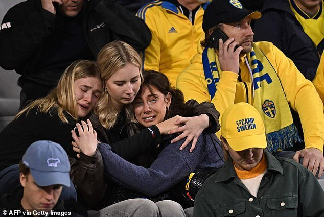
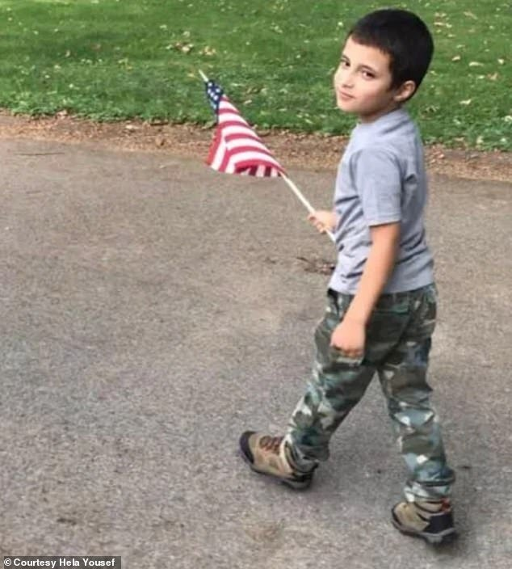

# 布鲁塞尔发生恐袭，两瑞典球迷被枪杀，欧预赛比利时VS瑞典被迫中止

当地时间10月16日晚，几位瑞典女球迷相拥着坐在比利时布鲁塞尔的博杜安国王体育场的看台上，看样子她们很悲伤，眼中噙着泪水。

倒也不是因为球队输掉了和比利时队的欧锦赛预选赛的比赛，事实上球队的输赢已经对她们来说不再重要了，就在比赛开始前，他们的老乡遭枪击身亡了……

报道称，事情发生在距离布鲁塞尔最著名的大广场以北几分钟路程的伊普尔大道上，枪手向一群身着瑞典队服的球迷们开枪。

事发之后比利时警方表示说，两名瑞典国民在布鲁塞尔被枪杀，比利时已将“恐怖警报”提升至最高级别。危机中心警告公众，不要前往首都进行任何不必要的旅行。此外法国也加强了对比利时边境的控制。

比利时首相亚历山大·德克罗在社交媒体平台X（原来的推特）上证实，遇难者是瑞典人，但没有透露具体人数。“在今晚瑞典公民于布鲁塞尔遭受惨痛的袭击后，我向瑞典首相表示诚挚哀悼。”“我们的心与失去亲人的家人和朋友同在。作为亲密伙伴，反恐斗争是一场共同的斗争。”

袭击者很快也“露面”了，他自称名叫阿卜杜萨利姆·阿尔·吉拉尼 (Abdesalem Al Guilani），在“脸书”上吹嘘自己制造了枪击事件。

吉拉尼用阿拉伯语写下了“庆祝报仇”的话，并表示称他是以极端组织“伊斯兰国”的名义，犯下如此惨无人道的罪行的。此外他声称，受害者的人数为三人，而不是被公布的二人。但据比利时方面的消息称，第三人是受了重伤，但没有殒命，此外还有其他人受伤了。

视频中的吉拉尼穿着橙色夹克，佩戴着黑色围巾，还戴着一顶黄颜色的棒球帽，警方证实他就是与袭击有关的人，目前仍在逍遥法外。

吉拉尼还声称，他之所以要向手无寸铁的瑞典球迷开枪，是为一名6岁的穆斯林男孩复仇，孩子在美国的伊利诺伊州芝加哥地区被房东刺杀。

男孩名叫瓦迪亚·阿尔法尤姆 (Wadea Al-Fayoume），他被71岁的房东约瑟夫·祖巴 (Joseph
Czuba）刺了26刀，很是悲惨地离开了人世。而她的母亲哈南·沙辛 (Hanaan Shahin）也身中了十几刀。

据法庭文件显示，祖巴因为目前的以巴冲突而变得偏执，并且认为他会因此受到伤害。

枪击发生之时，已经有很多的瑞典球迷入场了，当他们通过手机得到消息时，瞬间陷入了恐慌和悲伤之中。

随后比赛被取消了，但双方的球员还是出现在了绿茵场中，为遇难者默哀了一分钟。

据报道称，为了所有人的安全，虽然比赛取消了，但无论是球员还是球迷都被锁在了体育场内，等候下一步的安排。而如何让他们安全地撤离，现在已经成为了布鲁塞尔警方的首要任务。

