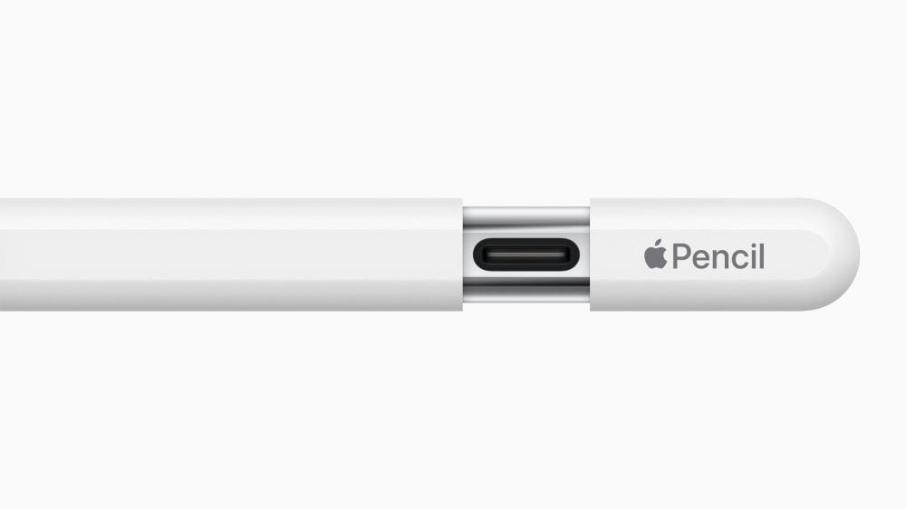
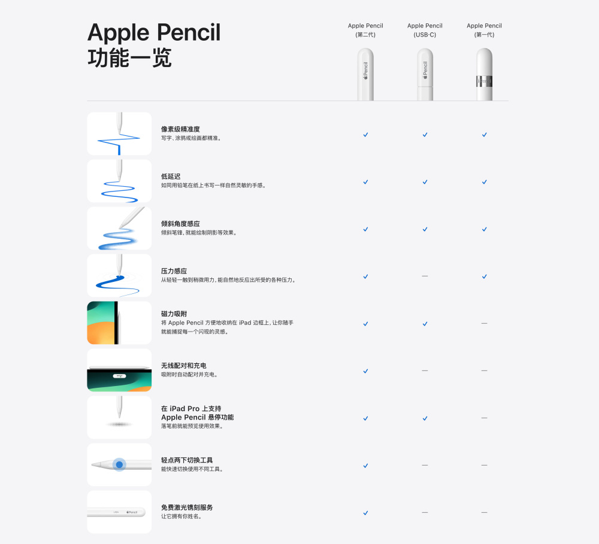
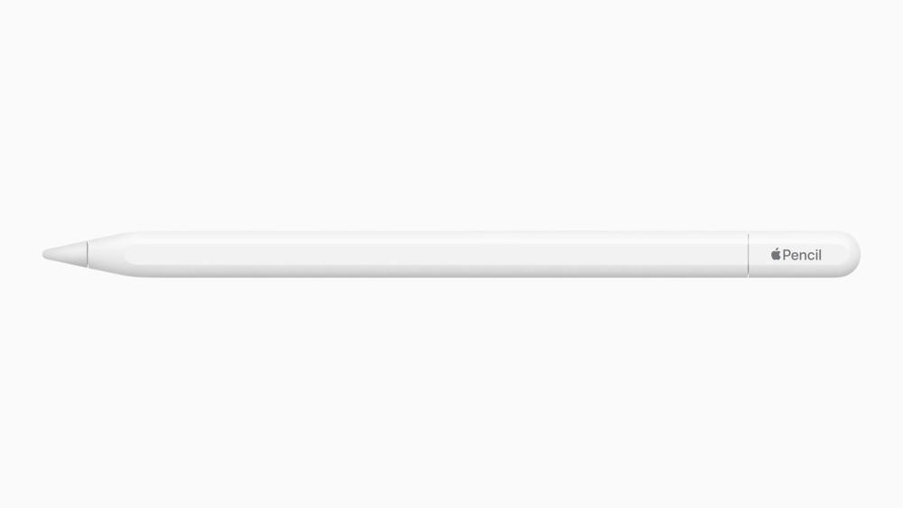

# 苹果发布新款Apple Pencil：加入USB-C接口，售价649元

腾讯数码讯 北京时间10月17日，苹果通过官网推出全新一代Apple Pencil（USB-C），它在原有二代的Apple
Pencil设计基础上，增加了一个滑动式的笔帽，内部藏有一个USB-C的接口，用户可以通过USB-C为新款 Apple Pencil 进行配对与充电。

Apple Pencil（USB-C）的定价为649元，除此之外，第一代和第二代的Apple Pencil依然在售，价格分别为799和999元。

新款Apple Pencil因为USB-C接口的加入，将不再支持磁吸充电，通过磁力吸附于iPad侧边时，新款Apple
Pencil将进入休眠状态以节省电量。

全新一代Apple Pencil整体的设计保持了和上一代高度一致，包括了哑光外观的设计，具有磁吸的平直侧边，以便于Apple
Pencil可以吸附在iPad上便于保存等等。

**其适用的机型包括：**

12.9 英寸 iPad Pro：第三代、第四代、第五代和第六代

11 英寸 iPad Pro：第一代、第二代、第三代和第四代

iPad Air：第四代和第五代

iPad mini：第六代

iPad：第十代

同时更新的还有第十代的iPad无线局域网 + 蜂窝网络机型，它将首次在中国大陆支持eSIM卡，其将于10月19日起接受预订，10月25日起正式发售。

