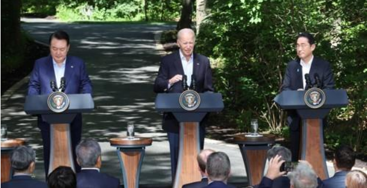

# 韩媒：韩美日设立危机协商热线，三国领导人可语音视频交流

【环球网报道 见习记者
姜蔼玲】据韩联社17日报道，韩国政府一名高官16日接受韩联社电话采访时透露，韩美日三国已设立国家安全委员会热线，并完成技术调试。三国领导人可通过该系统进行语音和视频交流。

报道称，该热线是根据今年8月在戴维营峰会上通过的一项名为“危机时协议”的公约而制定的。报道提到，在当时的记者会上，美国总统拜登表示“我们承诺将迅速相互协商，以应对威胁。这意味着在区域内发生危机时，我们将拥有一个共享信息、协调应对的热线。”

_图为当地时间8月18日，美国总统拜登在戴维营举行的韩美日三国会议共同记者会上发言。左起为韩国总统尹锡悦、美国总统拜登、日本首相岸田文雄。 图源：韩媒_

报道还提到，美国白宫国家安全委员会上周也向记者表示，他们正在努力改善美、中、俄三方之间的通信能力，以确保定期、及时、充分的语音和视讯沟通。

韩联社报道称，有分析认为，虽然三国热线的启动涉及到美国，但也意味着韩国和日本将就安全问题展开协商，这将成为韩日关系“迈向新里程碑的重要一步”。

此前，据韩媒报道今年8月15日，尹锡悦就在韩国光复节78周年庆祝仪式上，大谈韩美日合作重要性，声称日本已是同韩国共享普世价值、追求共同利益的伙伴。并表示，为从根本上消除朝鲜核导威胁，韩美日必须实时共享相关情报。被网友嘲讽道“（我们）选了个日本帝国主义总统”。

另据韩联社10月12日报道，美国海军核动力航母“罗纳德·里根”号当天上午停靠韩国釜山港。报道称，这艘航母将在朝鲜进行任何“挑衅”的情况下，强化韩国和美国的防御态势。对此，朝中社发文警告称，美国派遣核战略资产的示威性行动可能会让韩国感到稍微安心一些，但他们将痛切认识到，这只能成为进一步加剧他们的安保危机使其更加痛苦焦虑不安的恶果。

对于美日韩将同意加强安全方面的合作，8月18日，外交部发言人汪文斌主持例行记者会时表示，面对变乱交织的国际安全形势，各方应当秉持安全共同体理念，坚持真正的多边主义，协力应对各种安全挑战。任何国家都不应以牺牲他国安全利益，损害地区和平稳定为代价，谋求自身安全。亚太地区是和平发展的高地、合作发展的热土，绝不能再成为地缘争夺的决斗场。拼凑各种排他性小圈子、小集团，将阵营对抗和军事集团带入亚太的企图不得人心，势必招致地区国家的警惕和反对。

