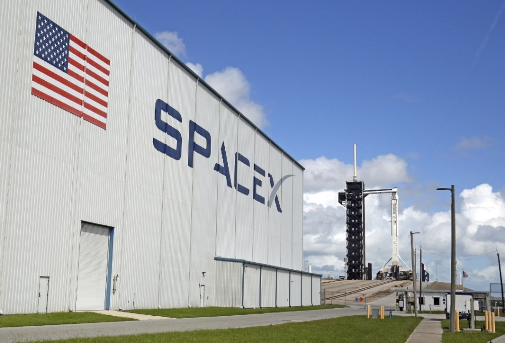

# SpaceX怒怼监管机构审核效率太低 试图阻止新载人航天安全规则出台

**划重点**

  * _1_ SpaceX正试图说服美国国会，将禁止对商业载人航天制定安全法规的禁令再延长几年，以支持创新。
  * _2_ SpaceX认为监管机构FAA的工作效率太低，并建议其多招募些人手。
  * _3_ SpaceX称其多个项目最近陷入内讧状态，互相争夺FAA的资源，这大大减缓了星舰计划的进展。

腾讯科技讯 10月18日，埃隆·马斯克(Elon
Musk)旗下火箭公司SpaceX计划于当地时间周三向国会提议，将禁止对商业载人航天制定安全法规的禁令再延长几年。同时，该公司也怒怼美国联邦航空管理局（FAA）工作效率低下，并建议其多招募些人手。

**极力说服国会，不需要新的载人航天安全规则**

SpaceX的一名高管计划在参议院小组委员会听证会上作证。他计划辩称，美国联邦航空管理局（FAA）已经在努力跟上快速变化的火箭发射行业的步伐，不需要额外出台新的载人航天安全规则。

此前，SpaceX负责建造和飞行可靠性事务的副总裁威廉·格斯滕迈尔（William
Gerstenmaier）在接受采访时也表示：“我们希望保持尽可能快的前进步伐，不想在不必要的地方被耽搁。”

格斯滕迈尔说，即使在传统的监管任务下，FAA也需要更多的工作人员来履行其监督职责。但他称：“他们（FAA）一直支持我们，我们只是认为他们被忽略了，我们将看到他们未来变得越来越忙！”

自2004年以来，FAA就未曾为载人往返太空的航天器制定过安全规则。搭乘商用航天工具前往太空的人是在“知情同意”的框架下参与飞行的，他们必须承认自己所乘坐的航天器没有得到政府的安全认证。

不过，那些支持这项禁令的人表示，商业航天行业仍处于“学习期”，过早的监管可能会扼杀创新。

这项实施了近20年的禁令原定于10月1日结束。然而，国会将禁令延长三个月至明年1月1日。此举原是为联邦政府提供资金的权宜之计，目前还不清楚届时是否会再次延期。

美国当地时间周三，参议院空间和科学小组委员会将举行听证会，讨论这一问题。亚马逊创始人杰夫·贝索斯（Jeff
Bezos）旗下蓝色起源公司和英国大亨理查德·布兰森（Richard Branson）的维珍银河公司代表，也将作为证人出席会议。

格斯滕迈尔说：“我认为，FAA的用意是好的，他们本应简化流程，但问题出在细节上，这实际上拖慢了我们的脚步。”

今年7月，FAA宣布计划成立一个规则制定委员会，以确定潜在的新安全标准，这些标准可能会在禁令结束后实施。规则制定委员会计划从航天行业领域收集制定安全标准的建议。

然而，该公司更愿意在FAA就可能的监管进行辩论的同时延长禁令，毕竟知情同意框架已经赋予该机构在发生重大事故时介入的能力。格斯滕迈尔说：“在当今世界，FAA已经拥有足够大的权力！”

**怒怼FAA工作效率低下 致自家多个项目互争资源**

SpaceX还计划在周三就如何提高FAA的工作效率提出建议。例如，SpaceX不得不等待FAA结束对其星舰首次试飞的事故调查，然后才能重新申请发射运载火箭的许可证。格斯滕迈尔说，这些事情同时进行可能会更好。

据SpaceX称，最近几个月，该公司的多个项目进入内讧状态，都希望尽快通过FAA的审查。这大大减缓了星舰计划的进展，并使美国宇航局（NASA）阿尔忒弥斯重返月球计划中的人类着陆系统开发处于危险之中。高管们表示，随着世界其他地方太空项目的兴起，低效的监管正在降低美国的竞争力。

SpaceX今年将发射大约90枚火箭，主要是利用猎鹰9号火箭助推器在佛罗里达州发射。明年，该公司的目标是将发射次数提高约50%。同时，还有联合发射联盟公司（ULA）的火神火箭、蓝色起源的新格伦号火箭以及其他即将上线的小型火箭。此外，维珍银河也提高了飞行频率，蓝色起源的新谢泼德号亚轨道旅游火箭也将重返太空，高空气球飞行也将成为可能。

SpaceX的高管表示：“明年可能是非常忙碌的年份，有很多航天领域的供应商。我们担心的是，即使在今天，猎鹰火箭和龙飞船有时也会与星舰争夺FAA的资源，而FAA无法同时处理这三个项目，更不用说明年。我们认为，FAA似乎还没有为此做好准备。”

在周三的听证会上，格斯滕迈尔可能会建议FAA将其商业太空运输办公室下属许可部门的员工人数增加一倍。此外，FAA应该获得“加速招聘权”，从最优秀的求职者中挑选人才。

SpaceX的高管列举了最近的几个例子，由于FAA的工作积压，该公司不得不推迟工作或修改计划。例如，该公司从范登堡太空部队基地发射的猎鹰9号火箭有时会飞越贾拉马海滩，这是加州太空港的正南。SpaceX始终在根据飞行路径和解体分析进行计算，以确定海滩是否需要关闭。但由于这项工作将直接与FAA星舰分析并行，SpaceX不得不暂停了贾拉马海滩的审查申请，并试图在海滩空无一人的时候利用夜间窗口发射。

SpaceX及其创始人马斯克过去曾敦促美国政府更多通融。例如，大约五年前，该公司向美国空军提供了大量数据，以说服其接受自动飞行终止系统。本质上，火箭的机载计算机将在出现问题时感知并自毁，而不是依赖于发射靶场的指挥。该系统现已被广泛采用，并将很快成为美国火箭的强制性组件。

在证词中，格斯滕迈尔将敦促国会让FAA优先考虑攸关国家利益的项目，其中包括星舰的开发活动，NASA希望在2030年之前将人类送上月球。目前，所有申请许可程序都是一样的，阿尔忒弥斯项目也没有加速审查的优待。

SpaceX的高管表示，由于星际的审查程序缓慢，他们正在浪费时间。星舰第二次飞行的火箭已经准备好了一段时间，但它可能还需要等待至少两周才能完成监管审查。该公司担心，类似的冗长审查将来可能会导致无数次试飞推迟，而这些试飞需要证明星舰的可行性、加油能力和安全着陆月球的能力。虽然登陆月球的阿尔忒弥斯3号任务并没有因此而数次推迟，但监管问题正在产生负面影响。
（文/金鹿）

