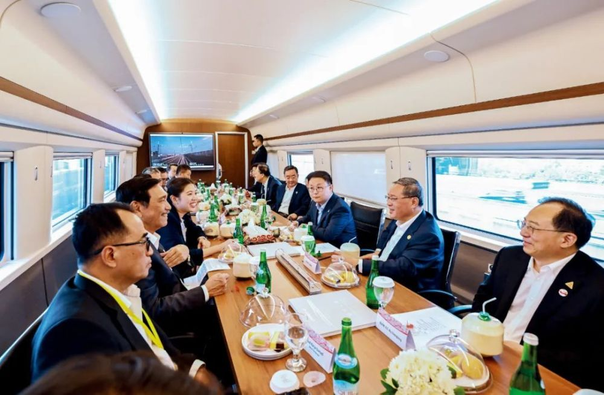

# 三个月内，印尼总统佐科为何两度访问中国

距离印度尼西亚总统府独立宫不到800米，印尼国家博物馆新馆大楼顶层，是不允许游客拍照的“珍宝区”。在一排排中国古代海运瓷器面前，雅加达文化遗产协会的志愿者讲解员向《中国新闻周刊》记者询问“郑和”的发音。

公元1405年到1433年，郑和七下西洋，其间多次到访印尼。今天，在印尼中爪哇省首府和最大的商港三宝垄，纪念郑和的“三保大人”像巡游活动是当地最隆重的节日之一。

六百多年后，中国到印尼的海路更加繁忙。最近十年，来自中国的钢轨、龙门吊、架梁机、动车组漂洋过海到达印尼，为建造港口、公路以及东南亚第一条高速铁路提供物资保障。

与此同时，曾受到殖民的印尼也深受欧美、日韩等其他文化的影响。年轻人追捧韩流，雅加达街头的富人区密布日料店，欧美政府的投资推介会一场接一场地在高档酒店里展开。印尼主流智库哈比比中心主席安瓦尔在接受《中国新闻周刊》采访时指出，从古至今，印尼和东南亚地处全球地理交通和文化交融的中心，同时也处于当前大国竞争的中心。

在此背景下，2014年就任印尼总统的佐科采取“对冲+”策略，试图同时密切和各个大国的双边关系。叠加1997年金融危机、2013年“一带一路”倡议提出以来中国和东盟各国越走越近的“大势”，中印尼关系在过去十年取得长足发展，被学界誉为“黄金时期”。

10月16日，印尼总统佐科乘专机抵达北京，对中国进行国事访问并出席第三届“一带一路”国际合作高峰论坛。这是佐科三个月内第二次访问中国。去年7月，佐科成为北京冬奥会后首位访华的外国元首，中国也是他在新冠疫情后首次东亚之行的首站。今年7月下旬，佐科飞抵成都，访华出席第31届世界大学生夏季运动会开幕式。

**大势所趋**

2014年，外交经验缺乏的梭罗市长佐科，凭借着“平民革命”的旋风当选印尼总统。当时的分析多认为，这位做过家具目测生意、接近“政治素人”的新总统将是一位“内向型”领导人，对于外交战略难有清晰的把控。

这一度引发了印尼及其周边国家的担忧。位于雅加达的希望之光大学（UPH）社会和政治科学院院长阿列克修斯·杰马杜告诉《中国新闻周刊》，作为总统制国家，印尼的外交决策和总统个人的执政风格有很大关系。

1967年，印尼成为东盟创始成员国。上世纪70年代到80年代，苏哈托执政时期的印尼逐渐被视为东盟的“非正式领导者”。佐科上台时，印尼是东盟人口和经济体量第一大国，也是东盟成员国中唯一的二十国集团（G20）成员。

在佐科就任总统的前一年，中国和印尼刚刚升级全面战略伙伴关系。2013年10月，国家主席习近平在印尼首次提出共建“21世纪海上丝绸之路”倡议。另一边，美国于2011年加入东亚峰会，奥巴马政府尝试在“亚太再平衡”战略下强化和印尼及东盟主要国家的合作。

_9月6日下午，正在印度尼西亚访问的国务院总理李强考察中印尼合作项目雅万高铁。印尼对华合作牵头人、统筹部长卢胡特，交通部长布迪陪同考察。图/新华_

面对全球和地区环境的新变化，印尼国内以及东盟都期待印尼能有一位“视野够远”的领导者。佐科上台后第一时间发布“全球海洋支点”战略，一定程度上打消了外界的担忧。在2023年度国情咨文中，佐科重申自己重视国际和地区事务的逻辑：一方面，要着力推动印尼本土的经济发展；另一方面，国际合作是经济增长的关键。

“佐科倾向于用经济相互依存的逻辑来看待本区域。”杰马杜说，本质上这和佐科实用主义的政治理念相符合。佐科希望通过国际合作的方式全方位改善印尼基础设施，同时指出“以当前印尼有限的资源及军事能力，采用‘从实力出发’等逻辑只会弄巧成拙，不仅影响印尼的地区大国地位，还会破坏东盟的团结稳定”。

佐科的“全球海洋支点”战略是理解这种实用主义的一个典型案例。作为世界上最大的群岛国，印尼素来有成为海洋强国的愿望，印尼语“祖国”的字面意思就是“陆地和水”。但是，限于发展水平，历届政府的优先事项都是人口稠密的岛屿，也就是“陆地”。

加强印度尼西亚的海洋地位，是佐科2014年的竞选承诺。当年10月宣誓就职后，佐科提出将印尼打造成“全球海洋支点”。2017年，他进一步提出全面的海洋强国政策，包含7个支柱、76项细分战略，最终目标是建成“先进、独立、强大的海洋国家”。

但在实践中，佐科的海洋战略并不涉足“海洋争霸”。国内层面，他借海洋强国战略，组建了全新的投资统筹部，组合海事和渔业部、交通部、能源和矿产资源部、旅游部等涉海部门，解决了印尼政府长期没有海洋综合管理机构、分权效率低下的痼疾。国际层面，“全球海洋支点”战略与中国“一带一路”倡议对接，最终指向基础设施建设，投资统筹部部长卢胡特也成为中印尼政府间合作的印尼方牵头人。

除了个人执政风格，佐科能推动中印尼合作，也与其所面对的内外部环境有关。安瓦尔坦言，在印尼推动和中国的合作，不能不受到曲折的历史因素的影响。另一方面，大规模举债进行基础设施建设，在总体贫穷的印尼，也会激起不同的声音。一位中资机构负责人对《中国新闻周刊》形容道，这就像“政治家看到了远方的桅杆，但老百姓并不知道那是什么、会给自己带来什么”。

佐科执政时期，中印尼双边关系正常化进入第三个十年。有印尼华人对《中国新闻周刊》介绍，虽然外岛仍有一些华人和其他族群关系紧张的问题，但雅加达及爪哇岛上“已基本没有问题”。另一方面，印尼正进入独立以来前所未有的和平稳定时期。

2005年，延续近二十年的亚齐省分离主义冲突得以和平解决。2011年，东帝汶在印尼担任东盟轮值主席国期间首次提出入盟申请，两国关系显著改善。诸多因素叠加，佐科推动中印尼合作，在国内受到的阻力比他的前任们“小很多”。

“如果我们将视野放得更宽，还会发现中印尼关系、中国-
东盟关系越来越密切，是上世纪90年代末以来的大势。”安瓦尔指出。1997年席卷东南亚的金融危机，导致印尼盾同美元比价跌破10000∶1。其间，国际货币基金组织（IMF）的救济措施未能生效，深受东盟各国期待的亚太经合组织（APEC）也未能发挥作用。

危机对东盟影响深远，东南亚经济“几乎腰斩”。一些印尼年轻人对《中国新闻周刊》介绍称，雅加达中产家庭“一夜返贫”，让他们对西方国家天然产生了一种疏离感。政策层面上，这场危机至今仍在塑造东盟的“避险”政策倾向。

上世纪90年代末担任印尼外交部国务部长的安瓦尔介绍，加强同东亚国家特别是同中国的合作，就是一种“避险”选择。东盟原本是冷战意识形态对抗下组建的区域组织，中国1996年获得对话伙伴地位。但中国政府在危机中采取有力举措后，2001年到2007年，中国-
东盟贸易额每年增长20％以上，中国迅速成为东盟第一大贸易伙伴。

**相互依存**

如果说1997年金融危机促成了中国和东盟各国的第一次“走近”，那么2013年中方提出共建“海上丝绸之路”的倡议，成为双方步入合作新阶段的起点。印尼战略与国际问题研究中心经济部主任法热哈·赫拉万甚至认为，“一带一路”倡议的提出，是“中印尼关系史上的里程碑”。

印尼智库战略与国际研究中心的报告指出，中国“一带一路”倡议提出，恰逢全球化的又一次“至暗时刻”：美国正在放弃多边机制，世贸组织多哈回合谈判没有进展，全球化陷入停滞。在此背景下，东盟各国“将‘一带一路’倡议视为全球经济一体化的创造性新途径”。

与“一带一路”倡议同时问世的，还有东盟的互联互通总体规划。前述报告指出，东盟和中国在发展路径上的同步，使得“双方可以坐下来一起讨论结合两项倡议，而非让其中一项凌驾于另一项之上，或相互妨碍”。对于恐惧“大国影响力”的东盟而言，这是促成合作的最佳机遇。

就印尼自身而言，赫拉万指出，“一带一路”倡议以发展基础设施为核心的原则，与印尼缩小基础设施差距的愿望相契合。基础设施建设也由此成为过去十年中印尼经济伙伴关系的核心，由此带动了两国民间经贸往来的增长。

“在中国企业走出去的过程中，国企承担的大项目肯定要冲在前面。”一位在印尼的中资机构负责人也对《中国新闻周刊》表示，“当国企打开局面，民营资本看到机遇，就会带动更大规模的投资。从这个意义上说，雅万高铁这样的项目，不仅是让印尼看到了中国的实力，也让更多中国企业了解了印尼。”

数据显示，过去十年，中国始终是印尼第一大贸易伙伴，2022年中印尼双边贸易额达1490.9亿美元，同比增长19.8％；中企在印尼工程承包合同金额2022年超过140亿美元。

值得注意的是，在全球基础设施投资建设领域的议程与规则设定上，中印尼双方也尝试发挥更大的作用。除了共同推动基础设施投资成为G20的重要议程，双方也在国际货币基金组织与世界银行等机构改革中相互支持。印尼成为亚洲基础设施投资银行的创始成员国，中国则支持印尼推动《区域全面经济伙伴关系协定》（RCEP）谈判，让这个东盟主导的区域经济合作框架“逆向”扩张到东亚主要国家。学界认为，这“呈现出传统概念上的边缘反向驱动中心国家复苏的独特路径”。

研究显示，RCEP生效后，成员国之间90％以上的商品贸易最终实现零关税，东盟宏观经济层面相对受益最大，东盟整体国内生产总值（GDP）累计增长率在2035年将因RCEP的生效增加4.47％。

“过去十年，两国关系最显著的发展，概括言之，就是从理念上的‘相互依存’走向了实质性的‘相互依存’。”杰马杜对《中国新闻周刊》说。对于印尼领导东盟加速与中国合作的看法，他认为，“印尼在东盟的领导地位之所以稳定，一定程度上是因为印尼站在了所有东盟成员国共同利益的角度上”。

不过，印尼国家研究与创新署研究员尤尼亚托指出，中印尼社会存在意识形态差异，而双方在过去十年的关系发展多基于国家间高层政府达成的协议，民间人文交流领域有限、深度不足、社会影响力较弱。最近两次总统选举中，对华友好都成为反对派攻击佐科的话题。

“自上而下地发展中印尼关系是正确的选择，但未来我们需要确保印尼民众更多参与进来。”杰马杜说，让印尼年轻人感受到中国文化、感受到就业机会增多、感受到科技生活，才能从社会基础上增强双边互信。

**“避免冲突”**

从9月5日到9月7日，第43届东盟峰会期间，印尼总统佐科反复强调的话题是“避免冲突”。他在开幕式上说：“我们都有责任不制造新的冲突、新的紧张局势、新的战争，同时我们也有责任减少紧张局势。”到了闭幕式，他再次强调冲突和紧张局势可能会“毁灭世界”。

中国国务院总理李强在中国-
东盟领导人会议上表示，中国愿与东盟一道推动落实全球安全倡议，防止“新冷战”、零和博弈等思维对发展合作的侵蚀和冲击，合力应对各类传统、非传统安全挑战。中国坚定不移走和平发展道路，愿同东盟国家积极推进“南海行为准则”案文磋商，为把南海建设成和平之海、友谊之海、合作之海提供制度保障。

和李强、佐科的发言不同，出席峰会的美国副总统哈里斯在多次会晤中将矛头指向中国，强调美国“反对单方面改变南海现状”。对此，中国外交部发言人毛宁9月7日表示，美方有关做法蓄意偏离会议主题，破坏合作气氛，同地区人民意愿背道而驰，“充分暴露了美方是东亚合作和地区稳定的搅局者、破坏者的真面目”。

事实上，这已经是美国高层最近一个月第二次在南海事务上攻击中国。8月24日，印尼国防部长普拉博沃和美国国防部长奥斯汀在华盛顿举行会晤。会后，美方发布的“联合新闻声明”指名攻击中国在南海的“扩张性海洋主张”违反国际法。而印尼政府随后对中方“澄清”称，美方发布的消息“和事实不符”。

分析认为，近年来，美国将对华遏制战略的地理范围从“亚太”扩大到“印太”，而东南亚正处于亚太地区和印度洋国家之间，太平洋和印度洋在地理上通过印尼领海相连。于是，印尼成为美国印太战略的焦点之一。

早在奥巴马政府时期，美国通过建立“湄公河之友”机制，将韩国、澳大利亚、新西兰、欧盟等盟友纳入东南亚的多边框架内，以应对中国推动的“澜湄合作”。但特朗普执政时期，美国在东南亚的影响力收缩，美国总统不再出席东亚峰会，驻东盟各国大使也长期缺位。

拜登政府上台后迅速纠正特朗普政府的“错误”，并将升级对印尼关系作为重心之一。2021年8月，美国-
印尼首次战略对话启动，两国军方随后举行了史上最大规模的联合军事演习。同月，美国副总统哈里斯访问新加坡和越南，是美国副总统50多年来首次到访南海周边国家。2022年，第二届东盟-
美国特别峰会在华盛顿举行，印尼、泰国随后正式参加拜登政府发起的“印太经济框架”（IPEF），美国媒体称，拜登政府重返东南亚取得“阶段性胜利”。

除美国外，其他周边主要国家也加强了同印尼、东盟的接触。2018年，印度总理莫迪在前往新加坡出席香格里拉对话会前访问雅加达，主动表态愿意加强和印尼的关系，将此作为印度“东进政策”的一部分。今年9月，日本首相岸田文雄和东盟各国就建设全面战略伙伴关系达成共识。

哈比比中心主席安瓦尔认为，面对西方国家的拉拢，印尼采取了“对冲+”战略，即并不与之保持距离，而是加强和美国的安全及防务合作，在中美之间形成“动态平衡”，同时为印尼自身争取利益最大化。印尼还希望扮演“中等强国”在大国之间的调停者角色，2022年中美领导人在巴厘岛实现疫情以来首次线下会晤，被印尼舆论视为佐科的一大“外交政绩”。

同样身为印尼国际关系专家的杰马杜也指出，通过和中美都保持密切关系来维持平衡，是一种“理想情况”。“我们不会为了和一方的合作去牺牲和另一方的关系，但有时这并不容易取得平衡。”

印尼及东盟各国面对“印太”概念的接受过程，就是一个例证。近年来，美方一直推动其亚太及南亚合作伙伴接纳“印太”概念，以对接美方主要针对中国提出的印太战略。日本、韩国、澳大利亚等美国盟友都据此调整了自己的外交及安全战略。

2019年东盟峰会期间，印尼带头发起协商《东盟印太展望》。但在这份文件中，东盟各国一方面没有放弃“亚太”概念，一方面提出“亚印”（亚洲的印度洋）的新概念，试图在中美之间寻找中立空间。同时，佐科用“开放、包容、共同繁荣”描述“印太”，而不采用美国政府提出的“自由开放”等词汇。分析认为，这是印尼试图以合作、包容的理念改造美方提出的排他性、针对性的“印太”概念。

然而，虽然东盟各国做出诸多努力，“印太”概念还是正式进入了东盟官方文件。今年第43届东盟峰会特别邀请了环印度洋国家联盟（IORA）主席国孟加拉国和太平洋岛国论坛（PIF）主席国库克群岛出席。而印尼外交部长勒特诺对此的解释是：“当我们谈论印太时，我们必须开始拥抱南太平洋地区和环印度洋地区。”

在各个具体政策领域，东盟各国对中国、美国有“亲疏远近”之分。安瓦尔就认为“柬埔寨整体上更偏向中国，菲律宾整体上更偏向美国”。但在一些具体问题上，印尼政府的表现没有那么“中立”。

中国社会科学院学部委员张蕴岭曾撰文指出，尽管中国与印尼在南海划界上基本没有争端，仅在捕鱼区范围上存有争议，但印尼对中国在南海地区实力的快速提升，有着很强的战略疑虑与警惕。美国、日本等以“自由航行”“遵守国际法”为旗号压制中国，在这一点上，印尼与美国、日本等有着认知与行动上的一致。中国与印尼虽然建立了全面战略伙伴关系，但在战略信任上仍存在一定的缺位。

_2022年11月11日，执行“和谐使命-2022”任务的中国海军“和平方舟”号医院船在印尼雅加达展开友好访问。图/视觉中国_

不过，这并不意味着印尼及东盟在未来可能更倾向美国及其盟友。杰马杜坦言，印尼和西方国家间的互信也极其脆弱。除了1997年亚洲金融危机引发的普遍性“对美不满”情绪外，印尼和美国在亚太地区的重要盟友澳大利亚，虽然在外交、安全事务上合作密切，但也存在东帝汶问题等历史“积怨”。2013年，印尼曾召回驻澳大利亚大使。2017年，因赴澳受训的印尼军官发现教材对印尼不敬，印尼政府暂停了两国军事合作。

此外，美国的印太战略有违印尼及东盟的整体战略目标。就具体政策而言，美国、英国、澳大利亚组建的军事联盟框架“奥库斯”（AUKUS），就和东盟长期追求的东南亚地区无核化目标相矛盾。早在1995年，东盟各国就通过《东南亚无核武器区条约》，但除中国外，世界主要有核国家都尚未加入该条约，而AUKUS的签署进一步引发了东盟对核武器进入“腹地”的担忧。印尼政府第一时间对此发表声明，要求澳大利亚遵守核不扩散义务及“对地区和平、稳定和安全做出的承诺”。

就宏观战略而言，美国期待通过印太战略及AUKUS、IPEF等“小多边”机制，最终形成美国主导的印太新秩序。东盟则担忧，小多边机制将使东盟在东南亚地区的“东盟中心地位”遭到挑战。

近年来，西方学者多诟病东盟机制“低效”，主张印尼等东盟主要国家“作为崛起中的大国，应超越东盟机制”。不过，杰马杜指出，印尼确实需要合作网络的多元化，但东盟永远是最重要的平台。“因为对印尼等国来说，东盟是‘近邻的联盟’。”

“一方面，涉及反恐、打击人口贩运等周边事务的问题，只能依靠东盟来解决。而且为了解决这些问题，还要进一步强化东盟‘作为一个整体’的能力。另一方面，东盟确实有很多问题，但最关键的是，这是唯一一个可以让所有东南亚国家坐在一起的平台。如果没有这个中立的区域实体，东南亚的情况就会像今天的欧洲一样。”杰马杜说，“为了和平、相互信任和相互尊重，东南亚需要东盟。”

发于2023.9.18总第1109期《中国新闻周刊》杂志

杂志标题：中印尼关系的“黄金十年”

记者：曹然

