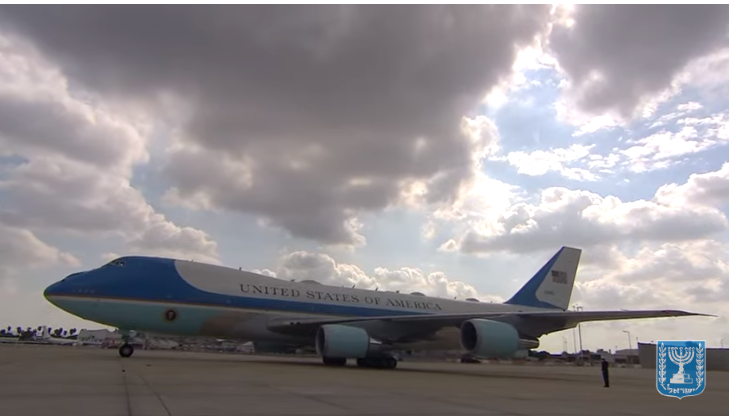
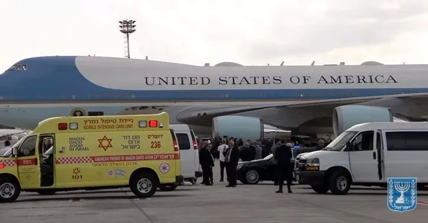
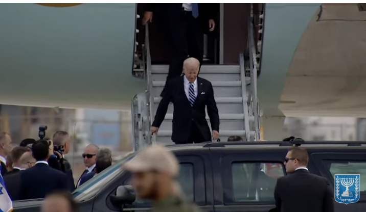
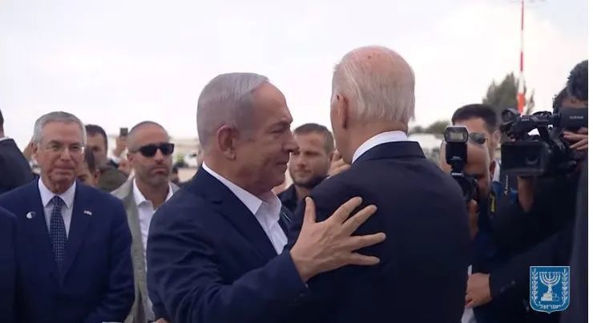
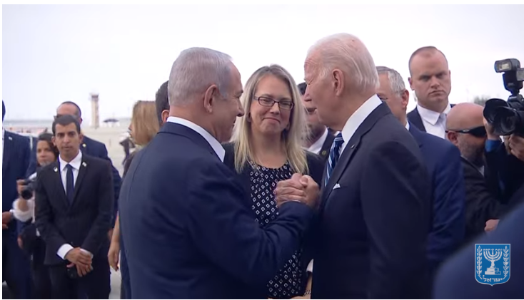

# 以媒：拜登抵达以色列特拉维夫，以色列总理拥抱迎接

《以色列时报》18日刚刚发布的直播画面显示，美国总统拜登乘坐的专机抵达以色列特拉维夫。

_《以色列时报》直播画面显示，拜登乘坐的专机抵达以色列特拉维夫本-古里安国际机场_

 _画面显示，以色列总理内塔尼亚胡在机场迎接拜登。图源《以色列时报》直播画面_

以色列酝酿对加沙地带的巴勒斯坦伊斯兰抵抗运动（哈马斯）采取大规模地面进攻之际，一周内两次访问以色列的美国国务卿布林肯17日凌晨在特拉维夫宣布，美总统拜登将于18日访问以色列，以示对以色列的支持。不过，多家美媒并不看好拜登此行，认为其风险太大，容易“引火烧身”。17日，以军坦克在与加沙交界地带就位，等待政府为地面攻势“开绿灯”。与此同时，本轮巴以冲突“第二条战线”上的交火越发猛烈。黎巴嫩方面17日称，以色列在对黎以临时边界黎方一侧的袭击中“使用白磷弹”。伊朗方面警告称，如果以色列“继续犯下战争罪行”，冲突地区“将出现其他战线”。

