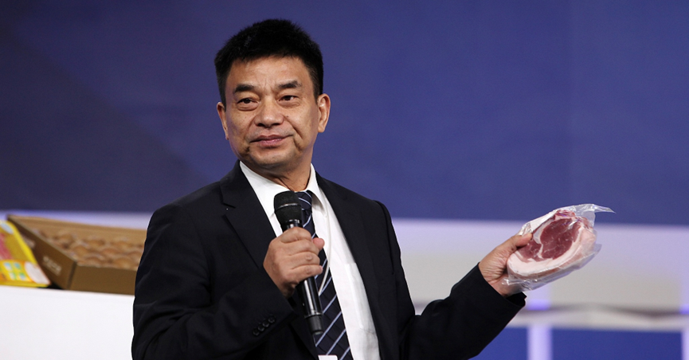
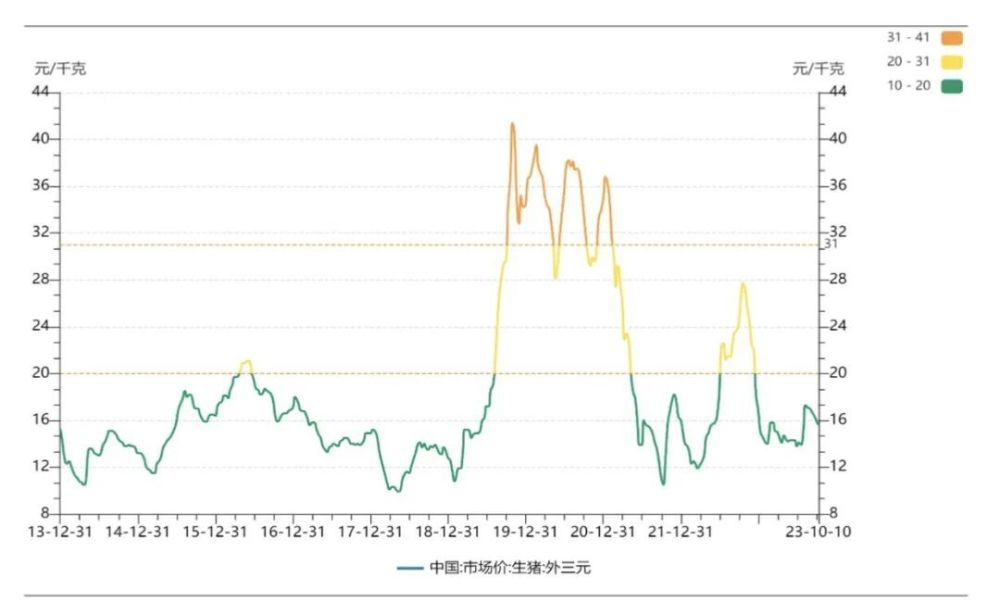
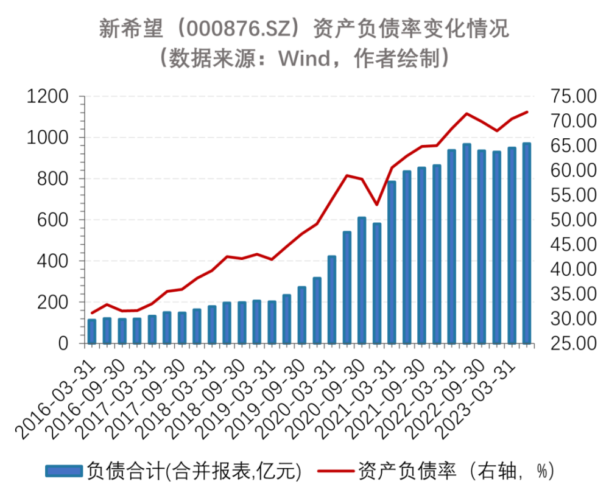

# 家族财富跌去700亿，前首富“资本运作式”养猪，如今赔钱卖猪肉

_图源：视觉中国_

作者 | 温世君

编辑 | 陈弗也

出品 | 棱镜·腾讯小满工作室

猪价低迷，猪周期持续，股市也在用真金白银投票。

截止10月18日开盘，新希望（000876.SZ）已连续19个交易日，处于主力资金净流出的状态。8月以来，只有两个交易日为净流入，累计出逃资金超过7亿元。

股价自然也缺乏支撑。新希望总市值跌至475亿元附近。相较于2020年9月，上一轮猪周期时创下的1775.8亿元的高峰，市值缩水超1300亿。

以2023年中报数据看，刘永好、李巍、刘畅家族控制的南方希望、新希望集团分别持有上市公司新希望29.28%和24.90%的流通股（后者17.29%流通股在2023年上半年划到“23希望E1担保及信托财产专户”）。

这意味着，三年多的时间，这部分刘氏家族控制的股权，跌去了近702亿元。

在新华网今年9月8日发布的一篇专访中，20多年前就已经问鼎中国首富的刘永好认为，自己成功的关键是“抓住了时代的机遇”，每一步都踩住时代的“鼓点”。

但猪周期的“鼓点”在哪里？

8月25日，刘永好在亚布力论坛谈到，（猪价）还在相对的底部，7、8月开始价格在稳步回升。他说，一直亏下去的可能性不大，一直很高价也不可能，最后一定会走向平衡。

市场无情，关关难过。在猪周期这一关面前，这位72岁的资深民营企业家，给了一个非常“中庸”而且语气并不是那么自信的答案。

**猪周期高位，超1000家地产公司跨界养猪**

什么是猪周期？生猪养殖产业较为分散，且育仔、育肥本身需要时间周期，在资本逐利驱动力之下，市场因此存在一个“猪肉价高—行业集中增产—生猪供应增加—肉价下跌—行业开始去产能—生猪供应减少—肉价上涨”的猪周期。

猪价还是货币等宏观政策的标尺。按照目前国内CPI的核算方式，猪肉价格对测算指标有不小的影响。猪肉价格关乎民生，价格长期处于高位，政策干预力度往往比较明显，对于经营者而言同样也是影响经营业绩的重要因素。

_图：近十年国内生猪（外三元）价格走势 数据来源：Wind，作者绘制_

特别是2019年-2020年，猪价迅速攀升并持续处于高位，不仅农牧行业公司集中扩产，跨界养猪也开始盛行：阿里提出要实现“AI养猪”，京东“全球首创”猪脸识别。2020年中，中国11家企业入选2020年全球10万头母猪企业排行榜，这个榜单上共有34家企业。

国家发改委价格成本调查中心研究显示，长期以来，在我国生猪养殖成本中，饲料成本占比最大约56%，其次是仔猪成本约占23%左右。

“饲料大王”新希望的扩产，理所当然。

2020年9月24日，已经接任上市公司新希望董事长的刘畅参加了当天的投资者交流会，刘永好也线上接入，亲自回答问题。

刘永好表态，“我们的养猪战略是集团的一号工程，这是我们集团上上下下全都一致公认的”。

刘畅在这场交流会做出来了一个“猪地产”的判断：“发展养猪最前端环节的工作就像是一个房地产业务，是一个‘猪地产’，从拿地到工程，从标准的建设，从验收这一系列都是房地产干的事情……”

新希望财务数据随之高歌猛进：

到2020三季度末，存货增加了88亿元，增幅94%，主要是“猪产业的消耗性生物资产增加”；固定资产增长76亿，增幅55%，主要是“猪产业的固定资产投入增加比较多，竣工猪场增加比较多”；在建工程增加49亿，增幅是104%，“前三季度大力发展猪养殖产业，新建猪场比较多，在建产能大幅度增长”。

在2020
年11月股东大会的现场交流环节，时任公司董事会秘书的胡吉又谈及了“一号工程”的蓝图：“公司今年800万头的出栏目标，明年确保2500万头出栏力争3000万头出栏，后年4000万头出栏，完成的确定性是非常高的。因为公司从土地、资金、人才、种猪各方面的储备很充分，完全能够覆盖和支撑公司现在的出栏规划。”

也是在这年的11月，刘永好在中国畜牧业高质量发展论坛暨首届生猪产业峰会上说：“过去一年多的时间，仅从房地产过来跨界养猪的企业就超过1000家”。

当人人都在谈论股市的时候，市场已经过热。当地产都去做猪地产，猪价已是强弩之末。

但刘永好的“一号工程”已经没有回头箭。

**加杠杆易，降杠杆难，如今负债近千亿**

当产业竞争变成了跑马圈地，当养猪变成“猪地产”，资本就成了关键要素。

在刘永好“一号工程”的冲锋号下，新希望时隔多年之后（上一次是2016年），重启发债。数据显示，2020、2021两年，新希望发行各类债券6只，累计规模181.5亿元。

其他类型债务也在扩张。财报显示，新希望长期借款项目，从2019年末的不足50亿元，迅速在2021年末达到327.12亿元。

但就是在2021年，猪价再次下探到谷底。

这一年，新希望自1998年上市以来，首次出现全年业绩亏损：全年归母净利润亏损 95.9 亿。主要亏损在养猪上：2021
年，饲料产业依然为新希望贡献了16.5 亿的利润，但猪产业的亏损却达到了111.5 亿。

2022年，猪价短期上探，但生猪（外三元）价格依然没能回到30元/千克以上的高位，亏损有所收敛。全年归母净利润亏损14.6 亿元，其中猪产业亏损 24.6
亿。

2023年，整个行业之前积累的产能到了集中释放的时间，猪价继续低迷。但无论是新希望，还是整个行业，之前扩张的资金债务成本，还是繁育、育肥的成本，不会在这么短的时间有什么变化。

2023年上半年，新希望归母净利润亏损29.8 亿元，其中猪产业贡献了 33.8 亿元的亏损。

8月 30 日，副总裁兼财务总监陈兴垚在一场线上调研交流会上给出了非常具体的数据：“（2023年上半年）整体出栏量近 900 万头，同比增长超
30%，在运营场线的出栏肥猪在二季度的成本 16.6 元/公斤，一季度是 17.4 元/公斤，7 月已经降到 16.3 元/公斤。”

“今年上半年猪价14多元/公斤，处于低位，全行业都出现亏损。” 陈兴垚补充。

也就是说，新希望上半年卖出的这900万头猪，都是在赔钱出货。

亏损侵蚀资产，债务却日积月累，随之攀升的是上市公司的债务压力。新希望资产负债率，从2017年6月末的35.49%，上升到2023年6月末的71.79%，负债合计970.16亿元。

加杠杆易，降杠杆难。

2023 年 5 月 22
日，在执行董事长兼总裁张明贵到场的一次投资者接待活动中，新希望管理层明确表示，“公司未来不会再去过多加杠杆”，并提出了一个降杠杆的目标：“2023
年底，预计控制在 65%以内。”

但到了7月，在董事会秘书兼首席战略投资官兰佳牵头的面向投资者的路演活动中，说法有所不同：“资产负债率我们做了大致的测算，今年猪价一直低迷的话，最高也就是70-75%，不太会突破更高，猪价悲观一点的话就在
73-74%左右。”

市场压力下，这一目标很快缩了水。

如何降杠杆？管理层提出了引入战略投资者的思路，但谁会出手接盘？

**资本运作老玩家，拉来国资一起接盘**

实际上，此前新希望已经在出售猪产业狂飙时的资产。

2022年12月、2023年4月新希望先后发布关联交易公告，向参股40%的公司成都天府兴新鑫农牧科技有限公司出售川渝地区18个养猪场项目（包括在建猪场）公司，合计交易金额22.43亿元。

从时间点的选择来看，颇有优化财报数据方面的考量。

而持有成都天府兴新鑫农牧科技有限公司60%股权的大股东，穿透而言，是成都市国有资产监督管理委员会。

_图：成都天府兴新鑫农牧科技有限公司实控人为成都国资委 数据来源：国家企业信用信息公示系统，作者绘图_

据界面新闻采访新希望内部一位管理人员，目前新希望还在山东、河北寻求与当地国企合作，预计出售40-50亿元猪场资产。

对于相对抗周期的国资而言，在周期底部将资产收入囊中，也算是一个“双赢”的选择。而对于新希望和刘永好而言，站在周期的底部，“活下去”才是唯一的路。何况，这样的资本运作，对他本就是轻车熟路。

回到1990年代，刘永好可谓是那个年代民营企业的“第一”标杆人物：当选全国政协委员，在人民大会堂做“私营企业有希望”发言；当选首位民营企业家背景的全国工商联副主席，参与推动成立民生银行，并出任副董事长；作为中国民营企业家的代表，赴瑞士参加达沃斯论坛年会。

1998年春天，就在刘永好从瑞士回来后不久，新希望在深交所上市，成为中国农牧民营企业第一股。

其中有一个很容易让市场忽视的事实是：虽然刘永好自己，乃至新希望集团总是喜欢把其饲料产业的历史追溯到1980年代末诞生的“希望牌”猪饲料，但今天上市公司新希望在饲料行业头部地位，却是资本运作的产物。

新希望的第一股，只是时间上的第一。上市后很长一段时间，上市公司新希望主营业务饲料、屠宰、肉类加工的营收和利润一直比较乏力，账面利润多为投资民生银行所得。

股价和市值需要优质资产的支撑。2005年，刘永好买下饲料和禽类巨头山东六和41.9%的股份。2010年，新希望发布资产重组方案，将山东六和100%股权等核心资产装入上市公司。

2011年，证监会批复同意该方案。上市公司也由此更名为新希望六和。

财务并表后，新希望营收从2010年的77.85亿元，攀升至2011年的716.0亿元。在核心的饲料板块，收入从2010年的35.68亿元，跳升至2011年的445.78亿元。

经典的“蛇吞象”的案例，奠定了今天新希望在饲料行业的头部地位，也一举让新希望成为了真正的农牧第一股。

其实，这一轮刘永好的猪产业“一号工程”，何尝不是在复制自己当年吞下六和的“成功经验”。

在猪周期面前，新希望最大的敌人是过去的自己，正是希望通过规模的迅速扩张，一举奠定行业的领先地位。然后可以依靠这样的领先地位，持续创造稳健的收益的野心，一定程度造就了扩张与猪周期脱节甚至难以收尾的局面。

虽然在今天，刘永好家族和新希望集团依然是民生银行、民生人寿、新网银行（新希望集团、小米科技等企业发起设立）、华创证券的重要股东。但资本运作老手，也难免踩错了“鼓点”。

2018年1月，王石曾在一场公开演讲中说：我们知道刘永好、刘永行兄弟做饲料起家的，我做的时候他们还没有起家，如果我继续做玉米，“饲料大王”应该是我了。

2021年6月，刘永好自己却在亚布力论坛上说，“我女儿刘畅常跟新员工讲，我这十年做的最对、最难的事情就是从‘大王’的宝座上走下来……”

时代给予的桂冠，终将还给时代。

