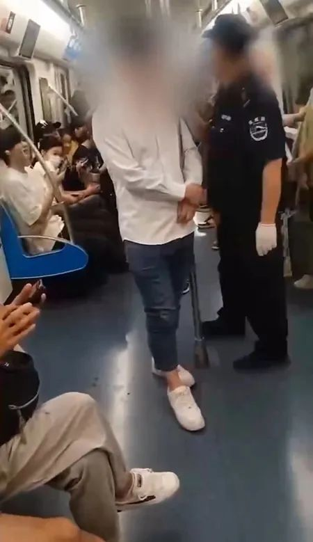
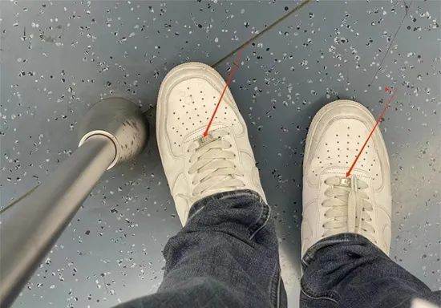
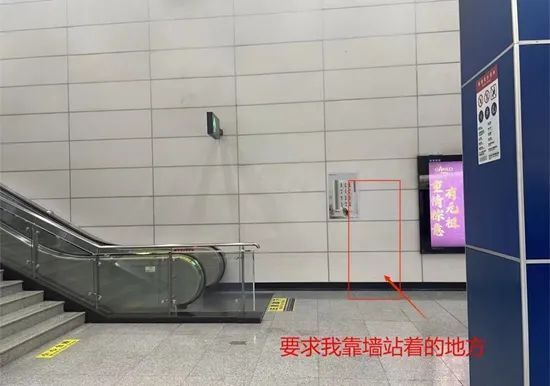
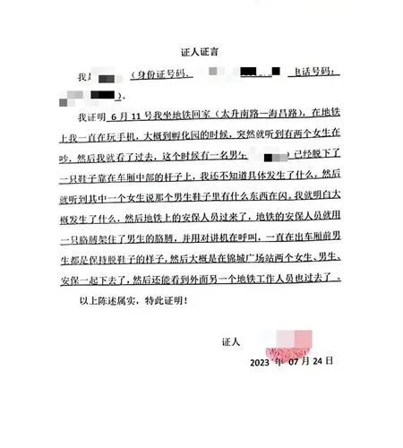
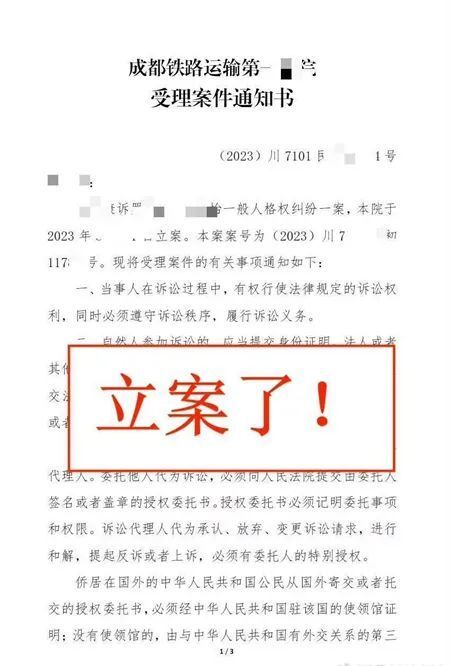

# 当一名男性被当成“偷拍者”

_事发时站在地铁车厢内的小何。本文图片均由受访者提供_

作者 ｜ 裴思童

编辑 ｜ 秦珍子

小何从没想过，那个车厢里突然出现的“声音”，拥有漫长而难以消除的余音。

几个月前，他在成都乘坐地铁，被两名年轻女孩高声指认为“偷拍者”。随后赶来的警方证明，这是一次误会。

女孩们现场认了错，但小何不认可。他要借助法律手段，寻求一个正式的道歉。此外，他还希望地铁运营管理部门能改善处理相关问题的方式。

在维权的过程中，小何遇到了一些和他有相似经历的男性，广州地铁大叔被冤偷拍事件也热度正高。

“我不敢设想这个事情如果没有结果会对我造成什么样的影响。”他说，“诬告者”脱口而出一句指责，“被诬告者”却需要投入巨大的成本 “自证清白”，擦去
“偷拍者”的污名并不容易。

关注小何经历的部分网友，也提供了另一种观点，他们看到两名女孩过激行为背后可能隐藏的敏感与恐惧，试着理解可能“被偷拍”的女性。

从某种意义上说，双方都处在维权的困境当中。

**“你是不是在偷拍”**

不知道重复讲了多少遍之后，小何已经不需要仔细回忆，便能准确说出听见那个“声音”的时刻。

他回忆，今年6月11日晚，自己从成都地铁6号线犀浦站出发，坐地铁回家。

前一晚，他和朋友爬了山，早上去工作，下午又有聚会，回家前“身心俱疲”，只想休息。但在上地铁后，他还是给一对老夫妇让了座。

距离下车还有5站时，小何站在车厢中央的金属立柱旁，忽然听到有女生喊：“你是不是在偷拍，我怀疑你在用小型摄像头偷拍。”

小何说，直到全车厢的目光都聚焦到自己身上时，他才意识到，自己正是被喊话的那个人，瞬间蒙了。

后来流传到网络中的视频画面显示，两名年轻女孩坐在离小何大约两三米的座位上，愤怒地说：“他的（鞋子）不是在反光，而是在闪光，刚刚我们亲眼看到的，等我们拍的时候他就把它（摄像头）关了。”

地铁安保人员迅速赶来，“夹住”小何的手臂。

形容那一刻的感受时，小何说“像在众目睽睽下被逮捕”。

他被喊话的女孩要求脱下鞋子检查，他不敢用手，“怕被怀疑是在销毁证据”，只能用左脚蹬掉右脚的鞋子，单脚站在车厢中间。

当时，车厢里有乘客拍下了这一幕。3个月后，小何第一次以旁观者的视角看到当时的自己，“表情很无奈，很无助”，他甚至没有勇气再看一遍。

画面中，他默默地站着，没有反驳。

“在那种情况下，我说我没偷拍，有用吗？我觉得没什么用。”
小何甚至认为“让他们的批评、怀疑，更加深刻一点，现在他们对你的怀疑有多深，后面他们的后悔就有多重。”

小何记得，自己脱鞋后，一名戴眼镜的男性乘客曾主动替他辩解：“鞋子上面都没有装摄像头的空间呀？是不是鞋带上的金属扣在反光？”

_小何被怀疑安装偷拍设备的鞋子。红色箭头指示的位置为“闪光处”。_

按照车厢安保人员的要求，小何需要下车接受进一步检查。

等待下车的十几分钟里，他始终沉默站立，努力观察车厢内的情况。“没有人穿奇装异服，几乎没人穿裙子，说我偷拍的女孩虽然穿了长裙，但离我很远，我也想知道她们到底在怀疑我偷拍什么。”

下车前，始终沉默的小何向陌生的乘客发出请求，请他们继续关注此事：“如果大家明天没看到相关新闻，请相信我没有偷拍。”他害怕，此事万一成了“悬案”，他将以“偷拍者”的身份存在于那些乘客的记忆中。

**​“你根本就没有道歉”**

十几分钟后，小何和两个女孩都在锦城广场站下了车。

一名安保人员“搀扶”着他走出车厢，要求他站在站台电梯的扶手边等待。于是他光着右脚，双手背后，单腿靠墙站立。小何记得，每当有列车到站，乘客下车，他就要被异样的目光审视一遍。他曾试图掏出手机回复消息，但两个女孩谨慎地凑上前来，防止他“销毁证据”，他只能向对方展示手机屏幕，觉得“被一种无形的力量逼到角落”。

 _小何从成都地铁锦城广场站下车后，被要求站立等待的地方。_

据小何回忆，一名站台工作人员前来了解情况，两名女生重申：“他刚刚在偷拍，鞋子上有绿色的摄像头，等我们看向他，他就把摄像头关掉了。”

小何继续选择不反驳，他只是说：“我觉得应该马上报警，让警察来处理这件事情。”

在他的回忆里，那段等待警察到来的时间格外漫长，半个小时，或是40分钟，他记不清楚，只记得站台工作人员一直在用对讲机来回沟通，似乎遇到了问题。

“地铁站针对这种事情应该准备预案，而不是遇到问题再临时沟通处理方式，我原本不需要在外面等这么久的时间。”

小何说，他曾询问站台上的地铁工作人员：“地铁管理在这方面有没有相关的标准或者制度？发生这样的事情，在什么情况下，列车员需要或者说有权力对涉事人员采取行动？”

他记得工作人员笑了笑说：“我不清楚，没遇到过这样的情况。”

面对4名赶来的民警，两个涉事女孩再次说明了情况，坚称小何“偷拍”。一行人重新登上地铁，前往派出所。

车厢里，一名民警曾拿出手机对着那只被认为装有摄像头的鞋子变换角度拍摄，然后对小何说：“我想应该是误会了，你也不要有太多的情绪。”

晚上11点多，在派出所，民警对小何的鞋进行了细致检查，最终脱下手套告知两名女孩：“应该是不存在偷拍的，他的鞋子里也没有摄像头，你们看到的闪光应该是列车进站时两侧广告牌在鞋面金属片上的折射。”民警一边说，一边播放刚刚录制的检查鞋子的视频。

回想起来，小何说真相大白的一刻并没有感到开心，他认为自己应该获得一个道歉。“我不需要什么经济赔偿，我只想要一个有态度的道歉，她们必须要认识到自己的错误。”

随后，民警专门和两名女孩进行了沟通。过了一会儿，小何说，她们扭扭捏捏地走进门，其中一人飞快地说了一句：“帅哥，对不起！”然后便迅速转身想要离去。

“我感觉她们好像一秒都不想多待。就像是以前读书的时候，被关系好的老师抓到办公室要求道歉，我们就会这样拖长长的调调说‘老师——对不起——’，然后马上嬉皮笑脸地往外跑。”

于是小何脱口而出：“我不接受道歉。”

后来他反思，他当时应该说“你根本就没有道歉”。“因为道歉的前提必须是你先觉得自己错了。”

最终，通过警方调解，小何还是在笔录上签了字。只是额外补充了几句话：“一、我不接受道歉。二、双方没有达成和解。三、我会继续诉讼。”

**很多人因为投入太多，放弃了维权**

夜里12点多，小何从派出所出来了。他回忆，当时感到胸闷、胸痛、呼吸困难，一个人前往医院急诊科做了检查。

等医院报告的时间里，小何写下自己刚刚的经历。这篇6000余字的文章传到网上两天，被阅读超过4000万次。成都地铁和警方随后也对媒体证实了此事。

在大量的网友评论中，多数人支持小何，但也有人说“肯定是因为你长得猥琐别人才会怀疑你”，还有人提醒他“你不考虑自己也考虑一下自己的家人”。

那几天，小何向公司请了假，搬去酒店居住，着手处理诉讼事宜。他说当时“精神状态快要崩溃”，也不敢坐地铁，“总感觉那一幕会重现”。

他记得，曾在网络中看过相似的事件，其中大多数最终没有定论，不了了之，他害怕自己的经历也成为一桩“悬案”。

“我读了很多年的书，现在有一份不错的工作，我还背着房贷，是社会的一份子。如果这个事情处理不好，我很可能就‘社会性死亡’了。”

事件发生后的第二天下午，小何前往派出所，希望取得相关资料，如问询记录等。但按照规定，他还需要委托律师立案，资料才能按照程序提供给律师。

“很多网友评论说这种事实清晰的小官司不需要请律师，但调取证据之类的工作，只能依靠律师完成。”

找律师的过程也不大顺利。由于事件舆论热度过高，小何被一些律师拒绝过，也被开过高价。几经周折，他终于确定了律所，律师按类似案件的最低标准收费，依然花掉了小何近一个月的工资。

“普通人的维权成本不低，在遇到类似事件时，人们可能会因为付出的费用太高、精力太多而放弃。”

律师也劝他，争取下去，可能也就获得一个赔礼道歉，“至多有点象征性的经济赔偿”。小何不想放弃，他觉得自己在做一件有意义的事。

事情并没有像他预期的那样顺利。他收到成都铁路运输第一法院的回执，因缺乏证据材料，未能准予立案。

对小何来说，寻找证据正是最难的环节。在公共场合遭遇突然的“言语攻击”，他本人没来得及留下任何证据材料，唯一可获得的证明资料是警方的笔录及监控视频，但按照规定，他只有在法院立案后持调令才有权力调取这些材料。与此同时，成都地铁也以“在法律程序上没有责任出具此份情况说明”为由，拒绝为他提供情况说明。

立案进入僵局，小何也陷入强烈的痛苦中。为了诉讼，他频繁向公司请假，休息时间也搭了进去。“律所在北边，地铁公司在西南，派出所在南边，公司在西边”，小何一边工作一边在城市里来回穿梭，同时准备职业资格考试。

“就这样经过了两个多月，我甚至连诉讼的第一步都还没有完成，我非常不满意这个结果，但我又很无力。”

在这个过程中，小何还感受到一种强烈的不对等感——那两个把他当成“偷拍者”的女孩对他的付出似乎毫无感知，“仿佛那晚结束，事情就真的结束了”。

**“不是我一个人的事”**

一封目击者的书面证言打破了困局。

_小何收到的证人证言。_

自小何的经历在网络上获得广泛关注后，陆续有几名网友自称事发当时位于车厢内。小何联系上其中两人，希望他们能为自己作证。其中一名目击者由于证言过程较为繁琐且担心暴露个人隐私放弃作证，但另一人作出了书面证言。

“那是一个刚刚大学毕业的00后男孩，处理这件事他压力挺大的，但他还是站出来为我作证，这很了不起。”小何说。

8月25日，这份补交的证人证言让小何收到了成都铁路运输第一法院的立案通知书，该院已经受理他与涉事女乘客的“一般人格权纠纷”案件。

_成都铁路运输第一法院受理案件通知书。_

小何松了一口气，但并未因此放松，他认为法院立案仅仅是一个开始，后面要走的路还长。

他仍然没想过放弃，越发觉得这件事不是自己一个人的事，期望有一个明确的、法律意义上的结果，告诉公众什么是偷拍，怎么去界定，诬告者要不要惩罚，实施偷拍的人又该如何处置等。

几个月来，小何收到不少私信，有人说自己被冤枉“偷拍”，个人信息、未经处理的照片、视频也被发到网上，“但事情没有得到警方的证实，只有指控者单方面的说辞”。

在网络中，小何的社交账号几乎成了“被冤枉偷拍”的代名词，曾有5名网友自称与他经历相似，想一起维权，但接触之后，有4人放弃了。

郭先生是5人中还在坚持的那个维权者。他对中青报·中青网记者表示，今年7月26日，在深圳地铁晚高峰的安检人群中，一名年轻女子说他“性骚扰”，并当众对他进行了言语侮辱。警方查看监控后，证实他并没有不法行为，但该女子拒绝道歉。郭先生决定起诉。

在多次与法院和警方沟通后，郭先生依然因为缺乏证据材料无法立案。他的经历并未像小何一样获得舆论关注，没能找到为他提供证人证言的目击者。

此前，郭先生曾在网上看到过小何的经历，还有发生在广州地铁的“大叔蒙冤”事件，但那时他没想过这种事情真的会发生到自己身上。

“今天是我，明天就可以是这个社会上的任何一个人。不知什么时间什么地点，就会有一个人遭到这种无端的诬陷，并且诬陷者可以不用承担任何责任，甚至都不用给出一个道歉，受害者却需要花费代价去维权。”郭先生说。

小何认为，需要承担责任的不光是那两个误以为他偷拍的女孩。在开庭前，他决定追加成都地铁为被告方，事由是成都地铁涉嫌违约和侵权。

他认为，成都地铁工作人员当日的做法对他造成了次生伤害：“首先，列车的安全员在听完女生说辞后未容许我解释便‘架住’了我，是否是在限制我的人身自由？第二，到站台后是不是可以为我准备一个遮挡屏风、把我带进办公室或任何一个人少的地方，为什么偏偏让我站在人流量最大的地方接受审视？第三，我认为地铁公司面对此类事件应该提前做好预案，并将相关人员培训到位。”

小何申请调看地铁站台的监控，尤其是他被要求“脱掉鞋子，在电梯扶手处单腿靠墙站立”的那一段监控记录，但成都地铁称，因站台上的两个摄像头坏掉了，关键证据丢失。截至发稿前，成都地铁并未回复中青报·中青网记者的书面采访申请。

作为同行，北京地铁2号线地铁乘务管理员调度室值班经理马兆友在地铁工作了近两年，从列车内的乘务管理员升职为负责“总控”的调度室值班经理。在他的印象中，从业以来没有处理过有关“偷拍”或是“性骚扰”的案件，“我觉得某种程度上可能是因为我们有一套严格的管理体系”。

据他介绍，北京地铁2号线平均每两到三节车厢配备一名乘务管理员，定期培训。按照要求，管理员应每两站对所管辖车厢巡视一次。“不是象征性地走一遍，而是要尽可能地观察每一个乘客，包括是否有异常的动作、表情或是携带违规物品，这样其实无形中就对一些图谋不轨的人进行了震慑。”

马兆友强调，当乘务管理员发现异常状况时，应及时打开身上佩戴的记录仪，并对异常情况持续关注，如情况有变应及时上前制止。“但是管理员没有执法权，只能注意监督、保留证据”，应将涉事人员转移至站台内的站务，并视情况联合站内驻警处理。

北京地铁几乎每个地铁站内都设有警务室，至少有一名民警和一名辅警，当车厢内发现异常状况时，一般到下一站就能将涉事人员控制住并移交警方，“整个过程可能也就几分钟”。

**理解被诬陷的冤枉，也理解被偷拍的恐惧**

在小何事件引发的讨论中，始终有两种声音格外鲜明。

多数网友对小何的遭遇表示同情，支持他运用法律武器维护自身的合法权益；还有一部分人则充满隐忧，认为过多关注“诬告者”，可能会使原本就维权困难的偷拍受害者更加孤立无援。

中国政法大学刑事司法学院教授罗翔在其个人社交平台发布的一条名为《女性故意“报复”男性？性侵犯罪是一种高诬告率的犯罪吗？》的视频中说：“有不少的人认为在性侵犯罪中，被告人很容易被诬告……但是严肃的学术研究证明，这种担心是多余的。相反，在性侵犯罪中存在大量的犯罪黑数，也就是说，有相当多的性侵犯罪是没有进入到司法体系的。”

在小何被误指偷拍前后几天，河南、河北分别有两所大学几乎同时曝光，有男生扮女装潜入女生浴室进行偷拍；英国广播公司（BBC）国际频道调查小组“BBC之眼”发布了一条名为《追查“痴汉”——谁在售卖中国日本性侵偷拍影片》的纪录片，揭露了一个位于日本东京的售卖偷拍性侵视频团伙，该团伙运营的3家色情网站中，一些视频拍摄于中国各大城市的地铁车厢，网站创始人日收入可达5000元至1万元人民币。

纪录片中的记者冯兆音在接受媒体采访时表示，仅仅是观看这些偷拍视频，就使她感到身体僵硬，不愿靠近陌生人，想尽量避免正常社交属性的身体接触。尤其是看到某条视频出现她熟悉的广州地铁，听到报站，看出线路，冯兆音感到脊背发凉——这个受害者很可能是我，也可能是我在广州的朋友，这可能发生在我们任何一个人身上。

黄先生和女友林女士目击了小何被误指偷拍的全过程。巧合的是，事发时，他们还在讨论不久前发生在广州地铁的“张薇事件”——那个年轻女孩曾诬陷一名农民工“偷拍”。黄、林二人一致认为，说别人偷拍，需要拿出证据。

林女士则比黄先生多考虑了一些：“我担心这些事情曝光太多，一些真正被偷拍的人便不敢讲了。”

林女士的好友何小姐曾有过不止一次被偷拍的经历。最近一次在工作场合被客户偷拍时，“我的第一反应是不敢讲。尽管他的手机其实已经直对着我了，但是我依然不敢去问他，我害怕像之前的地铁事件一样造成什么不好的影响，我怀疑自己的反应是不是太过激了。”

直到何小姐确定自己看到了对方的手机拍摄画面，才鼓起勇气叫来了保安，由保安制止偷拍者的行为。在此之前，她也经历过相似的被偷拍场景，给她的内心留下一种隐秘的恐惧——每当身边有人拿起手机，只要对方的摄像头可能朝向她，她就感觉自己陷入了一种要被偷拍的不安全感中。

“当别人做出拍我的动作时，我会本能地感觉自己受到了侵犯。忍不住去想他为什么要拍我，他拍到了什么，他把我拍在他的相机里有什么用途。”

尽管害怕被偷拍，何小姐还是不认同在缺乏证据的情况下贸然质疑别人，她更担忧由此引发的讨论带来更大的影响。“部分网友的评论，把这件事上升为对女性群体的攻击，认为女性可能是在故意污蔑男性，这样的舆论导向会使真正的受害者更难维护自己的权益。一个理性的人，不应该把一个人的个体行为加之于群体之上。”

曾代理过广东第一例“性骚扰损害责任纠纷”案件的律师丁雅清在接受媒体采访时说：“一方面，我们要理解一个男性面临诬陷的冤屈；另一方面，我们也可以试着更多理解一下女性的处境，普及维权的相关知识、取证手段。其实就是双方互相理解的一个过程。”

**正义的边界**

在被两名女孩指认为“偷拍者”之前，小何说自己几乎从未关注和听说过“地铁偷拍或是性骚扰”的事件。近来，他逐渐看到了大量相关情况。

“‘偷拍’这个事情确实存在，我知道‘被偷拍者’想要维权也是非常困难的。”小何说，但他不会动摇。

在他维权的过程中，也曾数次收到类似“为什么要跟两个小女孩计较”的质疑，他始终认为，事件中，“诬告者”与“被诬告者”所付出的代价并不对等，他有“坠入深渊”的风险，而“诬告者”却不用付出什么成本。

尽管早就被警方证明“清白”，小何还是不想对同事、朋友和亲人透露这件事。“我始终觉得不光彩，在拿到最终的判决结果之前，我怕自己可能还是无法自证。”

与此同时，他支持那些怀疑自己被偷拍的人维护权益，建议他们不用太极端，他相信“走到别人身边好好说，别人大概率是会配合的”。

郭先生也认为，对于性骚扰，他和绝大多数女生一样持“零容忍”的态度。“另一方面，真的误会了别人，应该向对方道歉，然后放过彼此。大部分人不会上纲上线要去法院起诉。”

复旦大学社会学系副教授沈奕斐在其个人播客谈及此事时曾表示，此类事件背后确实存有“女性的生活体验所导致的集体恐惧感”，所以女性可能会“本能地产生自我保护的念头”，从某种意义上讲，它可能意味着我们对于“偷拍”相较以往有了更多的意识。

但同时，沈奕斐也强调：“正义的目标必须用正义的手段来执行。”她认为，在公共场合中人们依然需要在对他人进行指控时保持谨慎态度，因为个人行为边界扩大可能会导致社会公共空间限缩，“如果在后果还没有发生之前就要去预防这种小概率的可能性，整个的社会的容错空间会变得非常小，每个人的行为在这个空间里面都会变得非常小心翼翼，稍有不慎你就可能被怀疑是有问题的，这就是个人的权利占用了公共的权利，导致公共的空间变得非常狭窄。”

北京市千千律师事务所（原北京大学法学院妇女法律研究与服务中心）执行主任、律师吕孝权长期从事女性维权工作，他强调当我们想要对他人提起指控时，一定要学会辨别“客观事实”和“法律事实”的区别。

“按照法律要求，一般而言都是‘谁主张谁举证’。法律追究的是能够通过证据所呈现的事实，法律事实接近客观事实但永远不可能等于客观事实，一旦上升到法律层面，就必须要有实在的证据。指控者必须要对自己的言行负责，应在基础证据上证明自己的主张，而不能空穴来风，故意捏造事实侮辱诽谤他人，否则很可能原告变被告。”

另一方面，丁雅清认为，很多女性之所以会出现一些过激反应，其实是因为她不知道自己能得到帮助，不清楚还有一些途径能帮助她平和地维护自己的权利，她们是在孤立无助的情绪下做出了不当的反应。

吕孝权也同样认为，对于“偷拍”或是“性骚扰”引发的社会问题，规范个人行为仅仅是“治标不治本”。“目前很多被害人无法在第一时间拿起法律武器合法维权，是因为他们还缺乏社会系统资源支持。这些支持因素不具备的情况，通常意味着被害人需要孤军奋战来面对问题，那么便很可能由于维权意识的匮乏让自己陷入更糟糕的境遇。”

“比起批评某个个人，我们更应该反思如何改进整个社会。”吕孝权说。

作为一项全球议题，近些年，治理“偷拍”问题得到各国重视，其中，立法是最直接的行动之一。目前，在日本、韩国、美国、英国、法国等国家，偷拍、偷录等行为都被作为单独罪名纳入刑罚。我国香港地区前年通过《2021年刑事罪行（修订）条例草案》，针对窥淫、未经同意下拍摄私密部位及未经同意下发布私密影像订立特定罪行，最高刑罚为监禁5年。

中国内地自2019年以来，也在持续推进打击偷拍偷窥黑色产业链的专项行动。曾于2021年5-8月，在全国范围组织开展摄像头偷窥黑产集中治理期间，京东、淘宝、闲鱼等电商平台下架违规宣传或违规售卖摄像设备1600余件，抓获犯罪嫌疑人59名，收缴窃听窃照器材1500余套。

吕孝权介绍，目前我们在立法上尚还缺少专门针对偷拍及性骚扰防治的法律，与之相关的规定分散在民法典、治安管理处罚法、刑法等部门法律中，“部门法之间可能还存在衔接的问题，部分条款内容存有相冲突的地方”，他希望能够参照反家庭暴力法，制定专门的“反性骚扰”法律，“我们也应该有全面、详实、可操作的法律对性侵害行为进行明确规制”。

他同时也认为，立法只是第一步，解决性别暴力问题的关键在于提高全社会的性别平等意识。“性骚扰没有男女之分，它不是妇女问题，而是社会问题，因此它需要社会的广泛参与，尤其是男性的参与。通过全民普法和性别平等教育，建立由政府主导、社会力量广泛参与的工作机制，搭建起法律、心理、救助等一系列社会资源体系，形成一个权责明确的支持系统，对包含性暴力在内任何形式的侵害行为树立起绝对意义上‘零容忍’的态度。”

据报道，在“电车痴汉”严重泛滥的日本，与之相对的还有一个名为“痴汉冤罪”的现象，即被诬告为“痴汉”的冤假错案，被诬告者通常会因此付出严重的成本，甚至遭到“社会性抹杀”。日本NHK电视台的一档节目曾专门针对此议题进行探讨，节目中的一位律师对此评价道：“所谓痴汉，常被称为是女性的敌人，实际上不是的，是男女共同的敌人。”

正如沈奕斐在播客里所表达的：“每个个体都不应该因为自己的性别身份而受到区别化对待……性别的研究是希望把每个人都变成人。”

中青报·中青网见习记者 裴思童 记者 秦珍子 来源:中国青年报

**中国青年报·中国青年网出品**

