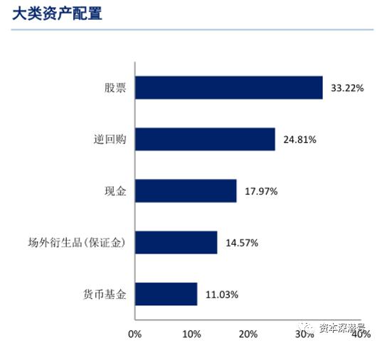

# 百亿“选股高手”崩溃认输：建议投资人去买量化

“擅长”选股选时的主动基金经理，终于认输了。

来自业界的消息，一家知名的百亿级主动私募机构，日前在一场投资者见面会上，主动奉劝投资者去购买其他机构的量化产品。

该名私募基金经理声称：现在这个市场他 **“不懂”、“不明白”、“不会做”** 了。

他建议投资者改配置其他机构的量化产品（该机构旗下没有）。

而他也在考虑在策略中加入量化的因素。

这样的表现，确实很让人意外。

私募基金经理“语出惊人”

10月17日，私募圈流传出一张截图，是一家近年规模增速惊人的百亿主观多头私募。

但该机构在会上交流的信息却让人大吃一惊。

截图（下图）中，一位人士“转述”他所参与的一场私募路演内容，有如下要点：

其一，对于当前的市场，基金经理不懂，看不明白，也不会做。

其二，建议投资人可以改配量化产品。

其三，人工交易已经无法战胜量化交易了，他也在考虑运用量化交易的模式。

由于上述内容属于“转述”内容，是否是基金经理在路演中的原话尚待确认。

主观多头“压力大”

虽然措辞“激烈”，但近几个月，私募基金经理压力较大是普遍性的。

相对于公募的“排名竞赛”法则，私募的绝对收益和低波动导向，令得私募基金经理的压力在现阶段尤为明显。

根据业界讨论，前述的言论会涉及一家业内新崛起的明星私募机构。

据悉，该机构成立没几年，即募得上百亿规模，其核心基金经理在几家公司的服务业绩都不错（2021年前），颇受渠道青睐。

但近两年，这位私募基金经理的业绩回撤较多，压力也较大。

第三方公开披露的代表产品显示， 2021年9月相关产品运作以来，进入2022年后净值跌破1元面值，到了今年8月末已跌至0.8元以下。

已配置“防御资产”

此前的投资业绩非常出色，近期却表现不佳。这是因为某位基金经理或某种策略“江河日下”么？

答案是未必。

从前述的百亿私募旗下产品的净值走势，确实不尽如人意。但从其资产配置看，该机构配置了近5成的现金、回购、货币基金，加之有近15%的衍生品。

组合的“防御资产”安排的很到位。

但从实际表现看，该产品的净值还在持续向下。

这或许表明，相关产品的极度保守组合配置也在经历波动。

或许，这已经是行情到了最“逆风”时段的标准。

所有方法都有“逆风期”

而从历史上看，所有A股的投资风格都有顺风期，也有逆风期，两者互相转化，概不能免。

比如价值风格，2019年后是逆风期，直至2022年后才逐步进入顺风期。

成长风格则恰好相反，2022年后开始经历逆风，到了2023年，连中小盘指数也都开始“逆风”。

历史上，低风险的定增和打新策略也有这种间隔的不可避免的低谷期。

而据私募排排网：百亿私募前三季度收益平均值为1.44%，中位数为2.36%。

具体来看：前三季度量化私募平均收益率5.75%， **主观策略私募、主观量化混合私募的收益率分别为-1.39%和1.01%。**

这表明，主观多头私募也开始进入幽暗的时期。从辩证的角度看，这也是给下一个顺风期“积攒能量”。

“周期”概不能免

另一些知名投资机构曾对这种风格轮替现象做过分析：

它们认为，其一是周期性因素，指数型牛市期间，主动型基金转手买入好公司，把好公司价格抬得过高，成就了当时大盘成长风格的强势，也为近两年的走弱埋下隐患。

类似的当和市场热点变换到价值风格后，另一些好公司又被追捧推高，而前期的成长类好公司则开始下跌。

两者都会超过一般人士的预期水平。

其二是趋势性因素，股票数量越来越多，主动研究员能够调研覆盖的比例在降低。

现在上市公司超过5000家，单个管理人能够调研的公司一般不超过500家。

这导致了市场资金始终是结构性的集中在少数板块和公司身上。

“复起”需要时间

它们也认为，主观基金经理和产品走出低潮时刻，需要一些助力因素，比如：

其一，股市系统性行情的出现，诸多资产得到修复的机会。

其二，当主观策略私募机构引入更多研究员，覆盖更多投资标的，基金经理可以突破此前的视野，更灵活地构建组合。

其三，主观策略私募将投资范围扩展到其他资本市场，在投资区域上更多元化。

其四，基金经理学会运用更多的衍生品工具。

