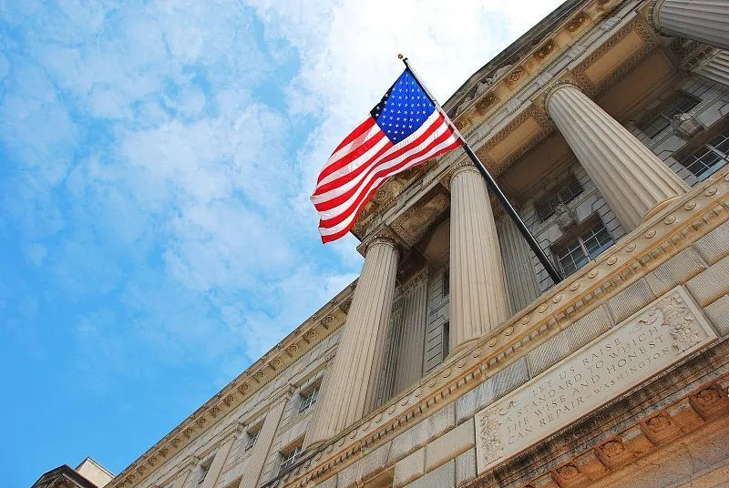
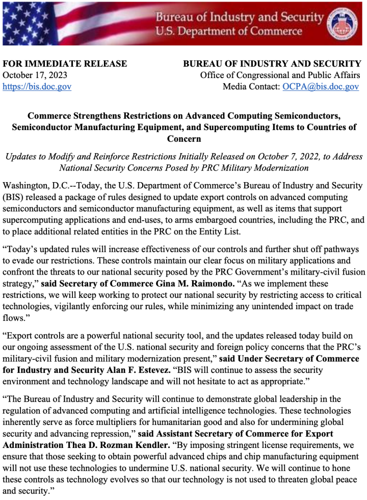
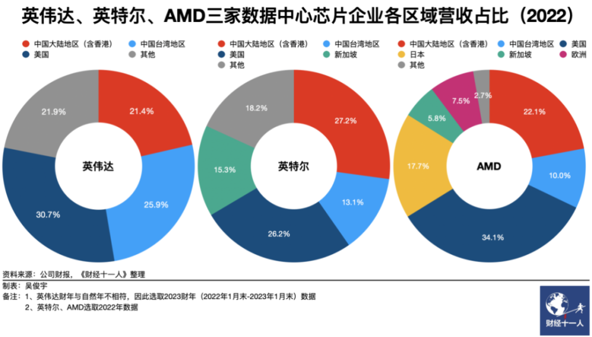

# 美升级对华AI芯片制裁力度，美芯片企业提出担忧

英伟达、英特尔、AMD等美国芯片厂商约50%的收入来自数据中心芯片市场，而中国是全球数据中心芯片最大市场之一。

文 | 记者 吴俊宇 顾翎羽

编辑 | 谢丽容

10月17日，美国商务部工业和安全局（BIS）更新了“先进计算芯片和半导体制造设备出口管制规则”。这是对2022年10月7日规则的修改和强化。该规则尚处于公示期，将在30天后生效。美国商务部工业和安全局还将两家中国GPU（图形处理芯片）企业摩尔线程、壁仞科技及其子公司列入了实体清单。

美国商务部工业和安全局此举目的在于强化对中国的芯片制裁，更新的规则中给出的理由是，提高制裁的效果，切断逃避限制的途径，确保美国国家安全。

10月17日更新的“先进芯片和半导体制造出口管制规则”主要新增了三项内容：

**其一，把性能密度作为出口管制标准。**
禁止对中国出售运行速度超过300teraflops（即每秒可计算300万亿次运算）的数据中心芯片。运行速度在150-300teraflops的芯片，如果性能密度超过每平方毫米370
gigaflops（十亿次计算），也会被禁止销售。

**其二，先进芯片出口许可范围扩大到40多个国家。** 其目的是，防止先进AI芯片从其他国家辗转进入中国。

**其三，对21个国家提出了芯片制造设备的许可要求，并扩大了禁止进入这些国家的设备清单。** 此举旨在限制中国的14纳米以下先进芯片的制造能力。

 _来源：美国商务部网站_

10月17日正式公布之前，上述出口管制规则消息已传闻多日，10月16日，中国外交部发言人毛宁在例行记者会上就上述消息表示：“中方已经多次就美国对华芯片出口管制表明立场，我们认为美方应当停止将经贸科技问题政治化、工具化、武器化，停止扰乱全球产供链的稳定。中方将密切关注有关动向，坚决维护自身权益。”

英伟达（NASDAQ：NVDA）、英特尔（NASDAQ: INTC）、AMD（NASDAQ:
AMD）等企业参与的美国半导体行业协会10月17日就“美国商务部出口管制规则”声明称，过于广泛的单边控制可能会损害美国半导体生态系统，因为它们会鼓励海外客户转向其他地方。美国半导体行业协会还敦促美国政府加强与盟友协调，以确保所有公司有公平的竞争环境。

业内普遍认为，美国政府管制规则的更新短期内对产业影响有限，但是从中长期来看，该管制将影响到中国在AI竞争中的发展速度。一位不愿具名的美国律师告诉记者，业内正在评估法案的影响范围。美方的管制风格一贯是选择性执法，也就是说，尽管法案条文已经落下，但是具体扩展到多大还是要看执法的尺度，而这其中也牵涉到海内外更多博弈。

多位接受采访的海内外半导体从业者透露，此次法案出台前，业内已经有传闻美国将升级管制措施，但是，法案的实际内容还是大大超出了业内的预计范围。

一位资深行业人士表示，对比去年相对模糊、以工艺节点作为限制依据的管制内容，此次条款的针对性和准确性都更加明确，这是一个值得关注的全新变化。如此次对高端GPU的限制除了传输速度还增加了性能方面的管制维度，不仅英伟达等美国企业对华提供特供版芯片将受到限制，同时也意味着对中国企业利用一些其他手段绕开美国管制的空间更加狭小，这些体现了美国在AI发展上限制中国的决心。

限制收紧

受美国商务部出口管制规则影响，如英伟达的A100/H100、A800/H800，AMD的MI25系列芯片，英特尔的Gaudi2系列数据中心会被禁止出售给中国客户。

英伟达10月17日发布公告称，公司部分芯片超过某些性能阈值（包括但不限于A100、A800、H100、H800、L40、L40S和RTX4090）。许可要求可能会影响公司及时完成产品研发、支持现有客户或向受影响地区提供服务的能力。如果客户需要许可证要求管制产品，公司可能会为客户寻求许可证，但不保证美国政府会授予。考虑到全球对英伟达产品需求强劲，预计不会对财务业绩产生短期有意义的影响。

美国商务部工业和安全局的先进芯片和半导体制造管制规则在2022年10月7日最早颁布，当时主要包括两项内容：其一，限制先进芯片对华出口。其中包括英伟达的A100/H100系列AI芯片；其二，限制对华半导体制造设备出口。其中包括限制中国制造出14纳米以下的逻辑芯片。

上述管制规则颁布后，英伟达的A100/H100芯片被禁止供应中国市场。英伟达A100/H100芯片是目前全球性能最强的数据中心芯片，专用于自动驾驶、高端制造、医疗制药等AI推理或训练场景。

英伟达为代表的美国芯片企业并不愿意就此失去中国市场的份额，并根据美国商务部的出口管制规则针对中国市场推出了降低网络互联速度的AI芯片A800/H800。其性能峰值和A100/H100一致。由于内存带宽更低，A800/H800训练AI大模型的时间将显著变长。
**不过，A800/H800在中国市场仍然被公认是用于AI训练/推理的最佳数据中心芯片。**

2023年AI大模型技术流行，市场对英伟达算力芯片的需求急剧攀升。在美国，包括微软、特斯拉、Orcale等在内的美国企业均在组建万枚A100/H100芯片的数据中心集群。

在中国，包括阿里、字节跳动、腾讯、百度等云计算厂商，联想、新华三等ICT解决方案商，小鹏在内的汽车厂商也在大规模采购A800/H800系列芯片。A800/H800目前处于供不应求状态，记者从多家服务器厂商了解到，目前英伟达的A800/H800芯片订单已经排期至2024年的年中。

今年8月，权威媒体（英国金融时报）报道称，包括阿里、腾讯、字节跳动、百度等在内的中国企业共订购了50亿美元的A800芯片，预计2023年-2024年交付。如果按照一枚A800芯片单价10万元（人民币）计算，中国市场对A800芯片的需求量超过5万枚。

一位芯片技术人士评价，美国商务部最新的这版出口管制规则中，芯片性能密度的条款尤为严苛。这堵死了美国芯片企业用其他技术策略为中国市场提供专用产品的可能性。他认为，如果只限制峰值性能，芯片企业还可以针对中国市场推出性能功耗低的小体积产品，再通过高速连接的方式组成集群。最终实现预期中的集群性能。但芯片性能密度的条款把这条路给堵住了。

一位半导体投资人告诉记者，此次管制升级后，未来管制范围内的芯片进入中国市场的难度将变大，这些芯片的价格也会水涨船高。记者了解到，法律界普遍认为，这是限制逻辑的一个重要变化。

国产芯片公司影响有限

国内华为昇腾、摩尔线程、壁仞科技虽然宣布推出了理论性能能够对标英伟达A100的AI芯片，但在实际场景中的运行性能仍有待观察。即使如此，摩尔线程、壁仞科技此次仍被美国商务部列入实体清单。

对于壁仞科技和摩尔线程来说，被列入实体清单意味着如果无法获得许可，不仅无法进口美国的技术或产品，也无法使用基于美国技术或设备的晶圆厂为其代工芯片。

10月17日晚，摩尔线程发表声明称，关注到美国商务部于当地时间
10月17日将摩尔线程列入“实体清单”的消息，对此表示强烈抗议。摩尔线程表示，目前公司正在与各方积极沟通，对于该事项的影响正在评估。壁仞科技也表示，公司对美国商务部此举表示强烈反对，将向美方有关政府部门积极申诉，并呼吁美国政府重新进行审视。

摩尔线程成立于2020年10月，是一家以全功能GPU芯片设计为主的芯片公司。摩尔线程的一位人士告诉记者，在今天上午，公司已经就此事召开了全员大会。管理层在内部释放的信息是，尽管此事有影响，但是对公司经营整体影响仍旧可控。目前，除了高端GPU，摩尔线程也在加大投入能更快产生营收的新产品线。

壁仞科技创立于2019年，是国产高端GPU芯片明星公司。四年来共获得超过50亿融资，投资方包括启明创投、IDG资本、高瓴创投等。在2022年3月，估值已经增长至惊人的172亿。

记者了解到，壁仞科技目前进行准备登陆港股市场。一位接近壁仞科技的FA（风险投资财务顾问）人士告诉记者，壁仞科技目前芯片量产和营收状况都不够理想，业务发展速度也不及预期，之所以能够赴港股上市，是因为港交所在今年正式实施了面向专业技术公司的上市规则“第18C章”。这大大降低了硬技术公司的上市门槛。

记者了解到，港交所为了吸引新一代信息技术、先进硬件等特定行业公司赴港上市，降低了企业上市所需要达到的营收门槛，更关注企业的估值和研发投资金额占比。也就是说，未能盈利，但具潜力的科技公司也能上市融资。

对于GPU企业来说，芯片研发只是第一步，接下来的供应链配套和生态配套是产品商业化的重要影响因素，一位资深半导体投资人认为，国内在2020年左右该赛道曾经迎来民营企业创业高潮，但是发展至目前，能够产品量产者寥寥无几，更不用说对标英伟达。从这一角度来说，此次限制升级对这些公司影响有限，甚至比不上资本泡沫退潮的影响。

美国芯片企业提出担忧

美国商务部对华芯片制裁一直采取“许可证”策略——美国芯片产业链上下游企业对华对外出售产品需要经过通过美国商务部工业和安全局颁发的许可证。

也就是说，美国政府在管制美国芯片企业出口时，美国企业同样也会因此业绩受损。目前，英伟达、英特尔、AMD等芯片厂商约50%的收入来自数据中心芯片。数据中心芯片最大市场是美国和中国。

**中国市场长期是美国芯片企业在美国以外的最大市场。**
记者统计了2022年英伟达、英特尔、AMD三家主要数据中心芯片在中国大陆地区（含香港）营收占比分别为21.4%、27.2%、22.1%。

**整个中国大陆地区市场的实质营收贡献远大于财报数据。**
多位服务器厂商人士对记者表示，中国台湾地区的PC企业，如华硕、技嘉、微星等，集成了英伟达的芯片，大量最终客户仍在中国大陆地区。如果按照中国大陆地区、中国台湾地区两个市场合计统计，英伟达、英特尔、AMD在中国市场的营收占比分别为，47.3%、40.3%、32.1%。

美国政府对中国芯片领域的制裁引发了美国芯片企业的担忧。美国半导体行业协会
(SIA)企业营收占美国半导体行业的99%，占全球芯片公司营收近三分之二。其中的成员包括英特尔、英伟达、高通、AMD、Ampere等数十家企业。美国半导体行业协会10月17日就美国商务部工业和安全局的出口管制规则发布声明称，正在评估更新的出口管制对美国半导体行业的影响。声明内容显示：

“我们认识到保护国家安全的必要性，并相信维持健康的美国半导体行业是实现这一目标的重要组成部分。过于广泛的单边控制可能会损害美国半导体生态系统，而不会促进国家安全，因为它们会鼓励海外客户转向其他地方。因此，我们敦促政府加强与盟友的协调，以确保所有公司有公平的竞争环境。”

今年8月末，英伟达管理层在2024财年二季度（2023年5月初-7月末）的投资者电话会议中直言，中国市场需求占英伟达数据中心收入的20%-25%。从长远来看，禁止向中国销售先进数据中心芯片的管制措施一旦实施，将导致美国失去在全球最大市场之一竞争和领先的机会。

截至美国东部时间下午4点收盘时，英伟达股价下跌3.2%，收盘价为446.0美元，总市值10852.7亿美元。英特尔股价下跌1.4%，收盘价为36.1美元，总市值1510.2亿美元。AMD股价下跌1.2%，收盘价为105.1美元，总市值1698.7亿美元。

责编 | 张雨菲

题图 | 视觉中国

