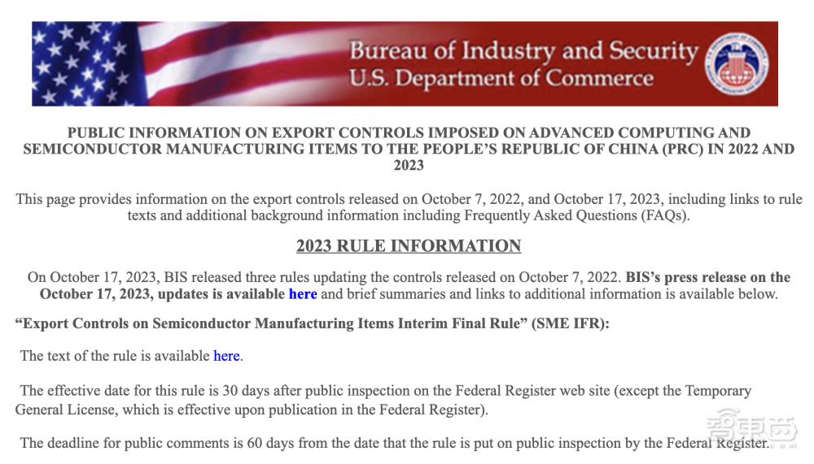
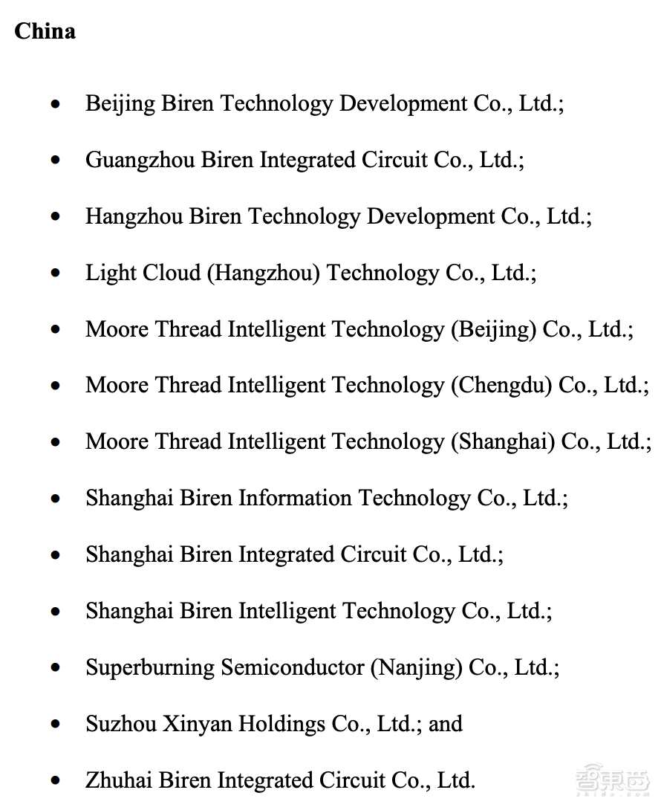

# 美国升级AI芯片和半导体设备禁令，壁仞科技、摩尔线程被列入实体清单

**芯东西（公众号：aichip001）**

**编译 | ZeR0**

**编辑 | 漠影**

芯东西10月18日消息，10月17日，美国商务部工业和安全局（BIS）公布新的先进计算芯片、半导体制造设备出口管制规则，限制中国购买和制造高端芯片的能力，并将两家中国GPU企业摩尔线程、壁仞科技及其子公司列入了实体清单。

与芯东西周一报道的传言一样（[传美收紧对华AI芯片出口限制，或影响英伟达H800，预计本周公布](https://new.qq.com/rain/a/20231016A02QH900)），新规取消对“通信速度”限制，而将重点放在限制“性能密度”参数上，据悉此举是为了防止企业通过使用Chiplet技术来绕过对完整芯片的限制。

英伟达通过向中国市场供应降低了互连速度的“阉割版”旗舰计算芯片A800和H800，来适应此前的限制规则。而新规的变化可能会冲击英伟达A800和H800的销售。AMD、英特尔等预计也可能受到新规的影响。

至于新规扩大对另外40多个国家出口先进的许可要求，则是为了规避A100和H100芯片从海外其他地区辗转出口到中国。美国希望堵住此前规则的漏洞，监控到所谓的“灰色地带”活动。

美国政府还对中国以外的21个国家提出了芯片制造设备的许可要求，并扩大了禁止进入这些国家的设备清单。

英伟达、壁仞科技、摩尔线程、美国半导体行业协会（SIA）均已发表声明，对此事作出回应。

一、先进计算芯片规则：新增“性能密度”限制，堵住海外采购芯片渠道

《先进计算芯片规则（AC/S IFR）》的生效日期为2023年11月16日，公众评论的截止日期为规则公开展示之日起60天。

该规则保留了2022年10月7日实施的严格的中国范围内的许可要求，并进行了两类更新：1）调整决定是否限制先进计算芯片的参数；2）实施新措施，以解决规避管制的风险。

**1、参数更改**

取消了“互连带宽”作为识别受限制芯片的参数。

如果超过下面任一参数范围，则限制芯片出口：1）10月7日规则规定的既存履行门槛；2）一个新的“性能密度阈值”。

该规则要求对性能略低于限制阈值的某些额外芯片的出口进行告知。

根据新“许可证例外通知先进计算（NAC）”，在收到出口和再出口到中国澳门和被确定为受美国武器禁运地区的通知后，美国政府将在25天内审查决定交易是否可以根据许可证例外进行，还是需要许可证。

作为这些更新的一部分，BIS还引入了一项豁免，允许出口用于消费应用的芯片。

**2、防止规避**

对总部位于受美国武器禁运地区或澳门的任何公司，或其最终母公司总部位于中国澳门的任何公司，建立全球出口受控芯片的许可要求，以防止来自相关国家及地区的公司通过其海外子公司和分支机构获得受控芯片。

创建新的危险信号和额外的尽职调查要求，以帮助代工厂识别受限制的芯片设计。这将使晶圆厂更容易评估海外企业是否试图通过以下方式规避管控非法生产受限制的芯片。

将先进芯片的出口许可要求扩大到美国维持武器禁运的所有22个国家以及中国澳门。

对先进芯片的出口施加许可证要求，并假定已获得批准，以回应有关国家利用第三国转移或获取受限制物品的报告。这将提供更大的法规遵循监视和执行可见性。

对少量高端游戏芯片制定通知要求，以提高出货可见度，防止滥用这些芯片破坏美国国家安全。

包括就多个主题征求公众意见，包括与基础设施即服务（IaaS）提供商相关的风险，对视同出口和视同再出口的控制应用，可向接收芯片设计的代工厂提供的额外合规指导，以及如何更精确地定义法规中的关键术语和参数。

二、扩大对芯片设备出口管制范畴，许可要求新增21个国家

《扩大半导体制造项目出口管制暂行最终规则（(SME
IFR）》的生效日期为在联邦公报网站公开查阅之日起30天(《临时通用许可证》除外)，公开征求意见的截止日期为本规定公开查阅之日起60天。

从2022年10月7日至今，该规则的主要变化有:

1、对其他类型的半导体制造设备施加控制。

2、完善和更好地关注美国人员限制，同时编纂先前存在的机构指导，以确保美国公司不能为先进的中国半导体制造提供支持，同时避免意外影响。

3、将半导体制造设备的许可要求扩大到中国以外的其他国家，包括美国维持武器禁运的另外21个国家。

三、实体清单范围扩大：新增壁仞科技、摩尔线程

实体清单新规的生效日期为2023年10月17日。

BIS将两家涉及先进计算芯片开发的中国实体及其子公司（共13家实体）添加到实体清单中，这些实体还将受到使用美国技术生产的海外产品的限制。

代工厂为这些列出的各方生产芯片将需要BIS许可证，然后代工厂才能将此类芯片发送给这些实体或代表这些实体行事的各方。

被新列入实体清单的13家实体包括壁仞科技及其子公司、摩尔线程及其子公司、光线云（杭州）科技有限公司、超燃半导体（南京）有限公司。

尚未确定被列入实体清单的苏州企业Suzhou Xinyan Holdings Co., Ltd.具体中文译名，其相关别名及地址信息如下：

四、英伟达、壁仞科技、摩尔线程均已回应

10月16日，我国外交部发言人毛宁在例行记者会上回复对美方扩大对华芯片出口限制的评论。毛宁说：“中方已多次就美国对华芯片出口管制表明立场。美方应当停止将经贸科技问题政治化、工具化、武器化，停止扰乱全球产供链稳定。中方将密切关注有关动向，坚决维护自身权益。”

美国新规发布后，英伟达、壁仞科技、摩尔线程、美国半导体行业协会均发表声明。

据外媒报道，英伟达在一份电子邮件声明中写道：“我们遵守所有适用的法规，同时努力提供支持许多不同行业的数千种应用的产品。”该声明预计“短期内不会对我们的财务业绩产生有意义的影响”。

壁仞科技发布声明称：“壁仞科技关注到，美国商务部将壁仞科技等中国科技企业列入实体清单。公司对美国商务部此举表示强烈反对，将向美方有关政府部门积极申诉，并呼吁美国政府重新进行审视。壁仞科技以“智绘全球”为愿景，严格遵守相关国家和地区的法律、法规，并在此基础上始终合法依规经营。公司正在评估此事件可能对公司造成的影响，做好应对工作，并将与各方面积极沟通。”

摩尔线程发布声明称：“我们关注到美国商务部于当地时间10月17日将摩尔线程列入“实体清单”的消息，对此我们表示强烈抗议。摩尔线程作为中国GPU领域的领军企业，专注于研发和设计全功能通用型GPU芯片，致力于打造赋能下一代互联网的元计算平台。摩尔线程作为中国GPU领域的领军企业，专注于研发和设计全功能通用型GPU芯片，致力于打造赋能下一代互联网的元计算平台。目前公司正在与各方积极沟通，对于该事项的影响我们正在评估。”

美国半导体行业协会在其官网发布声明：“我们正在评估更新的出口管制对美国半导体行业的影响。我们认识到保护国家安全的必要性，并相信维持健康的美国半导体行业是实现这一目标的重要组成部分。过于广泛的单边控制可能会损害美国半导体生态系统，而不会促进国家安全，因为它们会鼓励海外客户转向其他地方。因此，我们敦促政府加强与盟友的协调，以确保所有公司有一个公平的竞争环境。”

