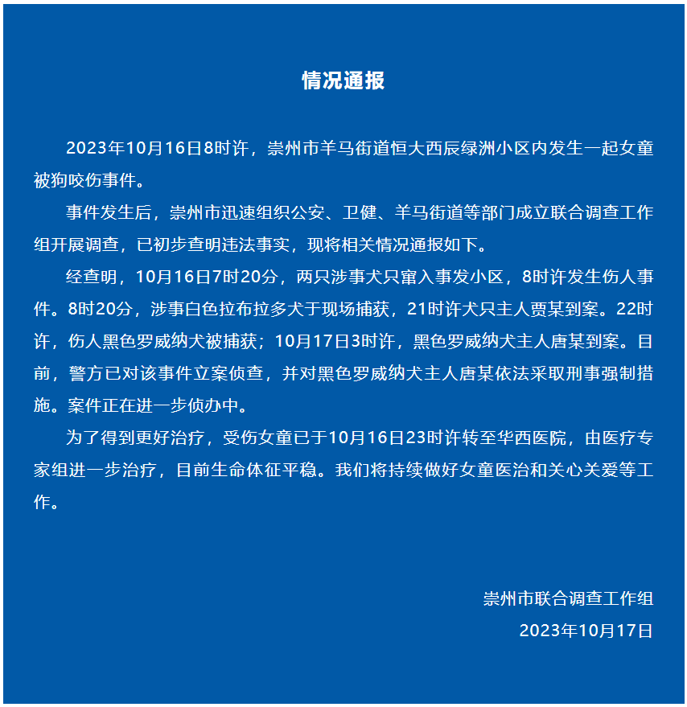
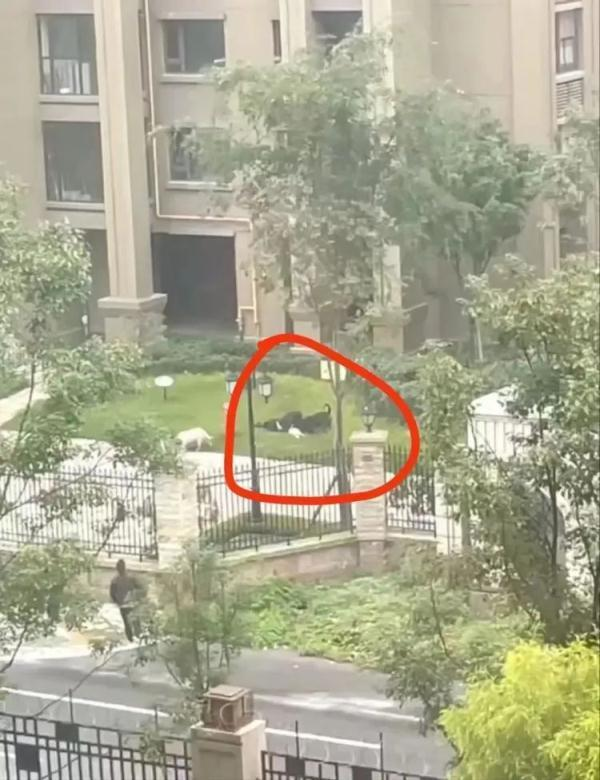

# 评论：高空抛物都可以入刑，为什么不能将不规范养狗入刑

【文/观察者网专栏作者 徐文海】

10月17日3时许，四川崇州咬伤2岁女童的黑色罗威纳犬主人唐某终于到案。警方对此事件立案侦查，并对唐某依法采取刑事强制措施。

而此时，距离女童被咬已经过去了20多个小时。微博热搜也一直在讨论如何处理此次事件，文明养犬的话题再次走向网友们热议的潮头。

作为一个年幼孩子的父亲，我没有打开过那个撕咬的视频，因为我能想象那种画面，我自知承受不了那种冲击。我也希望以后在面对类似事件时，我们不是只有愤怒的讨伐和无奈，而是切切实实的行动。

先回到本案，我们发现通报中明确提到罗威纳犬的主人唐某已经被依法采取刑事强制措施，那么唐某可能涉及哪些罪名呢？通过检索类似案件发现，此类犬只伤人事件中最多的罪名主要有两类：过失致人死亡罪、过失致人重伤罪以及过失以危险方法危害公共安全罪。

刑法第233条规定：过失致人死亡的，处三年以上七年以下有期徒刑；情节较轻的，处三年以下有期徒刑。第235条规定：过失伤害他人致人重伤的，处三年以下有期徒刑或者拘役。

与之相对，第115条规定：放火、决水、爆炸以及投放毒害性、放射性、传染病病原体等物质或者以其他危险方法致人重伤、死亡或者使公私财产遭受重大损失的，处十年以上有期徒刑、无期徒刑或者死刑。

过失犯前款罪的，处三年以上七年以下有期徒刑；情节较轻的，处三年以下有期徒刑或者拘役。

这两大类三个罪名最主要的特色都在于“过失”。过失作为一个非常主观的构成要件，除非狗主人承认自己放狗咬人、与被害人间存在一定伤害的理由、现场也存在相应证据例如证人听到狗主人大喊“咬死他”等，一般从饲养犬只的目的出发，很难推定出存在故意的可能性。因此此类犬只伤人事件确实多属于“过失”类犯罪。

过失致人死亡与过失致人重伤的区分标准非常客观且明确，但这两项罪名与过失以危险方法危害公共安全罪最主要的区分标准，我们通过判决同样可以觅得一二。

2013年5月，贵州遵义，一位老人晨练时，被路边蹿出的两只杜高犬咬伤致死，拖行10余米远。经法院审理，狗主人周某构成过失死亡罪，被判处有期徒刑两年。

2015年7月，黑龙江尚志，一名13岁少年被邻居家狗咬死。法院认定，狗主人刘某某的行为已构成过失致人死亡罪，且刘某某在被害人死亡后，移尸抛弃，情节恶劣，决定判处其有期徒刑五年，并赔偿附带民事诉讼原告人（被害人之父）583978元。

这几起过失致人重伤死亡的案件，无不都是少数烈性犬（多为一条）的少数（绝大多数是单一）伤害，即仅发生过当案致人重伤死亡的情形。而过失以危险方法危害公共安全罪则存在着前序发生过多次伤害事件，狗主人仍然未尽到看管义务的则定性为本罪，比如2017年祁阳县人民检察院的判决。在此案中，被告人胡小伟所养的两条大狗先后咬伤蒋某1、文某、唐某2、曾某1等人，对社会公共安全造成严重危害。最终法院认定，被告人胡小伟犯过失以危险方法危害公共安全罪，判处有期徒刑一年六个月。

甚至我们还发现存在这样一起案件（2015兵一刑终字第00016号），因为三条烈性犬藏獒在2010年到2013年期间，重伤2人，轻伤7人之后，狗主人仍然怠于履行看管义务，已经属于放任烈性犬危害不特定多数人的生命安全，达到了间接故意的地步。这是较为罕见的一起“以危险方法危害公共安全”的刑事判决。

因此，结合本案该条黑色罗威纳犬目前没有信息指向曾经有过多次的恶性尤其是轻伤重伤的前科、狗主人唐某也并未有饲养多条的情形，很大概率会以过失致人重伤进行刑事调查，最终是否会以此送检目前还不确定，可能还需要结合受害人情形等综合判断。

 _四川崇州恶犬咬伤女童画面_

说到这里，想必很多网民应该会有不忿，如果被害人达不到重伤是不是存在不刑事处罚的可能性。很多人甚至提出，连高空抛物都入刑的今天，为什么不能将不规范养狗入刑？

在这里首先想跟大家简单沟通一下刑事立法的一些立场和原则。刑法对自然犯的规定更容易获得民众淳朴法治观的接受，而对于法定犯则需要进行更为缜密的论证。此外，对于故意犯罪的规定肯定更为自然，而对于过失犯罪则应当更为严谨。进而，结果犯相较于行为犯肯定也更容易为一般理性的法治观所接受。

从这些角度出发，刑法291条之2的高空抛物罪：从建筑物或者其他高空抛掷物品，情节严重的，处一年以下有期徒刑、拘役或者管制，并处或者单处罚金。首先肯定是一个故意犯罪，其次虽然在结果犯和行为犯上存在争议，但“情节严重的”在司法实务中多指向产生较大的财产损害等（当然也包括多次等情形）。

只是不规范养狗一来很难找寻起“故意”所侵害的法益所在，二来也很难找到存在的“结果”。倘若这样的“过失”“行为”犯因为民众的喜好而入刑的话，那其实反而不如将其纳入“寻衅滋事罪”更加具有可操作性。

显然，这种寻求通过刑法解决一切问题的观念肯定是不恰当的，但这种不恰当的念头恰恰反应出民众对于本应解决此类问题的其他法律或者力量不备的一种无奈。

还以本案为例，罗威纳犬并不在《成都市养犬管理条例》所限制的犬种中，但一、为什么京沪等多地罗威纳犬都在禁养犬种中，而成都却不禁？二、即便京沪都禁养，但为什么我家小区里还有人养？虽然这几位业主算是比较有素质的，他们从来都是晚上9点以后才出来遛狗且也确实牵了狗绳，但那确确实实是罗威纳啊！他们有“犬证”吗？各地部门不要仅仅通过本地公众号发两篇文明养犬的文章就当作完成了自身的责任。

当然，更值得注意的恰恰是我们自身。很多人经常会因为狗主人说“放心，我的狗狗不会咬人”而表示难以跟他们共情。我们当然难以共情，我们也不需要去共这个情。你会跟晚上九十点还在小区边公放着跳广场舞的人那句“我们就不能运动运动”共情吗？你会跟站你旁边的老烟枪那个白你一眼的挑衅眼神共情吗？所以，如果你讨厌别人在你身边抽烟、讨厌大晚上的广场舞影响了你的休息，那么作为狗主人的你也应该明白，不牵狗绳甚至还养着烈性犬的样子其实和他们没什么分别。

不仅于这样的自省，在无法也不应当将所有规制都交给刑法之上，其实意味着民事和行政管理的责任应当加强。然而，行政责任的提升上有时也有很多“平庸的恶”，反而导致了行政管理的束手束脚。犹记得不时有各地扑杀野狗行动时，民众对于工作人员的各种恶意攻击，直接肢体冲突不说，还有不少网上辱骂乃至人肉工作人员信息的。针对这些不法行为，又有多少人站出来支持相应的行政管理行为呢？当然，我们的行政管理自身也存在很大的完善空间，即便小区住户发现存在饲养严禁饲养犬种时，又有多少人知道应该向哪个单位寻求帮助呢？甚至，即便明确向相应单位提供了信息，我们的行政管理部门是否真的切实解决了呢？

公园管理乃至小区物业如有可能，也应当尽最大可能对不牵狗绳、不戴嘴套的不文明行为做出一些善意的提醒，为了避免冲突，也可以尝试做一些相应配件的租借准备。如同那句“自己是自己健康的第一责任人”所讲，最终的责任承担还得来到自己，小区内整体状态的改善其实在于每一个自己。如果你有孩子，看到崇州这次事件的视频和报道，你还会做那个沉默的大多数吗？而小区里如何进行恰当的管理，想必每个小区都有自己的办法，比如我就遇见在业主群里公开曝光，让狗主人社死的情况。

汤姆和杰瑞里的那只大狗有自己的狗屋，有自己的项圈，有一片能让自己撒欢的草地。把中大型犬困在逼仄的公寓楼里，真的爱它们吗？

**本文系观察者网独家稿件，文章内容纯属作者个人观点，不代表平台观点，未经授权，不得转载，否则将追究法律责任。关注观察者网微信guanchacn，每日阅读趣味文章。**

